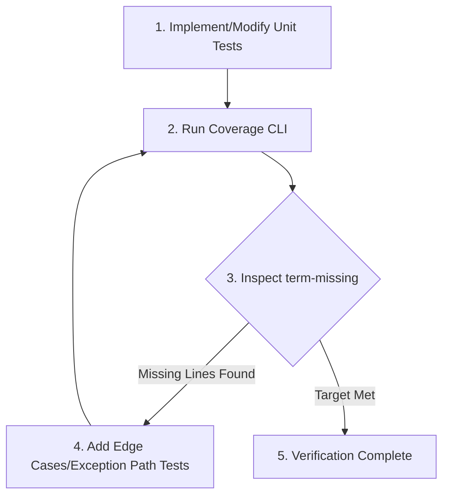

---
trigger:
  - on_file_path_regex: "tests/.*test_.*\\.py"
  - on_file_path_regex: "src/.*\\.py"
priority: 8
---

# Testing & Code Coverage Directives: Best Practices

This document defines the strict requirements for writing highly readable, maintainable, and precise tests in this project. The AI coding assistant MUST strictly adhere to these directives when creating, modifying, or refactoring test codes using `pytest`.

---

## 1. Adherence to F.I.R.S.T. Principles
- **Fast:** Tests must execute within seconds. Use `pytest-asyncio` for precise control over asynchronous code; avoid sleep-based waiting.
- **Independent:** Ensure each test is independent by resetting shared state, singletons, or global variables.
- **Repeatable:** Tests must produce the same result in any environment (local, CI, staging) regardless of network status, external exchange APIs, or system time.
- **Self-Validating:** Verify test outcomes exclusively through precise `assert` statements; avoid print().
- **Thorough:** Cover not only the happy paths but also negative paths, boundary values, empty values (`None`, empty collections), and intentional exception scenarios.


---

## 2. Test Readability & Maintainability

### 2.1 AAA Pattern (Arrange, Act, Assert)
The body of each test function must be clearly separated into three distinct phases using blank lines to represent **Given (Arrange) - When (Act) - Then (Assert)**.
```python
def test_calculate_order_qty_with_valid_balance():
    # Arrange (Given)
    balance = 1000.0
    price = 250.0
    risk_percentage = 0.02
    
    # Act (When)
    qty = calculate_order_qty(balance, price, risk_percentage)
    
    # Assert (Then)
    assert qty == 0.08
```

### 2.2 Explicit Naming Convention
Test functions must be named descriptively using the **`test_[target]_[condition]_[expected_behavior]`** structure. This ensures that failures can be diagnosed immediately from the test logs alone.
- **Bad:** `test_order()`
- **Good:** `test_create_order_when_balance_insufficient_raises_value_error()`

### 2.3 Pytest Fixture Standards
- **Explicit Dependency Injection:** Separate shared setups into Pytest fixtures and inject them explicitly as test function parameters.
- **Resource Cleanup (`yield`):** Fixtures managing databases, files, or network resources must use the `yield` keyword to ensure teardown occurs after the test completes.
- **Scope Minimization:** Restrict stateful or mutable fixtures to `scope="function"` to avoid cross-test contamination.
- **Leverage Standard Fixtures:** Always leverage Pytest's built-in `tmp_path` fixture for temporary file/directory operations.
- **Limit `autouse=True`:** Inject dependencies explicitly; restrict `autouse=True` strictly to global initialization (e.g., global mocking hooks).
- **Immutability of Higher-Scoped Fixtures:** Treat `session` or `module` scoped fixtures as read-only; avoid modifying their internal state inside a test function.
- **Asynchronous Testing Standards:** Every asynchronous fixture must be decorated with `@pytest_asyncio.fixture`. Every asynchronous test function (`async def`) must be explicitly marked with `@pytest.mark.asyncio`. 
- **Async Fixture Scope Trap:** Manage Event Loop scopes explicitly if mixing `session` scoped fixtures with `function` scoped async tests.
- **`caplog` Best Practice:** Use pytest's built-in `caplog` fixture for log capture and call `caplog.set_level(logging.DEBUG)` at the test level; avoid manual manipulation of handler levels or `logger.propagate` flags to prevent state leakage.


### 2.4 Co-modification Mapping
Source files and test files must maintain a strict 1:1 mapping in folder structure and file naming to simplify discovery and maintainability.
- **Convention:** A source module located at `src/[path]/[module_name].py` must map directly to `tests/[category]/[path]/test_[module_name].py` (where `category` is `unit`, `integration`, or `e2e`).
- **Co-modification Rule:** When creating or modifying a source file under `src/`, the AI assistant MUST immediately locate, review, and update/create the corresponding test file to ensure they are synchronized.
- **Exception for Trivial Changes:** This rule is waived for changes that do not alter logical behavior, such as typos in comments, adding type hints, or documentation-only updates. It is also waived if the user explicitly instructs to skip tests for a specific task.

---

## 3. Precision & Robustness

### 3.1 Single Logical Assertion & Meaningful Parameterization
- A single test case must focus on validating **only one logical behavior (scenario)**. Avoid validating multiple unrelated behaviors in a single test. If multiple scenarios exist, split them into distinct test functions or utilize `@pytest.mark.parametrize`.
- **Strict Parameterization Rule:** When using `@pytest.mark.parametrize`, every dataset or row provided MUST represent a distinct logical scenario, boundary condition, or specific edge case. Adding redundant or repetitive data parameters simply to increase test counts without expanding logical coverage is strictly prohibited.

### 3.2 Precise Assertions
- Avoid loose assertions like `assert result is not None` or `assert True` where a more concrete value can be validated. Assert precise return types, exact dict key-value pairs, and specific object properties.
- When asserting floating-point calculations, use `pytest.approx()` to prevent precision mismatches.
  ```python
  assert total_amount == pytest.approx(100.3333, rel=1e-4)
  ```

### 3.3 Explicit Exception & Warning Verification
When testing expected failures, use `pytest.raises` and leverage the `match` parameter to verify the exception type and the exception message in a single, robust assertion.
```python
# Good: Verifies both the exception type and the exact error message
with pytest.raises(InsufficientBalanceError, match="Cannot withdraw more than balance"):
    wallet.withdraw(1000)
```
- *Note:* The `match` argument treats the string as a regular expression pattern. If the error message contains special characters (like brackets `[]` or parentheses `()`), escape them properly or match only the key unique phrases to prevent regex matching failures.

### 3.4 Test Data Generation Strategy (Proactive Testing)
The AI MUST design test cases based on rigorous testing theory BEFORE looking at coverage reports:
- **Equivalence Partitioning (EP) & Boundary Value Analysis (BVA):** For trading logic (e.g., price, quantities, indicators), explicitly test valid ranges, extreme boundaries (e.g., zero, maximum precision limits), and invalid ranges.
- **Data Flow Testing (Def-Use):** When testing pipelines (e.g., `Signal` -> `Portfolio` -> `Order`), ensure that the specific state mutated in the definition (Def) is explicitly verified at its usage point (Use).

---

## 4. Isolation & Mocking Guidelines

### 4.1 Mocking Boundaries (Focused Mocking)
- **Mock Only Boundaries:** Restrict mocking strictly to system boundaries: external Web APIs (e.g., Upbit, Binance), database queries, sockets, filesystems, and clock times.
- **Verified API Schemas:** Use pre-recorded JSON responses located in the `tests/fixtures/` directory, or request the exact API response payload from the user when mocking external exchange APIs (Binance, Upbit); avoid guessing response schemas.
- **Test Pure Logic Directly:** Test internal domain models, utility functions, and mathematical modules with real implementations to ensure test robustness; avoid mocking internal logic.
- **Use `autospec=True` (RECOMMENDED, not mandatory):** When mocking classes or modules, specifying `autospec=True` prevents mock mismatches. Skip it for private functions (e.g., `_build_*`, `_get_*`) whose signatures may change; use `MagicMock` instead to avoid collection failures.
  ```python
  # Boundary class mock: use autospec
  mock_client = mocker.patch("src.services.order.BinanceClient", autospec=True)
  # Private/Internal helper mock: skip autospec
  mocker.patch("src.domain.module._helper_fn", return_value=None)
  ```
- **Where to Patch Rule:** Always patch the target where it is *imported and used*, not where it is *defined*.
  - **Preferred:** `mocker.patch("src.services.order.BinanceClient", autospec=True)`.
  - **Avoid:** `mocker.patch("src.clients.BinanceClient")` (ineffective if `src.services.order` has already imported it).
- **Async Mocking:** When mocking asynchronous methods (`async def`), specify `new_callable=mocker.AsyncMock` to ensure the mock returns an awaitable coroutine object.
- **Time Mocking Constraints:** Since Python's built-in `datetime` module is implemented in C and cannot be patched directly, use the `freezegun` library or patch the project's internal time abstraction layer (e.g., `src.utils.time.get_now`) for time isolation.
- **Boundary Isolation by Test Category:**
  - **Unit Tests (`unit/`):** Mock all system boundaries, including database access, external APIs, and network I/O.
  - **Exception for DB Layer:** For Repository or Database access layers, use an in-memory database (e.g., `sqlite:///:memory:`) to verify query correctness and avoid false positives; this is preferred over mocking ORM sessions.
  - **Integration Tests (`integration/`):** Utilize real database instances or test containers. Ensure state isolation and resource cleanup are managed via DB fixtures using the `yield` keyword (e.g., transaction rollbacks).

---

## 5. AI Coverage-Driven Self-Correction Loop
The AI coding assistant MUST execute the following 3-step loop when implementing or refactoring source code to ensure high quality and comprehensive test coverage.



1. **Standard Coverage Execution Command:**
   ```bash
   uv run pytest tests/<test_file>.py --cov=src/<target_module> --cov-report=term-missing
   ```
2. **Missing Line Tracking:**
   If the coverage output identifies missing/unexecuted lines (indicated under the `Missing` column), the AI must immediately write targeted edge cases (e.g., negative parameters, exceptions, fallback branches) to cover those lines.
3. **Risk-Adjusted Coverage Targets (TIERED — apply strictly by layer):**
   - Core Logic (Domain, Signal, Sizing, Portfolio): Target >= 90%. (Tolerance Buffer: **85% ~ 89%** is accepted as a **Conditional PASS** if all unit tests pass, avoiding unnecessary code rewrite loops).
   - Adapters/Runners/DTOs/Boilerplate: Target >= 70%. (Tolerance Buffer: **65% ~ 69%** is accepted as a **Conditional PASS**). Restrict the self-correction loop to 1 iteration.
   - Entrypoints / CLI / `__init__.py`: Skip coverage requirement entirely. Use `# pragma: no cover` where applicable.
4. **Modified-Files-Only Coverage Scope:**
   - **New Files:** Newly created source files MUST satisfy the full tiered coverage targets (Core >= 85%, Adapter >= 65%).
   - **Modified Existing Files:** Existing files that have been modified do not need to meet the global file target. However, **100% of the newly added/modified lines (git diff lines) MUST be covered by tests**. Any uncovered modified line results in an immediate FAIL.
5. **Coverage Loop Limit & Diagnostics:**
   - Limit the coverage self-correction loop to a maximum of 3 iterations. If targets are not met within 3 iterations, stop, commit the current progress, and report the specific bottleneck to the user.
   - **Diagnostic Exception:** If coverage target is missed on the 1st run, the AI is allowed to run `--cov-report=term-missing` targeting **exclusively the modified file** to identify exact missing lines, minimizing token consumption.
6. **Meaningful Assertions:**
   - Ensure every test includes meaningful assertions that validate the return value or verify expected state side effects; avoid writing tests solely to execute lines without validation.
7. **Precise Pragma Usage:**
   - Limit the use of `# pragma: no cover` strictly to genuinely untestable code paths (e.g., `if __name__ == "__main__":`), defensive guard statements (e.g., unreachable `else: raise ValueError`, assertion errors), and internal logging-only blocks (`except Exception as e: logger.exception(...)` with re-raise or passive handlers).

---

## 6. Advanced Stability Directives

### 6.1 Async Fixture Event Loop Safety (Preventing Event Loop Closed Errors)
- Avoid sharing functional-scoped async tests with higher-scoped (`session` or `module`) async fixtures without ensuring the event loop persists.
- If a session-wide DB pool or client connection is required, override the `event_loop` fixture in `tests/conftest.py` to persist across the session:
  ```python
  @pytest.fixture(scope="session")
  def event_loop():
      policy = asyncio.get_event_loop_policy()
      loop = policy.new_event_loop()
      yield loop
      loop.close()
  ```

### 6.2 Schema Drift Prevention (External API Mock Validation)
- Do not blindly trust static JSON fixtures for mocking external API responses (e.g. CCXT or order APIs).
- Always validate mock schemas against project Pydantic Models or TypedDict structures to verify contract alignment. Mock data must satisfy the exact parser logic used in source code.

### 6.3 Time-Dependent Logic Isolation (Using DI Over Patches)
- For modules relying on datetime/timestamp logic (e.g. order expiration, backtesting, candles), prefer injecting a Clock interface (e.g. `src.core.clock.Clock`) instead of patching `datetime` with `freezegun`.
- Use a `MockClock` in tests to manually advance time via `.advance_time(seconds)`. This prevents asynchronous loop hangs or scheduler lockups.