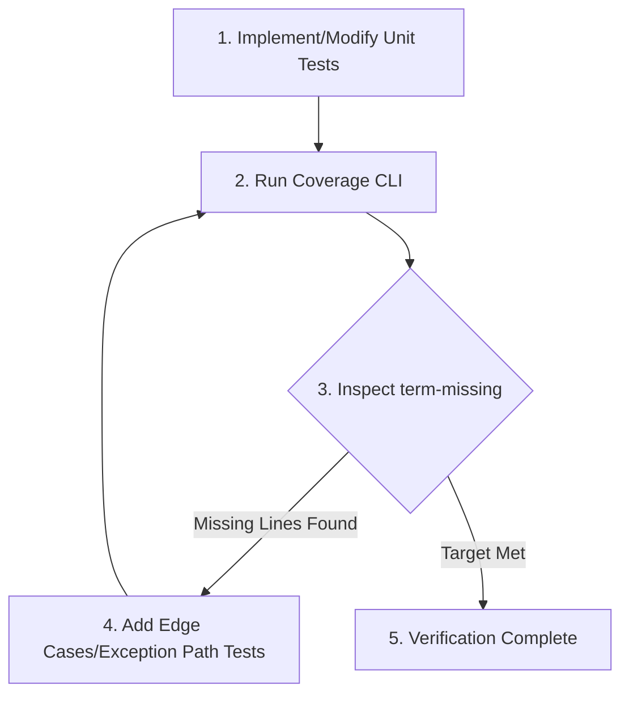

---
trigger:
  - on_file_path_regex: "tests/.*test_.*\\.py"
  - on_file_path_regex: "src/.*\\.py"
priority: 8
---

# Testing & Code Coverage Directives: Best Practices

This document defines the strict requirements for writing highly readable, maintainable, and precise tests in this project. The AI coding assistant MUST strictly adhere to these directives when creating, modifying, or refactoring test codes using `pytest`.

---

## 1. Adherence to F.I.R.S.T. Principles
- **Fast:** Tests must execute within seconds to allow frequent runs. Avoid unnecessary `time.sleep()`. Use `pytest-asyncio` for precise control over asynchronous code.
- **Independent:** Each test must be completely isolated. Avoid shared state. Shared contexts, singletons, or global variables must be reset or isolated at the start of each test.
- **Repeatable:** Tests must produce the same result in any environment (local, CI, staging) regardless of network status, external exchange APIs, or system time.
- **Self-Validating:** Manual log checks using `print()` are strictly prohibited. Tests must declare success or failure exclusively through precise `assert` statements.
- **Thorough:** Cover not only the happy paths but also negative paths, boundary values, empty values (`None`, empty collections), and intentional exception scenarios.

---

## 2. Test Readability & Maintainability

### 2.1 AAA Pattern (Arrange, Act, Assert)
The body of each test function must be clearly separated into three distinct phases using blank lines to represent **Given (Arrange) - When (Act) - Then (Assert)**.
```python
def test_calculate_order_qty_with_valid_balance():
    # Arrange (Given)
    balance = 1000.0
    price = 250.0
    risk_percentage = 0.02
    
    # Act (When)
    qty = calculate_order_qty(balance, price, risk_percentage)
    
    # Assert (Then)
    assert qty == 0.08
```

### 2.2 Explicit Naming Convention
Test functions must be named descriptively using the **`test_[target]_[condition]_[expected_behavior]`** structure. This ensures that failures can be diagnosed immediately from the test logs alone.
- **Bad:** `test_order()`
- **Good:** `test_create_order_when_balance_insufficient_raises_value_error()`

### 2.3 Pytest Fixture Standards
- **Explicit Dependency Injection:** Separate shared setups into Pytest fixtures and inject them explicitly as test function parameters.
- **Resource Cleanup (`yield`):** Fixtures managing databases, files, or network resources must use the `yield` keyword to ensure teardown occurs after the test completes.
- **Scope Minimization:** Restrict stateful or mutable fixtures to `scope="function"` to avoid cross-test contamination.
- **Leverage Standard Fixtures:** Avoid manually creating temp directories/files; instead, leverage Pytest's built-in `tmp_path` fixture.
- **Limit `autouse=True`:** Restrict `autouse=True` strictly to global initialization (e.g., global mocking hooks). All other dependencies must be explicitly injected.
- **Immutability of Higher-Scoped Fixtures:** `session` or `module` scoped fixtures must be treated as read-only. Modifying their internal state inside a test function is strictly prohibited.
- **Asynchronous Testing Standards:** Every asynchronous fixture must be decorated with `@pytest_asyncio.fixture`. Every asynchronous test function (`async def`) must be explicitly marked with `@pytest.mark.asyncio`. 
- **Async Fixture Scope Trap:** Be highly cautious of Event Loop scope mismatches. Do not mix `scope="session"` standard fixtures with `scope="function"` async tests without explicit loop management.
- **`caplog` Best Practice:** Always use pytest's built-in `caplog` fixture for log capture. Do NOT manually manipulate handler levels or `logger.propagate` flags across test bodies — this is a token-heavy anti-pattern that risks state leakage. Use `caplog.set_level(logging.DEBUG)` at the test level instead.

### 2.4 Co-modification Mapping
Source files and test files must maintain a strict 1:1 mapping in folder structure and file naming to simplify discovery and maintainability.
- **Convention:** A source module located at `src/[path]/[module_name].py` must map directly to `tests/[category]/[path]/test_[module_name].py` (where `category` is `unit`, `integration`, or `e2e`).
- **Co-modification Rule:** When creating or modifying a source file under `src/`, the AI assistant MUST immediately locate, review, and update/create the corresponding test file to ensure they are synchronized.
- **Exception for Trivial Changes:** This rule is waived for changes that do not alter logical behavior, such as typos in comments, adding type hints, or documentation-only updates. It is also waived if the user explicitly instructs to skip tests for a specific task.

---

## 3. Precision & Robustness

### 3.1 Single Logical Assertion & Meaningful Parameterization
- A single test case must focus on validating **only one logical behavior (scenario)**. Avoid validating multiple unrelated behaviors in a single test. If multiple scenarios exist, split them into distinct test functions or utilize `@pytest.mark.parametrize`.
- **Strict Parameterization Rule:** When using `@pytest.mark.parametrize`, every dataset or row provided MUST represent a distinct logical scenario, boundary condition, or specific edge case. Adding redundant or repetitive data parameters simply to increase test counts without expanding logical coverage is strictly prohibited.

### 3.2 Precise Assertions
- Avoid loose assertions like `assert result is not None` or `assert True` where a more concrete value can be validated. Assert precise return types, exact dict key-value pairs, and specific object properties.
- When asserting floating-point calculations, use `pytest.approx()` to prevent precision mismatches.
  ```python
  assert total_amount == pytest.approx(100.3333, rel=1e-4)
  ```

### 3.3 Explicit Exception & Warning Verification
When testing expected failures, use `pytest.raises` and leverage the `match` parameter to verify the exception type and the exception message in a single, robust assertion.
```python
# Good: Verifies both the exception type and the exact error message
with pytest.raises(InsufficientBalanceError, match="Cannot withdraw more than balance"):
    wallet.withdraw(1000)
```
- *Note:* The `match` argument treats the string as a regular expression pattern. If the error message contains special characters (like brackets `[]` or parentheses `()`), escape them properly or match only the key unique phrases to prevent regex matching failures.

### 3.4 Test Data Generation Strategy (Proactive Testing)
The AI MUST design test cases based on rigorous testing theory BEFORE looking at coverage reports:
- **Equivalence Partitioning (EP) & Boundary Value Analysis (BVA):** For trading logic (e.g., price, quantities, indicators), explicitly test valid ranges, extreme boundaries (e.g., zero, maximum precision limits), and invalid ranges.
- **Data Flow Testing (Def-Use):** When testing pipelines (e.g., `Signal` -> `Portfolio` -> `Order`), ensure that the specific state mutated in the definition (Def) is explicitly verified at its usage point (Use).

---

## 4. Isolation & Mocking Guidelines

### 4.1 Mocking Boundaries (Avoid Over-Mocking)
- **Mock Only Boundaries:** Restrict mocking strictly to system boundaries: external Web APIs (e.g., Upbit, Binance), database queries, sockets, filesystems, and clock times.
- **No Hallucinated API Schemas:** When mocking external exchange APIs (Binance, Upbit), the AI MUST NOT guess or hallucinate JSON response structures. The AI MUST use pre-recorded JSON responses located in the `tests/fixtures/` directory, or ask the user to provide the exact API response payload if missing.
- **Do Not Mock Pure Logic:** Never mock internal domain models, utility functions, or pure mathematical modules. Doing so results in fragile tests that pass even when the actual implementation is broken.
- **Use `autospec=True` (RECOMMENDED, not mandatory):** When mocking classes or modules, specifying `autospec=True` prevents hallucinated mock calls. However, skip it for private functions (e.g., `_build_*`, `_get_*`) whose signatures may change or be deleted; use simple `MagicMock` instead to avoid collection failures.
  ```python
  # Boundary class mock: use autospec
  mock_client = mocker.patch("src.services.order.BinanceClient", autospec=True)
  # Internal helper mock: skip autospec
  mocker.patch("src.domain.module._helper_fn", return_value=None)
  ```
- **Where to Patch Rule:** Always patch the target where it is *imported and used*, not where it is *defined*.
  - **Bad:** `mocker.patch("src.clients.BinanceClient")` (ineffective if `src.services.order` has already imported it).
  - **Good:** `mocker.patch("src.services.order.BinanceClient", autospec=True)`.
- **Async Mocking:** When mocking asynchronous methods (`async def`), always specify `new_callable=mocker.AsyncMock` to ensure the mock properly returns a awaitable coroutine object.
- **Time Mocking Constraints:** Since Python's built-in `datetime` module is implemented in C, it cannot be patched directly using standard `mocker.patch`. When time isolation is required, use the `freezegun` library or patch the project's internal time abstraction layer (e.g., `src.utils.time.get_now`) instead.
- **Boundary Isolation by Test Category:**
  - **Unit Tests (`unit/`):** All system boundaries, including database access, external APIs, and network I/O, MUST be strictly mocked.
  - **Exception for DB Layer:** For Repository or Database access layers, using an in-memory database (e.g., `sqlite:///:memory:`) is PREFERRED over mocking ORM sessions/queries to prevent "False Positives" and ensure query correctness.
  - **Integration Tests (`integration/`):** Real database instances or test containers must be utilized. Ensure state isolation and resource cleanup are strictly managed via DB fixtures using the `yield` keyword (e.g., transaction rollbacks).
---

## 5. AI Coverage-Driven Self-Correction Loop
The AI coding assistant MUST execute the following 3-step loop when implementing or refactoring source code to ensure high quality and comprehensive test coverage.



1. **Standard Coverage Execution Command:**
   ```bash
   uv run pytest tests/<test_file>.py --cov=src/<target_module> --cov-report=term-missing
   ```
2. **Missing Line Tracking:**
   If the coverage output identifies missing/unexecuted lines (indicated under the `Missing` column), the AI must immediately write targeted edge cases (e.g., negative parameters, exceptions, fallback branches) to cover those lines.
3. **Risk-Adjusted Coverage Targets (TIERED — apply strictly by layer):**
   - **Core Logic (Domain, Signal, Sizing, Portfolio):** Aim for **>= 90%**. Run the self-correction loop here.
   - **Adapters/Runners/DTOs/Boilerplate:** Aim for **>= 70%**. Do NOT run self-correction loop beyond 1 iteration for these layers. Running 3 full coverage iterations on adapter files is a token waste anti-pattern.
   - **Entrypoints / CLI / `__init__.py`:** Skip coverage requirement entirely. Use `# pragma: no cover` where applicable.
4. **Modified-Files-Only Coverage Scope:**
   - Coverage MUST be measured ONLY on files created or modified by the current spec (determinable via `git diff --name-only` against the base branch). Unchanged files in the same module directory are excluded from the coverage report to avoid false-negative penalties (e.g., `recipes.py` unchanged but dragging down the module average).
5. **[CRITICAL LIMIT] AI Loop Termination:**
   The AI MUST NOT execute the coverage self-correction loop more than **3 times**. If targets are not achieved within 3 iterations, the AI MUST stop, commit the current progress, and report the specific bottleneck to the user.
6. **No Empty Assertions:**
   Tests written solely to execute lines without performing meaningful assertions are strictly prohibited. The AI must always validate the final return value or verify expected state side effects.
7. **No Abuse of `# pragma: no cover`:**
   Abusing `# pragma: no cover` to artificially inflate coverage percentages is strictly prohibited. It should only be used for genuinely untestable code paths (e.g., `if __name__ == "__main__":`).