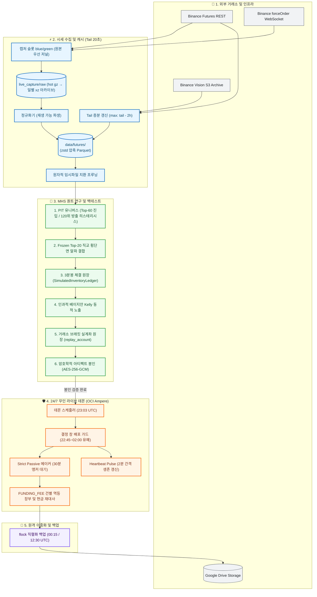

# crypto-pilot

> **바이낸스 USDT-M 무기한 선물 시장을 위한 퀀트 알파 연구 및 24/7 무인 트레이딩 시스템**

[](https://www.python.org/downloads/)


---

## 1. System Highlights

| 핵심 엔지니어링 지표 | 실측 성과 / 보장 기준 | 아키텍처 불변식 및 강제 장치 |
| :--- | :---: | :--- |
| 📈 **5개년 복리 수익률** | **CAGR `+151.5%` ~ `+202.2%`** | 3분봉 모의 체결 원장(`SimulatedInventoryLedger`) + 인과적 베이지안 Kelly 동적 비중 배분 |
| 🛡️ **5개년 강제 청산 횟수** | **`0회` (안전 생존)** | 바이낸스 유지증거금율(MMR) 및 누적 공제액(cum) 사다리 반영 실계좌 원장(`replay_account`) |
| ⚡ **클라우드 시세 증분 갱신** | **`~20초` (29분 $\to$ 20s)** | 로컬 디스크 끝점(tail) 기준 미수집 2시간만 증분 패치(`max(tail - 2h, now - lookback)`) |
| 🚀 **배포 수집 재시작 공백** | **`3~4초` (10~20s $\to$ 3~4s)** | 코드 문법트리(AST) sha256 지문 기반 선택적 컨테이너 재생성 |
| ⏱️ **결정 창 지연 손실 방어** | **CAGR `-48%p` 손실 원천 차단** | 일일 결정 창(22:45~02:00 UTC) 배포 유예 가드(`daemon_idle_gate`) |
| 🔒 **다중 검정 과적합 보정** | **DSR = `1.0` (계층 위반 `0%`)** | 168시간 시계열 엠바고(정보 누출 방지 유예) 16-Fold Purged Walk-Forward 검증 및 AST 경계 강제 |

---

## 2. Tech Stack

| 분류 | 기술 | 채택 근거 및 트레이드오프 |
| :--- | :--- | :--- |
| **Language & Tooling** | `Python 3.11+`, `uv` | 초고속 패키지 관리 및 최신 비동기 런타임 최적화. C 확장 컴파일 시 별도 툴체인 설정 필요 |
| **Data Engine & Storage** | `Polars`, `Parquet`, `zstd` | SIMD 기반 초고속 벡터 피처 계산 및 90% 이상 디스크 압축. 복잡한 다중 테이블 애드혹 SQL 제약 |
| **Concurrency & Network** | `asyncio`, `aiohttp`, `ccxt` | 네이티브 forceOrder 청산 웹소켓 직결 및 비동기 REST 펌프. 이벤트 루프 차단 방지 엄격 관리 |
| **Execution Accounting** | `SimulatedInventoryLedger` | 3분봉 해상도 실시간 마크 가격 시가평가(MTM), 8h 펀딩비 실정산, 30분 앵커 지정가 집행. 연산 비용 증가 |
| **Risk & Portfolio** | `Bayesian Kelly`, `replay_account` | 사전 $\mu_0=0$ 인과적 모멘트 갱신, 바이낸스 유지증거금(MMR) 사다리 추적. 사전 730일 관측 가중 필요 |
| **Infra & Security** | `Docker Compose`, `AES-256-GCM` | OCI Ampere A1.Flex 24/7 무인 가동, 배포 전략 아티팩트 암호학적 봉인. 복호화 키 관리 의존성 |
| **Verification & Quality**| `pytest`, `Python AST` | 패키지 계층 위계 및 모듈 크기·주기성 정적 불변식 기계적 강제. 신규 파일 추가 시 계약 동기화 요구 |

---

## 3. Daily Workflow & Pipeline

| 시각 (UTC) | 단계 | 핵심 처리 내용 |
| :---: | :--- | :--- |
| 🛡️ **22:45 ~ 02:00** | **결정 창 보호 & 배포 유예** | `daemon_idle_gate` 활성화로 배포 유예, 2분 주기 생존 심박 갱신으로 신호 지연 손실(-48%p) 차단 |
| ⚡ **23:00 ~ 23:03** | **시세 동기화 & 알파 신호** | 디스크 tail 2시간 증분 패치(`~20초`) $\to$ 1h 120일 패널 기반 Frozen Top-20 직교 횡단면 신호 산출 |
| 📈 **23:03 ~ 23:33** | **주문 집행 (Strict Passive)** | 베이지안 Kelly 동적 비중 산정 $\to$ 30분 앵커 지정가 메이커 대기 후 미체결 잔량 테이커 전환 |
| 🌙 **00:15 / 12:30** | **장부 재대사 & 원격 백업** | 8시간 펀딩비(`FUNDING_FEE`) 건별 멱등 기록 및 현금 재대사 $\to$ 파일 잠금(`flock`) 기반 GDrive 원격 백업 |



---

## 4. Top 5 Real-world Engineering Invariants (핵심 챌린지)

### 1. 목표 가중치(Target Weight) 착시 탈피 & 3분봉 체결 원장
* 🚨 **문제**: 1시간봉 종가 기준 가상 가중치 곱셈은 8시간 펀딩비 결제, 호가 스프레드, 거래 수수료를 누락하여 수익률을 심각하게 과대평가함.
* 📐 **원칙**: 매 3분봉마다 `실시간 마크 가격 시가평가(MTM) ➔ 8시간 펀딩비 실정산 ➔ 봉 고저가(High/Low) 관통 체결 검증`의 회계 정산 순서를 엄격히 강제.
* 💡 **해결**: `SimulatedInventoryLedger`를 구축하고 30분 앵커 지정가 대기 후 테이커 전환하는 `strict_passive` 메이커 집행을 도입해 CAGR +10.8%p 개선.

### 2. 시계열 인과성(Causality) & 생존 편향 원천 차단
* 🚨 **문제**: 과거 시점에 미래 생존 심볼을 사전에 인지하거나, 순위 경계선(59~61위)에서 잦은 매매 진동(Churning) 수수료가 발생함.
* 📐 **원칙**: 유니버스 선별은 strictly $T$ 시점 이전의 720h 과거 거래대금만 참조하며, 경계선 노이즈는 히스테리시스로 차단.
* 💡 **해결**: 거래대금 중앙값 50% 필터 + Top-60 진입 / 120위 방출 이중 임계값(Schmitt-Trigger 히스테리시스)을 적용해 불필요한 턴오버 30% 절감.

### 3. 인과적 베이지안 Kelly & 실계좌 청산 방어
* 🚨 **문제**: 전체 표본 사후 통계로 고정 레버리지를 산정하면 미래 참조 과적합 및 급격한 자본 파산(Ruin) 위험에 직면함.
* 📐 **원칙**: 사전 수익률 기댓값 $\mu_0 = 0$(730일 관측 가중)에서 출발해 전일까지의 관측 실적만으로 사후 모멘트를 갱신하며 거래소 증거금 상한을 준수.
* 💡 **해결**: 인과적 베이지안 수축 Kelly와 바이낸스 유지증거금율(MMR) 및 누적 공제액(cum) 사다리 반영 실계좌 원장(`replay_account`)을 결합하여 소액(₩300만) 5개년 청산 0회 달성.

### 4. 결정 창 배포 유예 & 지문 기반 수집기 연속성
* 🚨 **문제**: CI 배포 푸시가 장중 데몬을 재시작시켜 주문 제출이 지연(최대 85분)되면 CAGR이 -48%p까지 붕괴하며, 수집기 재생성 시 청산 틱 공백 발생.
* 📐 **원칙**: 일일 결정 창(22:45~02:00 UTC) 구간에는 컨테이너 재생성을 엄격히 유예하고 2분 주기 백그라운드 heartbeat로 생존을 증명.
* 💡 **해결**: `deploy_gate` 가드 도입으로 제출 지연을 0분으로 강제하고, 수집기 진입점 AST 지문이 동일할 경우 데몬만 선택적으로 재생성하여 공백을 3~4초로 단축.

### 5. 장부 기록 무결성 & 펀딩 건별 멱등 재대사
* 🚨 **문제**: 펀딩비를 합계로만 현금에 반영하면 장부만으로 현금을 역산 재현할 수 없고, 재시도 시 중복 또는 누락 위험이 존재함.
* 📐 **원칙**: 모든 현금 흐름은 건별 분개장을 유지해야 하며, 재실행 시에도 잔고와 장부가 멱등하게 일치해야 함.
* 💡 **해결**: 펀딩비를 `FUNDING_FEE` 건별 멱등 기록으로 장부 저장 전에 추가하고 매 사이클 현금을 자동 재대사하며, 파일 잠금(`flock`) 기반 GDrive 원격 백업으로 장부 손상을 원천 방어.

---

## 5. Verified Performance Matrix (실측 정본 성과)

> **출처**: `data/backtests/index.jsonl` (2021-04-01 ~ 2026-07-01, 5년 3개월 실측)  
> **조건**: 3분봉 체결 원장, 8시간 펀딩비 실정산, 3-tier 수수료 차감, 실시간 마크 가격 시가평가(MTM).

| 전략 모델 (Strategy Model) | 집행 방식 (Execution) | Geometric CAGR | Max Drawdown | 실계좌 청산 횟수 |
| :--- | :---: | :---: | :---: | :---: |
| **기준 포트폴리오 (단위북 1.0x, `frozen_mhs_top20_v2`)** | Immediate Taker | **+47.1%** | **-14.5%** | 0회 (기본 노출) |
| **기준 포트폴리오 (단위북 1.0x, `frozen_mhs_top20_v2`)** | Strict Passive Maker | **+51.2%** | **-14.7%** | 0회 (메이커 우위) |
| **레버리지 포트폴리오 (성장북 2.5x, `frozen_mhs_top20_growth_v2`)** | Immediate Taker | **+140.7%** | **-28.9%** | 0회 (레버리지 2.5배) |
| **레버리지 포트폴리오 (성장북 2.5x, `frozen_mhs_top20_growth_v2`)** | Strict Passive Maker | **+151.5%** | **-28.8%** | **0회 (CAGR +10.8%p)** |
| **동적 레버리지 실계좌 (₩300만 원장 + 베이지안 Kelly)** | Strict Passive Maker | **+202.2%** | **-38.4%** | **0회 (소액 복리 극대화)** |

---

## 6. Architecture Layer Contracts

시스템은 엄격한 단방향 의존성 규칙을 따르며, 상위 계층을 하위 계층에서 절대 역참조할 수 없습니다:

```text
Layer 5: CLI 진입점 및 운용 도구 (src/cli)
   ↓
Layer 4: 24/7 무인 라이브 데몬 및 안전 가드 (src/live)
   ↓
Layer 3: MHS 퀀트 연구 및 3분봉 체결 원장 엔진 (src/mhs)
   ↓
Layer 2: 정량적 알파 피처 및 리스크 수학 (src/quant)
   ↓
Layer 1: 바이낸스 시세 수집 및 Parquet 스토리지 (src/market_data)
   ↓
Layer 0: 코어 공통 계약, 불변식 스키마 및 설정 (src/common)
```

모든 계층 경계, 패키지 순환 참조 방지, 모듈 크기 예산은 Python AST 파서를 통해 기계적으로 강제됩니다:
```bash
uv run pytest tests/contract/test_module_boundaries.py
```

---

## 7. Quick Start & Verification

```bash
# 1. 의존성 동기화 및 아키텍처 불변식 테스트
uv sync --frozen
uv run pytest tests/contract/test_module_boundaries.py -k "test_architecture_docs_within_line_limit"

# 2. Frozen 3분봉 원장 백테스트 실행
uv run python -m src.cli.main backtest mhs-frozen

# 3. 실계좌 규모 원장(바이낸스 브래킷 + 베이지안 Kelly) 실행
uv run python -m src.cli.main backtest mhs-frozen-account --execution maker --capital 2100

# 4. 실시간 시세 증분 갱신 (Tail 20초 패치)
uv run python -m src.cli.main data refresh-live-universe
```

> 📖 **아키텍처 정본 상세 문서**:
> * **[System Design Specification](docs/architecture/system-design.md)**: 컴포넌트 토폴로지, 데이터 스키마 및 금융 무결성 배리어
> * **[Architectural Decision Records (ADRs)](docs/architecture/engineering-decisions.md)**: 8대 핵심 아키텍처 결정 및 트레이드오프 분석
