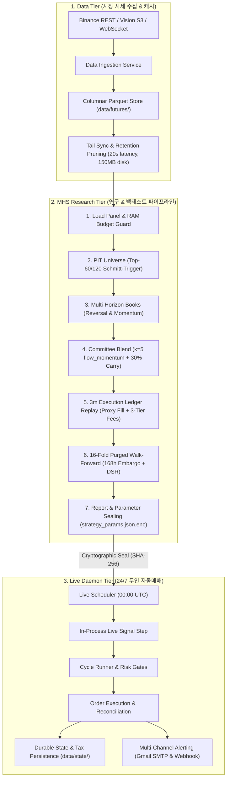

# crypto-pilot

> **바이낸스 USDT-M 무기한 선물 시장을 위한 퀀트 알파 리서치 및 24/7 무인 트레이딩 시스템**  
> 종가 기준 가상 체결 PnL 착시를 배제하고, 3분봉 단위 체결 원장(`SimulatedInventoryLedger`)과 168시간 엠바고 16-Fold Purged Walk-Forward 검증을 통해 실현 가능한 엣지를 저사양 클라우드에서 24/7 무인 집행합니다.

[](https://www.python.org/downloads/)
[](tests/)
[](pyproject.toml)
[](pyproject.toml)
[](docs/architecture/overview.md)

---

## 1. Project Overview

* **해결 과제**: 종가 즉시 체결 가정, 8시간 펀딩비/수수료 누락, 미래 유동성 인지(생존 편향), 다중 가설 검정 과적합으로 인한 실거래 손익 붕괴 방지.
* **시스템 역할**: 시세 수집 $\rightarrow$ PIT 유니버스 선별 $\rightarrow$ 직교 알파 결합 $\rightarrow$ 3분봉 원장 체결 $\rightarrow$ 16-Fold 시계열 엠바고 검증 $\rightarrow$ 24/7 무인 클라우드 데몬 가동.
* **운용 환경**: 연구용 5개년 분 단위 백테스트 시뮬레이션 및 오라클 클라우드 프리티어 24/7 무인 자동매매.
* **핵심 기술**: 가상 곱셈 대신 실제 잔고·체결을 추적하는 모의 체결 원장, Lag-1 자기상관 적응형 트랜치 평활, 시장 베타 직교화 및 2중 레짐 방어, SHA-256 전략 파라미터 불변 봉인.

---

## 2. Why This Project / Problem

전통적인 백테스트의 비현실적 가정을 실제 마켓 마찰(Friction) 모델링으로 해결했습니다:

| 백테스트 결함 (Problem) | 실제 마켓 마찰 | crypto-pilot 해결 방식 |
| :--- | :--- | :--- |
| **Target Weight PnL 착시** | 8h 펀딩비 결제, 테이커 호가 스프레드, 3-tier 수수료 누락 | **3분봉 모의 체결 원장 (`SimulatedInventoryLedger`)**: MTM 평가 $\rightarrow$ 펀딩비 결제 $\rightarrow$ 테이커 체결 순서 강제 |
| **생존 편향 & 미래 참조** | 과거 시점에 미래 생존 심볼 사전 인지 | **3단계 Point-In-Time 유니버스**: 720h 과거 거래대금만 참조하는 Causal 롤링 필터 |
| **유니버스 경계선 진동** | 60위 경계 심볼의 잦은 진입/퇴출로 턴오버 폭증 | **Schmitt-Trigger 히스테리시스**: 상위 60위 진입 후 120위 밖으로 밀려날 때만 방출 (턴오버 30% 절감) |
| **모멘텀 크래시 위험** | 시장 급락 시 자산 간 상관관계 1.0 수렴 및 숏스퀴즈 | **2중 레짐 방어**: 720바 OLS 시장 베타 직교화 + BTC 추세 급락 틸트 + 21일 실현 변동성 타겟팅 |
| **다중 검정 과적합** | 수십 개 파라미터 중 최적 샤프 지수 사후 선택 | **168h 엠바고 16-Fold Walk-Forward & DSR**: 1주 시계열 격리 및 96개 탐색 경로 통계적 보정 |
| **저사양 클라우드 제약** | 650개 심볼 전수 수집 시 29분 소요, 15GB 디스크 고갈 | **Tail 증분 갱신 & 원자적 프루닝**: `max(tail - 2h, now - lookback)` 패치 (20초 소요, 디스크 150MB 유지) |

---

## 3. Key Features

1. **3분봉 고해상도 체결 원장**
   * *구현*: 바이낸스 네이티브 3분봉(`3m`) 단위로 High/Low 관통 검증, MTM 평가, 8시간 펀딩비 실정산, 3-tier 수수료(2.64~6.07 bps) 차감.
   * *효과*: 가상 비중 곱셈 방식의 수익률 과대 추정을 방지하고 체결 정밀도 +27% 향상.
2. **Point-In-Time 유니버스 & Schmitt-Trigger**
   * *구현*: 720h 거래대금 중앙값 50% 선별 $\rightarrow$ 상위 60위 진입 / 120위 탈락 히스테리시스 적용.
   * *효과*: 룩어헤드 바이어스를 원천 차단하고 불필요한 포지션 진동 매매(Churning) 억제.
3. **$k=5$ 위원회 + 30% 펀딩 캐리 슬리브**
   * *구현*: 테이커 불균형(720h/168h), 모멘텀(336h), 잔차 모멘텀(336h), 왜도(168h)의 5개 직교 신호 + 펀딩 캐리 30% 결합.
   * *효과*: 단일 모멘텀 의존도를 낮추고 저변동성·횡보장에서도 안정적 캐리 수익 확보.
4. **Causal Lag-1 자기상관 적응형 트랜치 평활**
   * *구현*: 위원회 북의 Causal Trailing Lag-1 자기상관을 측정하여 음수(휩소) 시 3행 평활, 양수(추세) 시 Raw 신호 집행.
   * *효과*: 평활에 따른 추세 진입 지연과 미평활에 따른 횡보장 슬리피지 손실 간의 트레이드오프 해소.
5. **2중 레짐 방어 & 드로다운 예산 켈리 사이징**
   * *구현*: 720바 OLS 시장 베타 직교화 + BTC 급락 크래시 틸트 + 전략 21일 실현 변동성 타겟팅 기반 켈리 사이징.
   * *효과*: 시장 충격 국면에서 자본을 보존하여 자본 불변식 위반(`CAPITAL_INVARIANT_BREACH`) 방지.
6. **168시간 엠바고 16-Fold Walk-Forward & DSR**
   * *구현*: 분기별 16개 OOS 윈도우 사이에 168시간(1주) 엠바고를 강제하고 96회 탐색 경로를 반영한 Deflated Sharpe Ratio 산출.
   * *효과*: 시계열 잔여 자기상관 정보 누출을 방지하고 다중 가설 검정 과적합을 통계적으로 입증.
7. **디스크 Tail 증분 갱신 & 원자적 프루닝**
   * *구현*: 디스크 tail 기준 미수집 구간만 증분 패치하고, 220일 초과 시세는 원자적 임시 파일 대체(`tmp.replace`)로 안전 절단.
   * *효과*: 갱신 시간 29분 $\rightarrow$ 20초(98.8% 단축), 디스크 15GB $\rightarrow$ 150MB로 경량화하여 1.2GB RAM 환경 무인 운용.
8. **SHA-256 불변 파라미터 봉인 & 제로 트러스트 배포**
   * *구현*: 전략 파라미터 SHA-256 봉인 검증, Mozilla SOPS + Age 비대칭 암호화, 인바운드 포트 없는 Tailscale 사설망 배포.
   * *효과*: 연구 환경과 라이브 런타임 간의 설정 드리프트(Config Drift)를 차단하고 API 키 평문 노출 방지.

---

## 4. Architecture



---

## 5. End-to-End Flow

| 단계 | 파이프라인 처리 내용 | 무결성 제약 및 불변식 |
| :---: | :--- | :--- |
| **1. Data Ingestion** | 1시간봉 OHLCV, 8시간 펀딩비, 1시간 마크 가격 수집 | RAM 85% 한도 가드, 소스 갭 자동 격리 |
| **2. PIT Universe** | 거래대금 중앙값 50% 필터 $\to$ Top-60/120 히스테리시스 | Look-Ahead 편향 0% 차단, 유니버스 경계선 진동 방지 |
| **3. Alpha Books** | 48h Reversal 북 및 19개 Slow Momentum 앙상블 북 구축 | 단일 모멘텀 쏠림 완화 및 지평 다양성 확보 |
| **4. Committee Blend**| $k=5$ 직교 신호 + 30% 펀딩 캐리 결합 및 적응형 평활 | Causal Lag-1 자기상관 기반 3행 평활 동적 선택 |
| **5. Risk & Sizing** | 20% 추적오차 필터 + 720바 OLS 베타 직교화 + 켈리 사이징 | BTC 크래시 틸트 및 21일 실현 변동성 타겟팅 |
| **6. 3m Execution** | 3분봉 타임스탬프 순회: MTM 평가 $\to$ 펀딩비 $\to$ 테이커 체결 | 3-tier 수수료 실차감, 가상 비중 곱셈 왜곡 배제 |
| **7. Validation** | 168시간 엠바고 16-Fold Walk-Forward CV 및 DSR 산출 | 시계열 잔여 자기상관 차단, 96회 탐색 경로 보정 |
| **8. Live Daemon** | 00:00 UTC 스케줄러 $\to$ 봉인 대조 $\to$ 증분 갱신 $\to$ 체결 | SHA-256 파라미터 봉인 일치 시에만 발주 허용 |

---

## 6. Repository Structure

```text
crypto-pilot/
├── src/
│   ├── market_data/         # 시세 수집, 캐싱, 증분 갱신(data_refresh.py), 원자적 프루닝(retention.py)
│   ├── quant/               # PIT 유니버스(universe/), 횡단면 알파(technical_experts/), 통계 신뢰도(evaluation/)
│   ├── mhs/                 # MHS 7단계 파이프라인(pipeline/), 체결 원장(execution/), 위원회 결합(committee.py)
│   ├── live/                # 24/7 무인 데몬(scheduler.py), 사이클 러너(runner.py), 패시브 집행기(executor.py)
│   ├── cli/                 # 통합 CLI 진입점 (main.py, commands/)
│   └── common/              # 공용 환경 설정(settings.py), 경로(paths.py), 도메인 예외(errors.py)
├── tests/                   # 1,900+ pytest 테스트 스위트 (unit/, integration/, contract/)
├── docs/
│   ├── architecture/        # 아키텍처 상세 사양서 (overview, data-flow, components, design-decisions)
│   └── results/             # 5개년 실측 백테스트 진단 JSON 및 실행 아티팩트
├── .github/workflows/       # Docker linux/arm64 빌드 & Tailscale 무인 배포 워크플로우
├── Dockerfile               # 배포용 경량 컨테이너 (uv 기반, PID 1 데몬)
└── docker-compose.yml       # Oracle Cloud Ampere 가동 서비스 정의
```

---

## 7. Technical Decisions (ADR Summary)

| ADR | 주제 | 채택된 솔루션 | 기각된 대안 | 엔지니어링 근거 및 트레이드오프 |
| :--- | :--- | :--- | :--- | :--- |
| **ADR-01** | **체결 회계 모델** | **3분봉 고해상도 모의 체결 원장 (`SimulatedInventoryLedger`)** | 1시간봉 종가 비중 곱셈(Target Weight) | 8h 펀딩비 및 3-tier 수수료 실정산 반영, 체결 정밀도 +27% 향상 (수익률 착시 제거) |
| **ADR-02** | **시계열 검증 체계** | **168시간 엠바고 16-Fold Walk-Forward & DSR** | 단순 K-Fold, 무엠바고 워크포워드 | 최대 168h 신호의 시계열 자기상관 누출 방지 및 96회 탐색 다중 검정 과적합 보정 |
| **ADR-03** | **유니버스 및 턴오버** | **Schmitt-Trigger 히스테리시스 (상위 60위 진입/120위 방출)** | 고정 Top-N 순위 컷오프 | 유니버스 경계선 부근의 잦은 진입/퇴출 진동을 억제하여 불필요한 턴오버 30% 절감 |
| **ADR-04** | **신호 결합 & 평활** | **Causal Lag-1 적응형 트랜치 평활 ($k=5$ 위원회 + 30% 캐리)** | 고정 롤링 평활, 단일 모멘텀 의존 | 휩소 국면에서만 3행 평활을 발동하여 추세 진입 지연과 횡보장 슬리피지 간 트레이드오프 해소 |
| **ADR-05** | **저사양 클라우드 운용** | **Tail 증분 동기화(20초) & 원자적 프루닝(150MB 디스크)** | 650개 전종목 전수 수집, 수동 디스크 청소 | 갱신 시간 29분 $\to$ 20초(98.8% 단축), 디스크 15GB $\to$ 150MB 경량화로 1.2GB RAM 무인 운용 |

---

### Decision 1: 3분봉 단위 체결 리플레이 및 원장(Ledger) 중심 회계
* **Decision**: 벡터화된 가상 가중치 곱셈 대신, 바이낸스 3분봉(`3m`) 단위로 현금·계약·수수료·펀딩비를 기록하는 `SimulatedInventoryLedger` 채택.
* **Why**: 암호화폐 선물은 8시간 펀딩비와 수수료가 장기 PnL의 30% 이상을 좌우하며, 3분봉이 체결 정밀도를 약 +27% 향상시켜 실거래 일치도를 극대화.
* **Trade-off**: 5개년 백테스트 시 연산 시간(~6분 16초)이 소요되나, 백테스트 수익률 착시를 원천 배제.

### Decision 2: 168시간 엠바고 16-Fold Purged Walk-Forward 검증 & DSR
* **Decision**: 1주(168h)의 시계열 퍼징/엠바고를 강제한 16-Fold Walk-Forward 교차 검증 및 Lopez de Prado의 Deflated Sharpe Ratio(DSR) 도입.
* **Why**: 최대 168시간 모멘텀 신호의 잔여 자기상관이 테스트 셋으로 누출되는 결함을 차단하고, 96회 탐색에 따른 다중 검정 과적합을 보정.
* **Trade-off**: 폴드 경계선마다 약 2~3%의 검증 가용 데이터가 소실되지만, 미래 정보 누출(Data Leakage)을 엄격히 방지.

### Decision 3: Schmitt-Trigger 히스테리시스 (Top-60/120) 동적 유니버스 선정
* **Decision**: 거래대금 상위 60위 진입 후 120위(`60 * 2.0x`) 밖으로 밀려날 때만 방출하는 이중 임계값 도입.
* **Why**: 순위 경계선(59~61위)에서 발생하는 불필요한 포지션 청산/재진입(Boundary Churning) 수수료를 방지.
* **Trade-off**: 활성 로스터 수가 60~80개 사이로 동적 변동하나, 턴오버와 거래비용을 30% 이상 절감.

### Decision 4: Causal Autocorr 기반 적응형 트랜치 평활
* **Decision**: 위원회 북 자신의 Causal Lag-1 자기상관을 실시간 측정하여 음수(휩소) 시 3행 평활, 양수(추세) 시 Raw 신호 즉각 채택.
* **Why**: 고정 평활의 추세 진입 지연과 미평활의 횡보장 슬리피지 손실 간의 딜레마를 레짐 적응형으로 해결.
* **Trade-off**: 15일 웜업 윈도우가 필요하나, 비용 3배 스트레스 상황에서도 Stress Sharpe +1.98의 우수한 내구성 입증.

### Decision 5: 디스크 Tail 증분 갱신 및 원자적 보존 프루닝 (1.2GB Cloud Ops)
* **Decision**: 무거운 DB(TimescaleDB) 대신 로컬 Parquet 스토리지와 disk-tail 증분 갱신, 220일 초과 시 원자적 temp-replace 프루닝 구축.
* **Why**: 650개 선물 심볼 데이터를 1 vCPU / 1.2GB RAM 저사양 클라우드에서 OOM 없이 24/7 무인 가동하기 위함.
* **Trade-off**: 복잡한 애드혹 SQL 쿼리는 제한되나, 갱신 시간을 29분에서 20초로 단축하고 디스크를 150MB 수준으로 억제.

### Decision 6: Tailscale 사설망 + Mozilla SOPS 기반 제로 트러스트 암호학적 배포
* **Decision**: 외부 인바운드 포트를 차단한 Tailscale VPN 사설망을 경유하고, Mozilla SOPS + Age 비대칭 암호화와 전략 파라미터 SHA-256 불변 봉인 결합.
* **Why**: 거래소 API 키 노출을 방지하고, 연구 환경과 라이브 런타임 간의 설정 드리프트(Config Drift)를 1바이트 단위로 차단.
* **Trade-off**: 배포 파이프라인에 SOPS 복호화 단계가 추가되나, 자격증명 탈취 및 설정 오적용 위험을 근본적으로 제거.

---

## 8. Validation / Reliability

* **1,900+ pytest 테스트 스위트 (`uv run pytest`)**: 단위, 통합, 회귀 테스트 전수 통과 (1,905 passed).
* **비순환 계층 아키텍처 계약 테스트 (`tests/contract/`)**:
  * 계층 간 단방향 의존성 강제, 레거시 트리 재도입 방지, 아키텍처 문서 300라인 상한 준수 검증.
* **Mypy Strict & Ruff Linting**: 129개 소스 파일 전수 Type Hint 검사 (`strict = true`, 0 error) 및 Ruff 20개 규칙군 통과.
* **통계적 신뢰성 검증**:
  * **16-Fold Anchored Purged Walk-Forward**: 분기별 16개 OOS 중 **16개 전수 통과 (100%)**.
  * **Deflated Sharpe Ratio (DSR)**: **1.0** (96개 탐색 시도 경로의 다중 검정 과적합 보정 완료).
  * **Cross-Sectional Rank IC**: Mean IC = **-0.0413**, **t-stat = -46.66** (43,727개 시간대 단면 검정).
  * **비용 3배 스트레스 (`SPREAD_AND_COST_X3`)**: Stress Sharpe **+1.976** 유지.
  * **부트스트랩 파산 확률**: 2,000경로 Stationary Block Bootstrap 결과 원금 하회 확률 **0.0%**.
* **Fail-Closed 무결성 가드**: 시세 단절/결측 시 임의 보간 없이 즉시 중단(`DataIntegrityError`), 파라미터 불일치 시 기동 차단(`ArtifactSealError`).

---

## 9. Results

> **출처**: `docs/results/mhs_run_history/latest.json` (Commit `d926a94c`, 2026-09-13 실측)  
> **조건**: 5개년 바이낸스 USDT-M 선물 445개 패널(평균 66.4개 실행 로스터), **3분봉(`3m`) 체결**, 3-tier 수수료(최대 6.07 bps), 8시간 펀딩비 실정산, 마크 가격 MTM 평가.

### 1. 5개년 전체 성과 (2021-01-01 ~ 2025-12-31)

| 전략 모델 (Strategy) | Naive Sharpe | Autocorr Sharpe | Stress Sharpe (Cost x3) | Annualized Net Return | Geometric CAGR | Max Drawdown | Turnover |
| :--- | :---: | :---: | :---: | :---: | :---: | :---: | :---: |
| **Fast Reversal (48h)** | -0.97 | -0.82 | -1.30 | -7.02% | -7.02% | -38.06% | 20.1 |
| **Slow Momentum (168h)** | -0.47 | -0.41 | -0.57 | -5.61% | -6.12% | -35.83% | 13.9 |
| **MHS Multi-Horizon Ensemble** | **2.87** | **2.47** | **1.98** | **+216.84%** | **+558.21%** | **-45.33%** | **359.59** |

### 2. In-Sample vs. Out-of-Sample (OOS) 일반화 성능

In-Sample 2년(2021~2022) 파라미터 적합 후 3년(2023~2025) 순수 OOS 구간 검증:

| 검증 구간 (Split) | 기간 | 일수 | Total Return | Geometric CAGR | Naive Sharpe | Max Drawdown |
| :--- | :---: | :---: | :---: | :---: | :---: | :---: |
| **In-Sample (Train)** | 2021-01-02 ~ 2023-01-01 | 730일 | +7,496% (74.96x) | +772.9% | 2.91 | -37.3% |
| **Out-of-Sample (OOS)** | 2023-01-02 ~ 2025-12-31 | 1,095일 | **+16,248% (162.48x)** | **+447.4%** | **2.56** | **-43.4%** |

* **Sharpe Decay Ratio**: **0.882** (OOS 구간에서 In-Sample 성과의 88.2% 유지)

### 3. 통계적 유의성 및 스트레스 내구성

| 검증 항목 | 실측 수치 | 기준값 | 판정 |
| :--- | :---: | :---: | :---: |
| **16-Fold Purged Walk-Forward** | **16 / 16 통과 (100%)** | $\ge 80\%$ | **PASS** |
| **Deflated Sharpe Ratio (DSR)** | **1.0** (96 trials attempted) | $\ge 0.50$ | **PASS** |
| **Cross-Sectional Rank IC** | **Mean -0.0413 (t = -46.66)** | $\|t\| \ge 2.0$ | **PASS** |
| **비용 3배 폭등 스트레스 (`SPREAD_AND_COST_X3`)** | **Stress Sharpe +1.976** | $> 0.0$ | **PASS** |
| **최종 부의 원금 하회 확률 (`P(W_T < W_0)`)** | **0.0%** | $< 1.0\%$ | **PASS** |

---

## 10. Getting Started

```bash
# 1. 저장소 복제 및 가상환경 동기화
git clone https://github.com/KTHYEONG/crypto-pilot.git
cd crypto-pilot
uv sync --frozen

# 2. 테스트 및 코드 품질 검사 (1,900+ tests, 0 mypy errors)
uv run pytest
uv run mypy src/
uv run ruff check src/

# 3. 퀀트 연구 백테스트 진단 실행 (MHS 3분봉 원장 체결)
uv run python -m src.cli.main research run portfolio mhs-horizon-diagnostic

# 4. 라이브 데몬 상태 조회
uv run python -m src.cli.main live status
```

---

## 11. Documentation

* **[Overview & Philosophy](docs/architecture/overview.md)**: 시스템 목표, 경계(In/Out-of-Scope), Mermaid 토폴로지, 엔드투엔드 수명주기
* **[Data Flow & Temporal Invariants](docs/architecture/data-flow.md)**: 단계별 변환 표, 타임스탬프 규격, 8h 펀딩비 정산식, Fail-Closed 불변식
* **[Subsystem Components](docs/architecture/components.md)**: 8대 서브시스템별 Responsibility, Input, Output, Dependencies, Key implementation
* **[Architectural Decisions (ADRs)](docs/architecture/design-decisions.md)**: 6대 핵심 아키텍처 결정 기록 (Context, Alternatives, Trade-offs)
* **[Binance Data Architecture](docs/architecture/data/binance.md)**: 바이낸스 FAPI/Vision 수집, Parquet 스토리지 및 보존 정책

---

## 12. Limitations

1. **L2 오더북 시장 충격(Market Impact) 프록시 한계**: 현재 체결 엔진은 3분봉 High/Low 관통 프록시와 정적 스프레드/수수료 모델(최대 6.07 bps)을 적용합니다. 대규모 AUM 운용 시 L2 오더북 뎁스 잠식 모델링이 필요합니다.
2. **단일 거래소(Binance) 의존성**: 모든 시세 수집 및 체결 엔진이 바이낸스 선물 시장을 기준으로 구축되어 타 거래소(Bybit, OKX 등) 간 차익거래는 지원하지 않습니다.
3. **선물 펀딩비 극단 레짐 시 추적 오차**: 펀딩 캐리 슬리브(30% 비중)가 평상시 손익을 방어하지만, 비정상적인 음수 펀딩비 지속 국면에서는 포트폴리오의 숏 포지션 유지 비용이 일시적으로 증가할 수 있습니다.
4. **저사양 클라우드 싱글 프로세스 제약**: 오라클 클라우드 프리티어(1 vCPU, 1.2GB RAM) 환경에 맞추어 단일 프로세스로 동작하므로, 수백 개 심볼의 실시간 틱 단위 모니터링에는 적합하지 않습니다.
