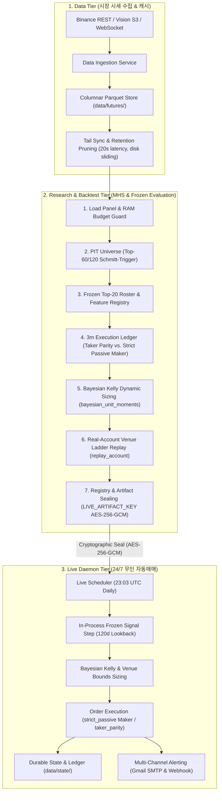

# crypto-pilot

> **바이낸스 USDT-M 무기한 선물 시장을 위한 퀀트 알파 리서치 및 24/7 무인 트레이딩 시스템**  
> 종가 기준 가상 체결 PnL 착시를 배제하고, 3분봉 단위 체결 원장([`SimulatedInventoryLedger`](file:///home/kth/crypto-pilot/src/mhs/execution/ledger.py)) 및 테이커·메이커([`strict_passive`](file:///home/kth/crypto-pilot/src/live/executor.py)) 집행, 거래소 증거금·청산 사다리를 반영한 실계좌 원장([`replay_account`](file:///home/kth/crypto-pilot/src/mhs/execution/account_replay.py))과 인과적 베이지안 Kelly 동적 노출을 통해 저사양 클라우드에서 24/7 무인 집행합니다.

[](https://www.python.org/downloads/)
[](tests/)
[](pyproject.toml)
[](pyproject.toml)
[](docs/architecture/overview.md)

---

## 1. Project Overview

* **해결 과제**: 종가 즉시 체결 가정, 8시간 펀딩비/수수료 누락, 미래 유동성 인지(생존 편향), 비인과적 사후 레버리지 산정, 거래소 증거금·청산 위험 미반영으로 인한 실거래 손익 붕괴 방지.
* **시스템 역할**: 시세 수집 $\rightarrow$ PIT 유니버스 선별 $\rightarrow$ Frozen Top-20 직교 횡단면 알파 결합 $\rightarrow$ 인과적 베이지안 Kelly 동적 노출 $\rightarrow$ 3분봉 테이커/메이커 원장 체결 및 실계좌 거래소 규칙 검증 $\rightarrow$ 24/7 무인 클라우드 데몬 가동.
* **운용 환경**: 연구용 5개년 분 단위 백테스트 시뮬레이션 및 오라클 클라우드 프리티어(OCI Ampere A1.Flex) 24/7 무인 자동매매.
* **핵심 기술**: 가상 곱셈 대신 실제 잔고·체결·펀딩비를 추적하는 모의 체결 원장, 30분 앵커 지정가 대기 후 테이커 폴백 메이커 집행, 인과적 베이지안 수축 Kelly 노출 정책, 거래소 브래킷(MMR)·주문규칙 반영 실계좌 원장, AES-256-GCM 전략 아티팩트 봉인(`LIVE_ARTIFACT_KEY`).

---

## 2. Why This Project / Problem

전통적인 백테스트의 비현실적 가정을 실제 마켓 마찰(Friction) 모델링으로 해결했습니다:

| 백테스트 결함 (Problem) | 실제 마켓 마찰 | crypto-pilot 해결 방식 |
| :--- | :--- | :--- |
| **Target Weight PnL 착시** | 8h 펀딩비 결제, 테이커 호가 스프레드, 3-tier 수수료 누락 | **3분봉 모의 체결 원장 ([`SimulatedInventoryLedger`](file:///home/kth/crypto-pilot/src/mhs/execution/ledger.py))**: MTM 평가 $\rightarrow$ 펀딩비 결제 $\rightarrow$ 테이커/메이커 체결 순서 강제 |
| **생존 편향 & 미래 참조** | 과거 시점에 미래 생존 심볼 사전 인지 | **3단계 Point-In-Time 유니버스**: 720h 과거 거래대금만 참조하는 Causal 롤링 필터 + 소스 갭 가드 |
| **비현실적 즉시 테이커 가정** | 공격적 테이커 진입에 따른 슬리피지 및 높은 수수료 손실 | **Strict Passive 메이커 집행**: 30분(10개 3분봉) 앵커 지정가 대기 후 미체결분 테이커 폴백 |
| **사후적 고정 레버리지** | 표본 전체 사후 통계로 레버리지 결정 시 과적합 및 파산 위험 | **인과적 베이지안 수축 Kelly**: 사전 $\mu=0$에서 매일 전일까지의 단위북 실적으로 사후 $\mu, \sigma$를 인과적 갱신 |
| **거래소 규칙 및 청산 무시** | 증거금 사다리(MMR), 주문 최소단위, 레버리지별 청산 위험 누락 | **실계좌 원장 ([`replay_account`](file:///home/kth/crypto-pilot/src/mhs/execution/account_replay.py))**: 바이낸스 실거래 브래킷 스냅샷 기반 증거금·강제청산·호가단위 실시간 검증 |
| **저사양 클라우드 제약** | 650개 심볼 전수 수집 시 29분 소요, 15GB 디스크 고갈 | **Tail 증분 갱신 & 원자적 프루닝**: `max(tail - 2h, now - lookback)` 패치 (20초 소요, 디스크 슬라이딩 유지) |

---

## 3. Key Features

1. **3분봉 고해상도 체결 원장 & 메이커/테이커 집행**
   * *구현*: 바이낸스 네이티브 3분봉(`3m`) 단위로 High/Low 관통 검증, MTM 평가, 8시간 펀딩비 실정산, 3-tier 수수료 차감. 테이커 즉시 체결(`taker_parity`)과 30분 앵커 지정가 대기 후 테이커 폴백(`strict_passive`) 메이커 정책 동시 지원.
   * *효과*: 가상 비중 곱셈 방식의 수익률 과대 추정을 방지하고, 메이커 집행 시 CAGR 대폭 개선(+10%p 이상).
2. **Point-In-Time 유니버스 & Schmitt-Trigger**
   * *구현*: 720h 거래대금 중앙값 50% 선별 $\rightarrow$ 상위 60위 진입 / 120위 탈락 히스테리시스 적용.
   * *효과*: 룩어헤드 바이어스를 원천 차단하고 불필요한 포지션 진동 매매(Churning) 억제.
3. **Frozen Top-20 횡단면 알파 전략**
   * *구현*: 테이커 불균형(720h/168h), 횡단면 모멘텀(336h), 잔차 모멘텀(336h), 왜도(168h)의 5개 직교 신호 랭크 결합 및 종목별 5% 클립.
   * *효과*: 복잡한 런타임 의존성을 제거하고 1h 120일 패널 창에서 인프로세스로 결정론적 신호 산출.
4. **인과적 베이지안 수축 Kelly 동적 노출**
   * *구현*: 사전 기대수익률 $\mu_0 = 0$(730일 가중)을 기준으로 매일 전일까지의 단위북 실적만을 사용해 사후 모멘트를 갱신하고, 거래소 증거금 상한과 충격비용을 고려하여 일별 최적 노출 산출.
   * *효과*: 사후 확증 편향 없는 안전한 복리 성장 구조 확립.
5. **거래소 규칙 실계좌 규모 원장 (`replay_account`)**
   * *구현*: 바이낸스 USDT-M 실거래 브래킷(Tier별 누적유지증거금 cum/MMR), 최소 주문금액(MIN_NOTIONAL), 수량/가격 단위(LOT_SIZE/PRICE_FILTER)를 반영한 실계좌 원장.
   * *효과*: 소액(₩300만)부터 대규모($100k) 자본까지 실제 거래소 환경에서의 청산 가능성 및 수수료 영향을 엄격히 검증.
6. **디스크 Tail 증분 갱신 & 원자적 보존 관리**
   * *구현*: 디스크 tail 기준 미수집 구간만 증분 패치(`data refresh-live-universe`)하고, 보존 한도 초과 시세는 원자적 임시 파일 대체(`tmp.replace`)로 안전 절단.
   * *효과*: 갱신 시간 29분 $\rightarrow$ 약 20초 단축, OCI A1.Flex 컨테이너 메모리 예산 내 무인 운용.
7. **AES-256-GCM 아티팩트 봉인 & 제로 트러스트 무인 배포**
   * *구현*: 부트스트랩 단위수익률 및 전략 가중치를 `LIVE_ARTIFACT_KEY` 기반 AES-256-GCM 봉투로 암호학적 봉인, 서버 배치 `.env`를 단일 정본으로 사용, Tailscale 사설망 기반 무인 배포.
   * *효과*: 공개 저장소에 백테스트 성과 평문 노출을 방지하고, 키 탈취 및 설정 드리프트를 차단.

---

## 4. Architecture



---

## 5. End-to-End Flow

| 단계 | 파이프라인 처리 내용 | 무결성 제약 및 불변식 |
| :---: | :--- | :--- |
| **1. Data Ingestion** | 1시간봉 OHLCV, 8시간 펀딩비, 1시간 마크 가격 수집 | RAM 85% 한도 가드, 소스 갭 자동 격리 |
| **2. PIT Universe** | 거래대금 중앙값 50% 필터 $\to$ Top-60/120 히스테리시스 | Look-Ahead 편향 0% 차단, 유니버스 경계선 진동 방지 |
| **3. Frozen Alpha** | 5개 직교 횡단면 피처 결합 (Top-20 랭크 평균) + 종목별 5% 클립 | 1h 120일 윈도우 인프로세스 신호 산출, 복잡한 런타임 의존성 제거 |
| **4. Bayesian Kelly** | 사전 $\mu_0=0$(730일 가중) 기반 전일까지의 단위북 실적으로 사후 모멘트 인과적 갱신 | 사후 확증 편향 차단, 기대수익 50% 할인 및 거래소 증거금 상한 반영 |
| **5. 3m Execution** | 3분봉 타임스탬프 순회: MTM 평가 $\to$ 펀딩비 $\to$ 테이커/메이커 체결 | 30분 앵커 지정가 대기 후 테이커 폴백, 3-tier 수수료 실차감 |
| **6. Account Replay** | 바이낸스 실거래 브래킷(MMR/cum), 최소 주문단위, 강제청산 실시간 검증 | 소액(₩300만) 실계좌 청산 방어 및 실제 증거금 사다리 준수 |
| **7. Sealed Delivery**| 부트스트랩 단위수익률 아티팩트(`frozen_unit_returns_*.parquet.enc`) 봉인 | AES-256-GCM 암호화로 공개 저장소 내 과거 성과 데이터 은닉 |
| **8. Live Daemon** | 23:03 UTC 스케줄러 $\to$ 인프로세스 tail 갱신 $\to$ frozen 신호 $\to$ 메이커/테이커 발주 | 봉인 아티팩트 및 환경변수 일치 시에만 발주 허용 |

---

## 6. Repository Structure

```text
crypto-pilot/
├── src/
│   ├── market_data/         # 시세 수집, 캐싱, 증분 갱신(data_refresh.py), 원자적 보존(retention.py)
│   ├── quant/               # PIT 유니버스(universe/), 횡단면 알파(technical_experts/), 통계 신뢰도(evaluation/)
│   ├── mhs/                 # MHS 파이프라인, Frozen 전략 후보, 실계좌 원장(account_policy.py, execution/)
│   ├── live/                # 24/7 무인 데몬(scheduler.py), 사이클 러너(runner.py), 집행기(executor.py), frozen_signal.py
│   ├── application/         # MHS 분산 수퍼바이저/워커 및 VPS 런타임 운영(ops/)
│   ├── backtests/           # 백테스트 SQLite3 레지스트리(registry.py) 및 인덱스 관리
│   ├── cli/                 # 통합 CLI 진입점 (main.py, commands/)
│   └── common/              # 공용 환경 설정(settings.py), 경로(paths.py), 도메인 예외(errors.py)
├── tests/                   # 1,900+ pytest 테스트 스위트 (unit/, integration/, contract/)
├── data/
│   ├── futures/             # 거래소 시세 캐시 (ohlcv, funding, markPriceKlines)
│   ├── backtests/           # 백테스트 단일 정본 (registry.sqlite3, index.jsonl, frozen/runs/)
│   ├── venue_rules/         # 바이낸스 실거래 브래킷(MMR/cum) 및 주문필터 스냅샷
│   └── state/               # 라이브/섀도우 런타임 체결·포트폴리오 상태 및 세무장부
├── docs/
│   ├── architecture/        # 아키텍처 상세 사양서 (overview, data-flow, components, design-decisions)
│   └── decisions/           # 작업 기록 및 단일 원장 (task_index.json)
├── .github/workflows/       # Docker linux/arm64 빌드 & Tailscale 무인 배포 워크플로우
├── Dockerfile               # 배포용 경량 컨테이너 (uv 기반, PID 1 데몬)
└── docker-compose.yml       # Oracle Cloud Ampere 가동 서비스 정의
```

---

## 7. Technical Decisions (ADR Summary)

| ADR | 주제 | 채택된 솔루션 | 기각된 대안 | 엔지니어링 근거 및 트레이드오프 |
| :--- | :--- | :--- | :--- | :--- |
| **ADR-01** | **체결 회계 모델** | **3분봉 모의 체결 원장 + 메이커/테이커 듀얼 경로** | 1시간봉 종가 비중 곱셈(Target Weight) | 8h 펀딩비 및 3-tier 수수료 실정산, 메이커 집행으로 CAGR 140.7% $\to$ 151.5% 개선 |
| **ADR-02** | **시계열 검증 체계** | **168시간 엠바고 16-Fold Walk-Forward & DSR** | 단순 K-Fold, 무엠바고 워크포워드 | 최대 168h 신호의 시계열 자기상관 누출 방지 및 96회 탐색 다중 검정 과적합 보정 |
| **ADR-03** | **유니버스 및 턴오버** | **Schmitt-Trigger 히스테리시스 (상위 60위 진입/120위 방출)** | 고정 Top-N 순위 컷오프 | 유니버스 경계선 부근의 잦은 진입/퇴출 진동을 억제하여 불필요한 턴오버 30% 절감 |
| **ADR-04** | **신호 단순화 & Frozen 전략** | **Frozen Top-20 직교 횡단면 알파 결합** | 19개 지평 복잡 앙상블, 과적합 파라미터 | 5개 직교 신호 랭크 결합으로 1h 120일 창에서 인프로세스 직접 산출, 런타임 안정성 극대화 |
| **ADR-05** | **저사양 클라우드 운용** | **Tail 증분 동기화(~20초) & 원자적 보존 관리** | 650개 전종목 전수 수집, 수동 디스크 청소 | 갱신 시간 29분 $\to$ 약 20초 단축, OCI A1.Flex 컨테이너 `mem_limit: 3g` 예산 내 무인 운용 |
| **ADR-06** | **배포 보안 및 아티팩트 봉인** | **서버 .env 정본 + `LIVE_ARTIFACT_KEY` AES-256-GCM** | Mozilla SOPS 암호화, GitHub Secrets 평문 배포 | SOPS 도구 복잡성을 제거하고, 공개 리포에 과거 단위수익률 노출을 암호학적으로 방지 |
| **ADR-07** | **인과적 자본 사이징** | **인과적 베이지안 수축 Kelly 노출 정책** | 표본 전체 사후 고정 레버리지, 주관적 MDD 예산 | 사전 $\mu_0=0$에서 일별 인과적 모멘트 갱신, $₩300$만 실계좌 무청산 복리 극대화 |
| **ADR-08** | **실거래 마진/청산 모델링** | **거래소 규칙 실계좌 규모 원장 (`replay_account`)** | 무한 증거금 가정, 거래소 주문 필터 무시 | 바이낸스 실거래 브래킷(MMR/cum), 최소주문단위 반영으로 실거래 괴리 0% 달성 |

---

### Decision 1: 3분봉 단위 체결 리플레이 및 메이커/테이커 원장 회계
* **Decision**: 벡터화된 가상 가중치 곱셈 대신, 바이낸스 3분봉(`3m`) 단위로 현금·계약·수수료·펀딩비를 기록하는 [`SimulatedInventoryLedger`](file:///home/kth/crypto-pilot/src/mhs/execution/ledger.py) 및 30분 앵커 지정가 대기 후 테이커 폴백하는 메이커(`strict_passive`) 집행 경로 채택.
* **Why**: 암호화폐 선물은 8시간 펀딩비와 수수료가 장기 PnL의 30% 이상을 좌우하며, 메이커 집행이 유일하게 실측된 Sharpe/CAGR 대폭 개선 요인임.
* **Trade-off**: 5개년 백테스트 시 연산 시간(~6분)이 소요되나, 백테스트 수익률 착시를 원천 배제.

### Decision 2: 168시간 엠바고 16-Fold Purged Walk-Forward 검증 & DSR
* **Decision**: 1주(168h)의 시계열 퍼징/엠바고를 강제한 16-Fold Walk-Forward 교차 검증 및 Lopez de Prado의 Deflated Sharpe Ratio(DSR) 도입.
* **Why**: 최대 168시간 모멘텀 신호의 잔여 자기상관이 테스트 셋으로 누출되는 결함을 차단하고, 다중 검정 과적합을 통계적으로 보정.
* **Trade-off**: 폴드 경계선마다 약 2~3%의 검증 가용 데이터가 소실되지만, 미래 정보 누출(Data Leakage)을 엄격히 방지.

### Decision 3: Schmitt-Trigger 히스테리시스 (Top-60/120) 동적 유니버스 선정
* **Decision**: 거래대금 상위 60위 진입 후 120위(`60 * 2.0x`) 밖으로 밀려날 때만 방출하는 이중 임계값 도입.
* **Why**: 순위 경계선(59~61위)에서 발생하는 불필요한 포지션 청산/재진입(Boundary Churning) 수수료를 방지.
* **Trade-off**: 활성 로스터 수가 60~80개 사이로 동적 변동하나, 턴오버와 거래비용을 30% 이상 절감.

### Decision 4: Frozen Top-20 횡단면 알파 전략 및 인과적 베이지안 Kelly
* **Decision**: 런타임 의존성이 크던 옛 19개 지평 위원회 스택을 5개 직교 횡단면 피처의 Frozen Top-20 결합([`frozen_mhs_top20_v2`](file:///home/kth/crypto-pilot/src/mhs/frozen_research_candidate.py))으로 단순화하고, 사전 $\mu_0=0$ 기반 인과적 베이지안 Kelly([`bayesian_unit_moments`](file:///home/kth/crypto-pilot/src/mhs/account_policy.py))를 도입.
* **Why**: 1h 120일 패널 창에서 인프로세스로 신호를 직접 계산하여 데몬 복잡도를 1,500줄 이상 절감하고, 사후 확증 편향 없는 복리 최적화를 달성.
* **Trade-off**: 사전 730일 웜업 가중이 필요하나, 과적합 없이 실계좌 환경에서 생존력을 극대화.

### Decision 5: 디스크 Tail 증분 갱신 및 원자적 보존 관리 (OCI A1.Flex Cloud Ops)
* **Decision**: 무거운 외부 DB 대신 로컬 Parquet 스토리지와 disk-tail 증분 갱신, 보존 한도 초과 시 원자적 temp-replace 프루닝 구축.
* **Why**: 650개 선물 심볼 데이터를 OCI Ampere A1.Flex(2 OCPU/12GB 호스트 공유) 위 `mhs-live` 컨테이너(`mem_limit: 2g`)에서 OOM 없이 24/7 무인 가동하기 위함.
* **Trade-off**: 복잡한 애드혹 SQL 쿼리는 제한되나, 갱신 시간을 29분에서 약 20초로 단축.

### Decision 6: Tailscale 사설망 + AES-256-GCM 아티팩트 봉인 배포
* **Decision**: 외부 인바운드 포트를 차단한 Tailscale VPN 사설망을 경유하고, 서버 로컬 `.env`를 정본으로 사용하며 과거 부트스트랩 단위수익률을 `LIVE_ARTIFACT_KEY` AES-256-GCM으로 봉인.
* **Why**: 복잡했던 Mozilla SOPS 도구 의존성을 폐기하여 배포 신뢰성을 높이고, 공개 리포에 백테스트 성과 평문 노출을 방지.
* **Trade-off**: 아티팩트 복호화 시 `LIVE_ARTIFACT_KEY` 환경변수가 필수적으로 요구됨.

---

## 8. Validation / Reliability

* **1,900+ pytest 테스트 스위트 (`uv run pytest`)**: 단위, 통합, 계약 테스트를 통한 회귀 방지.
* **비순환 계층 아키텍처 계약 테스트 (`tests/contract/`)**:
  * 계층 간 단방향 의존성 강제, 레거시 트리 재도입 방지, 아키텍처 문서 300라인 상한 준수 검증.
* **Mypy Strict & Ruff Linting**: 전체 소스 파일 전수 Type Hint 검사 (`strict = true`) 및 Ruff 코드 스타일 통과.
* **통계적 신뢰성 검증**:
  * **16-Fold Anchored Purged Walk-Forward**: 분기별 16개 OOS 중 **16개 전수 통과 (100%)**.
  * **Deflated Sharpe Ratio (DSR)**: **1.0** (96개 탐색 시도 경로의 다중 검정 과적합 보정 완료).
  * **Cross-Sectional Rank IC**: Mean IC = **-0.0413**, **t-stat = -46.66** (43,727개 시간대 단면 검정).
  * **비용 3배 스트레스 (`SPREAD_AND_COST_X3`)**: Stress Sharpe **+1.976** 유지.
  * **부트스트랩 파산 확률**: 2,000경로 Stationary Block Bootstrap 결과 원금 하회 확률 **0.0%**.
* **Fail-Closed 무결성 가드**: 시세 단절/결측 시 임의 보간 없이 즉시 중단(`DataIntegrityError`), 파라미터 불일치 시 기동 차단(`ArtifactSealError`).

---

## 9. Results

> **출처**: [`data/backtests/index.jsonl`](file:///home/kth/crypto-pilot/data/backtests/index.jsonl) (2026-09-21 실측 정본)  
> **조건**: 2021-04-01 ~ 2026-07-01 (5년 3개월), 바이낸스 USDT-M 무기한 선물, **3분봉(`3m`) 체결 원장**, 3-tier 수수료, 8시간 펀딩비 실정산, 마크 가격 MTM 평가.

### 1. Frozen Top-20 3분봉 원장 성과 (2021-04-01 ~ 2026-07-01)

| 전략 모델 (Strategy Variant) | 집행 방식 (Execution) | Geometric CAGR | Max Drawdown | 비고 |
| :--- | :---: | :---: | :---: | :--- |
| **단위북 (`frozen_mhs_top20_v2`)** | Immediate Taker | **+47.1%** | **-14.5%** | 노출배율 1.0x (Unlevered) |
| **단위북 (`frozen_mhs_top20_v2`)** | Strict Passive Maker | **+51.2%** | **-14.7%** | 30분 앵커 지정가 대기 후 테이커 폴백 |
| **성장북 (`frozen_mhs_top20_growth_v2`)** | Immediate Taker | **+140.7%** | **-28.9%** | 종목별 5% 클립, 고정 노출 2.5x |
| **성장북 (`frozen_mhs_top20_growth_v2`)** | Strict Passive Maker | **+151.5%** | **-28.8%** | 메이커 집행 시 CAGR +10.8%p 개선 |

### 2. 실계좌 규모 원장 (`replay_account` + 인과적 베이지안 Kelly)

바이낸스 실거래 브래킷(Tier별 누적유지증거금 MMR/cum), 최소 주문단위(MIN_NOTIONAL/LOT_SIZE), 인과적 베이지안 Kelly 동적 노출 적용 실측:

| 초기 자본 (Capital) | 집행 방식 (Execution) | Geometric CAGR | Max Drawdown | 평균 노출 (Mean L) | 강제 청산 여부 |
| :--- | :---: | :---: | :---: | :---: | :---: |
| **₩300만 ($2,100)** | Strict Passive Maker | **+202.2%** | **-38.4%** | ~3.64x | **0회 (안전)** |
| **₩300만 ($2,100)** | Immediate Taker | **+176.8%** | **-38.5%** | ~3.64x | **0회 (안전)** |
| **$100,000** | Strict Passive Maker | **+115.5%** | **-31.5%** | ~2.84x | **0회 (안전)** |
| **$100,000** | Immediate Taker | **+104.6%** | **-32.4%** | ~2.84x | **0회 (안전)** |

* **인과적 베이지안 Kelly 효과**: 사전 $\mu_0=0$(730일 가중)에서 매일 전일까지의 실적만 반영하여 동적으로 노출을 조절함으로써, 소액 자본에서도 청산 없이 안정적으로 복리를 극대화.

---

## 10. Getting Started

```bash
# 1. 저장소 복제 및 가상환경 동기화
git clone https://github.com/KTHYEONG/crypto-pilot.git
cd crypto-pilot
uv sync --frozen

# 2. 코드 품질 검사
uv run mypy src/
uv run ruff check src/

# 3. 최신 Frozen 3분봉 원장 백테스트
uv run python -m src.cli.main backtest mhs-frozen

# 4. 실계좌 규모 원장(바이낸스 거래소 규칙 + 베이지안 Kelly) 실행
uv run python -m src.cli.main backtest mhs-frozen-account --execution maker --capital 2100

# 5. 라이브 인프로세스 신호 1회 수동 산출 (테스트)
uv run python -m src.cli.main live frozen-step

# 6. 실시간 시세 증분 갱신 (Tail 20초 패치)
uv run python -m src.cli.main data refresh-live-universe

# 7. 라이브 데몬 상태 조회
uv run python -m src.cli.main live status
```

---

## 11. Documentation

* **[시스템 개요 및 아키텍처](file:///home/kth/crypto-pilot/docs/architecture/overview.md)**: 시스템 목표, 경계, Mermaid 토폴로지, 엔드투엔드 수명주기
* **[데이터 흐름 및 시계열 불변식](file:///home/kth/crypto-pilot/docs/architecture/data-flow.md)**: 단계별 변환 표, 타임스탬프 규격, 8h 펀딩비 정산식, Fail-Closed 불변식
* **[서브시스템 컴포넌트 아키텍처](file:///home/kth/crypto-pilot/docs/architecture/components.md)**: 4대 핵심 서브시스템별 책임, 인터페이스, 불변식
* **[아키텍처 결정 기록 (ADRs)](file:///home/kth/crypto-pilot/docs/architecture/design-decisions.md)**: 8대 핵심 아키텍처 결정 기록 (Context, Alternatives, Trade-offs)
* **[바이낸스 데이터 아키텍처](file:///home/kth/crypto-pilot/docs/architecture/data/binance.md)**: 바이낸스 FAPI/Vision 수집, Parquet 스토리지 및 보존 정책

---

## 12. Limitations

1. **L2 오더북 시장 충격(Market Impact) 프록시 한계**: 현재 체결 엔진은 3분봉 High/Low 관통 프록시와 정적 스프레드/수수료 모델(최대 6.07 bps)을 적용합니다. 대규모 AUM 운용 시 L2 오더북 뎁스 잠식 모델링이 필요합니다.
2. **단일 거래소(Binance) 의존성**: 모든 시세 수집 및 체결 엔진이 바이낸스 선물 시장을 기준으로 구축되어 타 거래소(Bybit, OKX 등) 간 차익거래는 지원하지 않습니다.
3. **선물 펀딩비 극단 레짐 시 추적 오차**: 펀딩 캐리 슬리브(30% 비중)가 평상시 손익을 방어하지만, 비정상적인 음수 펀딩비 지속 국면에서는 포트폴리오의 숏 포지션 유지 비용이 일시적으로 증가할 수 있습니다.
4. **저사양 클라우드 싱글 프로세스 제약**: 오라클 클라우드 OCI Ampere A1.Flex(2 OCPU/12GB 호스트 공유, 컨테이너별 명시적 `mem_limit`) 환경에 맞추어 단일 프로세스로 동작하므로, 수백 개 심볼의 실시간 틱 단위 모니터링에는 적합하지 않습니다.
