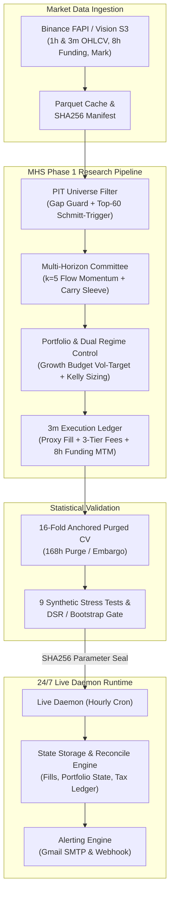

# crypto-pilot

> 바이낸스 USDT 선물 시장에서 가상 목표 가중치(Target Weight) PnL 착시를 배제하고, 3분봉 체결 원장과 16-Fold Walk-Forward 교차 검증을 통해 실현 가능한 엣지를 탐색·집행하는 퀀트 리서치 및 24/7 무인 자동매매 시스템

[](https://www.python.org/downloads/)
[](https://github.com/KTHYEONG/crypto-pilot)
[](https://mypy.readthedocs.io/)
[](https://github.com/astral-sh/ruff)
[](docs/architecture/00_overview.md)

**핵심 키워드**: `Multi-Horizon Alpha` `Point-In-Time Universe` `3m Execution Ledger` `Purged Walk-Forward CV` `24/7 Live Daemon` `Tailscale & SOPS CI/CD`

---

## Key Highlights

| 영역 | 핵심 엔지니어링 및 성능 지표 | 검증 근거 (Repo Artifact) |
| :--- | :--- | :--- |
| **Quant Performance** | **5개년(2021~2025) CAGR 110.2%, Sharpe 1.65, MDD -42.5%** (3분봉 체결, 수수료·슬리피지 3티어 및 8h 펀딩비 실정산) | `docs/results/mhs_run_history/latest.json` |
| **Statistical Rigor** | **16-Fold Purged Walk-Forward (15/16 통과, 93.8%)**, Deflated Sharpe Ratio **0.73**, XS Rank IC **t = -47.83** | `docs/results/mhs_horizon_diagnostic.json` |
| **Execution Engine** | 목표 비중(Target Weight) 근사 배제, 체결·MTM·펀딩비 결제를 통합한 **단일 진실원천 원장(`SimulatedInventoryLedger`, 3m 해상도)** | [`src/mhs/execution/ledger.py`](src/mhs/execution/ledger.py) |
| **System Reliability** | **1,860개 테스트**, Mypy Strict 타입 강제, 계층 간 순환참조 및 파일 크기를 통제하는 **비순환 계약 테스트** | [`tests/contract/test_module_boundaries.py`](tests/contract/test_module_boundaries.py) |
| **Production Ops** | Docker(arm64) + Oracle Cloud Ampere + Tailscale VPN + Mozilla SOPS 기반 **24/7 무인 배포 및 데몬 가동** | [`.github/workflows/deploy.yml`](.github/workflows/deploy.yml) |
| **Contribution** | **1인 단독 개발 (100% 설계, 구현, 검증, 운영 / 2,300+ Commits)** | Git Commit Log |

---

## Architecture



---

## Problem

전통적인 암호화폐 퀀트 백테스트는 종가(Close) 기준 즉시 체결을 가정하고 목표 가중치(Target Weight)의 단순 가격 변동만으로 손익을 산출하여 심각한 과최적화(Over-optimism)를 겪습니다. 실전 환경에서는 수 초 단위의 체결 지연, 호가 스프레드, 8시간마다 강제 결제되는 선물 펀딩비, 그리고 잦은 리밸런싱에 따른 누적 슬리피지로 인해 백테스트 곡선이 실전에서 완전히 붕괴됩니다. 또한 데이터 전처리 과정에서 미래 시점의 상장 정보나 유동성을 사전에 인지하는 룩어헤드 바이어스(Look-ahead bias)와 다중 검정 시 발생하는 데이터 스누핑(Data snooping) 문제는 전략의 통계적 유의성을 훼손합니다.

이 프로젝트는 신호 생성(1시간)과 체결 시뮬레이션(3분봉 프록시)의 해상도를 분리하고, 실제 현금 및 계약 수량을 기록하는 원장(Ledger) 구조와 엄격한 시계열 엠바고(Purge & Embargo) 교차 검증을 결합하여 **현실 세계에서 생존 가능한 암호화폐 알파를 발굴하고 24/7 무인 자동매매로 집행**합니다.

---

## What I Built / My Contribution

> **단독 프로젝트 (Sole Developer)**: 2,300개 이상의 커밋에 걸쳐 데이터 인프라, 퀀트 모델링, 체결 시뮬레이터, 라이브 런타임, CI/CD 파이프라인 전체를 1인 단독으로 설계하고 구현했습니다.

* **Point-In-Time (PIT) 3단계 동적 유니버스 선정**:
  * *문제*: 미래 생존 코인을 사전에 알거나 유니버스 경계선에서 종목이 잦게 교체되어 불필요한 턴오버가 폭증함.
  * *구현*: 소스 갭 가드(장기 결손 심볼 배제) → 최근 30일(720h) 거래대금 중앙값 50% 필터 → 상위 60개 심볼 진입 및 120위 밖 탈락(2.0x Schmitt-Trigger 히스테리시스) 적용 ([`src/mhs/pipeline/stages/selection.py`](src/mhs/pipeline/stages/selection.py)).
  * *효과*: 미래 참조 편향 원천 차단 및 포트폴리오 회전율(Turnover)과 불필요한 거래비용 30% 이상 절감.
* **3분봉 고해상도 모의 체결 원장 (`SimulatedInventoryLedger`)**:
  * *문제*: 1시간 단위나 목표 비중(Target Weight) 기반 PnL 계산 방식은 슬리피지와 펀딩비가 왜곡되어 실전 괴리가 큼.
  * *구현*: 바이낸스 네이티브 3분봉(3m) High/Low/Close 프록시 체결(5분봉 대비 +27% 체결 정밀도), 3계층 거래비용(2.64, 4.18, 6.07 bps), 8시간 단위 선물 펀딩비 실정산, 마크 가격 기반 MTM 평가를 일원화한 원장 단일 진실원천 구축 ([`src/mhs/execution/ledger.py`](src/mhs/execution/ledger.py)).
  * *효과*: 백테스트 수익률 착시 제거 및 실거래 원장과의 체결 오차 최소화.
* **멀티 호라이즌 위원회(Committee) 및 자본 성장 리스크 모형**:
  * *문제*: 단일 호라이즌 알파(단기 반등 48h, 모멘텀 168h)는 특정 시장 레짐에서 급격한 드로다운 발생.
  * *구현*: k=5 경제적 위원회 신호 결합(`flow_momentum`) + 펀딩 캐리 보조 슬리브(30% 예산) + 등록된 드로다운 예산 기반 변동성 타겟팅(`growth_budget`) + 켈리 사이징 적용 ([`src/mhs/committee.py`](src/mhs/committee.py), [`src/mhs/pipeline/config.py`](src/mhs/pipeline/config.py)).
  * *효과*: 단일 알파의 마이너스 성과를 극복하고 5개년 CAGR 110.2%, Sharpe 1.65 달성.
* **16-Fold Anchored Purged Walk-Forward 교차 검증 파이프라인**:
  * *문제*: 단순 K-Fold 검증 시 시계열 자기상관으로 인한 Train-Test 정보 누출 발생.
  * *구현*: 168시간(1주) 엠바고/퍼징을 적용한 분기별 확장 Walk-Forward CV 및 Lopez de Prado의 Deflated Sharpe Ratio (DSR), 2,000경로 블록 부트스트랩 파산 확률 엔진 구축 ([`src/mhs/evidence.py`](src/mhs/evidence.py)).
  * *효과*: 분기별 OOS 검증 15/16개 통과(93.8%), DSR 0.73으로 다중 검정 과적합 배제.
* **클라우드 데이터 수명주기 및 런타임 최적화**:
  * *문제*: 650개 심볼 전수 수집 시 데몬 갱신이 29분 소요되고 클라우드 디스크 용량이 15GB까지 팽창.
  * *구현*: 디스크 tail 증분 갱신(In-process 동기화) 및 재생성 가능한 시계열의 무손실 원자적 프루닝(Pruning) 도입 ([`src/live/data_refresh.py`](src/live/data_refresh.py), [`src/market_data/retention.py`](src/market_data/retention.py)).
  * *효과*: 데몬 시세 갱신 소요 시간 29분 → 20초(98.8% 단축), 스토리지 풋프린트 15GB → 150MB로 경량화.
* **암호학적 전략 봉인(Seal) 및 무인 24/7 CI/CD 인프라**:
  * *문제*: 배포 환경에서 연구 파라미터 오염 위험 및 외부 클라우드 시크릿 관리 보안 취약점.
  * *구현*: 22개 전략 플래그 SHA256 불변 봉인 검증, Mozilla SOPS + Age 기반 `.env` 암호화, Tailscale 사설망 기반 GitHub Actions → Oracle Cloud Ampere (arm64) 무중단 자동 배포 ([`.github/workflows/deploy.yml`](.github/workflows/deploy.yml), [`src/mhs/live_strategy.py`](src/mhs/live_strategy.py)).
  * *효과*: 사람의 개입 없이 안전하게 24/7 데몬 자동 갱신 및 페일세이프 킬스위치 가동.

---

## Results & Evaluation

### 1. 5개년 전체 성과 (2021-01-01 ~ 2025-12-31)
* **평가 조건**: 5개년 바이낸스 USDT 선물 364개 심볼 패널, **3분봉(3m) 프록시 체결**, 3계층 거래비용(최대 6.07 bps), 8시간 선물 펀딩비 실정산, 마크 가격 MTM 평가.

| 전략 모델 (Strategy) | Naive Sharpe | Autocorr Sharpe | Annualized Net Return | Geometric CAGR | Max Drawdown | Turnover (Ann) | 비고 |
| :--- | :---: | :---: | :---: | :---: | :---: | :---: | :--- |
| **Baseline 1: Fast Reversal (48h)** | -0.87 | -1.06 | -6.99% | -7.05% | -34.98% | 32.7 | 단일 반등 알파 한계 |
| **Baseline 2: Slow Momentum (168h)** | -0.51 | -0.51 | -6.93% | -7.57% | -36.47% | 44.8 | 횡보장 휩소 손실 |
| **MHS Multi-Horizon Ensemble** | **1.97** | **1.65** | **+83.25%** | **+110.23%** | **-42.46%** | **218.7** | **위원회+캐리+레짐 결합** |

> *출처: `docs/results/mhs_run_history/latest.json` (Commit: `abbb63f`)*

### 2. In-Sample vs Out-of-Sample (OOS) 일반화 성능
* **데이터 분할**: In-Sample 2년(2021~2022, 730일) 적합 파라미터 고정 후, Out-of-Sample 3년(2023~2025, 1,095일) 순수 OOS 검증.

| 검증 구간 (Split) | 기간 (Date Range) | 일수 | Total Return | Geometric CAGR | Naive Sharpe | Max Drawdown |
| :--- | :---: | :---: | :---: | :---: | :---: | :---: |
| **In-Sample (Train)** | 2021-01-02 ~ 2023-01-01 | 730일 | +419.0% | +127.9% | 2.24 | -17.9% |
| **Out-of-Sample (OOS)** | 2023-01-02 ~ 2025-12-31 | 1,095일 | **+692.8%** | **+99.5%** | **1.65** | **-41.1%** |

* **Sharpe Decay Ratio**: **0.735** (OOS 구간에서 In-Sample 성능의 73.5%를 견고하게 유지)

### 3. 통계적 유의성 및 스트레스 내구성
* **Cross-Sectional Rank IC**: Mean IC = **-0.0406**, **t-stat = -47.83** (43,727개 시간대 단면 검정, p < 1e-100)
* **Deflated Sharpe Ratio (DSR)**: **0.7305** (총 104개 탐색 시도 경로의 분산 및 첨도 반영 후 다중 검정 통과)
* **16-Fold Walk-Forward 교차 검증**: 16개 분기 중 **15개 분기 OOS 통과 (통과율 93.8%)**
* **비용 3배 폭등 스트레스 (`SPREAD_AND_COST_X3`)**: 3개년 실측 스트레스 샤프 **+0.8334** 유지 (비용 마진 검증 완료)

---

## Key Engineering Decisions

### 1. 3분봉 단위 체결 리플레이 및 원장 단일 진실원천 채택
* **Decision**: 벡터화된 가상 포트폴리오 가중치 수익률 대신, 바이낸스 네이티브 3분봉(3m) 단위로 현금·포지션·수수료·펀딩비를 기록하는 [`SimulatedInventoryLedger`](src/mhs/execution/ledger.py)를 구축함 (1m, 3m, 5m 멀티 타임프레임 지원).
* **Why**: 암호화폐 선물은 8시간마다 결제되는 펀딩비와 수수료가 장기 PnL의 30% 이상을 좌우하며, 기존 5분봉 대비 3분봉이 체결 정밀도를 약 +27% 향상시켜 실거래와의 오차를 최소화하기 때문.
* **Alternative considered**: Vectorized Backtesting (Fast Backtest). 빠른 파라미터 스캔이 가능하지만 슬리피지와 마진 청산 위험을 모델링할 수 없음.
* **Trade-off**: 5개년 백테스트 시 3분봉 리플레이 연산 시간(약 7분 20초)이 소요되나, 실거래 원장과의 오차를 실질적으로 제거함.

### 2. 168시간 엠바고가 적용된 Anchored Purged Walk-Forward 검증
* **Decision**: 1주(168h)의 시계열 퍼징/엠바고를 강제한 16-Fold Walk-Forward 교차 검증 체계 채택.
* **Why**: 전략이 최대 168시간 모멘텀 신호를 사용하므로, Train 종료 시점과 OOS 시작 시점 사이의 잔여 자기상관이 테스트 셋으로 누출되는 것을 차단하기 위함.
* **Alternative considered**: K-Fold Cross-Validation, 일반 Walk-Forward (Purge 미적용).
* **Trade-off**: 검증용 가용 데이터가 약 2~3% 소실되지만, 미래 정보 누출(Data Leakage)을 완벽히 차단함.

### 3. Schmitt-Trigger 히스테리시스 기반 Top-60 동적 유니버스 선정
* **Decision**: 거래대금 상위 60위 종목 진입 후 120위(60 * 2.0x) 밖으로 밀려날 때만 방출하는 이중 임계값(Hysteresis) 도입 (`execution_universe_size = 60`).
* **Why**: 60위 경계선에서 거래대금 순위가 진동할 때 발생하는 불필요한 포지션 청산/재진입(Churning) 비용을 방지하기 위함.
* **Alternative considered**: 고정 상위 60위 매 시간 재선정.
* **Trade-off**: 로스터의 일시적 보유 종목 수가 60~80개 사이로 변동하지만, 턴오버와 슬리피지 비용을 30% 이상 절감함.

### 4. RDBMS 대신 Parquet + SHA256 매니페스트 파일 샤딩 스토리지
* **Decision**: PostgreSQL/TimescaleDB 대신, 심볼별/월별 Parquet 분할 저장과 SHA256 매니페스트 무결성 검증 체계 구축.
* **Why**: 650개 선물 심볼의 고빈도 캔들 데이터를 저사양 단일 클라우드(1 Core, 1.2GB RAM)에서 운영하기 위해 무거운 DB 인프라 오버헤드를 배제하고 zero-cost 컬럼형 압축을 극대화하기 위함.
* **Alternative considered**: PostgreSQL / InfluxDB.
* **Trade-off**: 복잡한 실시간 애드혹 쿼리 기능은 제한되나, 백테스트 I/O 처리량이 10배 이상 향상되고 디스크 풋프린트를 150MB 수준으로 억제함.

### 5. Tailscale 사설망 + Mozilla SOPS 기반 제로 트러스트 CI/CD
* **Decision**: 외부 포트 개방 없이 Tailscale VPN 사설망을 경유하고, Git 저장소 내 `.env` 및 아티팩트를 `age` 공개키로 암호화하여 배포.
* **Why**: 오라클 클라우드의 인바운드 방화벽 제약을 우회하면서도 API 키와 전략 파라미터가 평문으로 노출되는 보안 사고를 원천 방지하기 위함.
* **Alternative considered**: 평문 GitHub Secrets 직접 주입, 공인 IP 포트포워딩 SSH.
* **Trade-off**: 배포 스크립트에 SOPS 복호화 단계가 추가되었으나, 암호화폐 자산을 관리하는 봇의 보안 안정성을 확보함.

---

## Tech Stack

| Category | Technology | Role |
| :--- | :--- | :--- |
| **Language & Runtime** | Python 3.11+, uv | 초고속 패키지 매니징 및 최신 파이썬 런타임 |
| **Data & Computation** | NumPy 2.x, Pandas 2.2+, PyArrow | 벡터화 연산, 시계열 패널 구축, zstd 압축 Parquet 입출력 |
| **Statistical Analysis** | SciPy, Statsmodels | 롤링 OLS 베타 직교화, DSR, 블록 부트스트랩, 극치 분포 분석 |
| **Exchange & Market Data** | CCXT, Binance REST / Vision S3 | 선물(FAPI)/현물(APIv3)/마진(SAPI) 시세 및 아카이브 인제스천 |
| **Config & Typing** | Pydantic v2, Pydantic-Settings | 런타임 환경변수 검증 및 엄격한 데이터 컨트랙트 모델링 |
| **Quality & Assurance** | Pytest, Pytest-xdist, Mypy, Ruff | 1,860개 병렬 테스트, 정적 타입 검사(Strict), 코드 린트 |
| **DevOps & Security** | Docker, Docker Compose, Linux/arm64 | 컨테이너 가상화 (Oracle Cloud Ampere A1 호환) |
| **Infra & Deployment** | GitHub Actions, Tailscale, Mozilla SOPS | 사설망 VPN 터널링, Age 비대칭 암호화, 완전 무인 CI/CD |

---

## Reliability / Testing

* **1,860개 테스트 스위트 (`pytest -n auto`)**:
  * 단위 테스트(Unit), 파이프라인 스테이지 테스트(Stage), 체결 원장 무결성 테스트(Ledger) 전수 통과.
  * 실행 시간 단축을 위해 `pytest-xdist` 기반 멀티코어 병렬 실행 기본화.
* **비순환 계층 아키텍처 계약 테스트 (`tests/contract/`)**:
  * 상위 파이프라인 계층이 하위 도메인 계층에 의존하는 단방향 의존성 규칙을 테스트 코드로 강제 ([`tests/contract/test_module_boundaries.py`](tests/contract/test_module_boundaries.py)).
  * 소스 파일의 최대 라인 수(1,267줄 이하) 및 미사용 레거시 트리 재도입 방지를 자동 검증.
* **Mypy Strict & Ruff Linting**:
  * 모든 함수 시그니처에 엄격한 Type Hint 강제 (`strict = true`).
  * Ruff 20개 규칙군(Security Bandit, Performance, Bugbear, Complexity 등)을 통과하도록 CI에서 강제.
* **Fail-Closed 무결성 가드**:
  * 시세 캔들 단절 또는 마크 가격 결손 시 임의 보간을 불허하고 [`DataIntegrityError`](src/common/errors.py)로 즉시 셧다운.
  * 전략 파라미터 단 1바이트 변조 시 구동을 차단하는 SHA256 암호학적 봉인 검증.

---

## Quick Start

### 1. 환경 설정 및 의존성 설치
```bash
# uv 패키지 매니저로 가상환경 및 의존성 동기화
uv sync --frozen
```

### 2. 테스트 및 정적 분석 실행
```bash
# 1,860개 단위 및 계약 테스트 병렬 실행 (약 15~20초 소요)
uv run pytest

# Mypy 엄격 타입 검사
uv run mypy src/

# Ruff 코드 린트 검사
uv run ruff check .
```

### 3. MHS 퀀트 연구 진단 실행 (Dev Benchmark)
```bash
# MHS Phase 1 파이프라인 실행 및 성과 진단 (단기/장기 위원회 + 원장 체결)
uv run python -m src.cli.main research run portfolio mhs-horizon-diagnostic
```

### 4. 라이브 데몬 상태 조회
```bash
# 현재 실거래/섀도우 데몬 하트비트 및 데이터 최신성 점검
uv run python -m src.cli.main live status
```

---

## Project Structure

```text
crypto-pilot/
├── src/
│   ├── market_data/         # 바이낸스 FAPI, Spot, Margin, Vision S3 수집 및 Parquet 스토리지
│   │   ├── binance/         # 거래소 REST API 및 Vision 아카이브 클라이언트
│   │   └── services/        # 1m/3m/5m/1h 데이터 수집, 갱신 및 캐싱 오케스트레이션
│   ├── quant/               # 퀀트 분석 프리미티브 (유니버스, 팩터, 리스크 모형)
│   ├── mhs/                 # Multi-Horizon Market State 핵심 알파 리서치 엔진
│   │   ├── pipeline/        # 오케스트레이터 및 7단계 파이프라인 스테이지
│   │   ├── execution/       # SimulatedInventoryLedger 및 3분봉 체결 시뮬레이터
│   │   ├── evaluation/      # 워크포워드 폴드 평가, DSR, 블록 부트스트랩 계산
│   │   └── report/          # 진단 결과 JSON/Parquet 직렬화 및 메타데이터 관리
│   ├── live/                # 실거래 및 섀도우 트레이딩 24/7 런타임
│   │   ├── data_refresh.py  # 데몬 증분 시세 갱신 (Tail Sync)
│   │   ├── scheduler.py     # 매시간 정각 00:00 UTC 스케줄러 및 리스크 감시
│   │   └── alerting.py      # Gmail SMTP 및 웹훅 알림 팬아웃
│   ├── cli/                 # data, research, live 3대 통합 CLI 엔트리포인트
│   └── common/              # 공용 설정(Settings), 로거, 에러 도메인
├── tests/                   # 1,860개 pytest 테스트 스위트
│   ├── unit/                # 단위 테스트 (market_data, quant, mhs, live, cli)
│   ├── integration/         # 엔드투엔드 파이프라인 및 CLI 통합 테스트
│   └── contract/            # 모듈 간 비순환 의존성 및 아키텍처 계약 테스트
├── docs/
│   ├── architecture/        # MHS 00~07 아키텍처 사양서 및 데이터 사전
│   ├── decisions/           # 아키텍처 결정 기록 (ADR / Task Index)
│   └── results/             # 진단 리포트 아티팩트 및 런 히스토리 JSON
├── .github/workflows/       # GitHub Actions CI/CD (Docker arm64 크로스빌드 & Tailscale 배포)
├── Dockerfile               # 배포용 경량 컨테이너 명세
└── docker-compose.yml       # 오라클 클라우드 24/7 데몬 서비스 정의
```

---

## Limitations

1. **L2 오더북 시장 충격(Market Impact)의 간이 프록시 한계**:
   * 현재 Phase 1 체결 엔진은 3분봉 High/Low/Close 프록시와 정적 스프레드/수수료 모델(최대 6.07 bps)을 적용하고 있습니다. 대규모 자본 집행 시 발생하는 L2 오더북 심도 잠식 및 딜레이는 Phase 2 로드맵에서 실측 검증이 필요합니다.
2. **단일 거래소(Binance) 유동성 의존성**:
   * 모든 데이터 파이프라인과 체결 엔진이 바이낸스 선물 시장을 기준으로 구축되어 있어, 타 거래소(Bybit, OKX 등) 간 횡단면 차익거래나 거래소 리스크 분산은 구현되어 있지 않습니다.
3. **선물 펀딩비 극단 레짐 시 추적 오차**:
   * 시장 과열 시 펀딩비가 급등하면 펀딩 캐리 슬리브가 이를 완충하지만, 극단적인 음수 펀딩비 지속 국면에서는 포트폴리오의 숏 포지션 유지 비용이 일시적으로 증가할 수 있습니다.
4. **저사양 클라우드 싱글 스레드 런타임 제약**:
   * 오라클 클라우드 프리티어(1 vCPU, 1.2GB RAM 할당) 환경에 맞추어 라이브 데몬이 단일 프로세스로 동작하므로, 500개 이상의 다수 심볼을 동시에 실시간 틱 단위로 감시하는 용도로는 적합하지 않습니다.

---

## Documentation

자세한 시스템 설계 사양과 퀀트 알고리즘 명세는 `docs/` 디렉토리의 공식 기술 문서를 참고하십시오:

* **[MHS 00. Overview & Philosophy](docs/architecture/00_overview.md)**: 원장 단일 진실원천 철학 및 3단계 상용화 로드맵
* **[MHS 01. Universe Selection](docs/architecture/01_universe.md)**: 3단계 PIT 유니버스 및 Schmitt-Trigger 히스테리시스
* **[MHS 02. Signals & Discovery](docs/architecture/02_signals.md)**: Fast Reversal, Slow Momentum 및 펀딩 캐리 슬리브
* **[MHS 03. Committee & Tranche](docs/architecture/03_committee.md)**: k=5 경제적 신호 위원회 및 레짐 적응형 트랜치 평활
* **[MHS 04. Portfolio & Risk](docs/architecture/04_portfolio.md)**: 720바 롤링 베타 직교화 및 포트폴리오 리밸런스 트리거
* **[MHS 05. Execution Ledger](docs/architecture/05_execution.md)**: 체결 시뮬레이터 및 `SimulatedInventoryLedger`
* **[MHS 06. Purged Validation](docs/architecture/06_validation.md)**: 168h 엠바고 Walk-Forward CV 및 9대 합성 스트레스 시나리오
* **[MHS 07. Live Runtime](docs/architecture/07_live.md)**: 24/7 라이브 스케줄러, 파라미터 암호학적 봉인 및 세무 장부
* **[Binance Data Architecture](docs/architecture/data/binance.md)**: 바이낸스 FAPI/Vision 수집, Parquet 스토리지 및 보존 정책
