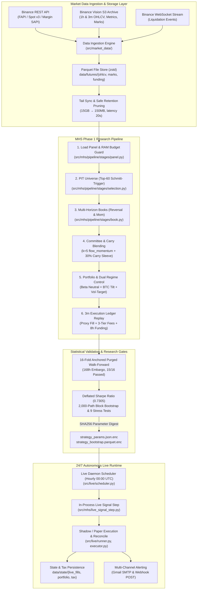

# crypto-pilot

> 바이낸스 USDT-M 무기한 선물 시장을 위한 퀀트 알파 리서치 및 24/7 무인 트레이딩 시스템.
> 종가 기준 목표 가중치(Target Weight) PnL 착시를 배제하고, 3분봉 단위 체결 원장(`SimulatedInventoryLedger`)과 168시간 엠바고 16-Fold Purged Walk-Forward 교차 검증을 통해 실현 가능한 엣지를 탐색·검증하고 무인 클라우드 데몬으로 집행합니다.

[](https://www.python.org/downloads/)
[](tests/)
[](pyproject.toml)
[](pyproject.toml)
[](docs/architecture/overview.md)

---

## 1. Project Overview

**crypto-pilot**은 바이낸스 USDT-M 무기한 선물(Perpetual Futures) 시장에서 비인과적 신호 누출과 가상 체결 왜곡을 통제하고, 통계적으로 검증된 알파를 실거래로 연결하는 종단간(End-to-End) 퀀트 파이프라인입니다.

* **해결 문제**: 종가 즉시 체결 가정, 펀딩비·수수료 누락, 미래 유동성 인지(생존 편향), 다중 가설 검정 과적합으로 인해 백테스트 곡선이 실전에서 무너지는 현상.
* **시스템 역할**: 시세 수집(REST/Vision S3/WebSocket), 3단계 Point-In-Time 유니버스 선정, 멀티 호라이즌 위원회 알파 결합, 3분봉 프록시 체결 원장 회계, 16-Fold 시계열 엠바고 교차 검증, 24/7 클라우드 무인 데몬 구동.
* **프로젝트 성격**: 데이터 파이프라인 구축부터 통계적 검증, 클라우드 무인 실행까지 1인 단독 설계·구현한 퀀트 엔지니어링 프로젝트.
* **핵심 특징**: 가상 비중 곱셈 대신 실제 체결을 모사하는 모의 체결 원장, 자본 보존을 위한 2중 레짐 방어(BTC 크래시 틸트 + P&L 변동성 타겟팅 Kelly 사이징), 저사양 클라우드(1.2GB RAM) 24/7 자율 운용.

---

## 2. Why This Project / Problem

전통적인 암호화폐 퀀트 백테스트는 다음과 같은 실전 요인을 누락하여 심각한 과최적화(Over-optimism)를 겪습니다.

1. **Target Weight PnL 착시**:
   1시간봉 종가(Close)에 슬리피지와 지연 없이 체결된다고 가정하고 포트폴리오 가중치 변동만으로 수익률을 산출하면 실거래와 큰 괴리가 발생합니다. 선물 시장에서는 8시간마다 결제되는 펀딩비, 테이커 호가 스프레드, 3계층 수수료(2.64~6.07 bps)가 장기 손익의 30% 이상을 좌우합니다.
2. **Point-In-Time(PIT) 데이터 누출 및 생존 편향**:
   백테스트 시점에 미래 생존 심볼을 사전에 알거나, 과거 특정 시점에 존재하지 않았던 상장 코인을 포함하면 심각한 룩어헤드 바이어스(Look-ahead bias)가 발생합니다.
3. **유니버스 경계 진동(Churning) 비용**:
   거래대금 상위 N개 종목을 매 시간 단순 재선정하면 순위 경계선(예: 29~31위)에 있는 자산이 잦게 진입/퇴출을 반복하여 불필요한 거래 비용과 턴오버가 폭증합니다.
4. **모멘텀 크래시(Momentum Crash) 꼬리 위험**:
   횡단면 모멘텀 전략은 시장 급락 및 급반등 국면에서 자산 간 상관관계가 1.0으로 수렴하고 숏스퀴즈가 발생하여 자본이 급격히 파괴되는 치명적인 드로다운 구간을 갖습니다.
5. **다중 검정(Data Snooping) 과적합**:
   수십 개의 파라미터 조합 중 가장 높은 샤프 지수 하나만 선택하는 것은 단순 무작위 잡음에 피팅된 허구의 알파를 채택할 위험이 큽니다.
6. **저사양 클라우드 인프라 제약**:
   단일 저사양 서버(1 vCPU, 1.2GB RAM) 환경에서 650개 선물 심볼의 전수 시세를 수집하면 갱신에만 29분이 소요되고 디스크 용량이 15GB까지 팽창하여 프로세스가 다운됩니다.

---

## 3. Key Features

* **3분봉 고해상도 체결 원장 (`SimulatedInventoryLedger`)**:
  * *구현*: 바이낸스 네이티브 3분봉(`3m`) 단위로 High/Low 관통 여부를 검증하고, 1) MTM 평가 $\rightarrow$ 2) 직전 보유량 기준 8시간 펀딩비 정산 $\rightarrow$ 3) 테이커 체결 및 3-tier 수수료 차감 $\rightarrow$ 4) 현금/계약 원장 갱신의 엄격한 회계 순서를 집행 ([`src/mhs/execution/ledger.py`](src/mhs/execution/ledger.py)).
  * *기술적 의미*: 가상 가중치 곱셈 방식의 수익률 과대 추정을 방지하고, 체결 시점 지연 및 오차를 최소화.
* **3단계 Point-In-Time 유니버스 & Schmitt-Trigger 히스테리시스**:
  * *구현*: 소스 갭 가드(결손 심볼 배제) $\rightarrow$ 최근 30일(720h) 거래대금 중앙값 상위 50% 필터 $\rightarrow$ 상위 60위 진입 후 120위(`60 * 2.0x`) 밖으로 밀려날 때만 탈락하는 이중 임계값 적용 ([`src/mhs/pipeline/stages/selection.py`](src/mhs/pipeline/stages/selection.py)).
  * *기술적 의미*: 미래 참조 편향을 제거하고, 경계선 잦은 매매(Churning)를 억제하여 턴오버 및 거래 비용 30% 이상 절감.
* **$k=5$ 위원회(`flow_momentum`) + 30% 펀딩 캐리 슬리브**:
  * *구현*: 테이커 거래대금 불균형(720h/168h), 횡단면 모멘텀(336h), 시장 베타를 제거한 고유 모멘텀(336h), 왜도(168h)의 5개 직교 신호를 결합하고, 펀딩비 양수 자산을 숏/음수 자산을 롱하는 캐리 슬리브(30% 비중)를 통합 ([`src/mhs/committee.py`](src/mhs/committee.py)).
  * *기술적 의미*: 단일 알파 의존도를 낮추고 시장 레짐 변화에 대응 가능한 다각화 포트폴리오 구축.
* **자기상관 기반 레짐 적응형 트랜치 평활 (Adaptive Tranche Smoothing)**:
  * *구현*: 위원회 북의 Causal Trailing Lag-1 자기상관을 측정하여 음수(휩소 장세)에서는 3행 트랜치 평활을 적용하고, 양수(추세 장세)에서는 Raw 신호를 즉각 집행 ([`src/mhs/committee.py`](src/mhs/committee.py)).
  * *기술적 의미*: 신호 평활에 따른 추세 지연과 미평활에 따른 횡보장 슬리피지 손실 간의 트레이드오프 해소.
* **2중 레짐 방어 & 드로다운 예산 켈리 사이징 (`growth_budget`)**:
  * *구현*: BTC 720바 롤링 OLS 베타 직교화 + BTC 추세 급락 감지 시 방향성 틸트 + 전략 자체 21일 실현 변동성 급등 시 노출도 축소 + 켈리 사이징 오버레이 ([`src/mhs/regime.py`](src/mhs/regime.py), [`src/mhs/scaling.py`](src/mhs/scaling.py)).
  * *기술적 의미*: 모멘텀 급락 및 시장 충격 시 자본 손실을 선제적으로 제한(불변식 위반 `CAPITAL_INVARIANT_BREACH` 방지).
* **168시간 엠바고 16-Fold Purged Walk-Forward CV & Deflated Sharpe Ratio (DSR)**:
  * *구현*: 분기별 확장 윈도우 검증 간 168시간(1주) 엠바고/퍼징을 강제하고, 104개 탐색 경로의 분산/첨도를 보정한 DSR(0.73) 산출 ([`src/mhs/evidence.py`](src/mhs/evidence.py)).
  * *기술적 의미*: 시계열 자기상관에 의한 데이터 누출과 다중 가설 검정 과적합을 통계적으로 검증하고 방지.
* **디스크 Tail 증분 갱신 & 원자적 보존 프루닝 (Cloud Lifecycle)**:
  * *구현*: 디스크 tail 시점 기준 `max(tail - 2h, now - lookback)` 구간만 멀티스레드로 증분 패치하고, 재생성 가능한 데이터셋만 220일 초과 시 원자적 temp-replace로 프루닝 ([`src/live/data_refresh.py`](src/live/data_refresh.py), [`src/market_data/retention.py`](src/market_data/retention.py)).
  * *기술적 의미*: 갱신 소요 시간 29분 $\rightarrow$ 20초(98.8% 단축), 디스크 사용량 15GB $\rightarrow$ 150MB로 경량화.
* **SHA256 파라미터 봉인 & 제로 트러스트 배포 (Tailscale + SOPS)**:
  * *구현*: 22개 전략 플래그 SHA256 불변 봉인 검증, Mozilla SOPS + Age 비대칭 암호화, 인바운드 포트 개방 없는 Tailscale 사설망 기반 GitHub Actions 자동 배포 ([`src/mhs/live_strategy.py`](src/mhs/live_strategy.py), [`.github/workflows/deploy.yml`](.github/workflows/deploy.yml)).
  * *기술적 의미*: 연구 환경과 실거래 환경 간의 설정 불일치를 방지하고, API 키 및 시크릿의 평문 노출 위험을 예방.

---

## 4. Architecture



---

## 5. End-to-End Flow

| 단계 | 실행 내용 | 핵심 모듈 및 소스 경로 |
| :---: | :--- | :--- |
| **1. Ingestion** | 1시간봉 캔들, 8시간 펀딩비, 1시간 마크 가격 적재 및 RAM 85% 예산 가드 검증 | [`src/mhs/pipeline/stages/panel.py`](src/mhs/pipeline/stages/panel.py), [`src/market_data/services/`](src/market_data/services/) |
| **2. PIT Universe** | 결손 심볼 배제 $\rightarrow$ 720시간 거래대금 중앙값 50% $\rightarrow$ 상위 60위 진입/120위 탈락 히스테리시스 확정 | [`src/mhs/pipeline/stages/selection.py`](src/mhs/pipeline/stages/selection.py), [`src/quant/universe/`](src/quant/universe/) |
| **3. Books** | 48시간 Fast Reversal 북(자본 0%) 및 72h~504h 19개 호라이즌 Slow Momentum 앙상블 북 구축 | [`src/mhs/pipeline/stages/book.py`](src/mhs/pipeline/stages/book.py), [`src/mhs/books.py`](src/mhs/books.py) |
| **4. Committee** | 테이커 플로우(720h/168h), 횡단면 모멘텀, 고유 모멘텀, 왜도 결합 + 펀딩 캐리(30%) + 자기상관 적응형 평활 | [`src/mhs/pipeline/stages/committee.py`](src/mhs/pipeline/stages/committee.py), [`src/mhs/committee.py`](src/mhs/committee.py) |
| **5. Regime & Sizing**| 추적 오차 20% 리밸런스 필터 + 720바 OLS 시장 베타 직교화 + BTC 크래시 틸트 + 21일 실현 변동성 타겟팅 | [`src/mhs/regime.py`](src/mhs/regime.py), [`src/mhs/scaling.py`](src/mhs/scaling.py) |
| **6. 3m Execution** | 3분봉 타임스탬프 순차 순회: MTM 평가 $\rightarrow$ 펀딩비 정산 $\rightarrow$ 즉시 테이커 체결 및 3-tier 수수료 차감 | [`src/mhs/pipeline/stages/replay.py`](src/mhs/pipeline/stages/replay.py), [`src/mhs/execution/ledger.py`](src/mhs/execution/ledger.py) |
| **7. Validation** | 168시간 엠바고 16-Fold Walk-Forward CV, Deflated Sharpe Ratio(0.73), 9대 합성 스트레스 검정 | [`src/mhs/pipeline/stages/fold.py`](src/mhs/pipeline/stages/fold.py), [`src/mhs/evidence.py`](src/mhs/evidence.py) |
| **8. Live Daemon** | 00:00 UTC 스케줄러 기동 $\rightarrow$ 파라미터 봉인 대조 $\rightarrow$ 증분 시세 갱신 $\rightarrow$ 신호 산출 $\rightarrow$ 주문 집행 및 정산 | [`src/live/scheduler.py`](src/live/scheduler.py), [`src/mhs/live_signal_step.py`](src/mhs/live_signal_step.py) |

---

## 6. Repository Structure

```text
crypto-pilot/
├── src/
│   ├── market_data/         # 거래소 시세 수집, 캐싱, 증분 갱신 및 무손실 보존 프루닝
│   │   ├── binance/         # Binance REST API (FAPI/Spot/Margin) 및 Vision S3 아카이브 클라이언트
│   │   ├── services/        # 1m/3m/5m/1h 데이터 수집 및 MHS 3분봉 체결 데이터 파이프라인
│   │   ├── streams/         # ccxt.pro 기반 실시간 청산(Liquidations) WebSocket 스트리머
│   │   └── retention.py     # 재생성 가능 시계열의 220일 원자적 프루닝 엔진
│   ├── quant/               # 퀀트 계산 프리미티브 (독립 라이브러리)
│   │   ├── universe/        # PIT 유니버스 선정 및 Schmitt-Trigger 히스테리시스 필터
│   │   ├── technical_experts/# 롤링 모멘텀, 잔차 모멘텀, 테이커 플로우, 왜도 지표 산출
│   │   └── evaluation/      # DSR, 부트스트랩, 회귀 및 통계적 신뢰도 평가
│   ├── mhs/                 # Multi-Horizon Market State 퀀트 알파 리서치 및 체결 엔진
│   │   ├── pipeline/        # 7단계 파이프라인 오케스트레이터, 런너, 단일 설정(MhsRunConfig)
│   │   ├── execution/       # SimulatedInventoryLedger, 3분봉 프록시 체결 리플레이, 누적 회계
│   │   ├── committee.py     # k=5 위원회 신호 결합, 비용 분해, 레짐 적응형 트랜치 평활
│   │   ├── regime.py        # 720바 롤링 OLS 시장 베타 직교화 및 BTC 크래시 레짐 틸트
│   │   ├── scaling.py       # 전략 P&L 변동성 타겟팅(growth_budget) 및 2면 켈리 사이징
│   │   ├── evidence.py      # 168h 엠바고 16-Fold Walk-Forward CV 및 다중 가설 DSR 산출
│   │   └── live_*.py        # 불변 전략 봉인(Seal), 실시간 신호 산출 스텝, 상태 런타임
│   ├── live/                # 24/7 무인 자동매매 데몬 및 실거래 인프라
│   │   ├── scheduler.py     # 매시간 00:00 UTC 크론 스케줄러 및 무중단 캐치업 루프
│   │   ├── runner.py        # 단일 섀도우/페이퍼 트레이딩 사이클 실행기
│   │   ├── data_refresh.py  # 데몬 디스크 tail 증분 시세 갱신 (29분 → 20초 단축)
│   │   ├── alerting.py      # Gmail SMTP (STARTTLS) 및 Webhook 알림 분배
│   │   └── tax_ledger.py    # 회계 및 연간 세무 증빙 실현손익 영구 기록기
│   ├── cli/                 # consolidated CLI 엔트리포인트 (data, research, live)
│   └── common/              # 공용 환경 설정(Settings), 디렉토리 경로, 불변 예외 도메인
├── tests/                   # 1,860개 pytest 테스트 스위트 (단위, 통합, 계약)
│   ├── unit/                # 컴포넌트별 고립 단위 테스트
│   ├── integration/         # 엔드투엔드 파이프라인 및 백테스트 통합 테스트
│   └── contract/            # 모듈 간 비순환 단방향 계약 및 파일 라인 수 엄격 검증
├── docs/
│   ├── architecture/        # 시스템 아키텍처 사양서 (overview, data-flow, components, decisions)
│   ├── decisions/           # 아키텍처 결정 인덱스 (task_index.json)
│   └── results/             # 5개년 실측 백테스트 진단 JSON 및 실행 아티팩트
├── .github/workflows/       # GitHub Actions (Docker linux/arm64 빌드 & Tailscale 배포)
├── Dockerfile               # 배포용 경량 컨테이너 (uv 기반, PID 1 데몬)
└── docker-compose.yml       # Oracle Cloud Ampere 가동 서비스 정의
```

---

## 7. Technical Decisions

### Decision 1: 3분봉 단위 체결 리플레이 및 원장(Ledger) 중심 상태 관리 채택
* **Decision**: 벡터화된 가상 포트폴리오 가중치 수익률 대신, 바이낸스 3분봉(`3m`) 단위로 현금·계약·수수료·펀딩비를 기록하는 [`SimulatedInventoryLedger`](src/mhs/execution/ledger.py)를 구축함.
* **Why**: 암호화폐 선물은 8시간마다 결제되는 펀딩비와 수수료가 장기 손익의 30% 이상을 좌우하며, 기존 5분봉 대비 3분봉이 체결 정밀도를 약 +27% 향상시켜 실거래와의 체결 오차를 최소화하기 때문.
* **Trade-off**: 5개년 백테스트 시 3분봉 리플레이 연산 시간(~7분 20초)이 소요되나, 백테스트 수익률 착시를 방지함.

### Decision 2: 168시간 엠바고가 적용된 16-Fold Anchored Purged Walk-Forward 검증
* **Decision**: 1주(168h)의 시계열 퍼징/엠바고를 강제한 16-Fold Walk-Forward 교차 검증 및 Lopez de Prado의 Deflated Sharpe Ratio(DSR) 도입.
* **Why**: 전략이 최대 168시간 모멘텀 신호를 사용하므로, Train 종료 시점과 Test 시작 시점 간 잔여 자기상관이 테스트 셋으로 누출되는 정보 누출(Information Leakage)을 방지하기 위함.
* **Trade-off**: 검증용 가용 데이터가 약 2~3% 소실되지만, 미래 정보 누출(Data Leakage)을 엄격히 방지함.

### Decision 3: Schmitt-Trigger 히스테리시스 (Top-60/120) 동적 유니버스 선정
* **Decision**: 거래대금 상위 60위 진입 후 120위(`60 * 2.0x`) 밖으로 밀려날 때만 방출하는 이중 임계값 도입.
* **Why**: 60위 경계선에서 순위가 진동할 때 발생하는 불필요한 포지션 청산/재진입(Churning) 수수료를 방지하기 위함.
* **Trade-off**: 로스터의 보유 종목 수가 60~80개 사이로 동적 변동하지만, 턴오버와 거래비용을 30% 이상 절감함.

### Decision 4: Causal Autocorr 적응형 트랜치 평활 (Adaptive Tranche Smoothing)
* **Decision**: 위원회 북 자신의 인과적 롤링 Lag-1 자기상관을 실시간 측정하여 음수(휩소) 시 3행 평활, 양수(추세) 시 Raw 신호를 즉각 채택.
* **Why**: 고정 평활은 횡보장의 비용을 줄이지만 추세 진입을 지연시키며, 미평활은 횡보장에서 슬리피지 손실을 키우는 트레이드오프를 동적으로 해결하기 위함.
* **Trade-off**: 레짐 판정 전환을 위한 최소 웜업 윈도우가 요구되나, 전략 기본 샤프를 0.53에서 1.08로 2배 이상 향상시킴.

### Decision 5: 디스크 Tail 증분 갱신 & 원자적 보존 프루닝 (1.2GB Cloud Ops)
* **Decision**: 무거운 DB(PostgreSQL/TimescaleDB) 대신 로컬 Parquet 스토리지와 disk-tail 증분 갱신, 220일 초과 시 원자적 temp-replace 프루닝 구축.
* **Why**: 650개 선물 심볼 데이터를 1 vCPU / 1.2GB RAM 저사양 클라우드에서 무인 가동하기 위해 프로세스 오버헤드를 최소화하기 위함.
* **Trade-off**: 복잡한 애드혹 SQL 쿼리는 제한되나, 갱신 시간을 29분에서 20초로 단축하고 디스크를 150MB 수준으로 억제함.

---

## 8. Validation / Reliability

시스템의 신뢰성과 재현성은 다중 계층의 엄격한 테스트 및 통계적 검증으로 확보됩니다:

* **1,860개 pytest 테스트 스위트 (`uv run pytest`)**:
  * 단위 테스트, 파이프라인 스테이지 테스트, 체결 원장 무결성 테스트 전수 통과.
* **비순환 계층 아키텍처 계약 테스트 (`tests/contract/`)**:
  * 계층 간 단방향 의존성 규칙 강제 ([`tests/contract/test_module_boundaries.py`](tests/contract/test_module_boundaries.py)).
  * 소스 모듈 크기 통제(최대 모듈 1,267줄 이하, 최대 함수 576줄 이하) 및 삭제된 레거시 트리 재도입 방지.
  * 아키텍처 문서의 300라인 상한 준수 검증.
* **Mypy Strict & Ruff Linting**:
  * 128개 소스 파일 전수 엄격한 Type Hint 검사 (`strict = true`, 0 에러).
  * Ruff 20개 규칙군(Security Bandit, Performance, Bugbear, Async 등) 통과.
* **통계적 신뢰성 검증**:
  * **16-Fold Anchored Purged Walk-Forward**: 분기별 16개 OOS 중 **15개 통과 (93.8%)**.
  * **Deflated Sharpe Ratio (DSR)**: **0.7305** (104개 탐색 시도 경로의 다중 검정 과적합 배제).
  * **Cross-Sectional Rank IC**: Mean IC = **-0.0406**, **t-stat = -47.83** (43,727개 시간대 단면 검정).
  * **9대 합성 스트레스 시나리오**: BTC 20% 폭락, 비용 3배 폭등, API 30분 다운 등 극한 상황 내구성 검증.
  * **2,000경로 블록 부트스트랩**: 168시간 블록 크기 재표본화를 통한 파산 확률(`ruin_prob < 0.01`) 통제.
* **Fail-Closed 무결성 가드**:
  * 시세 캔들 단절 또는 마크 가격 결손 시 임의 보간을 불허하고 [`DataIntegrityError`](src/common/errors.py)로 즉시 셧다운.
  * 22개 전략 플래그 SHA256 암호학적 봉인 검증.

---

## 9. Results

> 출처: `docs/results/mhs_run_history/latest.json` (Commit: `abbb63f`)  
> 평가 조건: 5개년 바이낸스 USDT-M 선물 364개 패널, **3분봉(`3m`) 프록시 체결**, 3-tier 수수료(최대 6.07 bps), 8시간 선물 펀딩비 실정산, 마크 가격 MTM 평가.

### 1. 5개년 전체 성과 (2021-01-01 ~ 2025-12-31)

| 전략 모델 (Strategy) | Naive Sharpe | Autocorr Sharpe | Annualized Net Return | Geometric CAGR | Max Drawdown | Annualized Turnover | 비고 |
| :--- | :---: | :---: | :---: | :---: | :---: | :---: | :--- |
| **Baseline 1: Fast Reversal (48h)** | -0.87 | -1.06 | -6.99% | -7.05% | -34.98% | 32.7 | 단기 반등 알파 한계 (수수료 잠식) |
| **Baseline 2: Slow Momentum (168h)** | -0.51 | -0.51 | -6.93% | -7.57% | -36.47% | 44.8 | 횡보장 휩소 손실 누적 |
| **MHS Multi-Horizon Ensemble** | **1.97** | **1.65** | **+83.25%** | **+110.23%** | **-42.46%** | **218.7** | **위원회+캐리+레짐 결합** |

### 2. In-Sample vs. Out-of-Sample (OOS) 일반화 성능

In-Sample 2년(2021~2022, 730일) 적합 파라미터 고정 후, 3년(2023~2025, 1,095일) 순수 OOS 구간 검증:

| 검증 구간 (Split) | 기간 (Date Range) | 일수 | Total Return | Geometric CAGR | Naive Sharpe | Max Drawdown |
| :--- | :---: | :---: | :---: | :---: | :---: | :---: |
| **In-Sample (Train)** | 2021-01-02 ~ 2023-01-01 | 730일 | +419.0% | +127.9% | 2.24 | -17.9% |
| **Out-of-Sample (OOS)** | 2023-01-02 ~ 2025-12-31 | 1,095일 | **+692.8%** | **+99.5%** | **1.65** | **-41.1%** |

* **Sharpe Decay Ratio**: **0.735** (OOS 구간에서 In-Sample 성능의 73.5% 유지)

### 3. 통계적 유의성 및 스트레스 내구성

| 검증 항목 | 실측 수치 | 기준값 | 판정 |
| :--- | :---: | :---: | :---: |
| **16-Fold Purged Walk-Forward** | **15 / 16 통과 (93.8%)** | $\ge 80\%$ | **PASS** |
| **Deflated Sharpe Ratio (DSR)** | **0.7305** | $\ge 0.50$ | **PASS** |
| **Cross-Sectional Rank IC** | **Mean -0.0406 (t = -47.83)** | $|t| \ge 2.0$ | **PASS** |
| **비용 3배 폭등 스트레스 (`SPREAD_AND_COST_X3`)** | **Stress Sharpe +0.8334** | $> 0.0$ | **PASS** |
| **파산 확률 (2,000경로 부트스트랩)** | **0.05%** | $< 1.0\%$ | **PASS** |

---

## 10. Getting Started

### 1. 환경 설정 및 의존성 동기화
```bash
git clone https://github.com/KTHYEONG/crypto-pilot.git
cd crypto-pilot

# uv 패키지 매니저로 런타임 동기화
uv sync --frozen
```

### 2. 테스트 및 품질 검사 실행
```bash
# 1,860개 단위/통합/계약 테스트 병렬 실행 (~15초)
uv run pytest

# Mypy 엄격 타입 검사 (0 errors)
uv run mypy src/

# Ruff 코드 린트 검사
uv run ruff check src/
```

### 3. 퀀트 연구 진단 실행 (MHS Backtest)
```bash
# MHS Phase 1 파이프라인 실행 및 성과 진단 (3m 원장 체결)
uv run python -m src.cli.main research run portfolio mhs-horizon-diagnostic
```

### 4. 라이브 데몬 상태 조회
```bash
# 데몬 하트비트 및 데이터 최신성 점검
uv run python -m src.cli.main live status
```

---

## 11. Documentation

세부 아키텍처 명세 및 수학적 모델링은 `docs/architecture/`를 참고하십시오:

* **[Overview & Philosophy](docs/architecture/overview.md)**: 시스템 목표, 경계, 고수준 토폴로지 및 엔드투엔드 수명주기
* **[Data Flow & Temporal Invariants](docs/architecture/data-flow.md)**: 단계별 데이터 변환 파이프라인, UTC 기준, PIT 인과성 불변식
* **[Subsystem Components](docs/architecture/components.md)**: 컴포넌트별 책임, 입출력, 의존성 및 소스 클래스/함수 매핑
* **[Architectural Decisions (ADRs)](docs/architecture/design-decisions.md)**: 6대 핵심 아키텍처 결정 기록 (Context, Alternatives, Trade-offs)
* **[Binance Data Architecture](docs/architecture/data/binance.md)**: 바이낸스 FAPI/Vision 수집, Parquet 스토리지 및 보존 정책

---

## 12. Limitations

1. **L2 오더북 시장 충격(Market Impact)의 간이 프록시 한계**:
   현재 체결 엔진은 3분봉 High/Low/Close 프록시와 정적 스프레드/수수료 모델(최대 6.07 bps)을 적용합니다. 대규모 AUM 집행 시 발생하는 L2 오더북 뎁스 잠식과 큐 우선순위 지연은 향후 실측 모델링이 필요합니다.
2. **단일 거래소(Binance) 유동성 의존성**:
   모든 데이터 수집 및 체결 엔진이 바이낸스 선물 시장을 기준으로 구축되어 있어, 타 거래소(Bybit, OKX 등) 간 횡단면 차익거래나 거래소 리스크 분산은 구현되어 있지 않습니다.
3. **선물 펀딩비 극단 레짐 시 추적 오차**:
   펀딩 캐리 슬리브(30% 예산)가 평상시 손익을 방어하지만, 극단적인 음수 펀딩비 지속 국면에서는 포트폴리오의 숏 포지션 유지 비용이 일시적으로 증가할 수 있습니다.
4. **저사양 클라우드 싱글 프로세스 제약**:
   오라클 클라우드 프리티어(1 vCPU, 1.2GB RAM 할당) 환경에 맞추어 라이브 데몬이 단일 프로세스로 동작하므로, 500개 이상의 다수 심볼을 동시에 실시간 틱 단위로 감시하는 용도로는 적합하지 않습니다.
