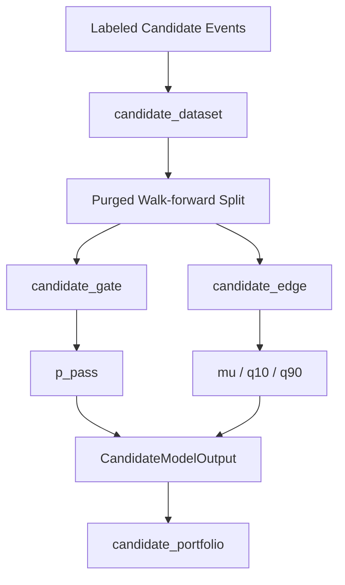

# 1. Overview

`ML.md`는 기본 production allocation이 아니라, `allocation_backend="ml_edge"`일 때만 활성화되는 **challenger path**를 설명합니다. active L2는 [allocation.md](/home/kth/my_coin_traider/docs/architecture/allocation.md)입니다.

# 2. Core Components

| Component | Responsibility | File |
|-----------|----------------|------|
| `label_candidate_events` | cost/funding/hurdle 반영 실현 edge 생성 | `candidate_labels.py` |
| `build_candidate_dataset` | identity, market, symbol, signal context feature matrix 구축 | `candidate_dataset.py` |
| `fit_candidate_gate` | pass probability calibration / validation gate 학습 | `candidate_gate.py` |
| `fit_candidate_edge_models` | center/q10/q90 residual edge 회귀 학습 | `candidate_edge.py` |
| `predict_candidate_edges` | ML 예측을 `CandidateModelOutput` 스키마로 변환 | `candidate_edge.py` |
| `candidate_workflow` ML branch | purged walk-forward split에서 challenger 경로 실행 | `candidate_workflow.py` |

# 3. Data Flow

# 4. Business Rules & Invariants

- **Challenger only:** 기본값은 `allocation_backend="ensemble_b0"`이며 ML path는 explicit opt-in입니다.
- **Fail-closed validation:** calibration에서 gate/edge 검증을 통과하지 못하면 selection에 유리한 예측을 강제로 유지하지 않습니다.
- **Cost-aware target:** 학습 타겟은 gross return이 아니라 `net_return_bps` / `edge_after_hurdle_bps` 계열 순수익입니다.
- **Shared output contract:** challenger path도 active allocation과 동일하게 `CandidateModelOutput`을 반환해야 합니다.
- **No active-path dependency:** ML file들은 보존되지만 `ensemble_b0` 기본 경로에서 import/fit/predict가 필수 dependency가 되어서는 안 됩니다.

# 5. Data Schemas

### `CandidateDataset`

- `X`, `feature_names`
- `event_index`
- `y_return_bps`, `y_edge_bps`, `y_q10_bps`
- `gate_weight`, `edge_weight`

### `CandidateModelOutput`

- `p_pass`
- `expected_net_bps`
- `q10_net_bps`, `q90_net_bps`
- `selection_score`
- `validation_diagnostics`

# 6. Testing Expectations

- `allocation_backend="ensemble_b0"`에서 gate/edge LightGBM 호출이 없어야 합니다.
- `allocation_backend="ml_edge"`는 기존 gate/edge unit suite를 계속 통과해야 합니다.
- workflow/ablation/reporting 경로는 challenger model 부재 시 active backend fallback을 깨지 않아야 합니다.
