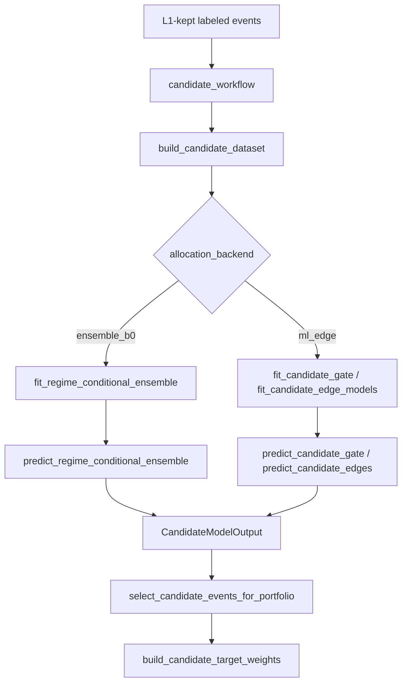

# 1. Overview

Allocation 레이어는 L1에서 살아남은 candidate event를 받아 event별 `mu_net_decision_bps`, `q10_net_bps`, `p_pass`를 만들고, 이를 selection 및 Kelly/stop-risk sizing으로 연결합니다. 현재 active backend는 **regime-conditional shrinkage ensemble (`ensemble_b0`)** 입니다.

# 2. Core Components

| Component | Responsibility | File |
|-----------|----------------|------|
| `CandidateStrategyConfig` | `allocation_backend`, `ensemble_shrinkage_k` 및 backend switch 제공 | `config.py` |
| `RegimeConditionalEnsemble` | archetype-regime cell별 shrunk expected edge 보관 | `candidate_ensemble.py` |
| `fit_regime_conditional_ensemble` | train-window event만으로 cell mean/q10 shrinkage 추정 | `candidate_ensemble.py` |
| `predict_regime_conditional_ensemble` | OOS event를 `(archetype, regime_code)` lookup으로 scoring | `candidate_ensemble.py` |
| `_fit_and_predict_single_fold` | fold별 `ensemble_b0` / `ml_edge` backend 분기 | `candidate_workflow.py` |
| `select_candidate_events_for_portfolio` | `CandidateModelOutput` 기준 filtering 및 event selection | `candidate_portfolio.py` |
| `build_candidate_target_weights` | selected events를 Kelly / stop-risk sizing으로 weight 변환 | `candidate_portfolio.py` |
| `run_candidate_ablation` | allocation backend와 reporting 경로의 fallback 일관성 유지 | `ablation.py` |

# 3. Data Flow

# 4. Business Rules & Invariants

- **Active default:** `allocation_backend="ensemble_b0"`가 기본값입니다.
- **No LGBM on active path:** `ensemble_b0` 경로에서는 `fit_candidate_gate`, `fit_candidate_edge_models`, `predict_candidate_gate`, `predict_candidate_edges`를 호출하지 않습니다.
- **Train-window only:** ensemble fitting은 현재 fold의 fit dataset event만 사용합니다. OOS event나 calibration event로 cell mean을 보정하지 않습니다.
- **Regime-conditional shrinkage:** cell 추정치는 `k = ensemble_shrinkage_k`를 사용해 global prior로 수축합니다.
  - `mu_hat(a,g) = (n_ag * mean_ag + k * mean_global) / (n_ag + k)`
- **Graceful sparse-cell fallback:** unseen `(archetype, regime_code)` 조합은 `global_mu_bps`, `global_q10_bps`를 사용합니다.
- **Schema stability:** backend가 달라도 downstream은 동일한 `CandidateModelOutput`만 소비합니다.
- **Selection unchanged:** B0는 `mu_net_decision_bps`, `q10_net_bps`, `p_pass` 생산자만 교체합니다. sizing/objective/AWF logic은 바꾸지 않습니다.
- **Reporting parity:** ablation/reporting 경로는 challenger model이 비활성일 때도 active allocation backend 예측으로 계속 진행해야 합니다.

# 5. Data Schemas

### `RegimeConditionalEnsemble`

- `cell_mu_bps: dict[tuple[str, int], float]`
- `cell_q10_bps: dict[tuple[str, int], float]`
- `global_mu_bps: float`
- `global_q10_bps: float`

### `CandidateModelOutput`

- `events: pd.DataFrame`
- `p_pass: NDArray[float64]`
- `expected_net_bps`
- `q10_net_bps`, `q90_net_bps`
- `selection_score`
- `validation_diagnostics["allocation_backend"]`

# 6. Testing Expectations

- small cell은 global prior 쪽으로 shrink 되어야 합니다.
- lookup predict는 seen cell과 unseen cell fallback을 모두 정확히 처리해야 합니다.
- workflow test는 `ensemble_b0`에서 LGBM 호출이 없음을 증명해야 합니다.
- `phase=ml` 실행은 B0 active path와 ablation/reporting fallback까지 포함해 종료되어야 합니다.
- `ensemble_b0` 배분 모델의 평가는 OOS 예측값(`expected_net_bps`)과 실제 OOS 실현값 간의 Spearman Rank Correlation(Rank IC)을 계산하여 검증합니다.
