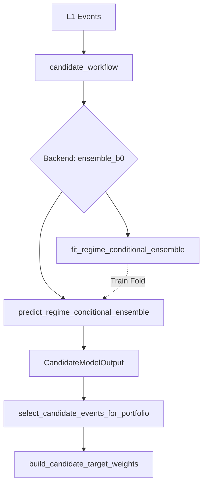

# 1. Purpose
Transforms L1 candidate events into optimal portfolio weights via regime-conditional shrinkage ensemble and stop-risk/Kelly sizing.

# 2. Core Logic & Math

**Regime-Conditional Shrinkage (Ensemble B0)**
- $\mu_{\text{net}} (a, g) = \frac{n_{a,g} \cdot \bar{x}_{a,g} + k \cdot \bar{x}_{\text{global}}}{n_{a,g} + k}$
- where $a$ = archetype, $g$ = entry_regime_code, $k$ = `ensemble_shrinkage_k`

**Conditioning Axis Selection (`ensemble_conditioning`)**
- Default `"auto"`: fold마다 IS 내부 검증 Rank IC 비교로 `archetype_regime` vs `archetype_only` 결정.
  - $\Delta IC = IC_{\text{regime}} - IC_{\text{arch}} \geq \text{ensemble\_min\_conditioning\_ic\_gain}$ 이면 `archetype_regime` 선택.
- `"archetype_regime"` / `"archetype_only"` 명시 가능 (수동 override).
- **Fail-SAFE Constraint:** OOS proof window 없이 `archetype_regime`이 선택된 경우 → `archetype_only`로 강등 (`conditioning_path="no_oos_evidence_failsafe"`). 증거 없이 복잡한 경로를 선택하지 않는다.

**Fallback Logic (Two-level)**
- Level 1 (Missing regime): $\mu(a, g) \rightarrow \mu(a)$
- Level 2 (Missing archetype): $\mu(a) \rightarrow \mu_{\text{global}}$

**Signal Evaluation Gates (OOS)**
- $IC_{\text{rank}} = \text{Spearman}(\text{score}, \text{target})$ over OOS window. Gate: $IC_{\text{rank}} \geq \text{min\_oos\_rank\_ic}$
- $t_{\text{stat}} = IC_{\text{rank}} \times \sqrt{\frac{N_{\text{oos}} - 2}{1 - IC_{\text{rank}}^2}}$. Gate: $t_{\text{stat}} \geq \text{min\_ic\_tstat}$
- Q10 Tail Risk: $\text{Fail Rate} \leq \text{max\_variant\_oos\_q10\_fail\_rate}$

**Regime-Cell Bayesian Admission (Orthogonal Signal Rescue)**
- Unified admission criterion: $p_{\text{admit}} = P(\mu > \delta \mid \text{data}) \geq p_{\text{admit\_min}}$
- Prior: $\mu \sim \mathcal{N}(\mu_0, \tau^2)$ where $\tau^2$ = cross-cell variance (data-derived; fallback `admission_tau_prior_bps²`)
- Likelihood: $\bar{x} \mid \mu \sim \mathcal{N}(\mu, \Omega_{nw}/n)$ with Newey-West long-run variance $\Omega_{nw}$ (Bartlett kernel)
- N-N conjugate posterior: $\sigma^2_{\text{post}} = 1/(n/\Omega_{nw} + 1/\tau^2)$, $\mu_{\text{post}} = \sigma^2_{\text{post}}(n\bar{x}/\Omega_{nw} + \mu_0/\tau^2)$
- $p_{\text{admit}} = \Phi((\mu_{\text{post}} - \delta)/\sigma_{\text{post}})$ via survival function; $\delta$ = `min_regime_cell_edge_bps`
- James-Stein shrinkage: $k_0 = \Omega_{nw}/\tau^2$ derived from data — no hard-coded regularization
- `min_regime_cell_oos_obs` = NW variance stability floor only (default 10); **not** a domain gate
- OR-path: if `regime_cell_admitted=True`, bypasses global pooled gates (`min_obs`, `breakeven_hard_gate`, `mean_edge`, etc.)
- Replaces: `min_obs=60`, `min_tstat=1.0` (statistically inconsistent; effect-size-agnostic)

**Fractional Kelly Sizing (calibrated_event_kelly)**
- $\sigma_R = \frac{q_{90\_R} - q_{10\_R}}{2.563}$
- $second\_moment = \max(\mu_R^2 + \sigma_R^2, 1e-6)$
- $w = \text{kelly\_fraction} \times \frac{\max(\mu_R, 0.0)}{second\_moment}$

**Dynamic Portfolio Caps & Vol-Targeting Guard**
- 타임스텝 $t$의 국면 코드 $Regime_t$에 맞춘 동적 Cap 제약:
  - $Cap_{\text{gross}, t} = Cap_{\text{gross}} \times \text{gross\_multiplier}(Regime_t)$
  - $Cap_{\text{net}, t} = Cap_{\text{net}} \times \text{net\_multiplier}(Regime_t)$
- 이중 볼라틸리티 타겟팅 방지 (`double_scaling_guard`):
  - 켈리/오버레이 사이징을 통해 1차적으로 비중이 스케일링된 경우, 포트폴리오 투영 단계에서 target_ann_vol을 $0.0$으로 처리하여 이중 감쇠(Attenuation)를 우회.

**Walk-Forward Survival Censoring**
- If fold realized edge $<$ `min_fold_realized_edge_bps`, fold fails.
- Failed fold predictions: $\mu, q10, q90, p_{\text{pass}} \rightarrow 0$ to prevent anti-selection in the portfolio pool.

# 3. Architecture Flow

# 4. Core Variables & I/O

| Type | Variable | Description |
|------|----------|-------------|
| **Input** | `events: pd.DataFrame` | Candidate events from L1 signal generation |
| **Input** | `entry_regime_code: int` | Regime code at the time of signal entry |
| **Param** | `ensemble_shrinkage_k` | Regularization strength toward global mean. Bounds: `[0, ∞)` |
| **Param** | `ensemble_conditioning` | Conditioning axis: `"auto"` (default, data-driven) \| `"archetype_regime"` \| `"archetype_only"` |
| **Param** | `ensemble_min_conditioning_ic_gain` | Min IC gain for auto to prefer archetype_regime. Bounds: `[0.0, 1.0]` |
| **Param** | `min_oos_rank_ic` | Minimum OOS Spearman Rank IC. Bounds: `[-1.0, 1.0]` |
| **Param** | `min_ic_tstat` | Minimum IC t-statistic for signal validity. Bounds: `[0.0, ∞)` |
| **Param** | `max_variant_oos_q10_fail_rate` | Maximum allowed fraction of events failing q10 threshold. Bounds: `[0.0, 1.0]` |
| **Param** | `regime_cell_admission_enabled` | Enable Bayesian per-cell admission (default `True`) |
| **Param** | `min_admission_posterior_prob` | $p_{\text{admit\_min}}$: minimum posterior probability. Bounds: `[0.5, 1.0)` |
| **Param** | `admission_use_newey_west` | Use NW autocorr-corrected variance; `False` = IID |
| **Param** | `admission_tau_prior_bps` | Fallback prior std when <2 cells. Bounds: `(0, ∞)` |
| **Param** | `min_regime_cell_oos_obs` | NW stability floor (not domain gate). Default: 10 |
| **Param** | `min_regime_cell_edge_bps` | $\delta$: minimum profitable edge. Default: 8.0 bps |
| **Param** | `double_scaling_guard` | Enable double vol-targeting scaling guard. Default: `True` |
| **Param** | `regime_gross_multipliers` | Gross cap multipliers per regime. Default HSL tailored |
| **Param** | `regime_net_multipliers` | Net cap multipliers per regime. Default HSL tailored |
| **Param** | `bl_shrinkage_var_mult` | Black-Litterman var shrinkage multiplier. Default: `0.20` |
| **Param** | `bl_shrinkage_omega_mult` | Black-Litterman omega shrinkage multiplier. Default: `0.10` |
| **Output**| `expected_net_bps` | Shrinkage-adjusted expected return per event |
| **Output**| `target_weights` | Final portfolio allocation weights per event |

# 5. Edge Cases & Handling
- **Missing OOS Samples (Sparse Signals):** If $N_{oos} < 3$, $t_{stat}$ is forced to 0.0 to strictly prevent division-by-zero or inflated confidence in rare patterns.
- **Unseen Regimes in Live Trading:** If the system encounters an `(archetype, regime)` tuple missing from the trained ensemble, it falls back gracefully to the archetype mean, then the global mean.
- **OOS Fold Failure (Contamination Defense):** If a walk-forward fold exhibits deeply negative out-of-sample edge, its predictions are censored (forced to 0) rather than dropped, preserving the matrix shape while neutralizing its allocation power.
- **No OOS Evidence (Fail-SAFE):** If `archetype_regime` is selected but no OOS proof window exists (e.g. first fold), the system degrades to `archetype_only` rather than proceeding without evidence. `conditioning_path="no_oos_evidence_failsafe"` is emitted for observability.
