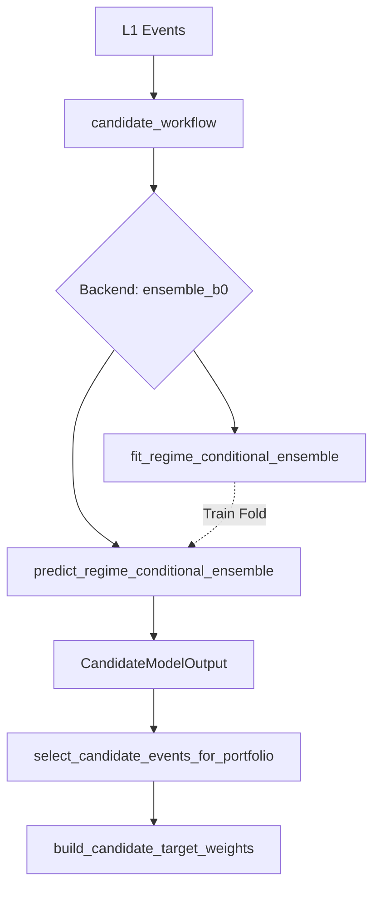

# 1. Purpose
Transforms L1 candidate events into optimal portfolio weights via regime-conditional shrinkage ensemble and stop-risk/Kelly sizing.

# 2. Core Logic & Math

**Regime-Conditional Shrinkage (Ensemble B0)**
- $\mu_{\text{net}} (a, g) = \frac{n_{a,g} \cdot \bar{x}_{a,g} + k \cdot \bar{x}_{\text{global}}}{n_{a,g} + k}$
- where $a$ = archetype, $g$ = entry_regime_code, $k$ = `ensemble_shrinkage_k`

**Fallback Logic (Two-level)**
- Level 1 (Missing regime): $\mu(a, g) \rightarrow \mu(a)$
- Level 2 (Missing archetype): $\mu(a) \rightarrow \mu_{\text{global}}$

**Signal Evaluation Gates (OOS)**
- $IC_{\text{rank}} = \text{Spearman}(\text{score}, \text{target})$ over OOS window. Gate: $IC_{\text{rank}} \geq \text{min\_oos\_rank\_ic}$
- $t_{\text{stat}} = IC_{\text{rank}} \times \sqrt{\frac{N_{\text{oos}} - 2}{1 - IC_{\text{rank}}^2}}$. Gate: $t_{\text{stat}} \geq \text{min\_ic\_tstat}$
- Q10 Tail Risk: $\text{Fail Rate} \leq \text{max\_variant\_oos\_q10\_fail\_rate}$

**Walk-Forward Survival Censoring**
- If fold realized edge $<$ `min_fold_realized_edge_bps`, fold fails.
- Failed fold predictions: $\mu, q10, q90, p_{\text{pass}} \rightarrow 0$ to prevent anti-selection in the portfolio pool.

# 3. Architecture Flow

# 4. Core Variables & I/O

| Type | Variable | Description |
|------|----------|-------------|
| **Input** | `events: pd.DataFrame` | Candidate events from L1 signal generation |
| **Input** | `entry_regime_code: int` | Regime code at the time of signal entry |
| **Param** | `ensemble_shrinkage_k` | Regularization strength toward global mean |
| **Param** | `min_oos_rank_ic` | Minimum OOS Spearman Rank IC (default: 0.01) |
| **Param** | `min_ic_tstat` | Minimum IC t-statistic for signal validity (default: 0.8) |
| **Param** | `max_variant_oos_q10_fail_rate` | Maximum allowed fraction of events failing q10 threshold (default: 0.65) |
| **Output**| `expected_net_bps` | Shrinkage-adjusted expected return per event |
| **Output**| `target_weights` | Final portfolio allocation weights per event |

# 5. Edge Cases & Handling
- **Missing OOS Samples (Sparse Signals):** If {oos} < 3$, {stat}$ is forced to 0.0 to strictly prevent division-by-zero or inflated confidence in rare patterns.
- **Unseen Regimes in Live Trading:** If the system encounters an `(archetype, regime)` tuple missing from the trained ensemble, it falls back gracefully to the archetype mean, then the global mean.
- **OOS Fold Failure (Contamination Defense):** If a walk-forward fold exhibits deeply negative out-of-sample edge, its predictions are censored (forced to 0) rather than dropped, preserving the matrix shape while neutralizing its allocation power.
