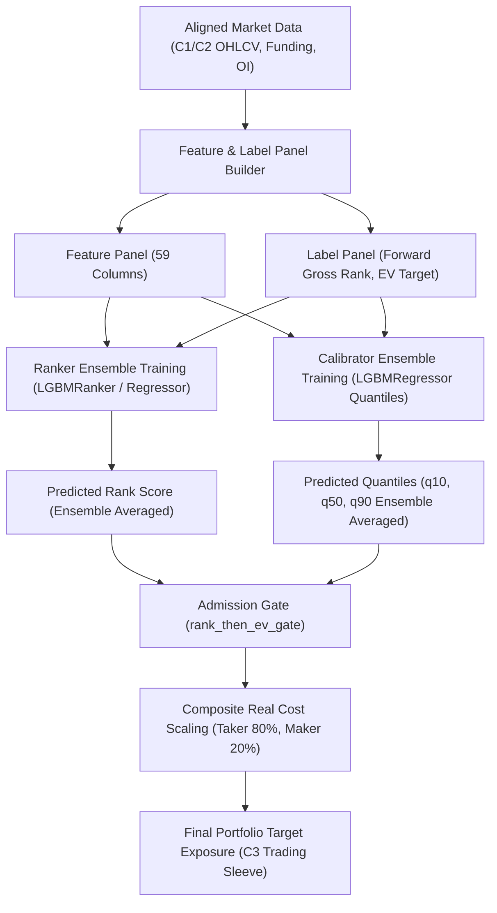

# Alpha ML Extraction Architecture (docs/architecture/alpha.md)

본 문서는 `my_coin_traider` 시스템의 핵심 구성 요소인 머신러닝 기반 알파 추출 아키텍처(ML Alpha Generation Architecture)의 구조, 알고리즘, 학습 설정, 피처 파이프라인 및 평가 기준을 정밀 기술합니다.

---

## 1. 아키텍처 개요 (Architecture Overview)

알파 추출 파이프라인은 다중 가상자산 선물 유니버스를 대상으로 횡단면 순위(Cross-Sectional Rank)와 실질 기대가치(Expected Value)를 동시 예측 및 결합하는 투트랙(Two-Track) 머신러닝 시스템입니다.

---

## 2. 피처 엔지니어링 및 전처리 (Feature Engineering & Preprocessing)

### 2.1. 피처 구조 (Total 59 Features)
* **기본 팩터 세트 (55종):** 모멘텀(Momentum), 평균회귀(Reversal), 캐리(Carry), 거래대금 변화율(USDT ADV), 미결제약정 변화율(Open Interest) 및 베이시스(Basis) 등 다이나믹 피처.
* **고도화 알파 팩터 (4종):**
  * `momentum_autocorr`: 단기 리턴 자기상관성 측정 (`ret_3`과 이의 3-bar shift 리턴의 6-period rolling correlation). Numba parallel 최적화 적용.
  * `cs_residual_momentum`: 횡단면 잔차 모멘텀 (CS demeaned return의 6-period rolling average).
  * `vwap_deviation`: VWAP 대비 종가 이격도.
  * `funding_rate_momentum`: 자금조달율 3-bar 차이의 6-period rolling average.

### 2.2. 견고한 전처리 파이프라인 (Robust Preprocessing)
* **결측치 대체 (Missing Value Imputation):** 횡단면 중앙값 대체를 기본으로 수행하되, 결측 심볼은 `nanmean` 및 전방 채우기(Forward Fill) 기법 혼용.
* **이상치 제어 (Outlier Mitigation):** 특이치에 의한 모델 왜곡을 방지하기 위해 MAD(Median Absolute Deviation) Z-score 및 로버스트 경계 조건(Robust Bounds)으로 클리핑 적용.

---

## 3. 학습 모델 및 앙상블 알고리즘 (Model & Ensemble)

### 3.1. 투트랙 예측 아키텍처 (Two-Track Prediction)
* **횡단면 순위 모델 (Ranker Model):**
  * 알고리즘: LightGBM (`LGBMRanker` 또는 `LGBMRegressor`)
  * 타깃: `forward_gross_rank` (미래 수익률의 횡단면 분위수 순위)
  * 목적: 롱/숏 포트폴리오 구성 시 최우수 종목의 상대적 순위 보장
* **시그널 캘리브레이터 (Signal Calibrator):**
  * 알고리즘: Platt Scaling (`LogisticRegression`)
  * 타깃: 수익 발생 여부 (Forward Return > 0) 및 평균 손익비 (`mean_b`)
  * 목적: Ranker가 출력한 원시 스코어를 실질 승률(Probability) 및 기대가치(EV) 단위로 정규화

### 3.2. 난수 시드 앙상블 시스템 (Seed Ensemble System)
* **메커니즘:** 단일 시드의 무작위 추출 편향(Sampling Noise) 및 OOS 성능 진동을 완전 통제하기 위해 다중 난수 시드(`[42, 1004, 2026]`) 앙상블 기법 이식.
* **Ranker 통합 적용:** Ranker 학습 모델 리스트를 지정 시드 개수만큼 개별 피팅 후, 예측 단계에서 예측값의 산술 평균을 산출하여 최종 점수로 채택.
* **Calibrator 최적화:** 각 AWF(Anchored Walk-Forward) 레그별로 OOS 데이터를 활용하여 로지스틱 회귀 기반 캘리브레이션을 수행함으로써 실질 실행 환경과의 정합성 극대화.

### 3.3. 비트 단위 재현성 보장 (Bitwise Reproducibility Guarantee)
* **결정론적 연산 파라미터 적용:** LightGBM의 멀티 스레딩 병렬 히스토그램 연산 시 발생하는 부동소수점 누적 순서 변동(floating-point round-off errors)을 방지하기 위해 `deterministic=True` 및 `force_col_wise=True`를 강제 설정함.
* **정합성 보장:** 동일 시드와 학습 데이터 셋 기반의 연속 피팅 실행 시, 산출된 가중치와 인퍼런스 예측 스코어가 비트 단위로 100% 동일(오차율 0%)함을 단위 테스트(`test_ml_reproducibility`)로 보증함.

---

## 4. 학습 설정 및 비정상성 보정 (Learning Settings)

### 4.1. 시계열 교차 검증 (Walk-Forward Validation)
* **Purge & Embargo:** 정보 누출(Look-ahead Bias) 방지를 위해 Folds 사잇구간에 12-bar 크기의 퍼지 및 엠바고 차단막 설정.
* **다중 Folds 구조:** OOS 안정성과 적응성을 확보하기 위해 다중 Folds 분할 학습 및 타임프레임 스윕 테스트 기본 장착.

### 4.2. 비정상성 보정 (Time-Decay Sample Weight)
* **기본값:** `sample_weight_time_decay_halflife_bars = 1080` (최근 6개월 반감기)
* **목적:** 가상자산 시장의 변동성 체제 전환(Regime Shift)에 적응하기 위해 과거 레짐(예: 2022-2023 하락장)의 비관적 편향을 억제하고 최근 트렌드에 가중치를 극대화하여 학습 유도.

---

## 5. 의사결정 및 평가 기준 (Admission Gate & Evaluation)

### 5.1. 다차원 포지션 진입 승인 필터 (Admission Gate)
* **진입 모드:** `rank_then_ev_gate`
* **승인 프로세스:**
  1. Ranker 앙상블 예측 점수를 기준으로 횡단면 상위/하위 극단에 위치한 최우수 후보군 선별 (상위 K개 자산 필터링).
  2. 선별된 후보군 중 Calibrator가 산출한 보수적 분위 기대가치(Conservative EV)가 사전 설정된 `EV_HURDLE_BPS` 장벽을 상회하는 자산만 최종 트레이딩 슬리브(C3)로 진입 허용.

### 5.2. 보수적 실질 비용 모델 스케일링 (Conservative Cost Model)
* **비용 함수:** `MAKER_RATIO` 복합 실질 비용
  * Taker 위주의 가혹 시나리오 적용 (`MAKER_RATIO = 0.20`, Taker 비중 80%)
  * $\text{effective\_rt} = (\text{maker\_ratio} \times \text{maker\_fee}) + ((1.0 - \text{maker\_ratio}) \times \text{taker\_fee}) + \text{slippage}$
* **정합성 진단:** `_build_strategy_compose_diag` 진단 지표와 `compose_mu` 의사결정 모델 간의 Friction 2D 오차율을 0%로 강제 통일하여 정밀 백테스팅 환경 제공.

### 5.3. 정량적 통과 기준 (SSOT Evaluation Criteria)
* **OOS-RANKIC:** Spearman Rank IC 계수 및 t-stat 전역 출력.
  * 배포 기준: `OOS-RANKIC ic >= 0.030`, `t-stat >= 3.0`
* **ML_COST:** 가혹 테이커 복합 비용 게이트 통과 여부 검사 (`pass=true`).

---