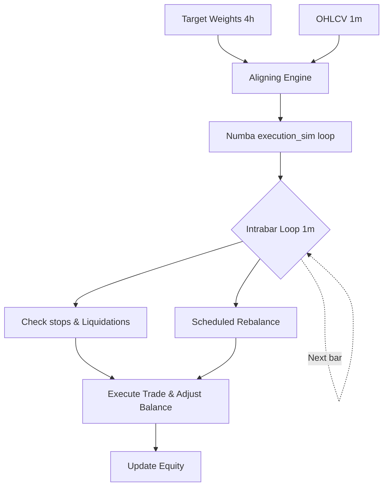

# 1. System Boundary
- **In-Scope**:
  - High-performance simulation execution via Numba JIT-compiled backtest core (`backtest_target_weights_numba`).
  - Intrabar 1m trade processing, fee/funding rate calculation, trailing stops, and margin calls.
  - Account state tracking and portfolio balance logging.
- **Out-of-Scope**:
  - Source data alignment and look-ahead filtering (managed upstream in Data Lifecycle).

# 2. Mathematical Formalism & Constraints

### Position Quantization
$$Q_{t, n} = \text{sgn}(w_{t, n}) \cdot \left\lfloor \frac{|w_{t, n}| \cdot E_t}{P_{t, n} \cdot \text{step\_size}_n} \right\rfloor \cdot \text{step\_size}_n$$
- Exclude symbol if: $|Q_{t, n}| \cdot P_{t, n} < \text{min\_notional}_n$

### Accounting Identity
$$E_t = E_0 - \sum_{i=1}^t \text{Fees}_i - \sum_{i=1}^t \text{Funding}_i + \sum_{i=1}^t \text{RealizedPnL}_i + \text{UnrealizedPnL}_t$$
- Position margin limit: $E_t \ge 0$ (Liquidation triggered at $E_t \le 0$)

### Long Position Stop Exit
$$\text{Exit} = \text{TRUE} \iff (P_{\text{open}, 1m} \le P_{\text{stop}}) \lor (P_{\text{low}, 1m} \le P_{\text{stop}})$$
- Execution price $P_{\text{exec}}$ fallback:
  - If $P_{\text{open}, 1m} \le P_{\text{stop}}$, $P_{\text{exec}} = P_{\text{open}, 1m} \times (1 - \text{slippage\_rate})$
  - Else, $P_{\text{exec}} = P_{\text{stop}} \times (1 - \text{slippage\_rate})$

# 3. Strict I/O Contract

| Type | Parameter | Shape | Data Type | Description |
| :--- | :--- | :--- | :--- | :--- |
| **Input** | `target_weights` | `[T, N]` | `float64` | Portfolio target weights matrix in range `[-1.0, 1.0]` |
| **Input** | `close_2d` / `open_2d` | `[M, N]` | `float64` | High-frequency 1m OHLC prices |
| **Input** | `funding_rate` | `[M, N]` | `float64` | Point-in-Time 1m funding rates |
| **Param** | `maker_fee` / `taker_fee` | Scalar | `float` | Transaction fee ratios |
| **Param** | `slippage_rate` | Scalar | `float` | Slippage model parameter |
| **Param** | `max_exposure` | Scalar | `float` | Hard limit on maximum combined exposure |
| **Output**| `equity_curve` | `[M]` | `float64` | Account net asset value history |
| **Output**| `trades` | list | `struct` | Trades ledger logging executions, sizes, fees, and realized PnL |

# 4. Topology & Dynamic Flow

# 5. Configurable Parameters
| Parameter | Default | Purpose |
| :--- | :--- | :--- |
| `rebalance_bars` | 240 | Periodicity bar count for rebalancing execution (240m = 4h) |
| `max_hold_bars` | -1 | Maximum position holding bar limit (-1 for infinite) |
| `dd_scaling_threshold` | 0.05 | Maximum peak drawdown threshold to trigger sizing scaling down |
