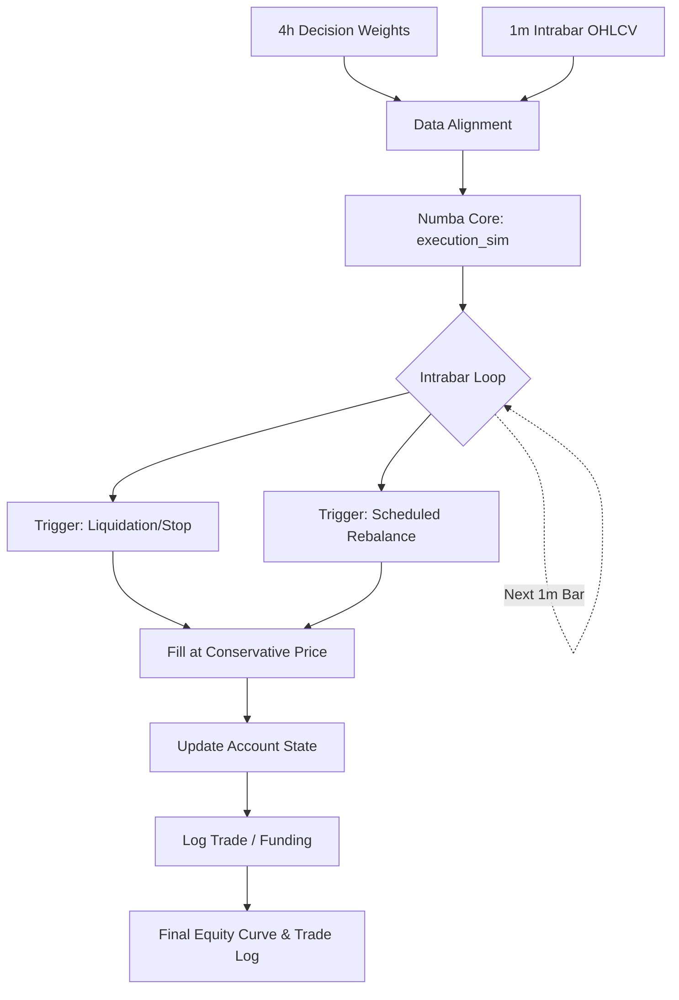

# 1. Purpose
Executes a dual-resolution (4h decision, 1m execution) conservative backtest simulation powered by a Numba JIT core to ensure mathematical integrity and perfect alignment between optimization and final testing.

# 2. Core Logic & Math

**Execution Priorities (Intrabar 1m)**
1. Liquidation: $Equity \leq 0 \implies \text{Margin Call}$
2. Time Stop / Max Hold
3. Stop Loss: Conservative fill (e.g., if Gap-Down $O_{1m} < \text{Stop}$, fill at $O_{1m}$)
4. Rebalance / Entry

**Position Quantization**
- $Q = \lfloor \frac{W_{\text{target}} \cdot E}{P \cdot \text{step\_size}} \rfloor \cdot \text{step\_size}$
- Filter: $Q \cdot P \geq \text{min\_notional}$

**Accounting Identity**
- $E_{T} = E_{0} - \sum \text{Fees} - \sum \text{Funding} + \sum \text{RealizedPnL} + \text{UnrealizedPnL}_{T}$

**Look-ahead Prevention**
- Decision computed at $T$ uses $P_{T}$.
- Execution happens strictly in window $(T, T+1]$ using $1m$ paths.

# 3. Architecture Flow

# 4. Core Variables & I/O

| Type | Variable | Description |
|------|----------|-------------|
| **Input** | `target_weights_2d` | $[B_{4h}, N]$ array of portfolio target weights. Bounds: `[-1.0, 1.0]` per asset |
| **Input** | `exec_ohlc_1m` | $[B_{1m}, N]$ arrays for simulating intrabar paths. Bounds: `P > 0` |
| **Input** | `funding_event_mask`| $[B_{1m}, N]$ array indicating funding settlement times. Bounds: `[0, 1]` |
| **Param** | `round_trip_cost_bps` | Universal execution cost parameter from `settings.py`. Bounds: `[0.0, ∞)` |
| **Param** | `min_notional` | Exchange minimum order size limit. Bounds: `(0.0, ∞)` |
| **Output**| `Equity Curve` | Time-series of account equity $E_{T}$ |
| **Output**| `Trades Log` | Detailed ledger of all fills, prices, and fees |

# 5. Edge Cases & Handling
- **Insufficient Margin for Any Execution:** If target weight calculation demands margin exceeding current equity bounds despite step quantization, `Q` clamps strictly to maximum viable capital, avoiding over-leverage.
- **Concurrent Liquidation vs Stop-Loss:** Processed strictly by mathematical severity. If a 1m candle's high/low breaches both Liquidation and Stop levels simultaneously, Liquidation path takes absolute precedence, instantly clearing the position without attempting partial stop execution.
