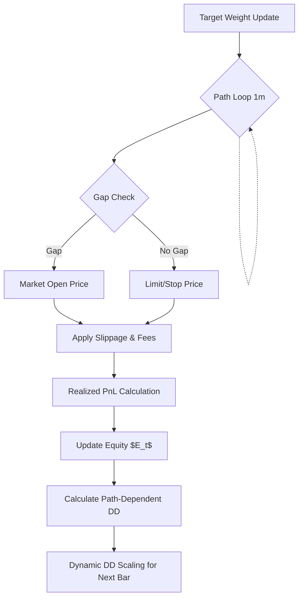

# 1. Purpose
Defines the strict mathematical models for friction, margin, drawdown scaling, and conservative fill pricing during intrabar simulation.

# 2. Core Logic & Math

**Cost Model (Friction)**
- Entry/Exit Price: $P_{\text{fill}} = P_{\text{market}} \cdot (1 \pm \text{slippage\_rate})$
- Fee Deduction: $\text{Fee} = \text{Notional} \cdot \text{taker\_fee\_rate}$
- Total Round-trip ($bps$): $2 \cdot (\text{fee} + \text{slippage}) + \text{impact} + \text{tick\_cost}$

**Cost Deduction Invariant (Double-Deduction Defense)**
- L1 Signal Target ($y$): Gross return only (Cost = 0).
- Optimizer Objective: Deducts cost exactly once ($\text{Friction} + \text{EV\_HURDLE}$).

**Conservative Fill Pricing (Stop/Gap Scenarios)**
- Long Stop Loss at $S$: If $O_{t} < S$ (Gap Down), $P_{\text{fill}} = O_{t}$. Else, $P_{\text{fill}} = \min(L_{t}, S)$.
- Short Stop Loss at $S$: If $O_{t} > S$ (Gap Up), $P_{\text{fill}} = O_{t}$. Else, $P_{\text{fill}} = \max(H_{t}, S)$.

**Drawdown Scaling (Path-Dependent)**
- $\text{DD}_{t} = \frac{\max(E_{\leq t}) - E_{t}}{\max(E_{\leq t})}$
- Applied dynamically inside the `execution_sim` intrabar loop. Never precomputed statically.

# 3. Architecture Flow

# 4. Core Variables & I/O

| Type | Variable | Description |
|------|----------|-------------|
| **Input** | `P_{market}` | Raw exchange price (O, H, L, C). Bounds: `P > 0` |
| **Param** | `slippage_rate` | Modeled slippage based on volume and depth. Bounds: `[0.0, 1.0]` |
| **Param** | `taker_fee_rate` | Exchange execution fee. Bounds: `[0.0, 1.0]` |
| **Param** | `EV_HURDLE` | Minimum expected edge bps required by optimizer. Bounds: `[0.0, ∞)` |
| **State** | `Equity E_t` | Live simulation capital. Bounds: `E_t > 0` (Liquidation at $\leq 0$) |
| **State** | `Drawdown DD_t` | Peak-to-trough capital reduction fraction. Bounds: `[0.0, 1.0]` |
| **Output**| `P_{fill}` | Post-friction execution price |

# 5. Edge Cases & Handling
- **Market Gaps Exceeding Stops:** If the market opens dramatically below a Long stop ($O_{t} < S$), the system does not magically fill at $S$. It fills at $O_{t}$ minus additional slippage, realistically simulating extreme tail-risk losses during flash events.
- **Cost Accumulation on Ping-Pong Trading:** High-frequency flipping of target weights incurs massive friction. The cost invariant ensures friction is fully subtracted, driving `Expected Net Edge` negative and effectively disabling hyper-active noisy variants during optimization.
