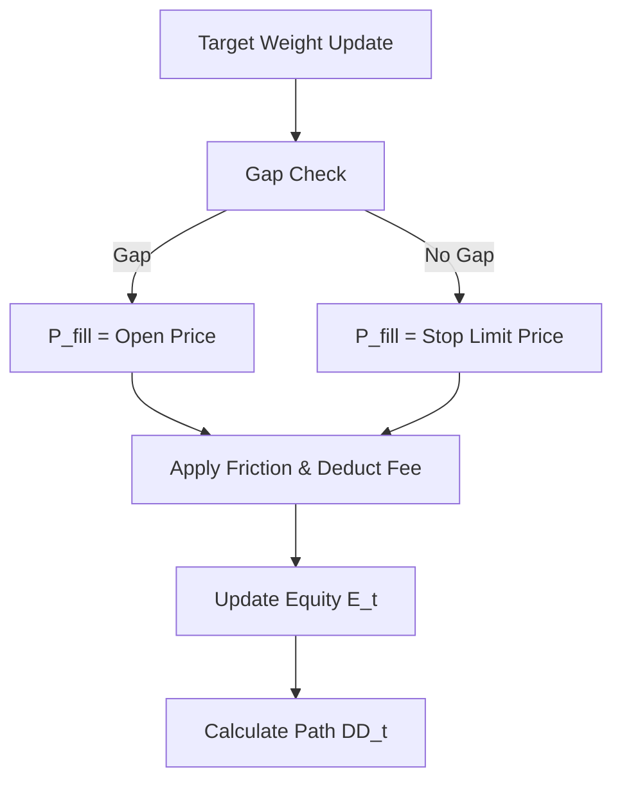

# 1. System Boundary
- **In-Scope**:
  - Mathematical formalisms for transaction friction models (fees and slippage).
  - Conservative Fill Pricing policies under market gaps.
  - Path-dependent drawdown scaling models for risk sizing.
- **Out-of-Scope**:
  - Actual order submission and clearing registry interfaces.

# 2. Mathematical Formalism & Constraints

### Friction Model
$$P_{\text{fill}} = P_{\text{market}} \times (1 \pm \text{slippage\_rate})$$
$$\text{Fee} = \text{Notional} \times \text{taker\_fee\_rate}$$
$$\text{Cost}_{\text{bps}} = 2 \cdot (\text{fee} + \text{slippage}) + \text{impact} + \text{tick\_cost}$$

### Conservative Fill Pricing (Long Stop Exit at $S$)
$$P_{\text{fill}} = 
\begin{cases} 
O_t & \text{if } O_t < S \quad \text{(Gap Down)} \\
\min(L_t, S) & \text{if } O_t \ge S 
\end{cases}$$

### Conservative Fill Pricing (Short Stop Exit at $S$)
$$P_{\text{fill}} = 
\begin{cases} 
O_t & \text{if } O_t > S \quad \text{(Gap Up)} \\
\max(H_t, S) & \text{if } O_t \le S 
\end{cases}$$

### Drawdown Calculation
$$\text{DD}_t = \frac{\max_{i \le t}(E_i) - E_t}{\max_{i \le t}(E_i)}$$

# 3. Strict I/O Contract

| Type | Parameter / Variable | Shape | Data Type | Description |
| :--- | :--- | :--- | :--- | :--- |
| **Input** | `P_market` | Scalar / Array | `float64` | Raw market prices (O, H, L, C) |
| **Input** | `E_t` | Scalar | `float64` | Simulated equity balance at step $t$ |
| **Param** | `slippage_rate` | Scalar | `float` | Slippage model coefficient |
| **Param** | `taker_fee_rate` | Scalar | `float` | Exchange taker fee rate |
| **Param** | `EV_HURDLE` | Scalar | `float` | Minimum expected value threshold required |
| **Output**| `P_fill` | Scalar | `float64` | Transaction execution price after slippage |
| **Output**| `DD_t` | Scalar | `float` | Path-dependent max drawdown ratio |

# 4. Topology & Dynamic Flow

# 5. Configurable Parameters
| Parameter | Default | Purpose |
| :--- | :--- | :--- |
| `slippage_rate` | 0.0005 | Fixed base rate for market order slippage (5 bps) |
| `taker_fee_rate` | 0.0004 | Binance USDT perpetual contract taker fee (4 bps) |
| `EV_HURDLE` | 0.0002 | Double cost deduction prevention hurdle (2 bps) |
