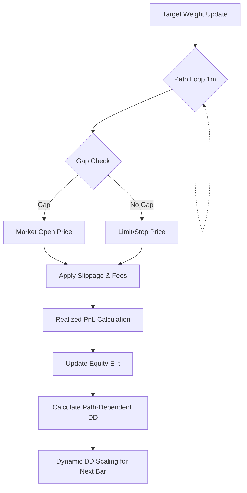

# 1. Purpose
시뮬레이션 과정에서 사용되는 거래 비용(Friction), 마진 정산, 낙폭(Drawdown) 계산 및 시장 갭(Gap) 발생 시의 보수적 체결 가격 결정 논리를 수학적으로 정의한다.

# 2. Core Logic & Math

### Friction Model (거래 비용)
- **체결 가격 반영**: $P_{\text{fill}} = P_{\text{market}} \cdot (1 \pm \text{slippage\_rate})$
- **수수료 차감**: $\text{Fee} = \text{Notional} \cdot \text{taker\_fee\_rate}$
- **총 왕복 비용 (bps)**: $2 \cdot (\text{fee} + \text{slippage}) + \text{impact} + \text{tick\_cost}$

### Cost Deduction Invariant (이중 차감 방지)
- L1 Signal Target ($y$): 비용이 반영되지 않은 Gross Return 기준으로 라벨링.
- Optimizer Objective: 최종 포트폴리오 최적화 단계에서 $\text{Friction} + \text{EV\_HURDLE}$을 1회 일괄 감산하여 이중 비용 차감 오류를 방지함.

### Conservative Fill Pricing (보수적 체결가 설계)
- **Long Stop Loss at $S$**:
  - $O_{t} < S$ (Gap Down 발생) $\implies P_{\text{fill}} = O_{t}$
  - $O_{t} \geq S$ $\implies P_{\text{fill}} = \min(L_{t}, S)$
- **Short Stop Loss at $S$**:
  - $O_{t} > S$ (Gap Up 발생) $\implies P_{\text{fill}} = O_{t}$
  - $O_{t} \leq S$ $\implies P_{\text{fill}} = \max(H_{t}, S)$

### Drawdown Scaling (실시간 낙폭 계산)
- **낙폭 정의**:
  - $\text{DD}_{t} = \frac{\max(E_{\leq t}) - E_{t}}{\max(E_{\leq t})}$
  - `execution_sim` 루프 내에서 각 step마다 실시간으로 계산하여 가중치 제어에 적용.

# 3. Architecture Flow

# 4. Core Variables & I/O

| Type | Variable | Description |
|---|---|---|
| **Input** | `P_market` | 거래소 원시 시세 (O, H, L, C) |
| **Param** | `slippage_rate` | 거래량과 호가창 깊이를 반영한 슬리피지 모델 파라미터 |
| **Param** | `taker_fee_rate` | 거래소 체결 수수료율 |
| **Param** | `EV_HURDLE` | 포트폴리오 구성 시 요구되는 최소 기대수익 임계값 |
| **State** | `Equity E_t` | 실시간 시뮬레이션 평가 잔고 |
| **State** | `Drawdown DD_t` | 역사적 고점 대비 현재 잔고의 최대 낙폭 비율 |
| **Output**| `P_fill` | 마찰 비용이 반영된 최종 거래 체결가 |

# 5. Edge Cases & Handling
- **스톱 가격을 넘는 시가 갭**: Long 포지션 보유 중 시장 시가가 Stop 수준보다 낮게 시작할 경우($O_{t} < S$), 임의의 $S$가 아닌 실제 시가 $O_{t}$에 추가 슬리피지를 가산하여 불리한 가격으로 체결함으로써 테일 리스크를 모사함.
- **잦은 비중 교체로 인한 비용 누적**: 타겟 비중이 과도하게 빈번하게 변경(Ping-Pong)될 경우 누적 마찰 비용이 급증하여 기대 순이익이 음수로 전환되며, 이를 통해 최적화 과정에서 노이즈 성격의 신호가 자연스럽게 배제됨.
