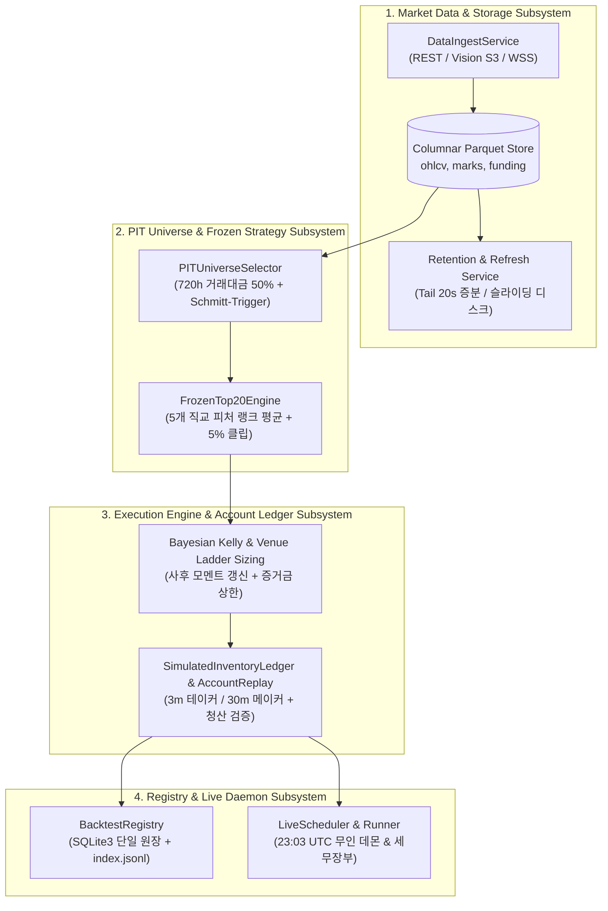

# Subsystem Component Architecture

본 문서는 `crypto-pilot` 시스템을 구성하는 핵심 컴포넌트별 단일 책임(Single Responsibility), 입출력 규격 및 Fail-Closed 불변식을 4대 핵심 서브시스템 단위로 정의합니다.

---

## 1. Subsystem Topology & Layer Interactions

---

## 2. Market Data & Storage Subsystem

| 컴포넌트 | 핵심 책임 | 핵심 인터페이스 (Input / Output) | 장애 방어 및 불변식 (Fail-Closed) |
| :--- | :--- | :--- | :--- |
| **[`MarketDataService`](file:///home/kth/crypto-pilot/src/market_data/services/)** | • Binance REST/S3/WSS 다중 소스로부터 시세 수집 • 디스크 tail 기반 증분 갱신 (~20초 소요) • 실행 커버리지 동기화 및 결손 감사 | **In**: 거래소 API 응답, Vision S3 아카이브 **Out**: zstd 압축 컬럼형 Parquet 파일 | • **RAM 예산 가드**: 메모리 사용률 85% 초과 시 즉시 작업 중단 • **결손 심볼 자동 격리**: `SOURCE_GAP_EXCLUDED_SYMBOLS` 사전 필터링 • **펀딩 엔드포인트 격리**: fundingRate WAF/IP 차단은 펀딩만 skip하고 OHLCV 갱신은 계속 |
| **[`RetentionService`](file:///home/kth/crypto-pilot/src/market_data/retention.py)** | • 무손실 원자적 슬라이딩 윈도우 프루닝 • 보존 기간 초과 데이터 원자적 절단 | **In**: 로컬 Parquet 스토리지 **Out**: Prune 완료 파일, `RefreshReport` | • **원자적 치환 (`tmp.replace`)**: 파일 파손 방지 • **최소 보존 한도**: 패널 윈도우 이상 안전 유지 |

---

## 3. PIT Universe & Frozen Strategy Subsystem

| 컴포넌트 | 핵심 책임 | 핵심 인터페이스 (Input / Output) | 장애 방어 및 불변식 (Fail-Closed) |
| :--- | :--- | :--- | :--- |
| **[`PITUniverseSelector`](file:///home/kth/crypto-pilot/src/quant/universe/pit_universe.py)** | • 3단계 Causal 거래대금 필터링 • Schmitt-Trigger 히스테리시스 적용 | **In**: 1시간봉 거래대금 시계열, 상장 이력 **Out**: `(timestamp, symbol)` 실행 마스크 | • **Look-Ahead 차단**: 과거 720h 거래대금 중앙값만 참조 • **경계선 진동 억제**: 60위 진입 / 120위 방출로 턴오버 30% 절감 |
| **[`FrozenTop20Engine`](file:///home/kth/crypto-pilot/src/mhs/frozen_research_candidate.py)** | • 5개 직교 횡단면 피처 결합 • 달러 중립화 및 종목별 5% 클립 | **In**: 종가, 테이커 매수대금, 펀딩비 패널 **Out**: 달러 중립 목표 가중치 행렬 | • **결정론적 신호 산출**: 1h 120일 창에서 인프로세스 직접 산출 • **집중도 제어**: 단일 종목 5% 클립으로 꼬리 리스크 방어 |

---

## 4. Execution Engine & Account Ledger Subsystem

| 컴포넌트 | 핵심 책임 | 핵심 인터페이스 (Input / Output) | 장애 방어 및 불변식 (Fail-Closed) |
| :--- | :--- | :--- | :--- |
| **[`AccountGrowthPolicy`](file:///home/kth/crypto-pilot/src/mhs/account_policy.py)** | • 인과적 베이지안 수축 Kelly 노출 정책 • 거래소 브래킷 증거금 사다리 상한 산출 | **In**: 전일까지의 단위북 누적 실적, 자본금 **Out**: 일별 최적 노출 배율 $L^*$ 및 명목 목표 | • **인과성 불변식**: 미래 수익률 미참조 (사전 $\mu_0=0$에서 인과적 갱신) • **기대수익 50% 할인**: 과최적화 파산 방지 |
| **[`SimulatedInventoryLedger`](file:///home/kth/crypto-pilot/src/mhs/execution/ledger.py)** | • 3분봉 단위 즉시 테이커 체결 프록시 • 8시간 펀딩비 실정산, MTM 평가, 3-tier 수수료 | **In**: 3분봉 타임스탬프, 목표 비중, 시세 **Out**: 체결 내역, 일별 NAV, 포지션 원장 | • **순차 회계 순서 강제**: MTM 평가 $\to$ 펀딩비 정산 $\to$ 테이커 체결 • **수익률 착시 0%**: 가상 비중 곱셈 배제 |
| **[`RealAccountReplay`](file:///home/kth/crypto-pilot/src/mhs/execution/account_replay.py)** | • 거래소 브래킷(MMR), 주문필터, 청산 판정 • 메이커(30분 앵커 지정가 대기) 및 테이커 집행 | **In**: 목표 포지션, 3분봉 OHLCV, 베뉴 룰 스냅샷 **Out**: 실계좌 자산 곡선, 청산 이벤트, 수수료 | • **거래소 주문 제약**: 최소 주문단위 미달 시 발주 거부 • **강제 청산 가드**: 3분봉 저가/고가 기준 유지증거금 하회 즉시 전액 청산 |

---

## 5. Backtest Registry & Live Daemon Subsystem

| 컴포넌트 | 핵심 책임 | 핵심 인터페이스 (Input / Output) | 장애 방어 및 불변식 (Fail-Closed) |
| :--- | :--- | :--- | :--- |
| **[`BacktestRegistry`](file:///home/kth/crypto-pilot/src/backtests/registry.py)** | • 백테스트 SQLite3 단일 원장 관리 • index.jsonl 및 run 디렉토리 영속화 | **In**: 백테스트 실행 결과, 매니페스트 **Out**: `registry.sqlite3`, `index.jsonl` | • **원자적 등록**: 중복 방지 및 실행 매니페스트 무결성 추적 • **보존 한도 관리**: 최근 실행 detail만 보존해 디스크 보호 |
| **[`LiveScheduler & Runner`](file:///home/kth/crypto-pilot/src/live/scheduler.py)** | • 24/7 상시 무인 데몬 (매일 23:03 UTC 기동) • AES-256-GCM 봉인 검증, 세무 장부 기록 | **In**: 봉인 아티팩트, 증분 시세, 거래소 잔고 **Out**: strict_passive 메이커/테이커 발주, 상태 영속화 | • **AES-256-GCM 봉인 대조**: `LIVE_ARTIFACT_KEY` 불일치 시 기동 즉시 거부 • **제로 트러스트**: Tailscale 사설망 VPN 및 서버 로컬 `.env` 정본 |
