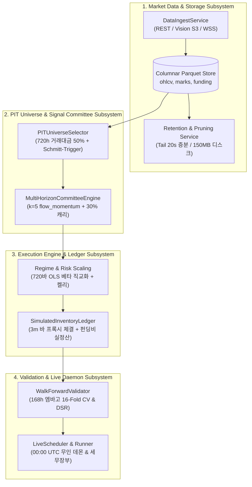

# Subsystem Component Architecture

본 문서는 `crypto-pilot` 시스템을 구성하는 핵심 컴포넌트별 단일 책임(Single Responsibility), 입출력 규격 및 Fail-Closed 불변식을 4대 핵심 서브시스템 단위로 정의합니다.

---

## 1. Subsystem Topology & Layer Interactions

---

## 2. Market Data & Storage Subsystem

| 컴포넌트 | 핵심 책임 | 핵심 인터페이스 (Input / Output) | 장애 방어 및 불변식 (Fail-Closed) |
| :--- | :--- | :--- | :--- |
| **`MarketDataService`** | • Binance REST/S3/WSS 다중 소스로부터 시세 수집 • 디스크 tail 기반 증분 갱신 (20초 소요) | **In**: 거래소 API 응답, Vision S3 아카이브 **Out**: zstd 압축 컬럼형 Parquet 파일 | • **RAM 예산 가드**: 메모리 사용률 85% 초과 시 즉시 작업 중단 • **결손 심볼 자동 격리**: `SOURCE_GAP_EXCLUDED_SYMBOLS` 사전 필터링 |
| **`RetentionService`** | • 무손실 원자적 슬라이딩 윈도우 프루닝 • 저사양 클라우드 디스크 용량 150MB 유지 | **In**: 로컬 Parquet 스토리지 **Out**: Prune 완료 파일, `RefreshReport` | • **원자적 치환 (`tmp.replace`)**: 파일 파손 방지 • **220일 보존 한도**: 초과 시세 안전 절단 |

---

## 3. PIT Universe & Signal Committee Subsystem

| 컴포넌트 | 핵심 책임 | 핵심 인터페이스 (Input / Output) | 장애 방어 및 불변식 (Fail-Closed) |
| :--- | :--- | :--- | :--- |
| **`PITUniverseSelector`** | • 3단계 Causal 거래대금 필터링 • Schmitt-Trigger 히스테리시스 적용 | **In**: 1시간봉 거래대금 시계열, 상장 이력 **Out**: `(timestamp, symbol)` 실행 마스크 | • **Look-Ahead 차단**: 과거 720h 거래대금 중앙값만 참조 • **경계선 진동 억제**: 60위 진입 / 120위 방출로 턴오버 30% 절감 |
| **`MultiHorizonCommittee`** | • $k=5$ `flow_momentum` 위원회 + 30% 캐리 슬리브 • Causal Lag-1 자기상관 적응형 평활 | **In**: 종가, 테이커 매수대금, 펀딩비 패널 **Out**: 정규화 목표 가중치 행렬 | • **Lag-1 적응형 평활**: 휩소 음수 시 3행 평활, 추세 양수 시 Raw 신호 집행 • **직교 신호 결합**: 단일 모멘텀 의존도 탈피 |

---

## 4. Execution Engine & Ledger Subsystem

| 컴포넌트 | 핵심 책임 | 핵심 인터페이스 (Input / Output) | 장애 방어 및 불변식 (Fail-Closed) |
| :--- | :--- | :--- | :--- |
| **`Regime & Risk Scaling`** | • 시장 베타 직교화 및 BTC 급락 크래시 틸트 • 전략 21일 실현 변동성 타겟팅 켈리 사이징 | **In**: 위원회 목표 가중치, BTC 시세 **Out**: 리스크 조정 최종 주문 비중 | • **자본 불변식 가드**: 시장 충격 국면에서 자본 보존 강제 • **20% 추적오차 필터**: 미세 리밸런싱 억제 |
| **`SimulatedInventoryLedger`** | • 3분봉 단위 즉시 테이커 체결 프록시 • 8시간 펀딩비 실정산, MTM 평가, 3-tier 수수료 | **In**: 3분봉 타임스탬프, 목표 비중, 시세 **Out**: 체결 내역, 일별 NAV, 포지션 원장 | • **순차 회계 순서 강제**: MTM 평가 $\to$ 펀딩비 정산 $\to$ 테이커 체결 • **수익률 착시 0%**: 가상 비중 곱셈 배제 |

---

## 5. Validation Engine & Live Daemon Subsystem

| 컴포넌트 | 핵심 책임 | 핵심 인터페이스 (Input / Output) | 장애 방어 및 불변식 (Fail-Closed) |
| :--- | :--- | :--- | :--- |
| **`WalkForwardValidator`** | • 168시간(1주) 엠바고 16-Fold Walk-Forward CV • Deflated Sharpe Ratio(DSR) 다중 검정 보정 | **In**: 백테스트 결과 패널, 96회 탐색 경로 **Out**: OOS 성과 통계 및 DSR 리포트 | • **시계열 자기상관 누출 방지**: 16개 OOS 구간 사이 168h 엠바고 강제 • **과적합 통계적 입증**: DSR 검정 통과 시만 배포 |
| **`LiveScheduler & Runner`** | • 매시간 `00:00 UTC` 무인 데몬 자동 기동 • 파라미터 봉인 검증, 세무 장부(`live_tax_ledger`) | **In**: 봉인 파일, 증분 시세, 잔고 **Out**: 실전/섀도 발주, 상태 영속화 | • **SHA-256 봉인 검증**: 불일치 시 기동 즉시 거부 • **제로 트러스트**: Tailscale 사설망 VPN 및 SOPS 암호화 |
