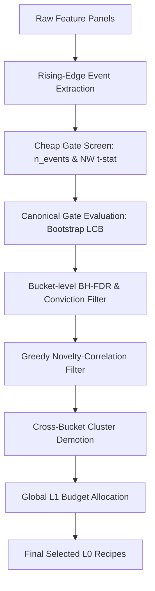

# 1. Purpose
후보 알파 시그널의 대규모 생성, 1차 저비용 스크리닝(Cheap Gate) 및 2차 Canonical Gate 검증, 다양성 선택(Diversity Selection), 그리고 Multi-Timeframe L0 Gate 퓨전을 통해 최종적으로 L1 검증에 전달할 고품질 Alpha Recipes를 필터링한다.

# 2. Core Logic & Math

### Low-Cost Screening (Cheap Gate)
- **Sparse Event Counts (n_events)**: 연속 보유바 중복 계산을 방지하기 위해 sparse entry mask (flat -> active 또는 direct 부호반전 Rising Edge)의 개수로 산출. effective_n = n_events.
- **Barrier-Aware Return Evaluation**: mean_gross_bps/mean_net_bps는 고정 호라이즌 mark-to-close가 아닌 L1의 Triple-Barrier 커널(compute_triple_barrier_returns)을 재사용해 산출한다. 이벤트는 `candidate_panels_to_events()`로 변환된 뒤 원본 sparse `event_mask`와 `(entry_idx-1, symbol)` 기준으로 정합 필터링되며, 정합되지 않은 `event_mask` 셀은 dense 배열에 NaN으로 남는다. 성능 최적화 및 OOM 방지를 위해, `candidate_panels_to_events()` 호출 전에 상류의 `event_mask`를 `panel.metadata["l0_event_mask_2d"]`에 임시 주입하여 필요한 이벤트들만 NumPy 레벨에서 필터링하여 DataFrame을 빌드하고 호출 즉시 제거(`pop`)한다. `compute_xs_spread_lcb_bps`/`compute_rank_ic_with_tstat`는 이 NaN을 반드시 finite 마스킹 후 집계해야 하며, 그렇지 않으면 `AlphaGateEvidence.xs_spread_lcb_bps` 유효성 검증에서 예외가 발생한다.

### Cost Array Usability Guard
- **Validity Check**: Cost status is resolved via _is_usable_cost_array() (verifying np.any(np.isfinite(...))). 
- **Fallback Policy**: If invalid, the system falls back to flat taker round-trip cost models.

### Canonical Gate & Priority Score
- **Soft Flagging**: 
  - L0SoftFlag.weak_rank_ic: |rank_ic| < 1 / sqrt(n_events - 3) (sample-size adaptive threshold)
  - Applies a decay multiplier (e.g., weak_rank_ic_multiplier = 0.70) to l1_priority_score without hard rejection.

### Diversity & Budget Selection
1. **BH-FDR Correction**: Step-up FDR correction applied to NW_tstat two-sided p-values to eliminate insignificant candidates.
2. **Greedy Diverse Selection**: 
  * Sorts bucket ((family, timeframe)) candidates by block_lcb_bps descending.
  * Filters out candidates exceeding mutual correlation threshold (max_novelty_corr).
3. **Cross-Bucket Diversity**: Hierarchical clustering applied across selected bucket representatives to demote cross-TF duplicates.
4. **Global L1 Budget Allocation**: Simulated slots are distributed across buckets using Largest-Remainder method based on maximum bucket block_lcb_bps.

### Cross-Timeframe Diversity Audit & Pruning Admission
- **Canonical Grid Projection**: `resolve_cross_tf_canonical_context()` auto-resolves the canonical TF as the finest TF among selected candidates. Signals are aligned onto this grid via causal forward-fill (`project_signal_to_canonical_grid()`, returns `float32`-precision projected scores — sufficient for correlation/jaccard threshold comparisons, not compounding return math), offset by causal_lag_bars to prevent look-ahead bias. Panel samples outside the canonical grid's own calendar span are clipped, not raised: pre-start samples causally forward-fill into later canonical bars (`np.searchsorted` clamps to index 0), post-end samples contribute nothing. Insufficient real overlap across TFs (independent of any single TF's fineness) is guarded separately by `resolve_cross_tf_canonical_context()`'s `min_common_active_bars` check, which raises if the intersection of all selected panels' active bars falls short.
- **Shared Computation** (`resolve_cross_tf_shared_context()`): When both `enable_cross_tf_diversity_audit` and `enable_cross_tf_pruning` are active, `assemble_l0_strategy_delivery_manifest()` builds one `CrossTFSharedContext` (canonical context + per-recipe projection cache + per-recipe side/entry cache + upper-triangle-mirrored correlation matrix + per-recipe entry_pos/neg flat arrays for batch jaccard) and injects it into both `audit_l0_selected_recipe_independence()` and `compute_cross_tf_redundancy()` via `precomputed_shared_context`. `compute_cross_tf_pair_evidence()` similarly accepts precomputed per-recipe projections/side-entries/correlation to avoid re-deriving them per pair. Guarded by `resolve_effective_memory_budget()`/`admit_memory_stage()` before the cache is built; exceeding budget raises (fail-open).
- **Independence Metrics** (read-only, `enable_cross_tf_diversity_audit`): Post-gate selection outputs `n_distinct_thesis_ids` (thesis id count) and `n_independent_clusters` (unique clusters via correlation hierarchical clustering).
- **Pruning Admission** (`enable_cross_tf_pruning`): `assemble_l0_strategy_delivery_manifest()` runs after `run_alpha_foundry_l0_gate_multi_tf()` completes, computing `compute_cross_tf_redundancy()` + `apply_cross_tf_survival_floor()`. `compute_cross_tf_redundancy()` uses batch matmul jaccard (entry_pos/neg flat arrays → `@` product) and dict-lookup leader greedy when precomputed_shared_context is available, falling back to per-pair jaccard + list-scan for backward compatibility. Per-archetype and per-TF minimum-survivor guarantee via `cross_tf_pruning_min_survivors_per_archetype`/`cross_tf_pruning_min_survivors_per_tf`. Fails open on ValueError.

### Phase-3 Cross-TF Parallel Execution (`l0_parallel_max_workers`)
- `run_alpha_foundry_l0_gate_multi_tf()`'s Phase 3 (per-TF canonical gate) runs sequentially by default (`parallel_max_workers=1`). When `parallel_max_workers>1`, `_run_phase3_parallel()` uses a fork-context `ProcessPoolExecutor` with a prefork copy-on-write cache (`_L0_TF_INPUT_CACHE`, module-level, primed via `_prime_l0_tf_input_cache()` before pool creation) — workers pass only a `tf: str` key through `submit()`, never the large `AlignedMarketData`/panel arrays, avoiding per-task pickling.
- Bootstrap resampling seeds from `config.bootstrap_seed` per call (not global RNG state), so sequential and parallel execution produce value-identical results regardless of worker/order.
- Bounded to `1 <= l0_parallel_max_workers <= 4` (half of an 8-core reference machine) — deliberately excludes L1's per-TF nested walk-forward loop, which already saturates cores via its own internal `ProcessPoolExecutor` pools; cross-TF parallelism there would oversubscribe, not speed up.

### LTF Streaming I/O Parallel Execution (`l0_ltf_exec_1m_max_workers`)
- `build_ltf_native_alpha_panels_streaming()` in `src/domain/futures/signals/ltf_alpha.py` runs symbol-level 1m parquet loading in serial by default (`max_workers=1`). When `max_workers>=2` (opt-in via `L0_LTF_EXEC_1M_MAX_WORKERS=2`), uses `ThreadPoolExecutor` with `_process_streaming_symbol()` — safe because pyarrow parquet I/O releases the GIL, and per-symbol native panel construction (`_build_native_panel`) does not hold Python-level locks across worker boundaries.
- Bounded to `1 <= max_workers <= 2` by `resolve_ltf_exec_1m_plan()` in `src/domain/futures/alpha_foundry/memory.py` (clamped at cap 2). Higher values would oversubscribe the I/O channel without throughput benefit.
- `resolve_1m_coverage_tier()` in `src/domain/futures/alpha_foundry/entry_timing.py` similarly parallelizes its `run_historical_sync` per-symbol coverage scan via `ThreadPoolExecutor(max(1, min(8, len(universe_symbols))))` — pure I/O bound, no thread contention.
- **Config gate**: `L0_LTF_EXEC_1M_MAX_WORKERS` env var in `config.py` → `l0_ltf_exec_1m_max_workers` injected via `build_l0_runtime_config()` as `L0_LTF_EXEC_1M_MAX_WORKERS` in the runtime config dict.

### Phase-1/Phase-3 Cheap-Gate Deduplication
- Phase 1 (per-TF `evaluate_alpha_cheap_gate_batch()`, sequential, builds `evidence_by_tf` for cross-TF corroboration fusion) and Phase 3 (per-TF canonical gate, via `run_alpha_foundry_l0_pipeline`) previously called `evaluate_alpha_cheap_gate_batch()` twice per TF with byte-identical inputs (`bound_panels`/`recipes`/`aligned`/`cost_model`/`cheap_gate_config`). Phase 1 now stashes its raw `tuple[CheapGateEvidence, ...]` per TF and passes it into Phase 3 via `precomputed_cheap_evidences` (threaded through `run_alpha_foundry_l0_gate_multi_tf` → `run_alpha_foundry_l0_gate` → `run_alpha_foundry_l0_pipeline`, all additive/`None`-default keyword-only parameters), which skips its own recomputation when provided.
- `build_cheap_gate_evidence_frame_from_evidences(cheap_evidences, recipes)` extracts the DataFrame-projection logic from `build_cheap_gate_evidence_frame()` (now a thin wrapper) so Phase 1 can build `evidence_by_tf` without discarding the raw evidences it already computed.
- Correspondence is by `recipe_id`, not list order (downstream matches evidences to panels via `ev.recipe_id`).

### Phase-3 Canonical Gate Early-Exit
- L0 Cheap Gate(Phase 1) 평가에서 이미 기각(`gate_passed == False`)이 확정된 후보 레시피들은 Canonical Gate(Phase 3)의 무거운 평가 과정(Bootstrap LCB, Triple Barrier return, Capacity score 등)을 전면 스킵하고 즉시 `_empty_gate_evidence`를 반환하도록 조기 탈락(Early-Exit) 처리하여 L0 연산 성능을 단축한다.
- `evaluate_alpha_gate_batch` 시그니처에 `cheap_evidences` 인자가 추가되어, `pipeline.py` 호출부로부터 결과를 매핑받아 스킵 조건(gate_passed)을 판정한다. `cheap_evidences`가 제공되지 않는 경우(`None`)에는 기존의 전체 평가 동작으로 자동 폴백된다.

### Phase-3 Cheap→Canonical Gate Cache (Pipeline Optimization O-1)
- `evaluate_panel_cheap_gate()` populates 3 optional dicts on `CheapGateEvidence` when present (None by default):
  - `cheap_event_arrays`: `{"event_mask": <2D bool array>}` — the event mask used by cheap gate, reused by canonical gate's `_fwd_ret_dense` and `compute_payoff_stats`/`_compute_bootstrap_lcb` without recomputing `candidate_panels_to_events()`.
  - `cheap_block_stats`: `{"gross_block_means": <1D array>}` — pre-computed per-event gross return means for turnover/LCB projections.
  - `cheap_meta_stats`: `{"rank_ic": <float>}` — pre-computed rank IC (superseded at runtime by NaN-safe `compute_rank_ic_with_tstat()` which ignores non-finite values).
- `evaluate_panel_gate()` accepts these via `cheap_event_arrays/cheap_block_stats/cheap_meta_stats` params. When provided (i.e., cache hit), it skips 6 redundant computations: triple-barrier return evaluation, `_compute_panel_block_means`, bootstrap LCB, rank IC, cost drag ratio, and turnover — all already computed in the cheap gate.
- `_compute_rank_ic()` (cheap gate) does not filter non-finite inputs, so its `rank_ic` can be NaN; the cache path therefore uses `compute_rank_ic_with_tstat()` instead of the cached `rank_ic` value.
- `evaluate_alpha_gate_batch()` provides these cache dicts matching by `recipe_id` from the cheap-evidence tuple, ensuring O(1) per-recipe cache lookup.

### Symbol Index Map (Pipeline Optimization O-2)
- Each `evaluate_panel_gate()` call builds a `_symbol_map: dict[str, int] = {s: i for i, s in enumerate(aligned.symbols)}` once at entry.
- Replaces 4 call sites that used `aligned.symbols.index(sym)` (O(S) linear scan) with `_symbol_map.get(sym, -1)` (O(1) dict lookup) for entry_idx/symbol resolution in `_fwd_ret_dense` construction and block means mapping.
- Validated by catch-all clause: `_idx = _symbol_map.get(_sym, -1); assert _idx != -1` catches untracked symbols.

### ATR Precompute (Pipeline Optimization O-3)
- `evaluate_alpha_cheap_gate_batch()` and `evaluate_alpha_gate_batch()` accept a `precomputed_atr_2d: NDArray[np.float64] | None` parameter.
- When None (default), both compute `_compute_yang_zhang_vol_2d(aligned)` internally (backward-compatible).
- The orchestrator computes ATR once and passes it to both batch functions, avoiding a duplicate `Yang-Zhang vol` computation (typically the cost is one `np.percentile` pass + one full OHLC scan, ~2-4ms per panel batch but done per TF, so total ~2-4s saved across 6 TFs).

### Non-Native Timeframe Synthesis (Virtual Probe)
- **Cadence Rules**: Synthesizes 2h/6h/8h/12h bars from nearest native timeframe (1h/4h) using left-closed, left-labeled resampling.
- **Completeness Rule**: Final bin acceptance requires bin_count >= target_hours / source_hours.

### L0 Runtime Contract
- L0/L1 phases require an active `AlphaFoundryRuntimeConfig.mode == "gate"`; diagnostic/off mode is invalid for production handoff.
- Multi-timeframe gate execution is single-process by default (`parallel_max_workers=1`) to bound memory and avoid cross-TF worker oversubscription.

# 3. Principal Data Structures

- `AlphaRecipe`: recipe_id, family, variant, timeframe, archetype, indicator_params, side_rule_id, exit_policy_id.
- `L0SearchCell`: blueprint_id, family, variant, timeframe, expected_event_rate, status, retire_reason.
- `AlphaGateEvidence`: n_events, effective_n, mean_net_bps, gross_lcb_bps, net_lcb_bps, nw_tstat, rank_ic, rank_ic_tstat, cost_drag_ratio, turnover_per_year, gate_passed, handoff_tier, selected_for_l1, reject_reasons.
- `CheapGateEvidence`: recipe_id, timeframe, symbol_scope, n_events, effective_n, mean_net_bps, nw_tstat, block_lcb_bps, rank_ic, cost_drag_ratio, turnover_per_year, **cheap_event_arrays** (optional dict, populated by cheap gate for phase-3 cache), **cheap_block_stats** (optional dict), **cheap_meta_stats** (optional dict).
- `MultiTimeframeEvidence`: family, variant, native_timeframe, corroboration_tier, fused_conviction_score.
- `L0IndependenceAudit`: n_selected_total, n_distinct_thesis_ids, n_independent_clusters, cluster_members, demoted_recipe_ids, demoted_reason_by_id, canonical_tf, max_corr_threshold.
- `L0StrategyDeliveryManifest`: run_id_prefix, reports_by_tf (dict[str, AlphaFoundryBridgeReport]), independence_audit (L0IndependenceAudit | None), final_selected_recipe_ids, total_l1_verification_budget.
- `assemble_l0_strategy_delivery_manifest(multi_results, aligned_by_tf, canonical_tf, run_id_prefix, enable_audit, enable_pruning, total_l1_verification_budget, max_novelty_corr, min_survivors_per_archetype, min_survivors_per_tf) -> tuple[dict[str, AlphaFoundryL0Result], L0StrategyDeliveryManifest]`: pure function, `src/domain/futures/alpha_foundry/bridge_helpers.py`.
- `apply_cross_tf_survival_floor(cross_tf_result, candidate_by_recipe_id, min_survivors_per_archetype, min_survivors_per_tf) -> CrossBucketDiversityResult`: pure function, `src/domain/futures/alpha_foundry/diversity.py`.

# 4. Architecture Flow

# 5. Core Gate Parameters

| Parameter | Default | Purpose |
|---|---|---|
| `min_events` | 30 | Minimum events for statistical significance |
| `min_nw_tstat` | 1.96 | Minimum Newey-West t-stat for L0 cheap gate |
| `max_cost_drag_ratio` | 0.60 | Maximum drag ratio representing transaction cost limits |
| `max_novelty_corr` | 0.70 | Maximum correlation allowed within the same bucket |
| `fdr_alpha` | 0.10 | FDR alpha level for Benjamini-Hochberg correction |
| `enable_cross_tf_diversity_audit` | False | Toggle for post-gate Cross-TF independence audit (read-only) |
| `cross_tf_diversity_canonical_tf` | "1h" | Target canonical grid TF for audit projection |
| `enable_cross_tf_pruning` | True (opt-out via `L0_CROSS_TF_PRUNING=0`) | Toggle for enforcing cross-TF redundancy pruning before L1 handoff |
| `cross_tf_pruning_min_survivors_per_archetype` | 1 | Minimum surviving candidates per archetype after cross-TF pruning |
| `cross_tf_pruning_min_survivors_per_tf` | 1 | Minimum surviving candidates per timeframe after cross-TF pruning |
| `l0_parallel_max_workers` | 1 | Phase-3 cross-TF gate concurrency; 1=sequential, 2-4=fork-based parallel |
| `enable_tf_probe_scoped` | True | Capability to skip the scoped TF-probe diagnostic stage (decision deferred, see `docs/results/result.md`) |
| `DEFAULT_L1_TFS` | `("2h","4h","6h","8h","12h","1d")` | L1-evaluated timeframe portfolio (`src/domain/futures/strategy/config.py`); native granularities are `1m/1h/4h/1d` only, 2h/6h/8h/12h are synthetic resamples |
| `RETIRED_FAMILIES` | 14 families (frozenset, `src/domain/futures/strategy/family_lifecycle.py`) | Whole-family exclusion applied at both recipe-catalog construction (`build_alpha_recipe_catalog`) and TF signal-pool resolution (`resolve_tf_signal_pool`) — distinct from `FAMILY_TF_RETIREMENT` (per-(family,tf) retirement) |
