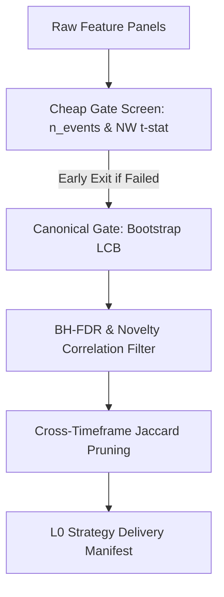

# 1. System Boundary
- **In-Scope**:
  - High-throughput alpha recipe generation and low-cost event screening (Cheap Gate).
  - Bootstrap LCB-based Canonical Gate validation.
  - Diversity selection, Benjamini-Hochberg FDR filtering, and cross-bucket correlation thresholding.
  - Cross-Timeframe diversity audit and Jaccard redundancy pruning.
- **Out-of-Scope**:
  - Out-of-Sample validation and parameter optimization (managed in Layer 1/2).

# 2. Mathematical Formalism & Constraints

### Low-Cost Screening (Cheap Gate)
- Sparse entry event count constraint:
$$N_{\text{events}} \ge \text{min\_events}$$
- Newey-West t-statistic threshold:
$$t_{\text{NW}} \ge \text{min\_nw\_tstat}$$

### Canonical Gate Soft Flagging Decay
$$L1_{\text{priority\_score}} \leftarrow L1_{\text{priority\_score}} \times \text{decay\_multiplier}$$
- Applies if: $|\text{Rank IC}| < \frac{1}{\sqrt{N_{\text{events}} - 3}} \quad (\text{Sample-size adaptive threshold})$

### Diversity & Budget Sizing
1. BH-FDR step-up filtering on NW t-stat two-sided p-values to prune insignificant candidates.
2. Greedy Novelty Filtering: Sort by $LCB_{\text{net}}$ descending, drop recipe $j$ if:
$$\rho_{ij} > \text{max\_novelty\_corr}$$
3. Global budget allocation across buckets using Largest-Remainder method based on max bucket $LCB_{\text{net}}$.

### Cross-Timeframe Alignment & Jaccard Pruning
- Forward lag projection to prevent look-ahead bias:
$$t_{\text{canonical}} = t_{\text{native}} + \text{causal\_lag\_bars}$$
- Jaccard similarity threshold filtering:
$$\text{Jaccard}(A, B) = \frac{|A \cap B|}{|A \cup B|} > \text{max\_jaccard\_threshold} \implies \text{Prune redundancy}$$

# 3. Strict I/O Contract

### Interface Data Structures
| Struct / Field | Type | Data Type | Description |
| :--- | :--- | :--- | :--- |
| **AlphaRecipe** | Model | `struct` | Input definition catalog of an alpha candidate |
| **AlphaGateEvidence** | Model | `struct` | Complete statistics evaluated by Canonical Gate |
| ├─ `n_events` / `effective_n` | Member | `int` | Sample event count statistics |
| ├─ `net_lcb_bps` | Member | `float` | Net bootstrap Lower Confidence Bound |
| ├─ `nw_tstat` | Member | `float` | Newey-West t-stat for returns significance |
| ├─ `gate_passed` | Member | `bool` | True if recipe passes all L0 gates |
| **CheapGateEvidence** | Model | `struct` | Lightweight statistics evaluated by Cheap Gate |
| **L0StrategyDeliveryManifest**| Manifest | `struct` | Hand-off data packaging selected recipes for L1 |

# 4. Topology & Dynamic Flow

# 5. Configurable Parameters

| Parameter | Default | Purpose |
| :--- | :--- | :--- |
| `min_events` | 30 | Minimum required events to ensure statistical sample size |
| `min_nw_tstat` | 1.96 | T-statistic significance threshold (≈ 95% confidence) |
| `max_cost_drag_ratio` | 0.60 | Maximum drag ratio representing transaction cost limits |
| `max_novelty_corr` | 0.70 | Maximum correlation allowed within the same bucket |
| `enable_cross_tf_pruning` | True | Enforces cross-TF redundancy pruning before L1 handoff |
| `cross_tf_pruning_min_survivors_per_tf` | 1 | Minimum surviving candidates per timeframe |
| `l0_parallel_max_workers` | 1 | Workers worker budget for Phase 3 parallel forks |
