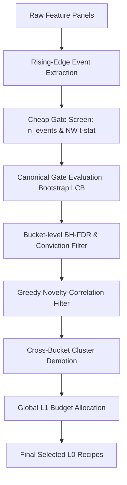

# 1. Purpose
후보 알파 시그널의 대규모 생성, 1차 저비용 스크리닝(Cheap Gate) 및 2차 Canonical Gate 검증, 다양성 선택(Diversity Selection), 그리고 Multi-Timeframe L0 Gate 퓨전을 통해 최종적으로 L1 검증에 전달할 고품질 Alpha Recipes를 필터링한다.

# 2. Core Logic & Math

### Low-Cost Screening (Cheap Gate)
- **Sparse Event Counts (n_events)**: 연속 보유바 중복 계산을 방지하기 위해 sparse entry mask (flat -> active 또는 direct 부호반전 Rising Edge)의 개수로 산출. effective_n = n_events.
- **Barrier-Aware Return Evaluation**: mean_gross_bps/mean_net_bps는 고정 호라이즌 mark-to-close가 아닌 L1의 Triple-Barrier 커널(compute_triple_barrier_returns)을 재사용해 산출한다. 이벤트는 candidate_panels_to_events()로 변환된 뒤 원본 sparse event_mask와 (entry_idx-1, symbol) 기준으로 정합 필터링되며, 정합되지 않은 event_mask 셀은 dense 배열에 NaN으로 남는다. compute_xs_spread_lcb_bps/compute_rank_ic_with_tstat는 이 NaN을 반드시 finite 마스킹 후 집계해야 하며, 그렇지 않으면 AlphaGateEvidence.xs_spread_lcb_bps 유효성 검증에서 예외가 발생한다.

### Cost Array Usability Guard
- **Validity Check**: Cost status is resolved via _is_usable_cost_array() (verifying np.any(np.isfinite(...))). 
- **Fallback Policy**: If invalid, the system falls back to flat taker round-trip cost models.

### Canonical Gate & Priority Score
- **Soft Flagging**: 
  - L0SoftFlag.weak_rank_ic: |rank_ic| < 1 / sqrt(n_events - 3) (sample-size adaptive threshold)
  - Applies a decay multiplier (e.g., weak_rank_ic_multiplier = 0.70) to l1_priority_score without hard rejection.

### Diversity & Budget Selection
1. **BH-FDR Correction**: Step-up FDR correction applied to NW_tstat two-sided p-values to eliminate insignificant candidates.
2. **Greedy Diverse Selection**: 
  * Sorts bucket ((family, timeframe)) candidates by block_lcb_bps descending.
  * Filters out candidates exceeding mutual correlation threshold (max_novelty_corr).
3. **Cross-Bucket Diversity**: Hierarchical clustering applied across selected bucket representatives to demote cross-TF duplicates.
4. **Global L1 Budget Allocation**: Simulated slots are distributed across buckets using Largest-Remainder method based on maximum bucket block_lcb_bps.

### Cross-Timeframe Diversity Audit & Pruning Admission
- **Canonical Grid Projection**: Align signals via causal forward-fill onto base timeframe grids, offset by causal_lag_bars to prevent look-ahead bias. `compute_cross_tf_redundancy()` requires the canonical TF to be at least as fine as every TF present in the pruning input set (raises if not — coarse-to-fine downsampling is not supported by the forward-fill projection); `audit_l0_selected_recipe_independence()` (read-only) has no such requirement.
- **Independence Metrics** (read-only, `enable_cross_tf_diversity_audit`): Post-gate selection outputs `n_distinct_thesis_ids` (thesis id count) and `n_independent_clusters` (unique clusters via correlation hierarchical clustering).
- **Pruning Admission** (`enable_cross_tf_pruning`): `assemble_l0_strategy_delivery_manifest()` runs after `run_alpha_foundry_l0_gate_multi_tf()` completes, computing `compute_cross_tf_redundancy()` + `apply_cross_tf_survival_floor()` (per-archetype and per-TF minimum-survivor guarantee, `cross_tf_pruning_min_survivors_per_archetype`/`cross_tf_pruning_min_survivors_per_tf`) to narrow the per-TF `panels_for_l1`/`candidates_for_l1` sets before they reach L1. Fails open: any `ValueError` from the redundancy computation falls back to the unpruned set.

### Non-Native Timeframe Synthesis (Virtual Probe)
- **Cadence Rules**: Synthesizes 2h/6h/8h/12h bars from nearest native timeframe (1h/4h) using left-closed, left-labeled resampling.
- **Completeness Rule**: Final bin acceptance requires bin_count >= target_hours / source_hours.

# 3. Principal Data Structures

- `AlphaRecipe`: recipe_id, family, variant, timeframe, archetype, indicator_params, side_rule_id, exit_policy_id.
- `L0SearchCell`: blueprint_id, family, variant, timeframe, expected_event_rate, status, retire_reason.
- `AlphaGateEvidence`: n_events, effective_n, mean_net_bps, gross_lcb_bps, net_lcb_bps, nw_tstat, rank_ic, rank_ic_tstat, cost_drag_ratio, turnover_per_year, gate_passed, handoff_tier, selected_for_l1, reject_reasons.
- `MultiTimeframeEvidence`: family, variant, native_timeframe, corroboration_tier, fused_conviction_score.
- `L0IndependenceAudit`: n_selected_total, n_distinct_thesis_ids, n_independent_clusters, cluster_members, demoted_recipe_ids, demoted_reason_by_id, canonical_tf, max_corr_threshold.
- `L0StrategyDeliveryManifest`: run_id_prefix, reports_by_tf (dict[str, AlphaFoundryBridgeReport]), independence_audit (L0IndependenceAudit | None), final_selected_recipe_ids, total_l1_verification_budget.
- `assemble_l0_strategy_delivery_manifest(multi_results, aligned_by_tf, canonical_tf, run_id_prefix, enable_audit, enable_pruning, total_l1_verification_budget, max_novelty_corr, min_survivors_per_archetype, min_survivors_per_tf) -> tuple[dict[str, AlphaFoundryL0Result], L0StrategyDeliveryManifest]`: pure function, `src/domain/futures/alpha_foundry/bridge_helpers.py`.
- `apply_cross_tf_survival_floor(cross_tf_result, candidate_by_recipe_id, min_survivors_per_archetype, min_survivors_per_tf) -> CrossBucketDiversityResult`: pure function, `src/domain/futures/alpha_foundry/diversity.py`.

# 4. Architecture Flow

# 5. Core Gate Parameters

| Parameter | Default | Purpose |
|---|---|---|
| `min_events` | 30 | Minimum events for statistical significance |
| `min_nw_tstat` | 1.96 | Minimum Newey-West t-stat for L0 cheap gate |
| `max_cost_drag_ratio` | 0.60 | Maximum drag ratio representing transaction cost limits |
| `max_novelty_corr` | 0.70 | Maximum correlation allowed within the same bucket |
| `fdr_alpha` | 0.10 | FDR alpha level for Benjamini-Hochberg correction |
| `enable_cross_tf_diversity_audit` | False | Toggle for post-gate Cross-TF independence audit (read-only) |
| `cross_tf_diversity_canonical_tf` | "1h" | Target canonical grid TF for audit projection |
| `enable_cross_tf_pruning` | False | Toggle for enforcing cross-TF redundancy pruning before L1 handoff |
| `cross_tf_pruning_min_survivors_per_archetype` | 1 | Minimum surviving candidates per archetype after cross-TF pruning |
| `cross_tf_pruning_min_survivors_per_tf` | 1 | Minimum surviving candidates per timeframe after cross-TF pruning |
