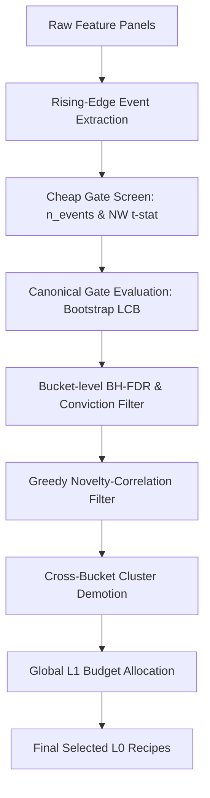

# 1. Purpose
후보 알파 시그널의 대규모 생성, 1차 저비용 스크리닝(Cheap Gate) 및 2차 Canonical Gate 검증, 다양성 선택(Diversity Selection), 그리고 Multi-Timeframe L0 Gate 퓨전을 통해 최종적으로 L1 검증에 전달할 고품질 Alpha Recipes를 필터링한다.

# 2. Core Logic & Math

### Low-Cost Screening (Cheap Gate)
- **Sparse Event Counts ($n_{events}$)**: 연속 보유바 중복 계산을 방지하기 위해 sparse entry mask(flat $\rightarrow$ active 또는 direct 부호반전 Rising Edge)의 개수로 산출. $effective\_n = n_{events}$.
- **Barrier-Aware Return Evaluation**: `mean_gross_bps`/`mean_net_bps`는 고정 호라이즌 mark-to-close가 아닌 L1의 Triple-Barrier 커널(`compute_triple_barrier_returns`)을 재사용해 산출한다. 이벤트는 `candidate_panels_to_events()`로 변환된 뒤 원본 sparse `event_mask`와 `(entry_idx-1, symbol)` 기준으로 정합 필터링되며, 정합되지 않은 `event_mask` 셀(예: 계열 종료 부근 호라이즌 초과로 라벨링 불가한 이벤트)은 dense 배열에 NaN으로 남는다. `compute_xs_spread_lcb_bps`/`compute_rank_ic_with_tstat`는 이 NaN을 반드시 finite 마스킹 후 집계해야 하며(`compute_regime_stability`와 동일 관례), 그렇지 않으면 `AlphaGateEvidence.xs_spread_lcb_bps` 유효성 검증에서 크래시한다.
- **Block-variance adjusted Newey-West $t$-stat**:
  - $NW_{tstat} = \frac{\mu_{block}}{SE_{block}}$
  - $block\_bars\_eff = \max(config.block\_bars, 2 \times holding\_bars)$ (블록 크기를 보유기간에 비동적으로 연동)
- **Bootstrap Significance (Informational only)**: block-mean 복원추출을 통한 `bootstrap_lcb_bps` 및 `bootstrap_agree` 산출.

### Canonical Gate & Priority Score
- **Soft Flagging**: 
  - $L0SoftFlag.weak\_rank\_ic$ : $|rank\_ic| < 1/\sqrt{n_{events} - 3}$ (표본크기 적응형 임계치)
  - soft flag 검출 시 `l1_priority_score`에 감쇠 승수(예: `weak_rank_ic_multiplier` = 0.70)를 적용하여 랭킹 페널티를 부과하되, 하드 리젝트는 하지 않음.

### Diversity & Budget Selection
1. **BH-FDR Correction**: 버킷 내 후보들의 $NW_{tstat}$ 기반 양측 p-value에 Benjamini-Hochberg step-up 절차를 적용하여 유의하지 않은 후보 조기 배제.
2. **Greedy Diverse Selection**: 
  * 버킷(`(family, timeframe)`) 내 `block_lcb_bps` 내림차순 정렬.
  * 상위 $K$개 후보에 대해 상호 상관계수($\rho \le max\_novelty\_corr$) 필터링을 적용해 최종 버킷 selected recipe 확정.
3. **Cross-Bucket Diversity**: 버킷별 selected 합집합에 대해 계층적 클러스터링을 적용하여 교차 중복을 제거하고 최종 L1 후보군을 확정.
4. **Global L1 Budget Allocation**: 버킷 대표 품질(selected 중 최대 `block_lcb_bps`)에 비례하여 L1 시뮬레이션 슬롯을 Largest-Remainder 방식으로 배분.

### Cross-Timeframe Fusion
- **패널-레시피 바인딩 선행**: 각 TF의 패널은 `_bind_panels_to_recipe_ids()`로 `recipe_id`가 부여된 뒤에만 `build_cheap_gate_evidence_frame()`에 전달된다. 이 바인딩 없이는 해당 TF의 evidence 프레임이 0행이 되어 이후 퓨전 입력에서 제외된다.
- **Timeframe 정규화**: `(family, variant, timeframe)` 키를 매칭하여 동일 variant의 타 Timeframe 성과 비교.
- **Corroboration Tier**:
  - `corroborated`: 타 TF 성과와 부호가 일치하며 강한 예측력을 보임. 컨빅션 스코어 15% 부스트 적용.
  - `contradicted`: 타 TF 성과와 부호가 불일치함. 컨빅션 스코어를 음수화하여 사실상 거부 처리.
  - `single_tf_strict` / `insufficient_coverage`: 매칭되는 타 TF 커버리지가 1개 이하이거나 전무한 경우.

# 3. Principal Data Structures

- `AlphaRecipe`: `recipe_id`, `family`, `variant`, `timeframe`, `archetype`, `indicator_params`, `side_rule_id`, `exit_policy_id`.
- `L0SearchCell`: `blueprint_id`, `family`, `variant`, `timeframe`, `expected_event_rate`, `status`, `retire_reason`.
- `AlphaGateEvidence`: `n_events`, `effective_n`, `mean_net_bps`, `gross_lcb_bps`, `net_lcb_bps`, `nw_tstat`, `rank_ic`, `rank_ic_tstat`, `cost_drag_ratio`, `turnover_per_year`, `gate_passed`, `handoff_tier`, `selected_for_l1`, `reject_reasons`.
- `MultiTimeframeEvidence`: `family`, `variant`, `native_timeframe`, `corroboration_tier`, `fused_conviction_score`.

# 4. Architecture Flow

# 5. Core Gate Parameters

| Parameter | Default | Purpose |
|---|---|---|
| `min_events` | 30 | 유효 검정을 위한 최소 이벤트 개수 |
| `min_nw_tstat` | 1.96 | Cheap Gate 통과용 최소 Newey-West t-통계량 |
| `max_cost_drag_ratio` | 0.60 | 기대 거래비용 대비 순수익의 임계 한계선 |
| `max_novelty_corr` | 0.70 | 동일 버킷 내 후보군 간 허용 최대 상관계수 |
| `fdr_alpha` | 0.10 | Benjamini-Hochberg FDR 유의성 수준 |
| `enable_discovery_unit_handoff` | False | 외부 조건부 Discovery Unit 이관 활성화 여부 |
