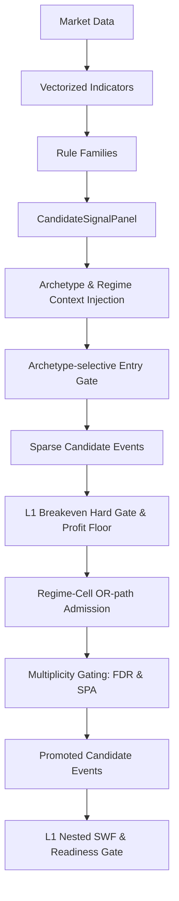

# 1. Purpose
Generates vectorized rule panels with archetype/regime contexts and filters them through an L1 breakeven hard gate to produce sparse candidate events. Handles Layer 1 prequential evidence snapshots and walk-forward readiness gating.

# 2. Core Logic & Math

**Signal Vectorization & Sparsity**
- $S_{t} = f(\text{Market Data}_{1..t})$ (Dense conviction score)
- $E_{t} = 1 \text{ if } (S_{t} \neq 0 \land S_{t-1} == 0) \text{ else } 0$ (Sparse entry trigger, side hint)
- Strict Causality: No forward-looking data $t+k$ is used in evaluating $S_{t}$ or $E_{t}$.

**Archetype-Selective Regime Gating**
- $A_{\text{reversion}}$ (Mean Reversion) entries are blocked ($E_{t} \rightarrow 0$) in regimes specified by `mean_rev_blocked_regimes`.
- Can be disabled globally via `regime_signal_gating_enabled=False`, shifting regime risk to the sizing multiplier layer.

**L1 Breakeven Hard Gate (Hurdle)**
- For a variant to be promoted, its OOS mean edge after hurdle must be positive and significant.
- $\text{Edge}_{i} = \text{Gross Return}_{i} - \text{Execution Costs}_{i}$
- Condition: $\frac{1}{N} \sum (\text{Edge}_{i}) > 0 \land t_{\text{stat}}(\text{Edge}) \geq \text{min\_rule\_ir\_t}$
- Controlled by `standalone_breakeven_hard_gate_enabled`. Evaluated strictly within archetype-allowed regimes.

**Profit Floor Gate (Hard Economic Floor)**
- A separate, unconditional cost-based minimum profitability check (`min_variant_oos_profit_bps`).
- $\text{pass\_profit\_floor} = \mu_{\text{OOS}} \geq \text{min\_variant\_oos\_profit\_bps}$
- **Cannot be bypassed** by regime-cell admission; it enforces an absolute economic floor before capital allocation.

**Multiplicity Control (BH-FDR & SPA Gates)**
- Controls the inflation of false discoveries under pool expansion:
  1. **BH-FDR (Benjamini-Hochberg FDR Control):** 
     - Sorts OOS p-values $p_{(1)} \le p_{(2)} \le \dots \le p_{(m)}$ and finds the largest $k$ satisfying: $p_{(k)} \le \frac{k}{m} \alpha_{\text{FDR}}$.
     - Variants satisfying this condition are admitted.
     - Controlled by `fdr_gate_enabled` and `fdr_alpha` (default: 0.10).
  2. **SPA (Hansen's Single Predictive Ability):**
     - Runs a stationary circular block bootstrap on the OOS edge time-series of the top-performing candidate strategy.
     - Rejects $H_0: E[\text{Edge}_{\text{best}}] \le 0$ at a family level. If SPA p-value $> p_{\text{max}, \text{SPA}}$, **all promotions are blocked (fail-closed)**.
     - Controlled by `spa_gate_enabled`, `spa_p_value_max` (default: 0.10), and `spa_n_bootstrap` (default: 2000).

**Regime-Cell Conditional Admission (OR-path)**
- Promotes a variant diluted by the global-pooled gates if it holds a strong edge in a specific regime cell $g$ (supplies orthogonal diversifiers to the B0 ensemble).
- Replaces flat obs/t-stat thresholds with a unified Bayesian criterion: $P(\mu > \delta | \text{data}) \ge \text{min\_admission\_posterior\_prob}$ under a Normal-Normal conjugate model.
- $\delta$ = `min_regime_cell_edge_bps`.
- Newey-West corrected variance $\Omega_{\text{nw}}$ is utilized if `admission_use_newey_west` is true.
- $\tau^2$ (prior variance) is estimated from cross-cell heterogeneity; shrinkage $k_0 = \Omega_{\text{nw}}/\tau^2$ is data-derived (James-Stein EB).
- `min_regime_cell_oos_obs` serves as a NW variance stability floor (default 10).
- Final promote $= \text{global\_AND\_gates} \lor (\text{admission\_enabled} \land \text{cell\_admitted})$. **Safety gates (`min_obs`, `q10_fail`, `event_density`, `profit_floor`) stay mandatory in both paths.**

**Empirical-Bayes Ensemble Shrinkage (James-Stein)**
- Cell-mean $\hat{\mu}_a$ per archetype $a$ is shrunk toward the grand mean $\bar{\mu}$ via:
  - $k_{\text{eff}} = \frac{\bar{\sigma}^2_{\text{within}}}{\text{between\_var}}$, clamped to $[0, k_{\max}]$
  - $\tilde{\mu}_a = \frac{n_a \hat{\mu}_a + k_{\text{eff}} \bar{\mu}}{n_a + k_{\text{eff}}}$
- Controlled by: `ensemble_adaptive_shrinkage` (default: True), `ensemble_shrinkage_k_max` (default: 50.0), `ensemble_freq_n_cap` (default: 200).

**Variant-Edge Hierarchical Prior**
- Restores within-cell variant discrimination: variants in the same (archetype × regime) cell receive shrunk scores relative to their anchor $a_v$ (mode-cell mean of the variant).
- Controlled by: `ensemble_variant_prior_enabled`, `ensemble_variant_shrinkage_k`, `ensemble_variant_min_obs`, `ensemble_variant_prior_families`.

# 3. Architecture Flow

# 4. Core Variables & I/O

| Type | Variable | Description |
|------|----------|-------------|
| **Input** | `AlignedMarketData` | Vectorized pricing and volume data matrices |
| **Param** | `standalone_breakeven_hard_gate_enabled` | Enforces L1 profitability gate before allocation. Default: `True` |
| **Param** | `mean_rev_gating_enabled` | Blocks mean-reversion entries in volatile/crash regimes. Default: `True` |
| **Param** | `min_rule_ir_t` | Minimum t-statistic for standalone breakeven gate. Default: `1.0` |
| **Param** | `min_variant_oos_profit_bps` | Hard economic floor for profit gate (non-bypassable). Default: `0.0` |
| **Param** | `regime_cell_admission_enabled` | Enables the Bayesian posterior regime-cell OR-path. Default: `True` |
| **Param** | `min_admission_posterior_prob` | $P(\mu > \delta \mid \text{data})$ threshold for admission. Default: `0.70` |
| **Param** | `min_regime_cell_edge_bps` | Minimum profitable edge $\delta$ (breakeven proxy). Default: `8.0` |
| **Param** | `fdr_gate_enabled` | Enables BH-FDR control gate. Default: `False` |
| **Param** | `fdr_alpha` | Target False Discovery Rate threshold. Default: `0.10` |
| **Param** | `spa_gate_enabled` | Enables SPA circular-block bootstrap gate. Default: `False` |
| **Param** | `spa_p_value_max` | Maximum p-value allowed to pass the SPA gate. Default: `0.10` |
| **Param** | `ensemble_adaptive_shrinkage` | Enables EB James-Stein shrinkage for archetype cell means. Default: `True` |
| **Param** | `ensemble_variant_prior_enabled` | Enables variant-level JS shrinkage. Default: `True` |
| **Param** | `l1_evidence_grid_multiplier` | Evidence fold count = `outer_n × multiplier` (effective min 3). Prevents early-fold starvation. Default: `3` |
| **Param** | `l1_evidence_max_folds` | Upper bound on evidence fold count. Default: `32` |
| **Param** | `l1_outer_warmup_blocks` | Warm-up blocks reserved before first outer OOS. `block_len = available // (n_folds + warmup)`. Default: `2` (ensures ≥2 evidence blocks before fold 0, satisfying `l1_pair_min_folds=2`) |
| **Param** | `l1_opp_ic_mode` | Mode for L1 Opportunity IC: `"time_series"` (default) or `"cross_section"` |
| **Output**| `CandidateSignalPanel` | Dense 2D structure containing `signed_score`, `side_hint`, and `valid_mask` |
| **Output**| `ValidatedSignalBatch` | Tabulated representation of validated entry signals with OOS statistics |

# 5. Edge Cases & Handling
- **Divergent Trend & Reversion Overlap:** Handled gracefully since rule panels are grouped by archetype; if both trigger simultaneously, they produce distinct sparse events evaluated independently by downstream allocators.
- **Cell-Admission Multiple Comparisons:** Per-cell selection over OOS amplifies data-snooping vs. global gates. The Bayesian posterior gate uses James-Stein cross-cell shrinkage (estimating $\tau^2$) and Newey-West variance to counteract overfitting.
- **Multiplicity Gating Fail-Closed:** Under extremely sparse event environments or low expectancy, the SPA bootstrap automatically fails (fail-closed), preventing overfitting noise candidates from leaking into Layer 2.

# 6. Data Integrity & Optimization (Robust Validation Guard)
- **Data Integrity Verification (`verify_data_integrity`):** Executed in the `bridge` layer before rule signals are composed. Applies strict multi-point sanity checks per symbol:
  - *Data Length Check (`too_short`):* History length below `min_length` (e.g., 100 bars).
  - *Missing Values Check (`excessive_nan`):* Blocks the symbol if any NaN values exist ($> 0.0\%$).
  - *Invalid Values Check (`invalid_values`):* Detects zero or negative prices/volume exceeding a specific threshold (`zero_neg_pct > 1.0%`).
  - *Stuck Price Check (`stuck_price`):* Flags frozen prices where the standard deviation of the close series is near-zero ($\sigma_{\text{close}} < 10^{-8}$).
  - *High-Low Violation Check (`hi_lo_violation`):* Flags any instances where high price is strictly lower than low price ($High < Low$).
- **Performance Optimizations:**
  - *Vectorized Percentile (`_compute_score_pct_variant_hist`):* Replaced $O(N^2)$ python masking filters with a vectorized $O(N \log N)$ `np.searchsorted` causal boundary search.
  - *Confluence Counts (`n_same`):* Optimized Pandas `groupby().transform("size")` with index alignment series.
  - *Ensemble Feature Bypass (`skip_features`):* If `skip_features=True` is provided to `build_candidate_dataset`, high-cost rolling feature computations (robust Z-scores, dispersion, btc market state, etc.) are bypassed. Since `ensemble_b0` only maps event metadata to target returns, this cuts feature building overhead down to zero.
  - *Global Fold Memoization Cache (`_L1_SWF_FOLD_CACHE`):* Caches `WFFold` training outputs in `pipeline.py` based on split configurations and references. In nested Optuna studies, this bypasses process pool execution for identical trials.
  - *Subprocess Thread Ceiling:* Clamps child process threads (`OMP_NUM_THREADS=1`) to eliminate inter-process core throttling under resource-capped WSL environments.

# 7. Layer1 Nested SWF & Readiness Gate

**Prequential Evidence Snapshot SWF**
- **Structure**: Split history into anchored evidence folds once via `build_l1_prequential_evidence_snapshots`, then build `Layer1EvidenceSnapshot(as_of_idx, evidence, registry, matured_event_count)`.
- `run_l1_nested_swf` selects the precomputed snapshot at `outer_oos_start_k` rather than retraining a fresh inner fold tree per outer fold, dramatically optimizing computational load.
- **Invariants**: Causal ordering is preserved by snapshot cutoff; `matured_event_count` strictly counts events with `exit_idx < as_of_idx`.
- **Evidence Grid Separation (Anti-Starvation)**: The evidence fold count is decoupled from the outer fold count via `l1_evidence_grid_multiplier` (default 3). `ev_n_folds = min(outer_n × multiplier, l1_evidence_max_folds)`. This ensures that each outer fold's `as_of_idx` snapshot has at least `l1_pair_min_folds` matured evidence blocks before it, preventing structural qualification starvation in early outer folds. Multiplier effective minimum is 3 regardless of config value.
- **Outer Warm-Up Block Reservation (Cold-Start Defense)**: `l1_outer_warmup_blocks` (default 2) reserves evidence blocks before the first outer OOS fold. `block_len = available // (n_folds + warmup)`. Fold 0 OOS starts at `l1_start + warmup × block_len`, guaranteeing ≥ `warmup` evidence blocks satisfy `l1_pair_min_folds=2` qualification. OOS total coverage shrinks by `n/(n+warmup)` (≈17% for warmup=2, n=4) — net positive since fold 0 becomes evaluable. Look-ahead preserved: evidence still filtered by `exit_idx < as_of_idx`.

**Qualification Key & OOS Activation (Regime Decoupling)**
- **D2 Override Enforce**: In Layer 1 training/validation (`run_l1_nested_swf` and `fit_layer1_inference_artifact`), `ensemble_conditioning="archetype_only"` and `ensemble_score_calibration_enabled=False` are explicitly injected. This completely disables regime $\mu$ conditioning and linear score calibration, enforcing a pooled (Arch-Only) mode.
- `l1_qualify_by_regime=False` (default): evidence grouping key = `(symbol, strategy_id)` — all regime cells are pooled to `"all"`. This restores statistical power ($n_{\text{eff}}$, $t$-stat) by eliminating sample fragmentation.
- `l1_activation_match_regime=False` (default): OOS activation filter is relaxed to `(symbol, strategy_id)`.
- Regime is demoted to a **risk overlay** (sizing/exposure scaling) in Layer 2+, rather than a qualification dimension.

**Hard Gate Evaluation & Adaptive Thresholds**
- `evaluate_layer1_readiness` applies strict readiness checks over outer fold reports. Requirements include:
  - `fold_cov >= l1_min_fold_cov` (default 0.80)
  - `match_ratio >= l1_min_realized_match_ratio` (default 0.90, relaxed from 1.00)
  - `sym_count`: Measured via HHI-based `effective_sym_metric >= l1_min_effective_sym_n` (default 3.0, replacing legacy absolute symbol count check when `l1_sym_count_mode="effective_n"`)
    $$N_{\text{eff}} = \frac{1}{\sum_{i} p_i^2} \ge 3.0$$
  - `fold_ratio >= l1_min_fold_ratio` (default 0.50, relaxed from 0.60)
  - `probe_lcb_bps > l1_min_probe_bps` (default 0.0). **Core profitability metric** (IC deprecated): Calculated as a single **Pooled Bootstrap LCB** over all passed folds' combined OOS trade series, eliminating the double-counting statistical penalty of averaging fold-level LCBs. Bootstrap uses stationary circular block method with configurable block_bars and n_bootstrap for time-series dependency handling.
- **Fold-Level Gate (Gross Edge Check)**: Fold-level readiness check enforces gross edge positive check (`probe_bps > l1_min_fold_probe_bps`, default 0.0). This is a preliminary screen; the global pooled gate (`probe_lcb_bps`) provides the definitive statistical significance test.
- **Adaptive Student's t-Threshold**: When computing evidence, a small-sample adapted one-sided $t$-threshold is applied based on $N_{\text{eff}}$:
  $$t_{\text{crit}} = F^{-1}_{t(df)}\left(1 - \alpha\right)$$
  ($df = N_{\text{eff}} - 1.0$; if $df < 2.0$, $t_{\text{crit}} = \infty$ enforcing an automatic filter).
- **MDES Gate**: Checks that mean incremental effect size surpasses the Minimum Detectable Effect Size scaled by `l1_pair_mdes_multiplier`.
- **Failure Handling**: Any single gate check failure triggers `gate_passed = False`, resulting in no final inference artifact passing to Layer 2.
