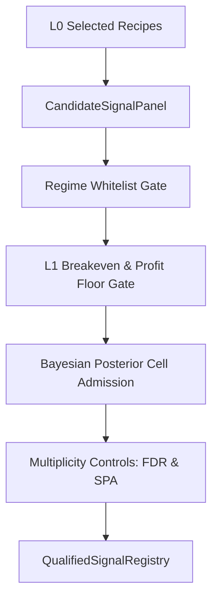

# 1. System Boundary
- **In-Scope**:
  - Gating sequence evaluation for L0 candidates in a Walk-forward Validation framework.
  - Multiplicity control (BH-FDR & Single Predictive Ability test) for alpha signals.
  - Dynamic Bayesian cell admission and shrinkage estimation.
  - Management of the `QualifiedSignalRegistry` lifecycle.
- **Out-of-Scope**:
  - Raw event extraction and candidate recipe construction (managed in Layer 0).
  - Portfolio weight optimization and execution sizing (managed in Layer 2/3).

# 2. Mathematical Formalism & Constraints

### Signal Gating & Sparse Triggering
$$E_t = \begin{cases} 1 & \text{if } S_t \ne 0 \land S_{t-1} = 0 \\ 0 & \text{otherwise} \end{cases}$$

### Empirical-Bayes James-Stein Shrinkage
$$\hat{x}_a = w_{\text{prior}} \cdot \bar{x}_a + (1 - w_{\text{prior}}) \cdot \mu_{\text{prior}}$$
$$w_{\text{prior}} = \frac{n_{\text{eff}}}{n_{\text{eff}} + n_{\text{prior}}}$$

### Multiplicity Control (Benjamini-Hochberg FDR)
$$P_{(i)} \le \frac{i}{m} \cdot q_{\text{FDR}}$$
- Rejects hypotheses for all $i \le k$ where $k = \max \left\{ i : P_{(i)} \le \frac{i}{m} \cdot q_{\text{FDR}} \right\}$.

### L1 Readiness Gate (Pooled LCB)
$$\text{LCB}_{\text{net}} > \max(\text{l1\_min\_probe\_bps}, \text{l1\_breakeven\_floor\_bps})$$
- Calculated using moving-block bootstrap where block size is:
$$B_{\text{size}} = \max(\text{l1\_bootstrap\_block\_bars}, 2 \cdot \text{max\_holding\_bars})$$

# 3. Strict I/O Contract

### Interface Data Structures
| Struct / Field | Type | Data Type | Description |
| :--- | :--- | :--- | :--- |
| **CandidateSignalPanel** | Model | `struct` | Input vector containing scores, sides, and config |
| ├─ `signed_score_2d` | Member | `NDArray[float64]` | Alpha signal scores |
| ├─ `side_hint_2d` | Member | `NDArray[int8]` | Intended trading direction hints |
| ├─ `allowed_regimes` | Member | `tuple[str]` | Regime whitelist constraints |
| **SymbolStrategyEvidence**| Model | `struct` | Statistical diagnostics computed per-strategy |
| ├─ `mean_gross_bps` | Member | `float` | Average gross edge return |
| ├─ `mean_incremental_bps` | Member | `float` | Incremental return above benchmark |
| ├─ `block_tstat_incremental`| Member | `float` | Moving-block bootstrap t-stat |
| ├─ `q_value` | Member | `float` | FDR-corrected p-value |
| ├─ `hard_eligible` | Member | `bool` | True if all structural gates passed |
| **QualifiedSignalRegistry**| Registry | `dict` | Output registry of active deployment-ready signals |

# 4. Topology & Dynamic Flow

# 5. Configurable Parameters

| Parameter | Default | Purpose |
| :--- | :--- | :--- |
| `l1_pair_fdr_alpha` | 0.10 | Target false discovery rate threshold for BH-FDR correction |
| `l1_min_effective_sym_n` | 3.0 | Minimum effective sample size $N_{\text{eff}}$ required for structural pass |
| `min_rule_ir_t` | 1.96 | Minimum t-stat hurdle for L1 breakeven |
| `min_variant_oos_profit_bps` | 5.0 | Hard minimum OOS net profit rate limit |
| `l1_structural_gate_only` | True | Controls if registry requires structural-only or full (advisory) pass |
