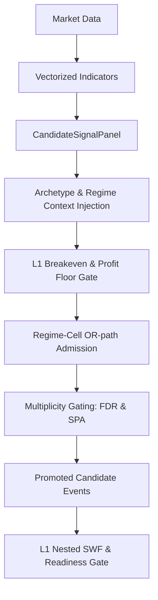

# 1. Purpose
Generates vectorized rule panels with archetype/regime contexts, filtered through L1 breakeven hard gates and multiplicity controls to produce sparse candidate events. Manages prequential evidence snapshots for walk-forward validation.

# 2. Core Logic & Math

**Signal Generation & Gating Sequence**
1. **Vectorization**: $S_{t} = f(\text{Data}_{1..t})$. Sparse triggers: $E_{t} = 1 \text{ if } (S_{t} \neq 0 \land S_{t-1} == 0) \text{ else } 0$. Strictly causal.
2. **Regime Gating**: Reversion signals blocked in specified high-risk regimes.
3. **L1 Breakeven Hard Gate**: $\frac{1}{N} \sum (\text{Edge}_{i}) > 0 \land t_{\text{stat}} \geq \text{min\_rule\_ir\_t}$.
4. **Profit Floor**: Unconditional cost-based minimum: $\mu_{\text{OOS}} \geq \text{min\_variant\_oos\_profit\_bps}$.
5. **Regime-Cell Admission (OR-path)**: Rescues signals with strong orthogonal edge in specific regimes via Bayesian posterior: $P(\mu > \delta | \text{data}) \ge p_{\text{admit\_min}}$. Uses Newey-West variance and cross-cell $\tau^2$ shrinkage.
6. **Multiplicity Controls**:
   - **BH-FDR**: Limits false discoveries across pool expansion.
   - **SPA**: Hansen's Single Predictive Ability (fail-closed circular bootstrap).

**Ensemble Shrinkage**
- Empirical-Bayes James-Stein shrinkage applies to both archetype cell means ($\hat{\mu}_a \to \bar{\mu}$) and variant-level priors.
- `predict_regime_conditional_ensemble` output: `validation_rank_ic` (diagnostic only, 0.0 default) in `validation_diagnostics`. IC is NOT a gate input; `mu_quality_shrinkage` feature is removed (was dead: validation_rank_ic=0.0 → lam=0 → mu collapse).

# 3. Architecture Flow

# 4. SWF & System Integrity

**Layer 1 Nested SWF**
- **Prequential Snapshots**: Evidence grids use decoupled multipliers and outer warm-up blocks to prevent early-fold starvation.
- **OOS Activation**: Enforces pooled Arch-Only mode during L1 to preserve statistical power ($N_{eff}$); regime is delegated to L2 risk overlays.
- **Readiness Gate**: Strict multi-condition screening:
  - Fold Coverage $\ge 0.80$, Match Ratio $\ge 0.90$, Effective Symbols ($N_{eff}$) $\ge 3.0$, Fold Ratio $\ge 0.50$.
  - **Pooled LCB**: Global profitability metric ($LCB > 0$) via stationary block bootstrap over all passed folds.
- **Right-Censoring Diagnostic**: `dropped_by_maturity_count` tracks events filtered by `exit_idx >= oos_end` per fold. Exposed in Outer Fold log as `[censored: N]` to distinguish genuine edge weakness from boundary truncation (especially last fold).

**Promotion Summary & L2 Gate**
- **Actual L2 gate**: `build_qualified_signal_registry` — admits evidence where `hard_eligible AND quality_weight > 0`, with `>= l1_min_signals_per_symbol` per symbol.
- **STATUS labels** (`[L2-PASS] Q:hi/mid/lo`) reflect q-value quality tier only; all admitted rows are L2-bound regardless of tier.
- **FAIL summary**: `[NOT PROMOTED] N pairs | top: <reason>xN` appears when `all_evidence` is provided, listing structural exclusion reasons for non-admitted pairs.

**PIT Universe Integration**
- `state_cube` (`UniverseStateCube [T, N]`) injected into `align_data_maps` → `AlignedMarketData.active_mask [T, N]`.
- Tiered entry scope is derived in two stages: `full_strategy_maps` is first reduced to a data-availability `base_scope`, then strict sub-window admission is applied before tiered execution begins. Empty strict admission is fail-closed.
- `active_mask` used as `SymbolLifecycleRecord` source: `first eligible bar per column = promotion_available_at`.
- **Promotion gate**: symbols with `promotion_available_at > l2_start` excluded from L2 `oos_stacked` before gate evaluation.
- `readiness_cube` (`StrategyReadinessCube`) computed after alignment via `evaluate_strategy_readiness`; injected via `dataclasses.replace(aligned, strategy_readiness_mask=...)`.

**Capacity Clip (awf_sim)**
- Per-bar capacity from `adv_usdt_2d [T, N]`: `intended_notional < 5 USDT → w = 0`; `> capacity → proportional clip`.
- Active only when `portfolio_nav` is provided (unit-NAV simulation skips the clip: weights are fractions, not USDT notional).

# 5. Data Integrity & Optimizations

- **Guards**: NaN/stuck-price blocks, length minimums, high-low violation checks.
- **Data Load Parallelization**: Utilizes `ThreadPoolExecutor` instead of multiprocessing to eliminate heavy pickle serialization and IPC overhead during parallel DataFrame loads.
- **Fast Datetime Bypass**: Skips redundant `pd.to_datetime` calls in `_resolve_tradeable_scope` if the input column is already in `datetime64` dtype, resolving datetime parsing bottlenecks to O(1).
- **NumPy-Backed Meta Alignment**: Meta columns are pre-converted to numeric at the ingestion stage. Within the `align_data_maps` loop, valid values are retrieved using fast NumPy masking on sliced views instead of Pandas Series creation, guaranteeing 100% data fidelity with zero look-ahead bias and optimized latency.
- **ALIGN-CUBE Loop-Invariant Hoisting**: `np.searchsorted` over `state_cube.calendar` (and `readiness_cube.calendar`) is computed once outside the symbol loop. `positions`/`t_valid`/`p_valid` are symbol-independent; complexity reduced from $O(N \cdot T \log T_{\text{cube}})$ to $O(T \log T_{\text{cube}} + N \cdot V)$ (V = valid bars). Pandas 3.0 nanosecond fix: `calendar.as_unit("ns").asi8` enforces `int64` nanosecond epoch instead of microsecond default.
- **Membership Timeline Hoisting**: `_normalize_timeline()` normalizes `timeline` / `inference_timeline` once before the symbol loop in `inject_membership_masks_into_maps`, eliminating 104× repeated quarter-start and `canonical_symbol` calls (52 syms × 2 maps).
- **Vectorized Volatility**: `volatility_2d [T, N]` computed via single `pd.DataFrame.rolling().std(ddof=1)` call over the full matrix, replacing a column-wise Python loop of N `pd.Series` allocations.
- **Algorithmic Optimizations**: Numba JIT bootstrap, $O(N \log N)$ vectorized percentiles, parent-process feature priming, Numba-JIT accelerated rolling/cross-sectional robust z-score loops to bypass pandas rolling overhead, and unified OMP-clamped multiprocessing pools.
