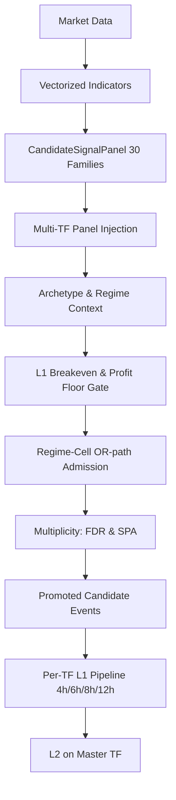

# 1. Purpose
벡터화된 Rule Panels에 시장 Regime Context를 결합하고, L1 Breakeven Hard Gate 및 Multiplicity Control을 적용하여 유효한 Candidate Events를 생성한다. 4개의 Timeframe(4h/6h/8h/12h)에 걸쳐 Walk-forward Validation을 지원하는 Prequential Evidence Snapshots를 관리한다.

# 2. Core Logic & Math

### Signal Gating Sequence
1. **Vectorization**:
   - $S_{t} = f(\text{Data}_{1..t})$
   - Sparse Trigger: $E_{t} = 1 \text{ if } (S_{t} \neq 0 \land S_{t-1} == 0) \text{ else } 0$ (Causal)
2. **Regime Gating**:
   - `mean_rev` Archetype: `("bull_quiet", "bear_quiet", "transition")` 허용
   - `beta_neut` Archetype: `("bull_quiet",)` 허용
3. **L1 Breakeven Hard Gate**:
   - $\frac{1}{N} \sum (\text{Edge}_{i}) > 0 \land t_{\text{stat}} \geq \text{min\_rule\_ir\_t}$
4. **Profit Floor**:
   - $\mu_{\text{OOS}} \geq \text{min\_variant\_oos\_profit\_bps}$
5. **Regime-Cell Admission**:
   - Bayesian Posterior: $P(\mu > \delta | \text{data}) \ge p_{\text{admit\_min}}$
   - Newey-West variance와 cross-cell $\tau^2$ shrinkage 적용.
6. **Multiplicity Controls**:
   - **BH-FDR**: $q \le \text{l1\_pair\_fdr\_alpha}~(0.10)$
   - **SPA (Single Predictive Ability)**: Fail-closed circular bootstrap 검정.

### Ensemble Shrinkage
- Archetype cell mean과 variant-level prior에 대해 Empirical-Bayes James-Stein shrinkage 적용.
- Bayesian Prior: $\hat{x}_a = w_{prior} \cdot \bar{x}_a + (1 - w_{prior}) \cdot \mu_{prior}$
- $w_{prior} = n_{eff} / (n_{eff} + n_{prior})$

### Cross-Sectional Alpha Families (xs_alpha archetype)
- 4대 Family: `xs_momentum`, `xs_carry`, `xs_flow`, `xs_oi_skew`
- Per-bar rank score 변환을 통한 beta-neutral 구성 (Regime Gating 면제).
- `xs_momentum`: Rolling beta residual return (L=12/48)
- `xs_carry`: Funding rate z-score 역수 (`-funding_z_96/168`)
- `xs_flow`: Order flow imbalance z-score (`flow_z_24`)
- `xs_oi_skew`: Open Interest 빌드업과 LSR 스큐 결합 (`-(oi_build_z_42 * sign(lsr_log_z_42))`)

### Signal Family Registry [ADR_20260706_L0_SIGNAL_FAMILY_DIVERSITY]
- `ALL_SIGNAL_FAMILIES` (`signals/rules.py`, `strategy/rule_signals.py`, 두 모듈 각자 동일 값 유지): 36개 rule family 모듈 상수(2026-07 `sparse_breakout_retest_liquidity`/`funding_flow_exhaustion_sparse`/`oi_lsr_unwind`/`vol_contraction_breakout`/`xs_residual_rebalance`/`carry_net_of_funding` 6종 추가). 두 모듈은 family 연산 로직을 병행 유지하므로 값 동기화가 계약이며, `filter_rule_signal_panels()`가 참조하는 `CandidateStrategyConfig.candidate_families` allowlist도 동시 갱신 필수(누락 시 family가 생성만 되고 즉시 필터링됨).
- `CandidateStrategyConfig.candidate_families`: native TF 빌드 시 `filter_rule_signal_panels()`가 적용하는 전역 allowlist(36종 전량 포함).
- `resolve_tf_signal_pool(cfg, tf)` / `_DEFAULT_PER_TF_FAMILIES`: 파생 패널 전용 family allowlist. `build_native_htf_panels()`가 `family_pool`로 직접 주입 — native TF의 `candidate_families`와는 별개 축. `DEFAULT_L1_TFS = ("4h","6h","8h","12h","1h","2h")`(`strategy/config.py`, `CandidateStrategyConfig.l1_tfs` 기본값) [ADR_20260708_LTF_NATIVE_DIRECTIONAL_SEARCH] — 1h/2h는 base(4h)보다 빠른 TF이며 `_project_panel_to_base_grid()`(`strategy_runtime/bridge.py`)가 `hpb_i >= hpb_base`/`hpb_i < hpb_base` 양방향을 이미 대칭 지원해 HTF와 동일 파이프라인으로 배선됨(신규 로직 없음). `_DEFAULT_PER_TF_FAMILIES["1h"]`/`["2h"]`도 함께 확장.
- `build_native_htf_panels()` / `project_htf_panels_to_base()`(`strategy_runtime/bridge.py`): 기존 `build_multi_tf_panels()`를 정렬+네이티브 패널 생성(전자, TF별 독립·`ThreadPoolExecutor` 병렬 가능)과 base-grid projection(후자, `_project_panel_to_base_grid`+`base_guard` 마스킹)으로 분리한 것. `build_multi_tf_panels()`는 둘을 순차 호출하는 thin wrapper로 하위호환 유지.
- `resolve_family_registration_gap(all_families, candidate_families)`: `all_families` 중 `candidate_families`에 없는 항목을 반환하는 순수 함수(orphan 탐지).
- `src/domain/futures/strategy/family_lifecycle.py`: `FAMILY_TF_RETIREMENT`(economic replay 기각 이력의 `(family, tf)` 집합) + `is_family_tf_retired()` — 동일 조합 재검증 방지 가드. `resolve_retired_families_for_tf(tf)`[ADR_20260708_L0_SIGNAL_YIELD_IMPROVEMENT]가 `strategy_runtime/bridge.py`의 `build_alpha_recipe_catalog()`/`bind_panels_to_alpha_recipes()` 4개 호출부(base+HTF × catalog+binding)에서 `exclude_families`로 실제 소비됨 — 이전에는 레지스트리만 존재하고 어디서도 호출되지 않아 은퇴 처리가 무효했음.
- `resolve_family_timeframe_gate_policy(recipe, config)`(`cheap_gate.py`)가 산출하는 family/archetype 인지 이벤트 하한(`min_events`)은 `evaluate_panel_cheap_gate()`/`evaluate_panel_gate()`의 `n_events` 하드 리젝트 체크에서 직접 소비된다[ADR_20260708_L0_SIGNAL_YIELD_IMPROVEMENT] — 우선순위: `config.family_event_floors[family]` > `config.archetype_event_floors[archetype]` > flat `config.min_events`.
- **L0 게이트 스코프 [ADR_20260707_L0_MULTI_TF_GATE_REDESIGN]**: `AlphaFoundryRuntimeConfig.use_all_timeframes_in_l0=True`(기본값)이고 `CandidateStrategyConfig.l1_tfs`에 base TF 외 TF가 있으면, `run_candidate_strategy_for_universe()`가 `build_native_htf_panels()`로 HTF(6h/8h/12h) native panel+aligned를 만들고, TF별로 `build_alpha_recipe_catalog()`/`bind_panels_to_alpha_recipes()`를 거쳐 `run_alpha_foundry_l0_gate_multi_tf()` 1회 호출로 **base TF와 HTF 전부를 동일 L0 경제성 게이트(fan-out cheap-gate → cross-TF fuse → fan-in canonical gate)에 태운다**. 게이트를 통과한 HTF panel만 `project_htf_panels_to_base()`로 base grid에 투영되어 L1로 전달된다. `use_all_timeframes_in_l0=False`이거나 `l1_tfs`가 base TF 하나뿐이면 레거시 단일-TF 경로(`run_alpha_foundry_l0_gate()` 단독 호출 + 무게이트 `build_multi_tf_panels()`)로 폴백한다.
- `_resolve_panel_archetype(panel)` [ADR_20260707_L1_BACKTEST_FIDELITY_FIXES]: `panel.metadata.archetype`가 없을 때 family 문자열로 archetype을 역산하는 fallback. trend 집합 = `{trend_ma, trend_donchian, vol_breakout, trend_pullback_continuation, mtf_trend_pullback, mtf_breakout_retest, vol_term_structure_gate, btc_regime_pullback}`. 미매칭 family는 전부 `mean_rev`로 폴백 — 신규 family 추가 시 이 함수 갱신 필수(누락 시 `exit_policies.build_exit_policies_for_panel()`이 엉뚱한 archetype 버킷의 손절/익절을 적용).
- `evaluate_compound_backtest()`(`candidate_evaluation.py`)/`build_candidate_target_weights()`(`candidate_portfolio.py`)의 연율화(`bars_per_year`)는 `optimization/metrics._bars_per_year_for_tf(tf)` SSOT로 통일(4h/1h/1d 하드코딩 elif 체인 제거, 그 외 TF는 4h로 암묵 폴백하던 결함 해소).

### Alpha Foundry Core [ADR_20260706_ALPHA_FOUNDRY_SYNC][ADR_20260706_ALPHA_FOUNDRY_L0_DIVERSITY][ADR_20260706_ALPHA_FOUNDRY_L0_SIGNAL_RIGOR][ADR_20260707_ALPHA_FOUNDRY_RESULT_SYNC][ADR_20260707_ALPHA_FOUNDRY_CANONICAL_GATE_WIRING][ADR_20260707_L0_MULTI_TF_GATE_REDESIGN]
- `AlphaRecipe`: `recipe_id`, `family`, `variant`, `timeframe`, `archetype`, `indicator_params`, `side_rule_id`, `exit_policy_id`, `required_fields`, `causal_lag_bars`, `max_turnover_per_year`.
- `AlphaSignalBlueprint`: `family`, `variant`, `archetype`, `timeframe`, `required_fields`, `causal_lag_bars`, `lookback_bars`, `holding_bars`, `max_turnover_per_year`, `entry_mode`, `side_rule_id`, `exit_policy_id`.
- `AlphaHypothesis` / `AlphaFeatureBlueprint` / `AlphaSearchPolicyState` (`contracts.py`): cost-aware search space 확장 계약. `CandidateFeatureFamily` / `FeatureDirectionRule` / `SearchRetireReason` type alias와 함께 `search_space.py`의 `build_alpha_hypotheses()` / `build_feature_blueprints()` / `apply_cost_prior_screen()` / `update_search_policy_state()`가 소비.
- `L0SearchCell`: `blueprint_id`, `family`, `variant`, `timeframe`, `tf_minutes`, `symbol_scope`, `cost_floor_bps`, `expected_event_rate`, `family_prior_score`, `status`, `retire_reason`, `feature_family`, `turnover_budget_per_year`, `max_compute_cost_score`, `tested_count`, `survivor_count`, `posterior_pass_rate`, `posterior_edge_bps`.
- `AlphaGateConfig` canonical / `CheapGateConfig` compatibility alias: `min_events`, `min_effective_n`, `min_lcb_net_bps`, `min_nw_tstat`, `max_cost_drag_ratio`, `max_turnover_per_year`, `max_novelty_corr`, `min_incremental_rank_ic`, `block_bars`, `bootstrap_samples`, `bootstrap_seed`, `fdr_alpha`, `archetype_event_floors`, `family_event_floors`, `min_seed_slots_per_archetype`, `min_seed_slots_per_timeframe`, `allow_soft_seed_when_only_soft_failures`, `priority_weights`, `min_candidate_rank_ic_tstat`, `min_xs_symbols_per_bar`, `max_abs_btc_beta`, `high_turnover_per_year`, `liquidity_cost_stress_mult`.
- `AlphaGateEvidence`: `schema_version`, `run_id`, `timeframe`, `family`, `variant`, `recipe_id`, `archetype`, `symbol_scope`, `n_events`, `effective_n`, `mean_gross_bps`, `mean_cost_bps`, `mean_net_bps`, `gross_lcb_bps`, `net_lcb_bps`, `nw_tstat`, `rank_ic`, `rank_ic_tstat`, `cost_drag_ratio`, `turnover_per_year`, `novelty_corr_max`, `incremental_rank_ic`, `compute_cost_score`, `event_hit_rate`, `payoff_skew`, `xs_spread_lcb_bps`, `liquidity_cost_stress_bps`, `bootstrap_lcb_bps`, `bootstrap_agree`, `gate_passed`, `handoff_tier`, `selected_for_l1`, `reject_reasons`, `soft_flags`, `capacity_score`, `regime_stability`, `tf_corroboration`, `entry_mode`. `gross_lcb_bps`는 block-bootstrap 순수 gross(비용 차감 전) LCB — `evaluate_alpha_gate_batch()`(`cheap_gate.py`)에서 실계산된다. `AlphaFoundryEvidenceRow`도 동일 3개 필드(`capacity_score`/`regime_stability`/`tf_corroboration`) + `entry_mode` + `cell_id`/`cell_axes`/`cell_values`/`execution_style`/`fill_probability`/`adverse_selection_bps`/`tested_horizons`/`selected_horizon`/`failure_axis`/`failure_axes`(신규, 기본 빈 문자열/기본값 — 하위호환)를 parquet 스키마에 보유.
- `run_alpha_foundry_l0_pipeline()`(`pipeline.py`)은 `canonical_by_rid`에 canonical `AlphaGateEvidence`가 있으면 `AlphaFoundryEvidenceRow.gross_lcb_bps`에 `canon.gross_lcb_bps`를 배선한다[ADR_20260708_L0_EDGE_FAILURE_ATTRIBUTION] — 이전에는 이 필드가 `0.0`으로 하드코딩돼 있어 `edge_failure.classify_edge_failure_rows()`의 `weak_gross_edge` 축이 실 evidence에서 절대 발동할 수 없었음(실측: 수정 전 100행 중 0건 → 수정 후 28건).
- `AlphaFoundryRuntimeConfig`: `enable_fast_discovery_timeframes` / `fast_discovery_timeframes` switch the discovery grid before native L0 gate execution; `observability_mode`, `debug_top_k_rows`, `debug_reject_bucket_rows`, `artifact_write_enabled`, `gate_schema` control runtime observability and schema validation; `enable_cost_aware_generation`, `exploration_budget_fraction`, `cost_prior_floor_by_tf`, `use_all_timeframes_in_l0` gate the search-space cost-prior screen in `run_alpha_foundry_l0_pipeline()`; `enable_failure_attribution` / `enable_conditional_l0_cells` / `enable_execution_arms` / `enable_horizon_sweep`(모두 기본 `False`) + `conditional_cell: ConditionalCellGateConfig` / `execution_arm: ExecutionArmConfig` / `horizon_sweep_bars`는 아래 Edge Failure Attribution & Conditional Alpha 절 참조 — **현재 `run_alpha_foundry_l0_pipeline()`에서 미소비(standalone 모듈, 배선 없음)**.
- `run_alpha_foundry_l0_pipeline()`: `runtime_config`가 주어지면 (1) blueprint→`L0SearchCell` 생성 후 `apply_cost_prior_screen()`, (2) `evaluate_alpha_cheap_gate_batch()`(1차 저비용 스크리닝) → (3) canonical `evaluate_alpha_gate_batch()`(`capacity_score`/`regime_stability`/`tf_corroboration`/`entry_mode`/3단계 `handoff_tier` 산출, cheap-gate 통과분 재평가) → (4) diversity/budget는 canonical `handoff_tier`(cheap-gate 자체 `discovery_tier` 아님) 기준으로 `selected_for_l1` 결정 → (5) `update_search_policy_state()`로 search cell 상태 갱신 → (6) `observability_mode=="debug_log"`면 `emit_alpha_generation_debug_summary()` 호출. `tf_corroboration`은 `evidence_by_tf`가 주입돼야 `compute_tf_corroboration()`에서 0이 아닌 값을 가지며, `evaluate_alpha_gate_batch()`/`build_l0_signal_candidate()`(`pipeline.py`) 양쪽 다 `tf_fusion_index` 조회 키를 `(family, _strip_tf_suffix(variant, timeframe), timeframe)` 3-tuple로 정규화해야 `index_multi_timeframe_evidence()`의 색인과 일치한다.
- `build_cheap_gate_evidence_frame()`(`bridge_helpers.py`): 단일 TF의 `evaluate_alpha_cheap_gate_batch()` 결과에 `recipes` 매핑으로 `family`/`variant`를 조인해 `fuse_multi_timeframe_evidence()`가 요구하는 스키마(`family`/`variant`/`timeframe`/`recipe_id`/`reject_reasons`/`mean_net_bps`/`block_lcb_bps`)의 DataFrame으로 변환.
- `run_alpha_foundry_l0_gate_multi_tf()`(`bridge_helpers.py`): TF별 `panels_by_tf`/`bindings_by_tf`/`recipes_by_tf`/`aligned_by_tf`를 받아 (1) 전 TF `build_cheap_gate_evidence_frame()`으로 `evidence_by_tf` 조립 → (2) 전 TF `run_alpha_foundry_l0_gate(evidence_by_tf=...)` 호출(내부에서 fuse+canonical) → `dict[tf, AlphaFoundryL0Result]` 반환. `AlphaFoundryL0Result`는 `evidence_rows`(canonical `AlphaFoundryEvidenceRow` 튜플) 필드를 노출한다. `run_candidate_strategy_for_universe()`는 `alpha_foundry_config.mode != "off"`일 때 `exec_1m` payload를 모아 `_build_ltf_native_panels_for_l0()`를 통해 LTF panels를 추가하고, L0 binding 전에 `build_alpha_recipe_catalog()`/`bind_panels_to_alpha_recipes()`에 합친다.
- `bind_panels_to_alpha_recipes()`(`bridge_helpers.py`)는 `feature_family_by_family` 매핑을 optional로 받아 recipe 바인딩에 반영.
- `ltf_alpha.py` (`build_ltf_alpha_feature_grid()` / `build_ltf_native_alpha_panels()` / `project_ltf_panel_to_base_grid()`): 1m cache 또는 runner-supplied `exec_1m`를 5m/15m/30m closed-bar grid로 변환하고, `funding_session_orb_flow` / `liquidity_sweep_reclaim` / `volume_participation_breakout` 3개 sparse LTF family만 rising-edge 패널로 생성해 base grid로 투영한다. `data/futures/{symbol}_1m.parquet`가 runner slice보다 짧으면 local cache로 보강하고, projection은 `np.searchsorted(base_datetimes, tau_end, side="left")`로 release timestamp를 기준으로 한다.
- `BucketKey`: `tuple[str, str]` alias for `(family, timeframe)` — diversity selection grouping key.
- `CorroborationTier`: `Literal["corroborated", "single_tf_strict", "contradicted", "insufficient_coverage"]`.
- `search_space.py`: `timeframe_to_minutes()`, `resolve_alpha_timeframe_grid()`, `build_l0_search_cells()`, `mark_retired_search_cells()` — L0 blueprint grid and retirement state helpers.
- `CheapGateEvidence`: 경제성 지표 전용(`gate_passed`, `reject_reasons`, `n_events`(sparse entry count), `effective_n`, `block_lcb_bps`, `nw_tstat`(block moments 기반), `rank_ic`, `turnover_per_year`, `cost_drag_ratio`, `incremental_rank_ic`, `compute_cost_score`, `novelty_corr_max`, `bootstrap_lcb_bps`, `bootstrap_agree`, `mean_gross_bps`(건당 평균, `total_gross/n_events`), `mean_cost_bps`(건당 평균, `total_cost/n_events`)). `monotonic_bucket_score`/`regime_edges_bps`는 미사용 필드로 제거됨.
- `L0SoftFlag`에 `"weak_rank_ic"` 추가: `_rank_ic_soft_floor(n_events) = 1/√(n_events-3)`보다 `abs(rank_ic)`가 작으면 부여(표본크기 적응형, 고정 임계치 아님). `discovery_tier`의 `blocked` 판정에는 무관하고 `L0PriorityWeights.weak_rank_ic_multiplier`(기본 0.70)로 `l1_priority_score`만 감쇠.
- `evaluate_panel_gate()` is the canonical gate evaluator; `evaluate_panel_gate_v2()` / `downgrade_gate_v2_to_cheap_evidence()` remain legacy compatibility paths until all call sites are migrated.
- `audit_full_family_correlation()`(`diversity.py`): `AlphaFoundryRuntimeConfig.enable_correlation_audit`(기본 `False`) 활성 시에만 native panel 빌드 직후(게이트 이전) 전체 family 상관행렬 + `estimate_effective_test_count()`(entropy 기반 실효 독립개수)를 `{run_id}_family_correlation.parquet`로 기록하는 opt-in 진단 경로.
- `DiversitySelectionResult`: 버킷 단위 산출물(`bucket_key`, `ranked_recipe_ids`, `selected_recipe_ids`, `redundant_recipe_ids`, `redundant_reason_by_id`, `bucket_corr`, `bucket_eff_test_count`). `redundant_reason_by_id` 값은 상관 상대 recipe_id 외에 `"bh_rejected"`/`"below_conviction_floor"` sentinel도 가짐.
- `CrossBucketDiversityResult`: 교차버킷 최종 산출물(`final_selected_recipe_ids`, `demoted_recipe_ids`, `demoted_reason_by_id`, `cross_bucket_corr`, `global_eff_test_count`).
- `MultiTimeframeEvidence`: `family`, `variant`, `native_timeframe`, `native_recipe_id`, `tf_coverage_count`, `sign_agreement_ratio`, `corroboration_tier`, `fused_conviction_score`.
- `AlphaFoundryEvidenceRow`: parquet 영속화 스키마 — family/variant별 `mean_net_bps`/`net_lcb_bps`/`cost_drag_ratio`/`turnover_per_year`/`bootstrap_lcb_bps`/`bootstrap_agree`/`selected_for_l1`/`bucket_eff_test_count`/`global_eff_test_count` 비교 단위.
- `L1VerificationUnit`: fold-bounded verification unit with `prior_mu_bps`, `prior_sigma_bps`, `allocated_fold_budget`, `early_stop_state`.
- `L1PosteriorEvidence`: `posterior_mu_bps`, `posterior_sigma_bps`, `prob_mu_gt_cost`, `lcb_net_bps`, `quality_weight`, `activation_contract`.
- `evaluate_panel_cheap_gate(bars_per_year=...)` / `evaluate_alpha_cheap_gate_batch()` — `bars_per_year`는 `_bars_per_year_for_tf(recipe.timeframe)`(`optimization/metrics.py` SSOT) 주입. `n_events`는 sparse entry mask(flat→active 또는 direct 부호반전, 연속보유 bar 중복계산 방지)로 산출, `effective_n = n_events`. `block_bars_eff = max(config.block_bars, 2*holding_bars)`로 블록 크기를 보유기간에 연동, `nw_tstat = mu_block/se_block`(block moments 통일). `bootstrap_lcb_bps`/`bootstrap_agree`는 block-mean 복원추출(`config.bootstrap_samples`, `config.bootstrap_seed`)로 산출(정보성, 게이트 미반영). 다양성/novelty 계산은 이 단계에서 수행하지 않음(단일 책임).
- `apply_bucket_bh_correction()` — 버킷 내 후보의 `nw_tstat` 기반 양측 p-value에 BH step-up(`config.fdr_alpha`) 적용, 유의하지 않은 후보를 랭킹 전에 배제.
- `select_bucket_diverse_recipes()` — BH 미통과·`min_conviction_lcb_bps` 미달 후보를 우선 배제한 뒤, 버킷(`family`, `timeframe`) 내 `block_lcb_bps` 내림차순 그리디 선택. `top_k_per_family_tf` 예산과 `max_novelty_corr` 상관 임계 동시 적용, 조기종료로 O(top_k·K_b) 상관 비교.
- `resolve_cross_bucket_diversity()` — 버킷별 selected 합집합(S, 상수 상한)에 한해 `compute_panel_correlation_matrix()`/`cluster_correlated_recipes()`로 교차 중복 제거, `estimate_effective_test_count()`로 `global_eff_test_count` 산출.
- `allocate_global_l1_budget()` — 버킷 대표품질(`max(block_lcb_bps)` over selected) 기준 largest-remainder 비례배분, 품질 0인 버킷은 슬롯 0, 버킷별 `top_k_max` 상한(기존 `top_k_per_family_tf` 값 재해석). `top_k_per_family_tf` 고정 캡을 대체.
- `fuse_multi_timeframe_evidence()` (`multi_tf_fusion.py`) — 동일 run epoch의 TF별 evidence DataFrame을 `(family, variant)`(TF 접미사 정규화 후) 기준으로 조인해, 다른 TF와의 부호일치도로 `corroboration_tier` 판정. `contradicted`는 `fused_conviction_score`를 강제 음수화(사실상 거부권), `corroborated`는 15% 컨빅션 부스트.
- `shrink_l1_evidence_hierarchical()` applies family/timeframe shrinkage with `w = n_eff / (n_eff + prior_effective_n)`.

### Edge Failure Attribution & Conditional Alpha [ADR_20260708_L0_EDGE_FAILURE_ATTRIBUTION][ADR_20260709_L0_CONDITIONAL_DIAGNOSTIC_WIRING]
- **Status**: wired into `run_alpha_foundry_l0_pipeline()` as an opt-in, diagnostic-only pass (`l0_diagnostics.run_l0_diagnostic_pass()`) gated by `AlphaFoundryRuntimeConfig.enable_failure_attribution`/`enable_conditional_l0_cells`/`enable_execution_arms` (all default `False`). Diagnostic rows are appended to `evidence_rows` strictly *after* `passed_recipe_ids`/`handoff_decisions`/`stage_counts`/`bucket_results`/`cross_bucket_result` are finalized — the flags cannot change L1/L2 handoff (`[LIMIT-06]`, regression-tested).
- `edge_failure.py`: `classify_edge_failure_rows(evidence, ...)` — pure post-hoc classifier over an `AlphaFoundryEvidenceRow`/`AlphaGateEvidence` DataFrame. Appends `failure_axis`(primary)/`failure_axes`(comma-joined all)/`failure_diagnostic`. Axis precedence: `cost_dominated`(if `cost_drag_ratio > cost_drag_ratio_floor`) → `weak_gross_edge`(if `gross_lcb_bps < min_gross_lcb_bps`) → `statistically_unstable`(`abs(nw_tstat) < weak_tstat_abs`) → `turnover_dominated` → `insufficient_sample`(`effective_n < 20`); no axis fired → `"unknown"`. Real-evidence validation (2026-07-08, 100-row `4h_1783519562_*` run): `cost_dominated`=42, `weak_gross_edge`=28, `statistically_unstable`=23, `unknown`=7(all `gate_passed=True`).
- `conditional_cells.py`: `ConditionalCellSpec`/`ConditionalCellEvidence`/`generate_default_cell_specs()`/`build_conditional_cell_masks()`/`build_calibrated_cell_masks()`(calibration/evaluation chronological split, prevents look-ahead in quantile/liquidity thresholds, `[LIMIT-01]`)/`evaluate_event_mask_gate()`(public, generalized from the former `_evaluate_cell_gate` — takes `round_trip_cost_bps: float` instead of a `cost_model`, shared by conditional-cell and execution-arm evaluation)/`build_parent_event_mask()`/`evaluate_conditional_l0_cells()` — slices a parent panel's events into PIT-only condition cells (`symbol_liquidity`/`symbol_cluster`/`market_regime`/`volatility_regime`/`funding_polarity`/`score_quantile`/`event_hour_utc`/`source_tf`). Parent failure never auto-blocks a passing cell (`[LIMIT-02]`, but see BH-FDR below).
- `execution_arms.py`: `ExecutionCostArm`/`ExecutionArmConfig`/`resolve_execution_cost_arms()`/`estimate_execution_arm_cost_bps()`/`evaluate_recipe_under_arm()` — alternate execution-cost assumptions (`taker_now`/`maker_retest`/`maker_or_cancel`/`hybrid`) with explicit fill-probability and adverse-selection penalties (`[LIMIT-03]`).
- `l0_diagnostics.py`: `L0DiagnosticConfig`(`contracts.py`: `failure_axes_for_cell_search`/`failure_axes_for_arm_search`/`calibration_fraction`/`max_diagnostic_recipes`)/`run_l0_diagnostic_pass()` — orchestrates the above: classifies failure axes, scopes conditional-cell search to `handoff_tier="blocked"` recipes matching the configured failure axes (ranked by `abs(net_lcb_bps)` ascending, capped at `max_diagnostic_recipes`), applies one BH-FDR correction across all cell tests in the run before materializing any cell row (`[LIMIT-02]`), and scopes execution-arm re-costing to `cost_dominated` recipes. Diagnostic rows use `recipe_id = f"{parent}::cell={cell_id}"` / `f"{parent}::arm={style}"` and always `selected_for_l1=False`. `bars_per_year` is resolved per-recipe via `optimization/metrics._bars_per_year_for_tf(recipe.timeframe)` (not hardcoded to 4h).
- **Real-data finding** (2026-07-09, run `4h_1783560242`, 25 syms, 1h/2h/4h/6h/8h/12h): both diagnostic hypotheses disproven — 105 BH-surviving conditional-cell rows (13 blocked recipes) and 112 execution-arm rows (56 blocked recipes) had **zero** `gate_passed=True`; closest near-misses were -13.5bps (cell) and -6.3bps (arm). Confirms the L0 rejection rate reflects genuine absence of gross alpha in the current family/TF set, not a pooled-averaging or worst-case-cost artifact.

### LTF Entry Timing Refinement [ADR_20260707_LTF_ENTRY_TIMING_LAYER]
- **Status**: standalone module, **not wired into `strategy_runtime/bridge.py`** — no production call site yet. `EntryTimingGateConfig.enabled` defaults to `False`.
- **Role**: refines the `entry_idx` of already-gated (`handoff_tier ∈ {seed, candidate}`) HTF directional events by searching a bounded LTF (1m-derived) window for order-flow/mean-reversion confluence. Does not generate new directional signals or touch L2/L3.
- `EntryConfluenceSnapshot` / `HtfDirectionalEpisode` / `EntryTimingWindow` / `EntryTimingGateConfig` (`alpha_foundry/contracts.py`): typed contracts for the per-LTF-bar feature snapshot, the HTF episode link, the per-episode timing-window outcome, and the runtime config (`ltf_grid`, `max_wait_bars_ratio`, `min_net_timing_edge_lcb_bps`, `confluence_weights`, `enabled_combos`).
- `entry_timing.py`: `compute_cvd_delta_z()` (windowed cumulative `safe_taker_imbalance_2d` z-score), `compute_anchored_vwap_dev_sigma()` (episode-anchored VWAP σ-deviation), `evaluate_trend_quality_gate()` (Kaufman ER + `hurst_dfa` + `variance_ratio` majority vote, `optimization/metrics.py` reuse), `refine_entry_indices()` (per-episode LTF confluence search → `entry_idx` rewrite, fail-closed fallback to the original `entry_idx` with `net_timing_edge_bps=0.0`; trigger score is a signed "alignment with `side`" confidence in `[-1,1]`, triggers when `score > 0`), `aggregate_entry_timing_evidence()` (offline block-bootstrap LCB per `(family, variant, ltf)` for calibrating `enabled_combos`).
- `safe_taker_imbalance_2d()` (`signals/rules.py`, public): bounded taker buy/sell imbalance from `AlignedMarketData.taker_buy_2d`, shared by both the native rule families and this layer.
- `Universe1mCoverageTier`(`alpha_foundry/contracts.py`) / `resolve_1m_coverage_tier()` / `resolve_1m_backfill_targets()` / `run_1m_backfill()`(`entry_timing.py`) [ADR_20260708_LTF_NATIVE_DIRECTIONAL_SEARCH]: `data/futures/{symbol}_1m.parquet` 존재 여부로 유니버스 1m 커버리지를 판정·백필하는 유틸. `run_1m_backfill()`은 기존 `run_historical_sync(sync_1m=True, sync_1d=False, sync_4h=False)`(`universe/storage.py`) 그대로 위임 — 신규 수집 로직 없음. `refine_entry_indices()`의 `coverage_tier` 파라미터로 `EntryTimingWindow.coverage_status`("covered"/"uncovered_fallback")를 관측 가능하게 함.

### Alpha Foundry Bridge Wiring [ADR_20260706_ALPHA_FOUNDRY_MAIN_WIRING][ADR_20260706_ALPHA_FOUNDRY_L0_DIVERSITY][ADR_20260706_ALPHA_FOUNDRY_L0_SIGNAL_RIGOR][ADR_20260707_ALPHA_FOUNDRY_RESULT_SYNC]
- `PanelRecipeBinding`: binding record with `panel_index`, `recipe_id`, `family`, `variant`, `source` (`catalog_exact`/`catalog_family_variant`/`synthetic_recipe`).
- `AlphaFoundryBridgeReport`: per-TF report with `mode` (off/audit/gate), `n_panels_in`, `n_bound_panels`, `n_evidence`, `n_passed`, `n_rejected`, `reject_reason_counts`, `json_path`, `parquet_path`.
- `AlphaFoundryL0Result`: typed result from L0 gate with `panels_for_l1`, `report`, `evidences`, `bindings`.
- `run_alpha_foundry_l0_gate(panels, bindings, recipes, aligned, cost_model, runtime_config, run_id, timeframe)` — panel→recipe matching, cheap gate → BH-lite/conviction floor → 버킷 다양성 선택 → 교차버킷 중복제거 실행, audit/gate 필터링, `AlphaFoundryEvidenceRow` parquet 실기록 + JSON 집계.
- `bind_panels_to_alpha_recipes(panels, recipes, timeframe, max_recipes_per_family, include_families, exclude_families, enable_synthetic_recipes=True)` — 카탈로그 미매칭 family는 `map_signal_archetype_to_alpha_archetype()`(`recipes.py`, `SignalArchetype`→`AlphaArchetype` 8→6종 매핑)로 합성 `AlphaRecipe`를 생성해 `recipes`(MutableMapping)에 즉시 등록(`source="synthetic_recipe"`); `enable_synthetic_recipes=False`면 기존 allowlist-only 동작(미매칭 시 폐기).
- `_write_alpha_foundry_report(report, evidence_rows, report_dir, run_id)` — JSON(`{tf}_{timestamp}_report.json`, 집계)과 parquet(`{tf}_{timestamp}_evidence.parquet`, `AlphaFoundryEvidenceRow` 전건) 동시 기록.
- Mode behavior: `"audit"` preserves all bound panels with `gate_passed`/`selected_for_l1` flags; `"gate"` forwards only `final_selected_recipe_ids`(Stage3 산출물) — zero-survivor closes tiered L1 entry.

# 3. Core I/O Interfaces

### Input Data
- `AlignedMarketData`: OHLCV, indicators, flow, funding rates
- `MarketRegimeContext`: Compressed 3-state (`bull`, `bear`, `crisis`) 및 6-state regime codes

### Principal Data Structures (src/domain/futures/signals/contracts.py)
- `CandidateSignalPanel`:
  - `signed_score_2d`: NDArray[np.float64]
  - `side_hint_2d`: NDArray[np.int8]
  - `allowed_regimes`: tuple[RegimeName, ...]
  - `exit_policies`: tuple[SignalExitPolicy, ...]
- `SymbolStrategyEvidence`:
  - `mean_gross_bps`: float
  - `mean_incremental_bps`: float
  - `block_tstat_incremental`: float
  - `q_value`: float
  - `quality_weight`: float
  - `hard_eligible`: bool
  - `lcb_net_bps`: float
  - `adverse_regime_lcb_bps`: float | None — bear/crisis 구간 LCB(진단 전용, `quality_weight` 산식 미반영)
  - `adverse_regime_n_obs`: int
  - `adverse_regime_defended`: bool — `compute_adverse_regime_evidence()` 산출 [ADR_20260705_L1L2_REGIME_CONDITIONAL_WEIGHT]
- `QualifiedSignalRegistry`:
  - `by_symbol`: dict[str, tuple[SymbolStrategyEvidence, ...]]
  - `ready_symbols`: tuple[str, ...]

# 4. Architecture Flow

# 5. Readiness & Promotion Gates

### Readiness Gate (5 Conditions)
- **Fold Coverage**: $\ge 0.80$
- **Match Ratio**: $\ge 0.90$
- **Effective $N$ ($N_{eff}$)**: $\ge 3.0$
- **Fold Ratio**: $\ge 0.50$
- **Pooled LCB**: $> 0$

### Promotion Gate (4 Conditions)
- **Hard Eligible**: Structural gates pass 통과 여부
- **LCB Net**: `lcb_net_bps > l1_breakeven_floor_bps` (~7.5 bps)
- **BH-FDR**: $q\text{-value} \le 0.10$
- **Quality Weight**: `quality_weight > 0`

# 6. Performance Optimizations
- **Adaptive Worker Cap**: 메모리 계산 및 fold 분할수에 따른 병렬 worker 수 조절.
- **Prefit Overlap (OPT-4)**: Evidence fold 수집 단계에서 Layer 1 모델을 백그라운드로 prefit하여 대기 시간 제거.
- **Prefork Cache Prime**: Process fork 이전에 shared cache를 초기화하여 CoW 메모리 효율화.
- **Numba JIT Acceleration**: Rolling z-score, cross-sectional rank, warm/ready 검사에 `@njit(cache=True)` 적용.
- **t.ppf LRU Cache**: Student-t 분포의 Percent Point Function 연산을 `@lru_cache`화하여 중복 연산 제거.
- **searchsorted Indexing (OPT-1)**: 시계열 datetime 매칭 탐색을 $O(T)$에서 $O(\log T)$로 최적화.
