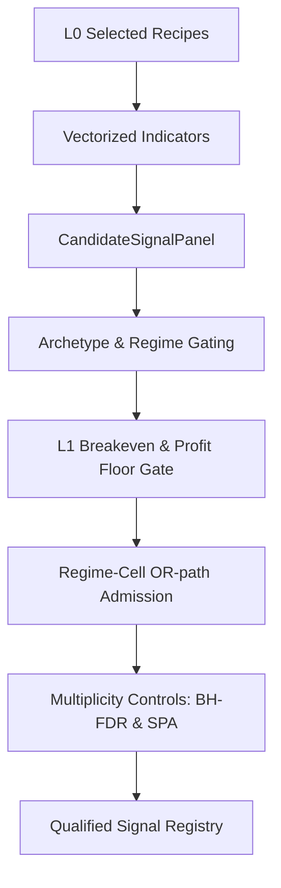

# 1. Purpose
Layer 0에서 추천된 Alpha Recipes 또는 vectorized Rule Panels에 대해, Walk-forward Validation 환경에서 L1 Breakeven Hard Gate 및 Multiplicity Control을 적용하여 유효한 Candidate Events를 생성하고 Qualified Signals를 선별한다.

# 2. Core Logic & Math

### Signal Gating Sequence
1. **Vectorization**:
   - S_t = f(Data_1..t)
   - Sparse Trigger: E_t = 1 if (S_t != 0 and S_t-1 == 0) else 0 (Causal)
2. **Regime Gating**:
   - mean_rev Archetype: ("bull_quiet", "bear_quiet", "transition") 허용
   - beta_neut Archetype: ("bull_quiet",) 허용
3. **L1 Breakeven Hard Gate**:
   - mean(Edge) > 0 and t_stat >= min_rule_ir_t
4. **Profit Floor**:
   - mean_OOS >= min_variant_oos_profit_bps
5. **Regime-Cell Admission**:
   - Bayesian Posterior: P(mu > delta | data) >= p_admit_min
   - Applies Newey-West variance and cross-cell tau^2 shrinkage.
6. **Multiplicity Controls**:
   - BH-FDR: q <= l1_pair_fdr_alpha (0.10)
   - SPA (Single Predictive Ability): Fail-closed circular bootstrap test.

### Ensemble Shrinkage
- Empirical-Bayes James-Stein shrinkage applied to archetype cell mean and variant-level prior:
  - x_hat_a = w_prior * x_bar_a + (1 - w_prior) * mu_prior
  - w_prior = n_eff / (n_eff + n_prior)

### Cross-Sectional Alpha Families (xs_alpha archetype)
- 4대 Family: `xs_momentum`, `xs_carry`, `xs_flow`, `xs_oi_skew`
- Per-bar rank score 변환을 통한 beta-neutral 구성 (Regime Gating 면제).

### Outer-Fold Opportunity Blocker Loci
- Gating failures within `evaluate_outer_signal_opportunities()` are tracked by semantic codes in `Layer1FoldReadiness.blockers`:
  - `empty_opportunities:registry_empty`: No qualified symbols passed the nested-pairwise gate.
  - `empty_opportunities:prediction_unmatched`: Registry symbols loaded but failed to align against realized event timelines.

### Pooled Alpha Admission (Generalized Factor-Level Substitution)
- Under high peer-correlation (e.g. signal competition), individual symbol evidence is substituted by factor-level pool statistics calculated via `compute_xs_factor_spread_diagnostics()`:
  - Substitution condition: `lcb > l1_breakeven_floor_bps` and `sharpe >= l1_xs_admission_min_sharpe`.
  - Strategy `mean_gross_bps` and `mean_incremental_bps` are replaced with factor-level equivalents to resolve peer exclusivity degradation.
  - Excludes sample adequacy validation gates (e.g. `insufficient_effective_obs`), which must always remain symbol-specific.

# 3. Core I/O Interfaces

### Input Data
- `AlignedMarketData`: OHLCV, indicators, flow, funding rates
- `MarketRegimeContext`: Compressed 3-state 및 6-state regime codes

### Principal Data Structures (src/domain/futures/signals/contracts.py)
- `CandidateSignalPanel`:
  - `signed_score_2d`: NDArray[np.float64]
  - `side_hint_2d`: NDArray[np.int8]
  - `allowed_regimes`: tuple[RegimeName, ...]
  - `exit_policies`: tuple[SignalExitPolicy, ...]
- `SymbolStrategyEvidence`:
  - `mean_gross_bps`: float
  - `mean_incremental_bps`: float
  - `block_tstat_incremental`: float
  - `q_value`: float
  - `quality_weight`: float
  - `hard_eligible`: bool
  - `lcb_net_bps`: float
- `QualifiedSignalRegistry`:
  - `by_symbol`: dict[str, tuple[SymbolStrategyEvidence, ...]]
  - `ready_symbols`: tuple[str, ...]

### Principal Data Structures (src/domain/futures/strategy/tiered_workflow/*.py)
- `XsAdmissionBasis` (signal_selection.py): `mean_bps`, `lcb_bps`, `sharpe`, `probability_positive`, `n_bars`
- `AtomizationDiagnosticReport` (atomization_diagnostics.py): `strategy_id`, `n_cells`, `n_cells_below_min_effective_obs`, `pooled_mean_gross_bps`, `atomized_mean_gross_bps_median`, `sign_flip_ratio`

# 4. Architecture Flow

# 5. Core Readiness & Promotion Gates

### Readiness Gate (5 Conditions)
- **Fold Coverage**: >= 0.80
- **Match Ratio**: >= 0.90
- **Effective N (N_eff)**: >= 3.0
- **Fold Ratio**: >= 0.50
- **Pooled LCB**: > 0

### Promotion Gate (4 Conditions)
- **Hard Eligible**: L1 structural gates 통과 여부
- **LCB Net**: `lcb_net_bps > l1_breakeven_floor_bps`
- **BH-FDR**: q-value <= 0.10
- **Quality Weight**: `quality_weight > 0`

# 6. Performance Optimizations
- **Numba JIT Acceleration**: Rolling z-score, cross-sectional rank, warm/ready 검사에 `@njit(cache=True)` 적용.
- **t.ppf LRU Cache**: Student-t 분포의 Percent Point Function 연산을 `@lru_cache`화하여 중복 연산 제거.
- **searchsorted Indexing**: 시계열 datetime 매칭 탐색을 O(log T)로 최적화.
- **Prefork Cache Prime**: Process fork 이전에 shared cache를 초기화하여 Copy-on-Write 메모리 효율화.
