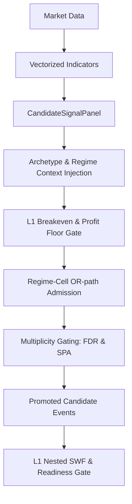

# 1. Purpose
Generates vectorized rule panels with archetype/regime contexts, filtered through L1 breakeven hard gates and multiplicity controls to produce sparse candidate events. Manages prequential evidence snapshots for walk-forward validation.

# 2. Core Logic & Math

**Signal Generation & Gating Sequence**
1. **Vectorization**: $S_{t} = f(\text{Data}_{1..t})$. Sparse triggers: $E_{t} = 1 \text{ if } (S_{t} \neq 0 \land S_{t-1} == 0) \text{ else } 0$. Strictly causal.
2. **Regime Gating**: Reversion signals blocked in specified high-risk regimes.
3. **L1 Breakeven Hard Gate**: $\frac{1}{N} \sum (\text{Edge}_{i}) > 0 \land t_{\text{stat}} \geq \text{min\_rule\_ir\_t}$.
4. **Profit Floor**: Unconditional cost-based minimum: $\mu_{\text{OOS}} \geq \text{min\_variant\_oos\_profit\_bps}$.
5. **Regime-Cell Admission (OR-path)**: Rescues signals with strong orthogonal edge in specific regimes via Bayesian posterior: $P(\mu > \delta | \text{data}) \ge p_{\text{admit\_min}}$. Uses Newey-West variance and cross-cell $\tau^2$ shrinkage.
6. **Multiplicity Controls**:
   - **BH-FDR**: Limits false discoveries across pool expansion.
   - **SPA**: Hansen's Single Predictive Ability (fail-closed circular bootstrap).

**Ensemble Shrinkage**
- Empirical-Bayes James-Stein shrinkage applies to both archetype cell means ($\hat{\mu}_a \to \bar{\mu}$) and variant-level priors.

# 3. Architecture Flow

# 4. SWF & System Integrity

**Layer 1 Nested SWF**
- **Prequential Snapshots**: Evidence grids use decoupled multipliers and outer warm-up blocks to prevent early-fold starvation.
- **OOS Activation**: Enforces pooled Arch-Only mode during L1 to preserve statistical power ($N_{eff}$); regime is delegated to L2 risk overlays.
- **Readiness Gate**: Strict multi-condition screening:
  - Fold Coverage $\ge 0.80$, Match Ratio $\ge 0.90$, Effective Symbols ($N_{eff}$) $\ge 3.0$, Fold Ratio $\ge 0.50$.
  - **Pooled LCB**: Global profitability metric ($LCB > 0$) via stationary block bootstrap over all passed folds.

**Data Integrity & Optimizations**
- **Guards**: NaN/stuck-price blocks, length minimums, high-low violation checks.
- **Performance**: Numba JIT bootstrap, $O(N \log N)$ vectorized percentiles, parent-process feature priming, Numba-JIT accelerated rolling/cross-sectional robust z-score loops to bypass pandas rolling overhead, and unified OMP-clamped multiprocessing pools.