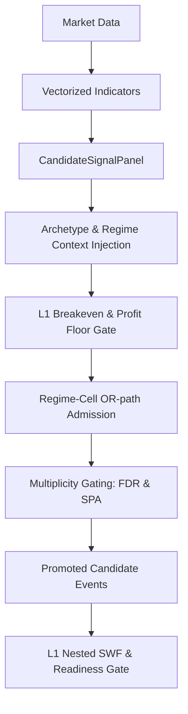

# 1. Purpose
Generates vectorized rule panels with archetype/regime contexts, filtered through L1 breakeven hard gates and multiplicity controls to produce sparse candidate events. Manages prequential evidence snapshots for walk-forward validation.

# 2. Core Logic & Math

**Signal Generation & Gating Sequence**
1. **Vectorization**: $S_{t} = f(\text{Data}_{1..t})$. Sparse triggers: $E_{t} = 1 \text{ if } (S_{t} \neq 0 \land S_{t-1} == 0) \text{ else } 0$. Strictly causal.
2. **Regime Gating**: Reversion signals blocked in specified high-risk regimes.
3. **L1 Breakeven Hard Gate**: $\frac{1}{N} \sum (\text{Edge}_{i}) > 0 \land t_{\text{stat}} \geq \text{min\_rule\_ir\_t}$.
4. **Profit Floor**: Unconditional cost-based minimum: $\mu_{\text{OOS}} \geq \text{min\_variant\_oos\_profit\_bps}$.
5. **Regime-Cell Admission (OR-path)**: Rescues signals with strong orthogonal edge in specific regimes via Bayesian posterior: $P(\mu > \delta | \text{data}) \ge p_{\text{admit\_min}}$. Uses Newey-West variance and cross-cell $\tau^2$ shrinkage.
6. **Multiplicity Controls**:
   - **BH-FDR**: Binding false-discovery control across pool expansion (`l1_fdr_hard_reject=True`; `q > l1_pair_fdr_alpha` → `quality_weight = 0`, hard reject). Soft-shrink mode available via `l1_fdr_hard_reject=False`. Adjusts multiplicity breadth $m$ to effective independent tests $m_{\text{eff}}$ using TF diversity correlations.
   - **SPA**: Hansen's Single Predictive Ability (fail-closed circular bootstrap).

**Ensemble Shrinkage**
- Empirical-Bayes James-Stein shrinkage applies to both archetype cell means ($\hat{\mu}_a \to \bar{\mu}$) and variant-level priors.
- A Bayesian prior layer precedes JS: $\hat{x}_a = w_{prior} \cdot \bar{x}_a + (1 - w_{prior}) \cdot \mu_{prior}$ with $w_{prior} = n_{eff} / (n_{eff} + n_{prior})$. When `l1_ens_prior_effective_n > 0`, archetypes with few events are shrunk toward $\mu_{prior}=0$ before JS, preventing small-sample negative edge artifacts. Disabled by default ($n_{prior}=0$).
- `predict_regime_conditional_ensemble` output: `validation_rank_ic` (diagnostic only, 0.0 default) in `validation_diagnostics`. IC is NOT a gate input; `mu_quality_shrinkage` feature is removed (was dead: validation_rank_ic=0.0 → lam=0 → mu collapse).

**Archetype Labels (`[ENS]` log)**
| Archetype key | Log label | Semantic |
|---|---|---|
| `trend` | `TRD` | Cross-sectional trend-following |
| `ts_mom` | `TMO` | Time-series momentum |
| `mean_rev` | `MRV` | Mean reversion |
| `carry_rev` | `CRY` | Carry / basis reversion |
| `flow_rev` | `FLO` | Order-flow reversion |
| `unwind` | `UNW` | Unwind / position exit |
| `beta_neut` | `BTN` | Beta-neutral / market-neutral |
- `[ENS]` numbers = archetype-pooled EB-shrunken mean edge (bps), NOT per-symbol averages.
- Archetypes with event count < `l1_ens_min_display_events` display `insuf` instead of numeric edge, preventing misleading small-sample signs.
- Unknown archetypes (not in the above 7) fall back to first-letter uppercase.

**Flow-Aware Panels & Conditioning Gates**
- `_safe_taker_imbalance_2d` converts taker buy volume into a cell-level imbalance cache and marks invalid cells as `False` without collapsing mixed-valid rows.
- `build_rule_signal_panels` reuses shared flow caches across `taker_imbalance_momentum`, `funding_flow_carry`, `funding_flow_unwind`, `flow_exhaustion_reversal`, `funding_term_structure_carry`, `flow_trend_continuation`, and `lsr_oi_regime_filter`.
- `funding_flow_carry` and `funding_term_structure_carry` route to `carry_rev`; `funding_flow_unwind` and `positioning_unwind` route to `unwind`; `flow_exhaustion_reversal` routes to `flow_rev`; `flow_trend_continuation` routes to `ts_mom`; `lsr_oi_regime_filter` routes to `beta_neut`.
- `funding_term_structure_carry` uses `funding_ts_slope = funding_z_96 - funding_z_168` to capture funding acceleration when short-term z exceeds long-term z in the same direction.
- `flow_trend_continuation` captures flow-supported trend continuation (flow_z_24 >= 1.0 + positive ret_12 + positive ret_1), long-only. Routes to `ts_mom` archetype (`flow_momentum_continuation` regime).
- `lsr_oi_regime_filter` emits a conditioning score when LSR z-score >= 1.0σ and OI build z-score >= 0.5σ, identifying positioning-dominated regimes. Emits directional side_hint (`-np.sign(lsr_log_z_42)`) to fade the crowded side, with stop_atr_mult=1.5 and take_profit_atr_mult=2.0. Routes to `beta_neut`.
- `positioning_unwind` enforces a 168-bar continuous valid data warm-up barrier before entry eligibility, preventing z-score noise in shallow data windows.
- Flow feature cache includes `flow_imbalance`, `flow_mean_6`, `flow_z_24`, `funding_z_96`, `funding_z_168`, `funding_ts_slope`, `ret_1`, `ret_12`, and `ret_z_48`.

**TF-Specific Signal Pools & 6 New Families**
- `build_rule_signal_panels` supports `family_filter: tuple[str, ...] | None = None` parameter. When provided, only signal families in the filter are generated (post-processing filter after all panels are built).
- `CandidateStrategyConfig` exposes `per_tf_candidate_families` (TF→family tuple mapping), `per_family_params` (family:variant→param override dict), and `per_tf_signal_pool_enabled` flag.
- `_DEFAULT_PER_TF_FAMILIES` assigns per-TF pools: 1h (9 families, mean_rev-dominant), 2h (9 families, mixed), 4h (17 families, balanced), 6h/8h (7 families, trend-dominant), 12h (9 families, trend-dominant).
- `_DEFAULT_PER_FAMILY_PARAMS` provides TF-specific parameter tuning (1h faster mean-rev params, 12h slower trend params).
- `apply_per_family_params(cfg, family, variant, base_params)` merges default params with per-family overrides.
- 6 new signal families:
  - `gap_fade_1h`: extreme gap (|open−close|/ATR > 2.0) fade. mean_rev, 1h only.
  - `vwap_reversion_1h`: 24h VWAP 2σ deviation reversion via cumsum-based rolling VWAP. mean_rev, 1h only.
  - `volume_climax_1h`: Wyckoff distribution (vol_z > 3.0 + stalled price). mean_rev, 1h only.
  - `macd_4h`: MACD (12/26/9) histogram zero crossover. trend, 4h only.
  - `supertrend`: ATR×2.5 trailing stop (period=10) with iterative band state machine. trend, 6h+/12h.
  - `ichimoku_trend`: Tenkan-Kijun cross + cloud confirmation. trend, 12h only.

# 3. Architecture Flow

# 4. SWF & System Integrity

**Layer 1 Nested SWF**
- **Prequential Snapshots**: Evidence grids use decoupled multipliers and outer warm-up blocks to prevent early-fold starvation.
- **Adaptive Evidence Gates**: During the first `l1_evidence_early_snapshots` snapshots, `l1_pair_min_effective_obs` and `l1_pair_min_folds` thresholds are relaxed to `l1_pair_min_effective_obs_early` / `l1_pair_min_folds_early`, allowing sparse early folds to generate registry entries. Quality weight is the ultimate arbiter: pairs that pass relaxed structural gates but fail `probability_positive ≥ 0.5` still receive `quality_weight = 0`.
- **OOS Activation**: Enforces pooled Arch-Only mode during L1 to preserve statistical power ($N_{eff}$); regime is delegated to L2 risk overlays.
- **Readiness Gate**: Strict multi-condition screening:
  - Fold Coverage $\ge 0.80$, Match Ratio $\ge 0.90$, Effective Symbols ($N_{eff}$) $\ge 3.0$, Fold Ratio $\ge 0.50$.
  - **Pooled LCB**: Global profitability metric ($LCB > 0$) via stationary block bootstrap over all passed folds.
  - **Per-TF Gate Overrides**: `per_tf_gate_overrides[tf]` can relax thresholds for short TFs (1h: $N_{eff} \ge 3.0$, sym_count $\ge 4$, fold_ratio $\ge 0.40$) or tighten for long TFs (12h: $N_{eff} \ge 6.0$, fold_ratio $\ge 0.55$). Applied via `apply_tf_gate_overrides(cfg, tf)`; `per_tf_gate_enabled=False` (default) preserves global defaults for backward compat.
- **Right-Censoring Diagnostic**: `dropped_by_maturity_count` tracks events filtered by `exit_idx >= oos_end` per fold. Exposed in Outer Fold log as `[censored: N]` to distinguish genuine edge weakness from boundary truncation (especially last fold).

**Promotion Summary & L2 Gate**
- **Actual L2 gate**: `build_qualified_signal_registry` — 4-condition admission:
  1. `hard_eligible` — structural gates (obs / folds / gross / incremental) all pass
  2. `lcb_net_bps > l1_breakeven_floor_bps` — economic hard gate: block-bootstrap P5 of incremental gross exceeds round-trip cost (`_DEFAULT_RT_BPS ≈ 7.5 bps` from `ExecutionCostModel`)
  3. `q_value ≤ l1_pair_fdr_alpha` — binding BH-FDR reject (`l1_fdr_hard_reject=True`; `l1_pair_fdr_alpha=0.10`)
  4. `quality_weight > 0` — conviction: `max(0, 2P−1) · positive_fold_ratio · sample_scale` where P = P(μ>0) from block-bootstrap
- **`lcb_net_bps`**: P5 of block-bootstrap means over `incremental_bps` (peer-relative gross edge, cost NOT deducted). Comparison against `breakeven` is a pre-trade cost screen; backtest engine deducts actual costs separately — no double penalty.
- **`quality_weight`**: Continuous conviction metric: `max(l1_qw_floor, max(0, 2P−1) · positive_fold_ratio · sample_scale)` where P = P(μ>0) from block-bootstrap. `l1_qw_floor` (default 0.0) prevents near-zero qw from eliminating marginally significant signals while preserving backward compat. FDR hard reject (q > `l1_pair_fdr_alpha`) is ABSOLUTE and overrides qw_floor — binding constraint. Probe winning cells inject an additional floor via `probe_prior_map: {(family, variant, symbol) → qw_floor}`, raising qw to `l1_qw_probe_boost` (default 0.3) for cross-confirmed signals. No discrete hi/mid/lo tier.
- **FAIL summary**: `[NOT PROMOTED] N pairs | top: <reason>xN` appears when `all_evidence` is provided, listing structural exclusion reasons for non-admitted pairs.
- **Promotion Filter**: Diagnostics-level filter (`apply_variant_promotions`) is advisory-only. When no variants are recommended by diagnostics, all events pass through unfiltered; the ultimate filtering authority is `compute_symbol_strategy_evidence` via structural gates and quality weight within the L1 SWF.
- **Backward compatibility**: `build_qualified_signal_registry(cfg=None)` disables LCB gate (sentinel pattern for tests / callers without cfg).

**PIT Universe Integration**
- `state_cube` (`UniverseStateCube [T, N]`) injected into `align_data_maps` → `AlignedMarketData.active_mask [T, N]`.
- Tiered entry scope is derived in two stages: `full_strategy_maps` is first reduced to a data-availability `base_scope`, then strict sub-window admission is applied before tiered execution begins. Empty strict admission is fail-closed.
- `active_mask` used as `SymbolLifecycleRecord` source: `first eligible bar per column = promotion_available_at`.
- **Promotion gate**: symbols with `promotion_available_at > l2_start` excluded from L2 `oos_stacked` before gate evaluation.
- `readiness_cube` (`StrategyReadinessCube`) computed after alignment via `evaluate_strategy_readiness`; injected via `dataclasses.replace(aligned, strategy_readiness_mask=...)`.

**Capacity Clip (awf_sim)**
- Per-bar capacity from `adv_usdt_2d [T, N]`: `intended_notional < 5 USDT → w = 0`; `> capacity → proportional clip`.
- Active only when `portfolio_nav` is provided (unit-NAV simulation skips the clip: weights are fractions, not USDT notional).

**Timeframe Alpha Probe (`timeframe_probe.py`) — Stage-1 계측 및 감사(Audit) 모듈**
- **Purpose**: 풀 L1/L2 최적화 실행 없이 `(symbol × family × tf)` 셀 단위 신호 예측력과 구조적 강점을 정량화하여 다각화된 최적 TF 조합을 식별하기 위한 매니페스트 생성.
- **TF Grid & Master Clock**: `{15m, 30m, 1h, 2h, 4h, 6h, 8h, 12h}` 그리드를 지원함. 1h 마스터 클럭(`PROBE_MASTER_TF`)을 통합 그리드로 채택하여 다운샘플 해상도 유실 및 측정-배포 일관성(fidelity)을 확보하고, TF-Probe는 high-recall 후보 생성기로 기능함.
- **Bar-param 정규화 (Time Horizon Normalization)**: 서로 다른 시간프레임 간 공정한 비교를 위해 실시간 wall-clock horizon을 고정함. `normalize_time_horizon=True` 시 $\text{bars}_{tf} = \text{round}(\text{hours\_target} / \text{hpb}(tf))$ 공식을 적용하여 moving average span 및 holding window를 4h 기준선 의도에 비례해 스케일링함.
- **Look-ahead 방어**: 미래 참조를 방지하기 위해 $\text{fwd}[t] = \text{close}[t+1+H] / \text{close}[t+1] - 1$ 형태로 entry shift(1)를 강제하고, 우측라벨(`closed="right"`, `label="right"`) resample 적용 후 마지막 미완성 bar를 drop함.
- **Virtual TF Source Contract**: `2h/6h/8h/12h` 등 디스크에 직접 저장되지 않는 가상 TF는 캐시된 `1m/5m/15m/30m/1h/4h` source TF 중 호환 및 최소 단위(finest valid)를 선정하여 런타임에서 리샘플링을 거쳐 빌드함. 리샘플링 호환성은 `hours_per_bar(target_tf) / hours_per_bar(source_tf)`가 float 허용오차 내에서 정수 비율일 때 성립함. 리샘플링 시 universe metadata 컬럼(`warm_mask`, `cluster_id`, `activation_regime`, `inactivation_side`, `diversity_corr`, `holding_bars`, `signal_decay_hours`, `min_events`, `holding_cost_bps`)은 bool→max, float→mean 집계로 보존되어 probe 통계 과대평가를 방지함.
- **계측 지표 및 감사(Audit)**:
  - `ic_mean`: Spearman rank IC
  - `ic_tstat_hac`: Newey-West HAC t-stat (`max_lag=H`)
  - `ic_fold_sign_consistency`: 4-fold IC 부호 동의율
  - `alpha_half_life_h`: 신호 정보 감쇠 속도
   - `net_edge_bps`: $\text{gross} - \bar{t/o} \cdot \text{holding\_bars} \cdot \text{round\_trip\_cost}$
  - `vr_label`: Lo-MacKinlay VR 다수결 구조 진단
  - `hurst`: DFA Hurst 지수
  - `passed_fdr`: BH-FDR(q=0.10) 통제 통과 여부. 실제 검정을 수행한 셀(`ic_tstat_hac != 0.0`)에 대해서만 적용되며, 미검정 셀(`ic_tstat_hac == 0.0`)은 가설검정 및 FDR 보정 대상 풀에서 제외되고 `passed_fdr=False`를 유지함.
- **Gate Audit 및 Observability**:
  - `summarize_tf_probe_gate_audit`를 통해 각 시간프레임별로 `tstat`, `fdr`, `net_edge`, `fold_consistency` 게이트의 누적 생존율과 첫 탈락 원인(`Top Fail`)을 요약함.
  - 당선 셀이 없는(zero-winner) 경우에도 각 게이트별 생존 정보 및 실패 사유를 ASCII 표 형식으로 로깅 및 감사함.
  - 가용 소스가 없는 TF는 준비도 평가(`Ready`)에서 제외되어 skipped 상태로 로깅과 실행이 일관되게 제어됨.
- **병렬**: `ProcessPoolExecutor(max_workers=12)`, tf 단위 8-task. VR/Hurst는 symbol×tf당 1회 캐시 후 panel 루프 공유.
- **다양성 계측 및 effective-N 보정**: 동일 (symbol, family) 내 tf 쌍의 Pearson r을 `diversity_corr`로 계측하고, 이를 L1 BY-FDR 다중검정 계산에 주입하여 $m_{\text{eff}} = \sum_{\text{clusters}} k / (1 + (k - 1) \cdot \bar{r}_{\text{cluster}})$ 형태로 다중성 통제 과보수 편향을 보정함.
- **Phase-2 handoff**: `select_tf_family_cells(manifest, min_ic_tstat=2.0, require_fdr=True, min_net_edge_bps=0.0, min_fold_sign_consistency=0.75)` → promotable 셀 `(ic_tstat_hac, net_edge_bps)` desc 정렬.

# 5. Data Integrity & Optimizations

- **Guards**: NaN/stuck-price blocks, length minimums, high-low violation checks.
- **Data Load Parallelization**: Utilizes `ThreadPoolExecutor` instead of multiprocessing to eliminate heavy pickle serialization and IPC overhead during parallel DataFrame loads.
- **Fast Datetime Bypass**: Skips redundant `pd.to_datetime` calls in `_resolve_tradeable_scope` if the input column is already in `datetime64` dtype, resolving datetime parsing bottlenecks to O(1).
- **NumPy-Backed Meta Alignment**: Meta columns are pre-converted to numeric at the ingestion stage. Within the `align_data_maps` loop, valid values are retrieved using fast NumPy masking on sliced views instead of Pandas Series creation, guaranteeing 100% data fidelity with zero look-ahead bias and optimized latency.
- **ALIGN-CUBE Loop-Invariant Hoisting**: `np.searchsorted` over `state_cube.calendar` (and `readiness_cube.calendar`) is computed once outside the symbol loop. `positions`/`t_valid`/`p_valid` are symbol-independent; complexity reduced from $O(N \cdot T \log T_{\text{cube}})$ to $O(T \log T_{\text{cube}} + N \cdot V)$ (V = valid bars). Pandas 3.0 nanosecond fix: `calendar.as_unit("ns").asi8` enforces `int64` nanosecond epoch instead of microsecond default.
- **Membership Timeline Hoisting**: `_normalize_timeline()` normalizes `timeline` / `inference_timeline` once before the symbol loop in `inject_membership_masks_into_maps`, eliminating 104× repeated quarter-start and `canonical_symbol` calls (52 syms × 2 maps).
- **TF Probe Data Stage**: `_run_data_stage`는 probe grid를 `load_futures_data_maps_for_symbols(..., target_tfs=...)`에 전달하지 않고, base execution data만 준비한다. probe TF 가용성은 source TF coverage 로그로 분리해 기록한다.
- **TF Probe Bridge Wiring**: `_run_strategy_stage`는 tiered bridge 호출 전에 `_run_tf_probe_stage()`를 실행하고, `winning_cells`를 `run_active_strategy_output_bridge(extra_probe_cells=...)`로 전달한다. `run_active_strategy_output_bridge`는 probe cells를 base TF panel 위에 추가로 투영한다. LTF(1h, 2h) 투영 시 `_project_panel_to_base_grid`는 `ltf_mode` 파라미터(`"last"`/`"mean"`)를 지원한다. `"last"`는 searchsorted로 마지막 bar 선택(하위 호환), `"mean"`은 cumsum 기반 window aggregation으로 window 내 모든 LTF 예측값을 평균 집계하고 side는 bincount mode를 사용한다.
- **Vectorized Volatility**: `volatility_2d [T, N]` computed via single `pd.DataFrame.rolling().std(ddof=1)` call over the full matrix, replacing a column-wise Python loop of N `pd.Series` allocations.
- **Conditional raw_df.copy()**: When `funding_df_prepared` and `metrics_df_prepared` are both `None`, the raw DataFrame reference is used directly without copying, eliminating redundant 30K×300 memory duplication. The copy path is preserved when any merge is required (`merge_asof` mutates in-place).
- **Single _to_unix_ms per TF**: `_to_unix_ms(raw_df["datetime"])` is computed once per timeframe inside `needs_merge` block. The resulting column is reused for both funding and metrics merge_asof calls, removing two unnecessary datetime→unix_ms conversions per TF.
- **Lightweight merged-stage audit**: `_append_stage_integrity("merged")` stores `{rows, cols}` only instead of calling `summarize_ohlcv_collection_integrity` (4 full-array scans: NaN, inf, gaps, OHLCV violations). The per-symbol `audit_df` groupby at the end of `load_futures_data_maps_for_symbols` conditionally selects only available integrity columns; missing columns default to zero.
- **Column group cache**: `_feature_group_coverage` uses a module-level `_COL_GROUP_CACHE` keyed by `(tf_label, frozenset(col_lower))` to pre-compute column→pattern-group mapping once per TF session. Subsequent calls for symbols with identical column sets perform O(C) lookups instead of O(C×P) string scans.
- **Parquet baggage column pruning**: `_load_cache` drops Binance API metadata columns (`close_time`, `no_trades`, `ignore`) immediately after parquet read — never used by any downstream domain code. Reduces per-file memory footprint by ~30% and eliminates string→numeric conversion overhead for these columns.
- **Numeric `_normalize_df` early exit**: When all non-datetime columns are already numeric (guaranteed after first `_save_cache`), the string→numeric loop is skipped via an `all(is_numeric_dtype)` guard. Cache-read path exits in O(N) dtype scan instead of O(C×N) full column conversion.
- **Removed redundant `.copy()`**: `collect_and_save(fetch_network=False)` returns `cache_df.loc[mask]` directly instead of `.loc[mask].copy()`. Boolean indexing in pandas always returns a copy, making the extra `.copy()` allocation redundant.
- **Algorithmic Optimizations**: Numba JIT bootstrap, $O(N \log N)$ vectorized percentiles, parent-process feature priming, Numba-JIT accelerated rolling/cross-sectional robust z-score loops to bypass pandas rolling overhead, and unified OMP-clamped multiprocessing pools.
