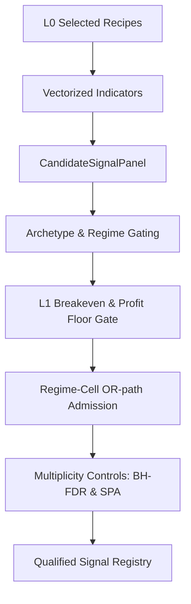

# 1. Purpose
Layer 0에서 추천된 Alpha Recipes 또는 vectorized Rule Panels에 대해, Walk-forward Validation 환경에서 L1 Breakeven Hard Gate 및 Multiplicity Control을 적용하여 유효한 Candidate Events를 생성하고 Qualified Signals를 선별한다.

# 2. Core Logic & Math

### Signal Gating Sequence
1. **Vectorization**:
   - $S_{t} = f(\text{Data}_{1..t})$
   - Sparse Trigger: $E_{t} = 1 \text{ if } (S_{t} \neq 0 \land S_{t-1} == 0) \text{ else } 0$ (Causal)
2. **Regime Gating**:
   - `mean_rev` Archetype: `("bull_quiet", "bear_quiet", "transition")` 허용
   - `beta_neut` Archetype: `("bull_quiet",)` 허용
3. **L1 Breakeven Hard Gate**:
   - $\frac{1}{N} \sum (\text{Edge}_{i}) > 0 \land t_{\text{stat}} \geq \text{min\_rule\_ir\_t}$
4. **Profit Floor**:
   - $\mu_{\text{OOS}} \geq \text{min\_variant\_oos\_profit\_bps}$
5. **Regime-Cell Admission**:
   - Bayesian Posterior: $P(\mu > \delta | \text{data}) \ge p_{\text{admit\_min}}$
   - Newey-West variance와 cross-cell $\tau^2$ shrinkage 적용.
6. **Multiplicity Controls**:
   - **BH-FDR**: $q \le \text{l1\_pair\_fdr\_alpha}~(0.10)$
   - **SPA (Single Predictive Ability)**: Fail-closed circular bootstrap 검정.

### Ensemble Shrinkage
- Archetype cell mean과 variant-level prior에 대해 Empirical-Bayes James-Stein shrinkage 적용.
- Bayesian Prior: $\hat{x}_a = w_{prior} \cdot \bar{x}_a + (1 - w_{prior}) \cdot \mu_{prior}$
- $w_{prior} = n_{eff} / (n_{eff} + n_{prior})$

### Cross-Sectional Alpha Families (xs_alpha archetype)
- 4대 Family: `xs_momentum`, `xs_carry`, `xs_flow`, `xs_oi_skew`
- Per-bar rank score 변환을 통한 beta-neutral 구성 (Regime Gating 면제).

### Pooled Alpha Admission (Generalized Factor-Level Substitution)
- Per-`(symbol, strategy_id, activation_context)` 원자화된 evidence는 상관된 systematic family(동일 트렌드에 동시발화)들이 서로의 peer가 되어 `mean_incremental_bps`가 0으로 수렴하는 구조적 한계를 가짐(`l1_baseline_mode="peer_exclusive"`).
- `compute_xs_factor_spread_diagnostics(xs_archetypes)`가 `archetype` 컬럼 기준으로 pooled factor-level(bar-level cross-sectional) `mean`/`lcb`/`sharpe`를 산출하고, `resolve_xs_alpha_admission()`이 `lcb > l1_breakeven_floor_bps ∧ sharpe ≥ l1_xs_admission_min_sharpe`를 만족하는 `strategy_id`에 한해 `mean_gross_bps`/`mean_incremental_bps`를 factor-level 값으로 치환한다.
- 스코프는 `cfg.l1_pooled_admission_archetypes`(기본 `("xs_alpha",)`)로 제어 — `xs_alpha` 외 임의 archetype(예: `trend`, `ts_mom`)으로 확장 가능. `insufficient_effective_obs`/`insufficient_folds` 등 표본 적정성 구조 게이트는 치환 대상에서 제외되어 항상 per-symbol로 평가됨(무분별한 일괄 승인 방지).
- `diagnose_strategy_atomization()`(log-only, `l1_atomization_diagnostics_enabled`)은 이미 원자화된 evidence를 `strategy_id` 단위로 재집계해 pooled-vs-atomized 괴리·sign-flip 비율·reject-reason 분포를 진단한다. 게이트 판정에는 관여하지 않음.

# 3. Core I/O Interfaces

### Input Data
- `AlignedMarketData`: OHLCV, indicators, flow, funding rates
- `MarketRegimeContext`: Compressed 3-state 및 6-state regime codes

### Principal Data Structures (src/domain/futures/signals/contracts.py)
- `CandidateSignalPanel`:
  - `signed_score_2d`: NDArray[np.float64]
  - `side_hint_2d`: NDArray[np.int8]
  - `allowed_regimes`: tuple[RegimeName, ...]
  - `exit_policies`: tuple[SignalExitPolicy, ...]
- `SymbolStrategyEvidence`:
  - `mean_gross_bps`: float
  - `mean_incremental_bps`: float
  - `block_tstat_incremental`: float
  - `q_value`: float
  - `quality_weight`: float
  - `hard_eligible`: bool
  - `lcb_net_bps`: float
- `QualifiedSignalRegistry`:
  - `by_symbol`: dict[str, tuple[SymbolStrategyEvidence, ...]]
  - `ready_symbols`: tuple[str, ...]

### Principal Data Structures (src/domain/futures/strategy/tiered_workflow/*.py)
- `XsAdmissionBasis` (signal_selection.py): `mean_bps`, `lcb_bps`, `sharpe`, `probability_positive`, `n_bars` — factor-level substitution basis, keyed by `strategy_id` (`"family:variant"`).
- `AtomizationDiagnosticReport` (atomization_diagnostics.py): `strategy_id`, `n_cells`, `n_cells_below_min_effective_obs`, `pooled_mean_gross_bps`, `atomized_mean_gross_bps_median`, `sign_flip_ratio`, `sign_flip_ratio_weighted`, `reject_reason_counts`, `dominant_reject_reason`.

# 4. Architecture Flow

# 5. Readiness & Promotion Gates

### Readiness Gate (5 Conditions)
- **Fold Coverage**: $\ge 0.80$ (Fold 내 유효 데이터 비율)
- **Match Ratio**: $\ge 0.90$
- **Effective $N$ ($N_{eff}$)**: $\ge 3.0$
- **Fold Ratio**: $\ge 0.50$
- **Pooled LCB**: $> 0$

### Promotion Gate (4 Conditions)
- **Hard Eligible**: L1 structural gates 통과 여부
- **LCB Net**: `lcb_net_bps > l1_breakeven_floor_bps` (~7.5 bps)
- **BH-FDR**: $q\text{-value} \le 0.10$
- **Quality Weight**: `quality_weight > 0`

# 6. Performance Optimizations
- **Numba JIT Acceleration**: Rolling z-score, cross-sectional rank, warm/ready 검사에 `@njit(cache=True)` 적용.
- **t.ppf LRU Cache**: Student-t 분포의 Percent Point Function 연산을 `@lru_cache`화하여 중복 연산 제거.
- **searchsorted Indexing**: 시계열 datetime 매칭 탐색을 $O(T)$에서 $O(\log T)$로 최적화.
- **Prefork Cache Prime**: Process fork 이전에 shared cache를 초기화하여 Copy-on-Write 메모리 효율화.
