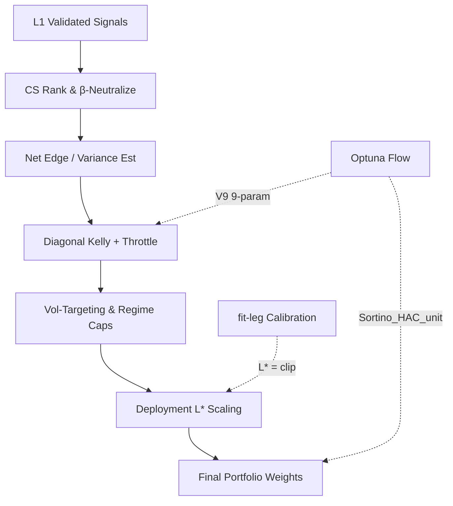

# 1. Purpose
L1에서 검증된 Qualified Signals를 입력받아 Cross-sectional Ranking, Regime-conditional Shrinkage, Diagonal Kelly Sizing을 결합한 최적의 포트폴리오 가중치(Weights)를 산출한다. L2 Optuna 최적화를 통해 9개의 최적 파라미터를 결정하고, 최종적으로 Calibration을 거쳐 배포용 레버리지 $L^*$을 도출한다.

# 2. Tiered Hybrid Architecture & Logic

### Signal Pooling
- **Precision-Weighted Combination**: 다중 Timeframe의 L1 net edge($\mu_i$)를 가중치($c_i = \text{quality\_weight}_i$)로 결합하여 심볼 레벨의 pooled edge($\mu_s$)를 생성.
  - $\mu_s = \frac{\sum_i c_i \mu_i}{\sum_i c_i}$
- **Conviction Cap**: 특정 TF의 과도한 가중치 쏠림을 방지하기 위한 상한 설정.
  - $c_s = \min\left(\sum c_i, \kappa \cdot \max c_i\right) \quad (\kappa = 1.5)$

### Bucket Routing & Regime Compression
- **Regime Compression**: 6개의 raw regime 코드를 3-state (`bull`, `bear`, `crisis`) effective regime 코드로 축약하여 맵핑.
- **Sleeve Gating**: triplet $(regime, family, TF)$ 기준 realized edge를 계산하여 `l2_bucket_edge_floor_bps`를 초과하는 sleeve만 통과.
  - $e_{raw} = \overline{side_j \cdot fwd\_ret(sym_j) \cdot 10000 - cost\_bps}$
- **Family Prior Shrinkage**: 관측 데이터가 부족할 경우($N < \text{l2\_bucket\_min\_n}$) family prior로 수축 처리.
  - $e = (1-\lambda) e_{raw} + \lambda e_{family} \quad (\lambda = 0.3)$
- **Bucket-Conditional Weight**: `l2_regime_policy_mode="filter"` 상태에서 $g(e)=\text{clip}((e-\text{floor})/\text{ref}, 0.5, 1.5)$로 `quality_weight`를 재가중.

### Kelly Sizing & Vol Target
- **Diagonal Kelly Weights**:
  - $w_s \propto f_k \cdot \frac{\mu_s}{\sigma_s^2}$
  - $\sigma_s = \sigma_R = \frac{q_{90} - q_{10}}{2.563}$ (양방향 분위수를 활용한 Robust Volatility)
- **Vol Targeting**: 실현 연율 변동성을 `vol_target`으로 스케일링하여 익스포저 급변 방지.

### Directional Veto (Major-Symbol Long Protection)
- **Adverse-Only Mode**: regime-adverse 환경에서 매수 신호가 발생할 때 binary 차단.
- **Contextual Mode**: 심볼별/폴드별 5-state 머신 (`idle → watch → armed → veto → cooldown`)에 근거하여 작동.
  - **Persistence**: regime-adverse + long 상태가 $N$ bar 연속될 때 전환.
  - **Loss Trigger**: rolling symbol return이 `-loss_trigger_bps` 하향 돌파 시 veto 발동.
  - **Release**: short 전환 또는 bull regime 복귀 지속 시 cooldown을 거쳐 idle 복귀.
  - **Actions**: `drop_long`(제거), `zero_mu`(무효화), `cap_mu`(상한 적용).

### Staged Portfolio Validation Space
- **L2PosteriorSleeve**: `mu_eff_bps = posterior_mu_bps - posterior_z * posterior_sigma_bps - cost_safety_mult * stress_cost_bps` 공식을 이용해 sleeve의 방향 및 리스크 가중치를 산출.
- **Staged Search**: L2 Optuna 탐색 영역을 `signal`, `risk`, `regime`, `deployment` 단계로 분할하고 최적 평가.

# 3. Phase B: Leverage Calibration
- **Optimal Leverage ($L^*$)**: fit-leg 모사 수익률과 OOS 성과를 기반으로 최대 낙폭(MDD) 및 CVaR 예산 내에서 레버리지를 탐색.
  - $L^* = \text{clip}(\min(L_{mdd}, L_{cvar}), 1.0, 20.0)$
- **Fit MDD Crisis Gate**: fit-leg MDD가 `l2_deploy_fit_mdd_crisis_gate` 임계값 이상이면 OOS 예산 블렌딩을 우회하고 fit-only calibration 결과 적용.
- **Diversification Gate**: Choueifaty-Coignard Diversification Ratio(DR) 하락 시 concentration_ratio를 반영하여 레버리지 차감.
  - $L^*_{final} = L^* \times \text{concentration\_ratio}$

# 4. Optimization Flow

# 5. Gate Contracts (Promotion Rules)
L2 최적화 스터디 완료 후 챔피언 포트폴리오는 아래 관문을 통과해야 한다.
1. **Performance Triad**: Sortino $\ge 1.5 \rightarrow$ Sharpe $\ge 0.7 \rightarrow$ Calmar $\ge 0.5$
2. **Worst-Fold CAGR**: 모든 fold 중 최악의 CAGR $\ge -0.05$
3. **Friction Gate**: 각 bar의 net expected edge가 expected cost를 상회해야 함 ($|\bar{g}_s^{pb}| \ge \bar{c}_s^{pb}$)
4. **Cost Drag Gate**: 누적 거래비용 대비 누적 총수익 비율이 임계값 이하이어야 함 ($\text{cost\_drag} \le \text{l2\_max\_cost\_drag\_ratio}$)
5. **Recent Fold Gate**: 직전 활성화 fold의 CAGR $> 0$ 만족 여부.

# 6. Core Parameters

| Parameter | Default | Purpose |
|---|---|---|
| `l2_routing_mode` | `"bucket"` | Regime $\times$ Family $\times$ TF 슬리브 라우팅 방식 |
| `l2_bucket_edge_floor_bps` | 50.0 | 버킷 라우팅 통과 최소 기대수익 |
| `l2_regime_policy_mode` | `"hybrid"` | Regime 정책 결합 제어 방식 (filter/observe/soft/hybrid) |
| `l2_portfolio_cov_mode` | `"diagonal"` | Diagonal Kelly용 공분산 모드 (diagonal/correlated) |
| `vol_target` | 1.0 | 포트폴리오 단위 vol 타겟팅 크기 |
| `l2_max_cost_drag_ratio` | 0.60 | 포트폴리오가 감당할 수 있는 최대 비용 드래그 비율 |
| `l2_deploy_fit_mdd_crisis_gate`| None | Fit-leg MDD 위기 상황 진입 차단 임계값 |
| `l2_leverage_diversification_gate_enabled` | False | DR 기반 레버리지 헤어컷 적용 여부 |
