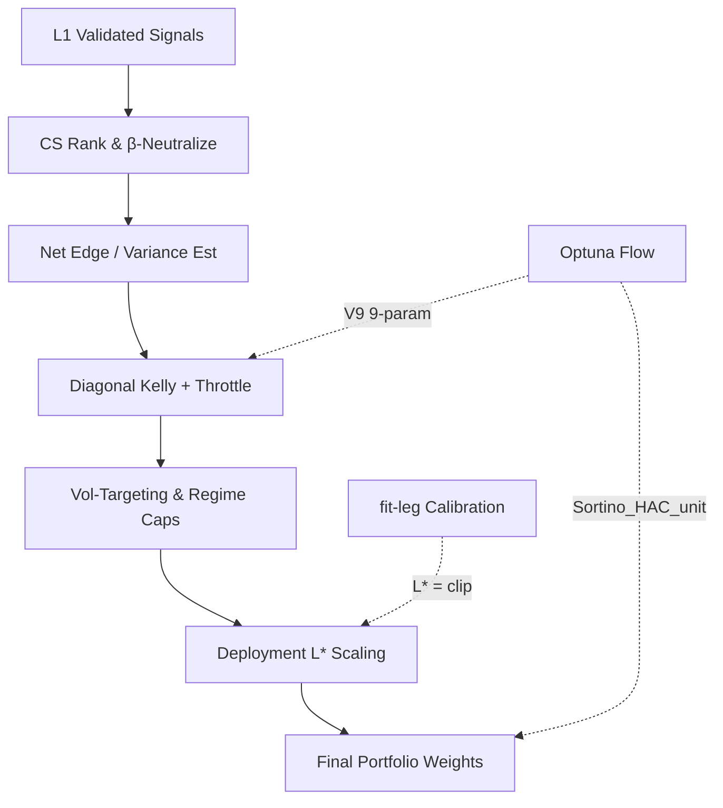

# 1. Purpose
L1에서 검증된 Candidate Events를 입력받아 Cross-sectional Ranking, Regime-conditional Shrinkage, Diagonal Kelly Sizing을 결합한 최적의 포트폴리오 가중치(Weights)를 산출한다. L2 Optuna 최적화를 통해 Sortino_HAC_unit 목적함수 기준 9개의 파라미터를 결정하고, 최종적으로 Calibration을 거쳐 배포용 레버리지 $L^*$을 도출한다.

# 2. Tiered Hybrid Architecture & Logic

### Signal Pooling
- **Precision-Weighted Combination**: 다중 Timeframe의 L1 net edge($\mu_i$)를 가중치($c_i = \text{quality\_weight}_i$)로 결합하여 심볼 레벨의 pooled edge($\mu_s$)를 생성.
  - $\mu_s = \frac{\sum_i c_i \mu_i}{\sum_i c_i}$
- **Conviction Cap**: 특정 TF의 과도한 가중치 쏠림 방지.
  - $c_s = \min\left(\sum c_i, \kappa \cdot \max c_i\right) \quad (\kappa = 1.5)$

### Bucket Routing (Regime $\times$ Family $\times$ TF)
- **Regime Compression**: 6개의 raw regime 코드를 3-state (`bull`, `bear`, `crisis`) effective regime 코드로 축약하여 맵핑.
- **Sleeve Gating**: triplet $(regime, family, TF)$ 기준 realized edge를 계산하여 `l2_bucket_edge_floor_bps`를 초과하는 sleeve만 통과.
  - $e_{raw} = \overline{side_j \cdot fwd\_ret(sym_j) \cdot 10000 - cost\_bps}$
- **Family Prior Shrinkage**: 관측 데이터가 부족할 경우($N < \text{l2\_bucket\_min\_n}$) family prior로 수축 처리.
  - $e = (1-\lambda) e_{raw} + \lambda e_{family} \quad (\lambda = 0.3)$

### Kelly Sizing & Vol Target
- **Diagonal Kelly Weights**:
  - $w_s \propto f_k \cdot \frac{\mu_s}{\sigma_s^2}$
  - $\sigma_s = \sigma_R = \frac{q_{90} - q_{10}}{2.563}$ (양방향 분위수를 활용한 Robust Volatility)
- **Vol Targeting**: 실현 연율 변동성을 `vol_target = 1.0`으로 고정하여 급격한 익스포저 변화 방지.

### Directional Veto (Major-Symbol Long Protection)
<!-- ADR_20260704_L2_CONTEXTUAL_DIRECTIONAL_VETO -->
- **Adverse-Only Mode**: binary `drop_long`/`zero_mu` on regime-adverse + raw_mu>0. No state.
- **Contextual Mode**: 5-state machine (`idle→watch→armed→veto→cooldown`) per symbol per fold.
  - **Persistence**: `n` consecutive adverse+long bars before escalation (`l2_regime_directional_veto_persistence_bars`).
  - **Loss Trigger**: rolling symbol return breaches `-loss_trigger_bps` threshold to arm veto.
  - **Release**: raw_mu≤0 or bull regime streak ≥ `release_regime_bull_bars` → cooldown → idle.
  - **Actions**: `drop_long`(remove), `zero_mu`(neutralize), `cap_mu`(cap at `cap_mu_bps`).
- **Causal Rolling Return**: `sum(returns[t-lookback, t))` — look-ahead-free.

### Throttle & Risk Controls
- **Edge-Conditional Throttle**: pooled edge 크기에 비례하여 Kelly 비중을 선형 혹은 거듭제곱 형태로 스케일링.
  - $m_t = \text{clip}\left(\frac{s - \text{floor}}{\text{ref} - \text{floor}}, 0, 1\right)^\gamma$
- **Reversal Kill-Switch**: BTC trailing drawdown 및 negative momentum 조건이 연속 만족될 때 작동하는 state machine. 활성화 시 모든 archetype의 `raw_mu`에 `reversal_risk_off_floor`를 곱해 익스포저를 축소.
- **Positioning-Crowding Dampener**: Open Interest 빌드업과 LSR 스큐가 동시 탐지된 경우 trend archetype의 `raw_mu`에 `l2_crowding_floor_mult`를 적용하여 비중 감소.

# 3. Phase B: Leverage Calibration
- **Optimal Leverage ($L^*$)**: fit-leg 모사 수익률과 OOS 성과를 기반으로 최대 낙폭(MDD) 및 CVaR 예산 내에서 레버리지를 탐색.
  - $L^* = \text{clip}(\min(L_{mdd}, L_{cvar}), 1.0, 20.0)$
- **Fit MDD Crisis Gate**: fit-leg MDD가 `l2_deploy_fit_mdd_crisis_gate` 임계값 이상이면 OOS 예산 블렌딩을 우회하고 fit-only calibration 결과로 잠금.
- **Diversification Gate**: Choueifaty-Coignard Diversification Ratio(DR) 하락 시 concentration_ratio를 반영하여 레버리지 차감.
  - $L^*_{final} = L^* \times \text{concentration\_ratio}$

# 4. Optimization Flow

# 5. Gate Contracts (Promotion Rules)
L2 최적화 스터디 완료 후 챔피언 포트폴리오는 아래의 관문을 통과해야 배포 대상이 된다.

1. **Performance Triad**: Sortino $\ge 1.5 \rightarrow$ Sharpe $\ge 0.7 \rightarrow$ Calmar $\ge 0.5$
2. **Worst-Fold CAGR**: 모든 fold 중 최악의 CAGR $\ge -0.05$
3. **Friction Gate**: 각 bar의 net expected edge가 expected cost를 상회해야 함.
   - $|\bar{g}_s^{pb}| \ge \bar{c}_s^{pb}$
4. **Cost Drag Gate**: 누적 거래비용 대비 누적 총수익 비율이 임계값 이하이어야 함.
   - $\text{cost\_drag} \le \text{l2\_max\_cost\_drag\_ratio} \quad (0.60)$
5. **Recent Fold Gate**: 직전 활성화 fold의 CAGR $> 0$ 만족 여부.

# 6. Core Parameters

| Parameter | Default | Purpose |
|---|---|---|
| `l2_routing_mode` | `"bucket"` | Regime $\times$ Family $\times$ TF 슬리브 가우팅 방식 |
| `l2_bucket_edge_floor_bps` | $50.0$ | 버킷 라우팅 통과 최소 기대수익 |
| `l2_regime_policy_mode` | `"hybrid"` | Regime 정책 결합 제어 방식 (filter/observe/soft/hybrid) |
| `l2_portfolio_cov_mode` | `"diagonal"` | Diagonal Kelly용 공분산 모드 (diagonal/correlated) |
| `vol_target` | $1.0$ | 포트폴리오 단위 vol 타겟팅 크기 |
| `l2_max_cost_drag_ratio` | $0.60$ | 포트폴리오가 감당할 수 있는 최대 비용 드래그 비율 |
| `l2_deploy_fit_mdd_crisis_gate`| `None` | Fit-leg MDD 위기 상황 진입 차단 임계값 |
| `l2_leverage_diversification_gate_enabled` | `False` | DR 기반 레버리지 헤어컷 적용 여부 |
