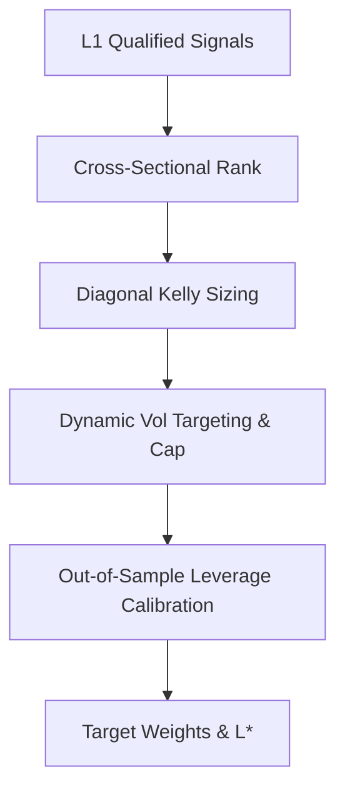

# 1. System Boundary
- **In-Scope**:
  - Cross-sectional ranking, regime-conditional shrinkage, and diagonal Kelly sizing weight calculations.
  - Optuna parameter tuning for leverage-routing variables, with a 12-dim `constraints_func` vector (mdd/cvar/fold/recent_fold/active_blocks/friction/trades/crisis/**cagr/sharpe_uplift**) guiding constrained-TPE search directly toward the promotion gate.
  - Out-of-Sample leverage calibration ($L^*$) under drawdown and CVaR budgets.
- **Out-of-Scope**:
  - Low-latency order routing and live execution client interfaces (managed in L3/Execution).

# 2. Mathematical Formalism & Constraints

### Signal Pooling
$$\mu_s = \frac{\sum_i c_i \cdot \mu_i}{\sum_i c_i}$$
$$c_s = \min\left(\sum c_i, \kappa \cdot \max c_i\right) \quad (\kappa = 1.5)$$

### Sleeve Gating & Family Prior Shrinkage
$$e_{\text{raw}} = \text{mean}\left(\text{side}_j \cdot \text{fwd\_ret}(sym_j) \cdot 10000 - \text{cost\_bps}\right)$$
$$e = (1-\lambda) \cdot e_{\text{raw}} + \lambda \cdot e_{\text{family}} \quad (\lambda = 0.3)$$
- Gate active only if: $e > \text{l2\_bucket\_edge\_floor\_bps}$

### Diagonal Kelly Sizing
$$w_s \propto f_k \cdot \frac{\mu_s}{\sigma_R^2}$$
$$\sigma_R = \frac{q_{90} - q_{10}}{2.563} \quad (\text{Robust Volatility via quantiles})$$

### Leverage Calibration
$$L^* = \text{clip}\left(\min(L_{\text{mdd}}, L_{\text{cvar}}, L_{\text{crisis}}), 1.0, 20.0\right)$$
$$L^*_{\text{final}} = L^* \times \text{concentration\_ratio}$$
- Concentration ratio is a haircut multiplier based on Choueifaty-Coignard Diversification Ratio (DR).
- $L_{\text{mdd}}$ targets $\text{mdd\_cap} \times (1 - \text{mdd\_margin})$ (normal-market, searchable). $L_{\text{crisis}}$ targets $\text{mdd\_cap} \times (1 - \text{crisis\_mdd\_margin})$ — a decoupled, non-searchable target so CAGR-gate tuning cannot erode crisis-window MDD protection.
- $L^*_{\text{final}}$ is further clamped downward, symmetric to the raise-only OOS blend, if the worst realized OOS fold's CAGR at $L^*$ falls below $\text{l2\_min\_worst\_fold\_cagr}$ — bounded to $[1.0, L^*]$ (no sub-unit deployment support).

# 3. Strict I/O Contract

### Interface Data Contracts
| Type | Parameter / Variable | Shape | Data Type | Description |
| :--- | :--- | :--- | :--- | :--- |
| **Input** | `mu_i` (L1 net edges) | Array | `float64` | Estimated net edge from Layer 1 |
| **Input** | `regime_code` | Scalar | `int` | Current active 3-state regime code |
| **Param** | `l2_bucket_edge_floor_bps` | Scalar | `float` | Minimum edge limit (bps) for bucket inclusion |
| **Param** | `vol_target` | Scalar | `float` | Maximum portfolio annualized target volatility |
| **Output**| `target_weights` | `[N]` | `float64` | Optimal target allocation weights matrix |
| **Output**| `optimal_leverage` ($L^*$) | Scalar | `float` | Target leverage multiple for deployment |

# 4. Topology & Dynamic Flow

# 5. Configurable Parameters

| Parameter | Default | Purpose |
| :--- | :--- | :--- |
| `l2_routing_mode` | `"bucket"` | Selection path routing mode (bucket / flat) |
| `l2_portfolio_cov_mode` | `"diagonal"` | Covariance covariance model configuration for Kelly weights |
| `l2_max_cost_drag_ratio` | 0.60 | Hard ceiling for cumulative friction relative to gross returns |
| `l2_leverage_diversification_gate_enabled` | False | Toggle to enable DR-based leverage haircut scaling |
| `l2_deploy_mdd_margin` | 0.30 (searchable 0.05–0.30) | Normal-market leverage-ceiling safety margin |
| `l2_deploy_crisis_mdd_margin` | 0.30 (fixed, non-searchable) | Crisis-window leverage-ceiling safety margin, decoupled from `l2_deploy_mdd_margin` |
| `l2_wf_n_folds` | 4 (fixed, non-searchable) | L2-only walk-forward fold count, decoupled from the shared `CandidateStrategyConfig.wf_n_folds` used by L1/live/ablation |
| `l2_regime_policy_mode` | `"soft"` (searchable: soft / hybrid) | Regime-cell admission mode; `"hybrid"` unlocks the hard-block path |
| `l2_regime_hard_block_enabled` | False (searchable) | Excludes (not just downweights) regime cells with confident negative calibration lift |
| `l2_regime_pooled_is_passthrough` | True (searchable) | Whether unresolved/unstable regime cells default to full-weight allow vs. cautious pooled treatment |
| `l2_require_recency_holdout_pass` | True (searchable) | Toggle for the 14th Optuna constraint: trailing objective-excluded return slice must clear a CAGR floor |
| `l2_min_recency_holdout_cagr` | -0.05 (searchable) | CAGR floor for the recency holdout slice, decoupled from `l2_min_worst_fold_cagr` |
| `l2_recency_holdout_days` | 30.0 (fixed, non-searchable) | Trailing calendar-day span excluded from the primary objective, used only for the recency holdout constraint |
| `l2_regime_bucket_side_split_enabled` | False (searchable) | Widens regime bucket keys from (regime, family, tf) to (regime, family, tf, side) so long/short edges are routed independently |
| `l2_regime_scoped_fold_override_enabled` | False (searchable) | Scopes the RC-3 fold-confidence override to individual regime states instead of demoting every cell in a fold on one blanket average |
