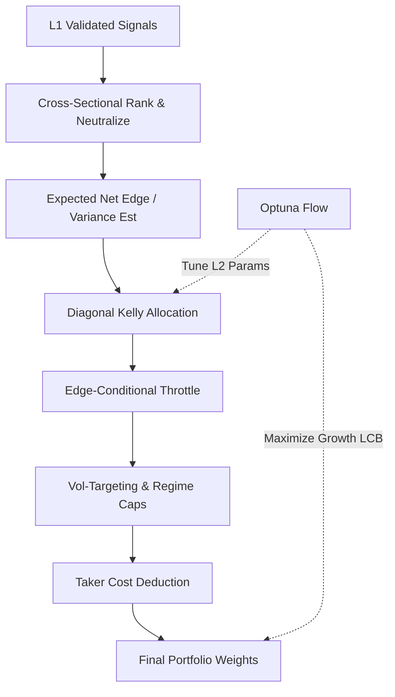

# 1. Purpose
Transforms L1 candidate events into optimal portfolio weights via cross-sectional ranking, regime-conditional shrinkage, and edge-throttled Diagonal Kelly sizing (3-Layer Tiered Hybrid Architecture).

# 2. Tiered Hybrid Architecture (USE_CS_RANK_ENGINE)

**Data Scope (`pick_strategy_data_maps`):** `full_strategy_maps` (the single source feeding the bridge, the tiered END-coverage filter, and `align_data_maps`) is the per-symbol **IS+OOS merge** (`concat → sort_values("datetime") → drop_duplicates(keep="first")`), spanning `[fetch_start, holdout_end]`. This lets the same `aligned` frame serve L1/L2 (pre-holdout calendar range) and L3 (post-holdout-start) without a second data path. `keep="first"` favors the IS row on boundary-timestamp duplicates (no look-ahead).

**L2 Fold Anchoring (`n_bars` invariant):** `build_walk_forward_folds`'s `global_oos_start/end` are computed *proportionally* to its `n_bars` argument (unlike L1's `build_l1_nested_swf_folds`, which is anchored by explicit `l1_start_idx`/`l1_end_idx` and uses `n_bars` only as an upper-bound check). Because of this, `run_tiered_pipeline` MUST pass `n_bars=ho_start_idx_l2` (bars up to `window.holdout_start`) to `build_walk_forward_folds` — never `len(aligned.datetimes)` — even though `aligned` itself spans the full IS+OOS+holdout range for L3's benefit. Passing the full length collapses the AWF fold count (regression observed: 3→1 folds, Optuna feasible-trial count → 0) since most generated folds land past `holdout_start` and get filtered out by the `[l2_start, holdout_start)` post-filter.

**Layer 1: SWF Strategy Panel Validation**
- Validates incoming signal panels via prequential evidence.
- **Gate**: Fold coverage $\ge 0.80$, valid strategies $\ge 5$, diversity $\ge 0.50$, CS fold pass ratio $\ge 0.60$.

**Layer 2: CS Rank & Diagonal Kelly AWF**
- **Signal Processing**: Absolute CS Ranking $\to$ BTC-$\beta$ Neutralization.
- **Kelly Sizing**:
  - Symmetric $q_{10}, q_{90}$ estimation for volatility: $\sigma_R = (q_{90} - q_{10})/2.563$.
  - Fractional Diagonal Kelly: $w_i \propto f_k \cdot \mu_i / \sigma_i^2$ subject to friction masks.
- **Edge-Conditional Throttle**: Time-varying conviction multiplier $m_t \in [0,1]$ applied based on gross-weighted net-of-cost edge.
- **Active Deployment Controls**:
  - `deploy_cost_safety_mult` isolates deployment friction from gross-edge conversion.
  - `edge_throttle_min_active_mult` preserves a non-zero floor for positive edge books.
  - `risk_budget_floor_ratio` scales under-deployed books toward the target-vol floor without creating new support.
  - `risk_budget_max_scale` caps the upward scaling applied by the floor logic.
- **Search Space V8 (Fix C)**:
  - `kelly_fraction` / `max_ann_vol` 제거 — Phase B 결정론적 레버리지 캘리브레이션으로 대체.
  - Signal 차원 9개: `K_RANK`, `REBALANCE_BARS`, `CS_Z_SCORE_THRESHOLD`, `deploy_cost_safety_mult`, `edge_throttle_min_active_mult`, `edge_ref_bps`, `edge_throttle_gamma`, `risk_budget_floor_ratio`, `risk_budget_max_scale`.
  - `L2_ALLOC_SPACE` aliases `L2_ALLOC_SPACE_V8`. N_eff↓·DSR 벤치마크 압력 완화 효과.
- **Phase B: 결정론적 리스크 배치 (`risk_deployment.py`)**:
  - Champion 선택 완료 후, `calibrate_deployment_leverage(fit_rets, mdd_cap, mdd_margin, l_hard_cap=4.0)` → 이분탐색으로 L* 산출.
  - `L* = clip(min(L_mdd, L_cvar), 1.0, l_hard_cap)`. `kelly_fraction *= L*`, `max_ann_vol *= L*`.
  - DSR/Sharpe는 L 스케일에 불변(mean·std 동비율 변화) → CAGR만 증폭, DSR 보존.
  - 현재 구현: `binding=hard_cap`(L*=4.0) — `mdd_margin=0.30` 안전여유로 OOS-fit 분포 이격 완충.
- **Dynamic Scaling**: Volatility targeting ($\sigma_{target} / \sigma_{port}$) combined with regime-specific gross/net caps. Includes double-scaling guards.
- **L2 Gate Contract**:
  - `Layer2GateEvaluation.optuna_constraint_values` is the 8-value safety vector fed to `TPESampler(constraints_func=...)`.
  - `Layer2GateEvaluation.promotion_constraint_values` is the full replay gate vector used for champion promotion.
  - Optuna feasibility covers deployment/leak/risk/coverage/trade floors only.
  - Final promotion gate additionally checks `CAGR`, `Sharpe`, `Sortino`, `MAR`, `growth_lcb`, `uplift`, and `DSR`.
  - `CAGR >= 0.30` remains a hard promotion gate and is not embedded as an Optuna objective bonus.
- **OOS Fraction**: `ml_fit_fraction=0.55` + `ml_calibration_fraction=0.15` → **OOS 30%** (fold당 ~27일). 구조적 과적합 방지 목적.
- **Replay Championing & DSR Pool (Fix B+C)**:
  - `select_layer2_champion`이 frontier 전수를 replay하여 gate-pass 후보를 **전수 수집** → `argmax(dsr, cagr)` 선택 (이전: 첫 gate-pass에서 break).
  - **DSR pool = feasible trials만** (Fix C): `completed_trial_sharpes` 및 `n_trials_eff` 엔트로피를 feasible subset으로 제한 → 벤치마크 압력 하락 → DSR 상승. (이전: 전체 complete trials → 0.270, 이후: feasible-only → 0.502 관측).
  - **DSR 불변성 보장**: DSR pool 필터링은 선택된 Sharpe(SR_obs)를 변경하지 않고 벤치마크만 낮춤 → 수학적으로 엄밀.

**Layer 3: Frozen Holdout**
- Tests the L2 champion on an untouched WFFold.
- **Gate**: $\text{Sharpe} \ge \text{Sharpe}_{baseline} \land \text{MDD} \le \text{MDD}_{baseline}$.

# 3. Decoupled Optuna Optimization Flow

Optimization runs independently per layer, prioritizing conservative growth metrics (LCB).
- **Step A (L1 Valid)**: Pipeline targets `l1`. Early exit if blocked.
- **Step B (L2 Prep)**: Builds causal signal batch from L1 results using historical training windows.
- **Step C (L2 Study)**: Maximizes `growth_lcb - worst_fold_penalty - λ_down·semidev - λ_turnover - λ_funding` via TPESampler (`V8` 9-param, 200 trials). **Fix B**: MDD/CVaR 소프트 패널티 제거 — 하드게이트만 유지, 탐색이 CAGR·DSR 방향으로 정렬됨. Champion은 frontier 전수에서 `argmax(dsr, cagr)` 선택. `blocker_reason != ""` 챔피언은 Step D 진입 **차단**.
- **Step C-Post (Phase B)**: Champion 선택 직후 `calibrate_deployment_leverage`로 L* 결정 → kelly/vol 스케일링. 추가 Optuna trial 없음 → DSR deflation 미증가.
- **Step D (L3 Eval)**: Runs final pipeline simulation applying `l2_params` and evaluates the frozen holdout.

# 4. Architecture Flow

# 5. Core Variables & I/O

| Type | Variable | Description |
|------|----------|-------------|
| **Input** | `ValidatedSignalBatch` | Tabulated L1 signal events with OOS edge |
| **Param** | `USE_CS_RANK_ENGINE` | Core architecture flag. Set to `True` for Tiered Hybrid. |
| **Param** | `kelly_fraction` | Phase B 배치 후 동적 결정 (`default=0.25 × L*`). V8 탐색공간에서 제외. |
| **Param** | `edge_throttle_enabled` | Toggles the time-varying conviction multiplier |
| **Param** | `deploy_cost_safety_mult` | Deployment-stage friction safety multiplier |
| **Param** | `edge_throttle_min_active_mult` | Minimum active multiplier for positive edge books |
| **Param** | `edge_ref_bps` | Deployment edge reference used by the throttle shape |
| **Param** | `edge_throttle_gamma` | Throttle curvature exponent |
| **Param** | `risk_budget_floor_ratio` | Minimum annual vol ratio used to lift under-deployed books |
| **Param** | `risk_budget_max_scale` | Upper bound for risk-budget floor scaling |
| **Param** | `Layer2GateEvaluation` | Split gate contract: safety vs promotion |
| **Param** | `L2_ALLOC_SPACE` | Active L2 Optuna search space (`V8`, 9-param, kelly/vol 제거) |
| **Param** | `L2_OPTUNA_TRIALS` | Optimization budget for Layer 2. Default: 200 |
| **Param** | `regime_gross_multipliers` | Gross portfolio cap limits mapped to specific regimes |
| **Param** | `double_scaling_guard` | Prevents redundant attenuation during portfolio projection |
| **Param** | `risk_utilization` | Diagnostic ratio of realized MDD versus the configured MDD cap |
| **Param** | `deployment_objective_bonus` | Shaped objective uplift used only inside Optuna |
| **Output**| `target_weights` | Causal vector of capital allocations per asset |

# 6. Edge Cases & Resilience
- **Survival Censoring**: Negative out-of-sample edge folds have predictions zeroed to prevent capital allocation into degrading factors.
- **Fail-SAFE Logic**: If OOS proof logic falters, replay selection falls back to the best diagnostic candidate while preserving the final blocker reason.
- **NaN Protection**: Tradeable masks naturally sever allocations on corrupted data points without crashing execution.
