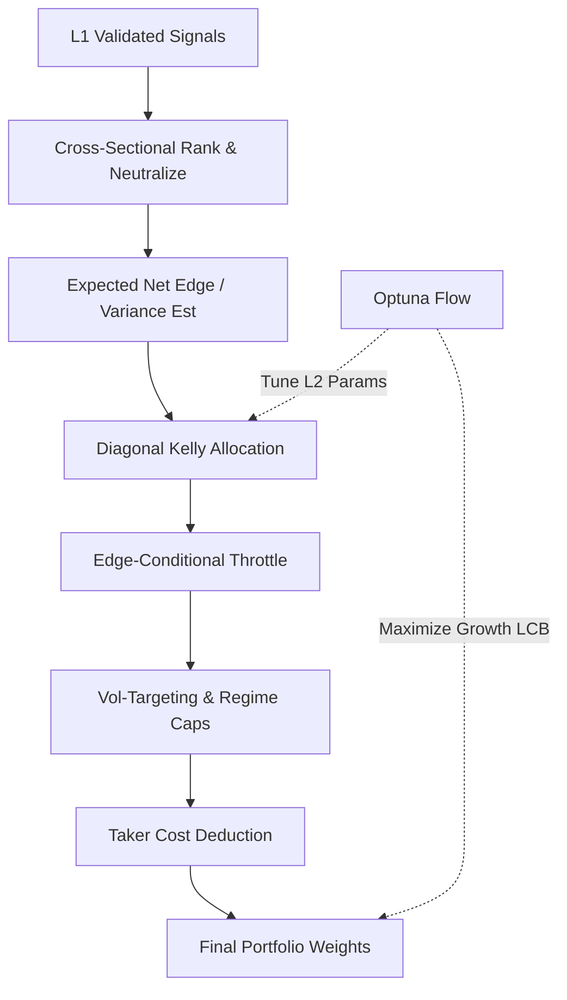

# 1. Purpose
Transforms L1 candidate events into optimal portfolio weights via cross-sectional ranking, regime-conditional shrinkage, and edge-throttled Diagonal Kelly sizing (3-Layer Tiered Hybrid Architecture).

# 2. Tiered Hybrid Architecture (USE_CS_RANK_ENGINE)

**Data Scope (`pick_strategy_data_maps`):** `full_strategy_maps` (the single source feeding the bridge, the tiered END-coverage filter, and `align_data_maps`) is the per-symbol **IS+OOS merge** (`concat → sort_values("datetime") → drop_duplicates(keep="first")`), spanning `[fetch_start, holdout_end]`. This lets the same `aligned` frame serve L1/L2 (pre-holdout calendar range) and L3 (post-holdout-start) without a second data path. `keep="first"` favors the IS row on boundary-timestamp duplicates (no look-ahead).

**L2 Fold Anchoring (`n_bars` invariant):** `build_walk_forward_folds`'s `global_oos_start/end` are computed *proportionally* to its `n_bars` argument (unlike L1's `build_l1_nested_swf_folds`, which is anchored by explicit `l1_start_idx`/`l1_end_idx` and uses `n_bars` only as an upper-bound check). Because of this, `run_tiered_pipeline` MUST pass `n_bars=ho_start_idx_l2` (bars up to `window.holdout_start`) to `build_walk_forward_folds` — never `len(aligned.datetimes)` — even though `aligned` itself spans the full IS+OOS+holdout range for L3's benefit. Passing the full length collapses the AWF fold count (regression observed: 3→1 folds, Optuna feasible-trial count → 0) since most generated folds land past `holdout_start` and get filtered out by the `[l2_start, holdout_start)` post-filter.

**Layer 1: SWF Strategy Panel Validation**
- Validates incoming signal panels via prequential evidence.
- **Gate**: Fold coverage $\ge 0.80$, valid strategies $\ge 5$, diversity $\ge 0.50$, CS fold pass ratio $\ge 0.60$.

**Layer 2: CS Rank & Diagonal Kelly AWF**
- **Signal Processing**: Absolute CS Ranking $\to$ BTC-$\beta$ Neutralization.
- **Kelly Sizing**:
  - Symmetric $q_{10}, q_{90}$ estimation for volatility: $\sigma_R = (q_{90} - q_{10})/2.563$.
  - Fractional Diagonal Kelly: $w_i \propto f_k \cdot \mu_i / \sigma_i^2$ subject to friction masks.
- **Edge-Conditional Throttle**: Time-varying conviction multiplier $m_t \in [0,1]$ applied based on gross-weighted net-of-cost edge.
- **Active Deployment Controls**:
  - `deploy_cost_safety_mult` isolates deployment friction from gross-edge conversion.
  - `edge_throttle_min_active_mult` preserves a non-zero floor for positive edge books.
  - `risk_budget_floor_ratio` scales under-deployed books toward the target-vol floor without creating new support.
  - `risk_budget_max_scale` caps the upward scaling applied by the floor logic.
- **Adaptive Breadth & Objective Shaping**:
  - `adaptive_breadth_enabled` can widen `K_RANK` when the previous book under-uses the vol budget.
  - `adaptive_k_extra` limits the breadth expansion window.
  - `adaptive_expand_below_vol_ratio` defines the low-utilization trigger against the annual vol target.
  - `l2_objective_risk_util_target` and `l2_objective_trade_target` shape Optuna toward more active deployment without replacing `growth_lcb` as the primary objective.
- **Dynamic Scaling**: Volatility targeting ($\sigma_{target} / \sigma_{port}$) combined with regime-specific gross/net caps. Includes double-scaling guards.
- **L2 Objective Gate (13-Condition AND)**:
  - *Sanity*: Active signals, safe deployments, trade count $\ge 30$.
  - *Growth*: Post-cost $\text{CAGR} > 0.30$.
  - *Efficiency*: $\text{Sharpe} \ge 1.0$, $\text{Sortino} \ge 1.5$ (표준 TDD: $\sqrt{\frac{1}{N}\sum\min(r_i-T,0)^2}$, 전표본 N 정규화), $\text{MAR} \ge 1.0$.
  - *Risk*: $\text{MDD} \le 0.30$, $\text{CVaR}_{95} \le 0.06$.
  - *Robustness*: Fold pass ratio $\ge 0.60$, friction pass $\ge 0.50$, active blocks $\ge 3$.
  - *Relative Edge*: $\text{Uplift LCB} > 0$, $\text{Sharpe Uplift} > 0.20$ vs 1/N baseline.
  - *Integrity*: $\text{DSR} \ge 0.60$ — 다중검정 보정(Bailey & López de Prado) 후 잔존 스킬 확률; `blocker_reason != ""` 또는 `best_evaluation is None`인 챔피언은 L3 승격 **불가(hard block)**.
- **OOS Fraction**: `ml_fit_fraction=0.55` + `ml_calibration_fraction=0.15` → **OOS 30%** (fold당 ~27일). 구조적 과적합 방지 목적.
- **Worst-Fold Soft Penalty**: objective에 `max(0, -0.30 − worst_fold_sharpe) × 0.005` 차감. 최신 fold 파국붕괴(-1.0↓)를 비용화 (하드 제약 아님 — feasible pool 보존).

**Layer 3: Frozen Holdout**
- Tests the L2 champion on an untouched WFFold.
- **Gate**: $\text{Sharpe} \ge \text{Sharpe}_{baseline} \land \text{MDD} \le \text{MDD}_{baseline}$.

# 3. Decoupled Optuna Optimization Flow

Optimization runs independently per layer, prioritizing conservative growth metrics (LCB).
- **Step A (L1 Valid)**: Pipeline targets `l1`. Early exit if blocked.
- **Step B (L2 Prep)**: Builds causal signal batch from L1 results using historical training windows.
- **Step C (L2 Study)**: Maximizes `growth_lcb - worst_fold_penalty` via TPESampler (`V6` 8-param, 200 trials). Constrained by the 13-stage L2 Gate. Features a Champion Store ledger for safe warm-starts. `blocker_reason != ""` 챔피언은 Step D 진입 **차단**.
- **Step D (L3 Eval)**: Runs final pipeline simulation applying `l2_params` and evaluates the frozen holdout.

# 4. Architecture Flow

# 5. Core Variables & I/O

| Type | Variable | Description |
|------|----------|-------------|
| **Input** | `ValidatedSignalBatch` | Tabulated L1 signal events with OOS edge |
| **Param** | `USE_CS_RANK_ENGINE` | Core architecture flag. Set to `True` for Tiered Hybrid. |
| **Param** | `kelly_fraction` | Target fractional Kelly sizing bound [0.15, 0.55] |
| **Param** | `edge_throttle_enabled` | Toggles the time-varying conviction multiplier |
| **Param** | `deploy_cost_safety_mult` | Deployment-stage friction safety multiplier |
| **Param** | `edge_throttle_min_active_mult` | Minimum active multiplier for positive edge books |
| **Param** | `risk_budget_floor_ratio` | Minimum annual vol ratio used to lift under-deployed books |
| **Param** | `risk_budget_max_scale` | Upper bound for risk-budget floor scaling |
| **Param** | `adaptive_breadth_enabled` | 동결: `False` (V6에서 탐색공간 제외) |
| **Param** | `adaptive_k_extra` | 동결: `0` |
| **Param** | `adaptive_expand_below_vol_ratio` | 동결: `0.0` |
| **Param** | `L2_ALLOC_SPACE` | Active L2 Optuna search space (`V6`, 8-param — V5 14-param 대비 다중검정 deflation 축소) |
| **Param** | `L2_OPTUNA_TRIALS` | Optimization budget for Layer 2. Default: 200 |
| **Param** | `regime_gross_multipliers` | Gross portfolio cap limits mapped to specific regimes |
| **Param** | `double_scaling_guard` | Prevents redundant attenuation during portfolio projection |
| **Param** | `risk_utilization` | Diagnostic ratio of realized MDD versus the configured MDD cap |
| **Param** | `deployment_objective_bonus` | Shaped objective uplift used only inside Optuna |
| **Output**| `target_weights` | Causal vector of capital allocations per asset |

# 6. Edge Cases & Resilience
- **Survival Censoring**: Negative out-of-sample edge folds have predictions zeroed to prevent capital allocation into degrading factors.
- **Fail-SAFE Logic**: If OOS proof logic falters, architecture falls back to unconditionally stable `archetype_only` conditioning.
- **NaN Protection**: Tradeable masks naturally sever allocations on corrupted data points without crashing execution.
