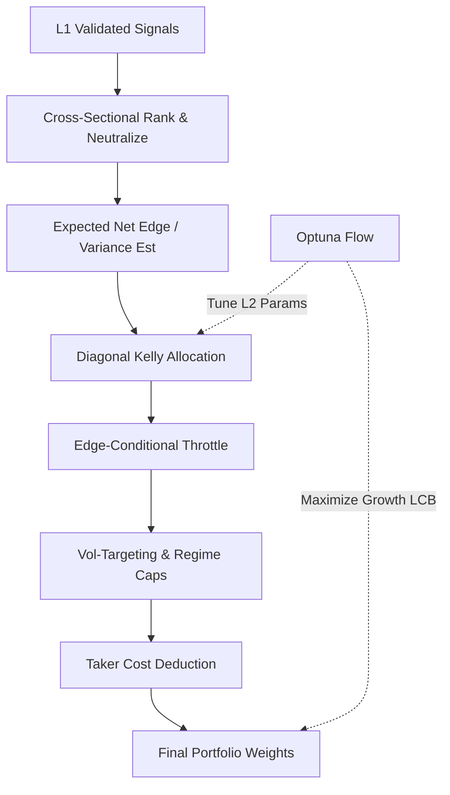

# 1. Purpose
Transforms L1 candidate events into optimal portfolio weights via cross-sectional ranking, regime-conditional shrinkage, and edge-throttled Diagonal Kelly sizing (3-Layer Tiered Hybrid Architecture).

# 2. Tiered Hybrid Architecture (USE_CS_RANK_ENGINE)

**Data Scope (`pick_strategy_data_maps`):** `full_strategy_maps` (the single source feeding the bridge and `align_data_maps`) is the per-symbol **IS+OOS merge** (`concat → sort_values("datetime") → drop_duplicates(keep="first")`), spanning `[fetch_start, holdout_end]`. `keep="first"` favors the IS row on boundary-timestamp duplicates (no look-ahead). The tiered entry scope is derived from `valid_symbols` in two stages: `base_scope` keeps only symbols with a non-empty timeframe frame, then strict sub-window admission applies warm-up / density / OOS coverage guards before `run_tiered_pipeline` starts.

**L2 Fold Anchoring (`n_bars` invariant):** `build_walk_forward_folds`'s `global_oos_start/end` are computed *proportionally* to its `n_bars` argument (unlike L1's `build_l1_nested_swf_folds`, which is anchored by explicit `l1_start_idx`/`l1_end_idx` and uses `n_bars` only as an upper-bound check). Because of this, `run_tiered_pipeline` MUST pass `n_bars=ho_start_idx_l2` (bars up to `window.holdout_start`) to `build_walk_forward_folds` — never `len(aligned.datetimes)` — even though `aligned` itself spans the full IS+OOS+holdout range for L3's benefit. Passing the full length collapses the AWF fold count (regression observed: 3→1 folds, Optuna feasible-trial count → 0) since most generated folds land past `holdout_start` and get filtered out by the `[l2_start, holdout_start)` post-filter.

**L2 Signal Provenance:** `ValidatedSignalBatch` is the L2 input SSOT. `_signal_batch_fingerprint()` hashes batch boundaries, symbols, registry/model versions, event count, and every event field in tuple order with streaming SHA-256. `_layer2_experiment_key()` binds study identity to the window and this fingerprint, so equal event counts with different batch content resolve to different study names. `_run_tiered_l2_study()` logs event count, unique symbols, and the fingerprint prefix for replay provenance.

**Layer 1: SWF Strategy Panel Validation**
- Validates incoming signal panels via prequential evidence.
- **Gate**: Fold coverage $\ge 0.80$, valid strategies $\ge 5$, diversity $\ge 0.50$, CS fold pass ratio $\ge 0.60$.

**Layer 2: CS Rank & Diagonal Kelly AWF**
- **Signal Processing**: Absolute CS Ranking $\to$ BTC-$\beta$ Neutralization.
- **Kelly Sizing**:
  - Symmetric $q_{10}, q_{90}$ estimation for volatility: $\sigma_R = (q_{90} - q_{10})/2.563$.
  - Fractional Diagonal Kelly: $w_i \propto f_k \cdot \mu_i / \sigma_i^2$ subject to friction masks.
  - `vol_target` **항상 활성**: `max_ann_vol=None` 시 unit-vol 정규화(`vol_target=1.0`) 강제 → `risk_budget_floor`·`adaptive_breadth` 재활성 보장(RC-1 cascade 방지).
- **Edge-Conditional Throttle**: Time-varying conviction multiplier $m_t \in [0,1]$ applied based on gross-weighted net-of-cost edge.
- **Active Deployment Controls**:
  - `deploy_cost_safety_mult` isolates deployment friction from gross-edge conversion.
  - `edge_throttle_min_active_mult` preserves a non-zero floor for positive edge books.
  - `risk_budget_floor_ratio` scales under-deployed books toward the target-vol floor without creating new support.
  - `risk_budget_max_scale` caps the upward scaling applied by the floor logic.
- **Search Space V9**:
  - 9 free dims: `K_RANK`, `REBALANCE_BARS`, `CS_Z_SCORE_THRESHOLD`, `deploy_cost_safety_mult`, `edge_throttle_min_active_mult`, `edge_ref_bps`, `edge_throttle_gamma`, `risk_budget_floor_ratio`, `risk_budget_max_scale`.
  - `L2_ALLOC_SPACE` aliases `L2_ALLOC_SPACE_V9`. `kelly_fraction`·`max_ann_vol`는 shape 정규화로 흡수(Optuna 탐색 불필요).
- **Optuna Objective — Scale-Invariant Sortino_HAC (D1)**:
  - $J = \text{Sortino\_HAC\_unit} - \lambda_w \cdot \max(0, \tau_{wf} - \text{worst\_fold\_Sortino}) - \lambda_d \cdot \text{downside\_dispersion}$
  - `Sortino_HAC_unit` = unit-vol 정규화 book의 HAC downside deviation 기반 Sortino. 레버리지 불변 → 사후 L*와 정합(RC-2 해소).
  - `growth_lcb`는 **diagnostic**으로 강등(목적에서 제외).
- **Phase B: fit-leg 기반 결정론적 리스크 배치 (`risk_deployment.py`)**:
  - **C1 - fit-leg book 정확도**: AWF fit-leg 루프가 OOS와 동일한 체인(rank→kelly→throttle→tradeable mask→cost→funding)으로 per-bar book 수익률 수집. 과거 equal-weight 시장수익률 평균(market MDD~25%)이 L*를 1로 압착하던 RC-2 수정.
  - **C2 - trial-내 L* 결정**: `evaluate_l2_trial`이 `calibrate_deployment_leverage(fit_rets=fit_rets_hybrid, l_hard_cap=20.0)` 호출 → `L* = clip(min(L_mdd, L_cvar), 1.0, 20.0)`. `cagr_hybrid/mdd_hybrid/cvar_95_hybrid`는 `apply_deployment(rets, L*)`의 deployed 값. `sortino/sharpe/psr`는 unit-vol(scale-invariant) 유지. `deploy_leverage` 필드로 기록.
  - **C3 - gate 자동 정렬**: gate가 `candidate_evaluation.cagr_hybrid`(deployed) 직접 사용 → C2 변경으로 자동 정렬(코드 수정 불필요).
  - **C4 - 배치 실현 경로 정정 (2026-06-18 재정의)**: `max_ann_vol/gross_cap` 천장주입(구조적 no-op)을 **수익률 직접 스케일**로 교체. `run_l2_awf(deploy_leverage=L*)`가 `apply_deployment(sim.rets_hybrid, L*)` 호출 → `cagr/mdd/cvar` 재산출. Sharpe/Sortino/PSR는 unit-vol 유지(레버리지 불변). `exchange_leverage_cap`(기본 10×)으로 거래소 실행가능 상한 제한. `l2_deploy_cvar_margin`(기본 0.20) 노브 추가.
  - fit-leg 미노출 시 OOS proxy fallback + `mdd_margin=0.30` 완충. `binding ∈ {mdd, cvar, hard_cap, exchange_cap, none}`. champion L*는 `l2_params["l2_deploy_leverage"]`로 SSOT 전달(recalibrate drift 0).
- **Dynamic Scaling**: Volatility targeting ($\sigma_{target} / \sigma_{port}$) combined with regime-specific gross/net caps. Vol scaling supports bidirectional normalization (upscale+downscale) via `allow_vol_upscale=True`, or downscale-only via `allow_vol_upscale=False` (default). Includes double-scaling guards.
- **L2 Gate Contract (D1/D4)**:
  - `Layer2GateEvaluation.optuna_constraint_values` is the 9-value safety vector (deployment, leak, mdd, cvar, fold_pass_ratio, **recent_fold**, active_blocks, friction, trades) fed to `TPESampler(constraints_func=...)`.
  - `Layer2GateEvaluation.promotion_constraint_values` is the full replay gate vector used for champion promotion.
  - Optuna feasibility covers deployment/leak/risk/coverage/trade floors only.
  - Final promotion gate (3단): **Sortino ≥ 1.5** (1차) + **Sharpe ≥ 0.7** (sanity floor; 하방 표본 희소 시 Sortino 인플레이션 방어) + **Calmar ≥ 0.5** (복리 앵커) + `CAGR`, `MAR`, `PSR`, `growth_lcb`, `uplift`.
  - Replay promotion also requires the latest non-empty deployed fold to pass `recent_fold` when enabled; the recent fold is evaluated on deployed `CAGR > 0` and optional minimum Sharpe floor.
  - `CAGR >= 0.30` remains a hard promotion gate and is not embedded as an Optuna objective bonus.
  - `l2_max_exchange_leverage` defaults to `10.0` when absent, and explicit `None` is reserved for disabling the exchange cap.
- **DSR Role (D4)**:
  - **L2**: `dsr_floor` BLOCKER 제거 → **PSR(N=1) gate**(`psr_floor ≥ 0.90`) 신설. DSR = diagnostic 잔존(계산·로깅·스코어카드, 차단 권한 없음).
  - **DSR 근거**: L2 pool = 동일 신호셋 파라미터 섭동 → 독립 가설 불성립 → 자기참조 → DSR≈0.5 고정(실엣지 무관). 진짜 다중검정 방어는 L1 DSR 게이트 + L3 multi-seed stability.
  - **DSR 벤치마크**: Bailey-LdP null SR=0 정론 적용 — `+mean(pool)` 항 제거(`std(pool)·√(2·ln N_eff)` only).
- **OOS Fraction**: `ml_fit_fraction=0.55` + `ml_calibration_fraction=0.15` → **OOS 30%** (fold당 ~27일). 구조적 과적합 방지 목적.
- **Replay Championing**:
  - `select_layer2_champion`이 frontier 전수를 replay하여 gate-pass 후보를 **전수 수집** → `argmax(sortino_hybrid, cagr)` 선택 (이전: argmax(dsr, cagr) — D4 변경).
- **Layer2FoldDiagnostics**: `compute_layer2_fold_diagnostics()`가 각 fold의 unit Sharpe, deployed CAGR/MDD, compound pass, selected symbols를 산출. `Layer2TrialEvaluation`에 `recent_fold_passed/sharpe/cagr/mdd`, `latest_to_median_cagr`, `fold_deployed_cagrs`, `fold_selected_symbols` 필드 저장 → Optuna attr 기록 및 gate 입력.
- **Config Defaults**: `l2_min_sharpe_abs` fallback 1.0→0.7; `l2_min_sortino` passthrough (legacy `l2_min_sortino_abs` fallback); `l2_min_calmar=0.5` 추가.
- **Universe Audit**: `build_layer_universe_audit()`가 레이어별 window slice의 active/entry_block/kill mask 통계를 산출하여 `LayerUniverseAudit` 반환. `run_tiered_pipeline` L1/L2/L3 각 단계에서 `format_layer_universe_audit_table()` 로깅. 진단 전용(포트폴리오 무게 미변경).

**Layer 3 Deployment Parity**
- `run_tiered_pipeline`는 L2 champion의 `l2_deploy_leverage`를 L3 holdout에도 동일하게 전달한다.
- `run_l3_holdout(deploy_leverage=L*)`는 L2 final scorecard와 동일한 `apply_deployment(rets, L*)` 경로로 hybrid holdout의 CAGR/MDD/CVaR/terminal compounding을 재계산한다.
- `deploy_leverage`는 1.0 이하 또는 비유한값이면 무효화되어 unit path를 유지한다.

**Layer 3: Frozen Holdout**
- Tests the L2 champion on an untouched WFFold.
- **Gate**: $\text{Sharpe} \ge \text{Sharpe}_{baseline} \land \text{MDD} \le \text{MDD}_{baseline}$.

# 3. Decoupled Optuna Optimization Flow

Optimization runs independently per layer, prioritizing conservative growth metrics (LCB).
- **Step A (L1 Valid)**: Pipeline targets `l1`. Early exit if blocked.
- **Step B (L2 Prep)**: Builds causal signal batch from L1 results using historical training windows.
- **Step C (L2 Study)**: Maximizes `growth_lcb - worst_fold_penalty - λ_down·semidev - λ_turnover - λ_funding` via TPESampler (`V8` 9-param, 200 trials). **Fix B**: MDD/CVaR 소프트 패널티 제거 — 하드게이트만 유지, 탐색이 CAGR·DSR 방향으로 정렬됨. Champion은 frontier 전수에서 `argmax(dsr, cagr)` 선택. `blocker_reason != ""` 챔피언은 Step D 진입 **차단**.
- **Step C-Post (Phase B)**: Champion 선택 직후 `calibrate_deployment_leverage`로 L* 결정 → kelly/vol 스케일링. 추가 Optuna trial 없음 → DSR deflation 미증가.
- **Step D (L3 Eval)**: Runs final pipeline simulation applying `l2_params` and evaluates the frozen holdout.

# 4. Architecture Flow

# 5. Core Variables & I/O

| Type | Variable | Description |
|------|----------|-------------|
| **Input** | `ValidatedSignalBatch` | Tabulated L1 signal events with OOS edge |
| **Param** | `USE_CS_RANK_ENGINE` | Core architecture flag. Set to `True` for Tiered Hybrid. |
| **Param** | `kelly_fraction` | Phase B 배치 후 동적 결정 (`default=0.25 × L*`). V8 탐색공간에서 제외. |
| **Param** | `edge_throttle_enabled` | Toggles the time-varying conviction multiplier |
| **Param** | `deploy_cost_safety_mult` | Deployment-stage friction safety multiplier |
| **Param** | `edge_throttle_min_active_mult` | Minimum active multiplier for positive edge books |
| **Param** | `edge_ref_bps` | Deployment edge reference used by the throttle shape |
| **Param** | `edge_throttle_gamma` | Throttle curvature exponent |
| **Param** | `risk_budget_floor_ratio` | Minimum annual vol ratio used to lift under-deployed books |
| **Param** | `risk_budget_max_scale` | Upper bound for risk-budget floor scaling |
| **Param** | `Layer2GateEvaluation` | Split gate contract: safety vs promotion |
| **Param** | `L2_ALLOC_SPACE` | Active L2 Optuna search space (`V8`, 9-param, kelly/vol 제거) |
| **Param** | `L2_OPTUNA_TRIALS` | Optimization budget for Layer 2. Default: 200 |
| **Param** | `regime_gross_multipliers` | Gross portfolio cap limits mapped to specific regimes |
| **Param** | `double_scaling_guard` | Prevents redundant attenuation during portfolio projection |
| **Param** | `risk_utilization` | Diagnostic ratio of realized MDD versus the configured MDD cap |
| **Param** | `deployment_objective_bonus` | Shaped objective uplift used only inside Optuna |
| **Param** | `l2_signal_fingerprint` | Deterministic replay fingerprint for `ValidatedSignalBatch` |
| **Output**| `l2_study_name` | SHA-256 study identity bound to window and signal fingerprint |
| **Output**| `target_weights` | Causal vector of capital allocations per asset |

# 6. Edge Cases & Resilience
- **Survival Censoring**: Negative out-of-sample edge folds have predictions zeroed to prevent capital allocation into degrading factors.
- **Fail-SAFE Logic**: If OOS proof logic falters, replay selection falls back to the best diagnostic candidate while preserving the final blocker reason.
- **NaN Protection**: Tradeable masks naturally sever allocations on corrupted data points without crashing execution.
