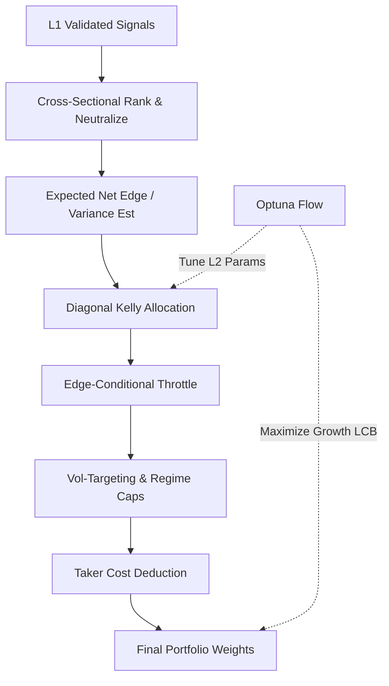

# 1. Purpose
Transforms L1 candidate events into optimal portfolio weights via cross-sectional ranking, regime-conditional shrinkage, and edge-throttled Diagonal Kelly sizing (3-Layer Tiered Hybrid Architecture).

# 2. Tiered Hybrid Architecture (USE_CS_RANK_ENGINE)

**Layer 1: SWF Strategy Panel Validation**
- Validates incoming signal panels via prequential evidence.
- **Gate**: Fold coverage $\ge 0.80$, valid strategies $\ge 5$, diversity $\ge 0.50$, CS fold pass ratio $\ge 0.60$.

**Layer 2: CS Rank & Diagonal Kelly AWF**
- **Signal Processing**: Absolute CS Ranking $\to$ BTC-$\beta$ Neutralization.
- **Kelly Sizing**:
  - Symmetric $q_{10}, q_{90}$ estimation for volatility: $\sigma_R = (q_{90} - q_{10})/2.563$.
  - Fractional Diagonal Kelly: $w_i \propto f_k \cdot \mu_i / \sigma_i^2$ subject to friction masks.
- **Edge-Conditional Throttle**: Time-varying conviction multiplier $m_t \in [0,1]$ applied based on gross-weighted net-of-cost edge.
- **Active Deployment Controls**:
  - `deploy_cost_safety_mult` isolates deployment friction from gross-edge conversion.
  - `edge_throttle_min_active_mult` preserves a non-zero floor for positive edge books.
  - `risk_budget_floor_ratio` scales under-deployed books toward the target-vol floor without creating new support.
  - `risk_budget_max_scale` caps the upward scaling applied by the floor logic.
- **Dynamic Scaling**: Volatility targeting ($\sigma_{target} / \sigma_{port}$) combined with regime-specific gross/net caps. Includes double-scaling guards.
- **L2 Objective Gate (12-Condition AND)**:
  - *Sanity*: Active signals, safe deployments, trade count $\ge 30$.
  - *Growth*: Post-cost $\text{CAGR} > 0.30$.
  - *Efficiency*: $\text{Sharpe} \ge 1.0$, $\text{Sortino} \ge 1.5$, $\text{MAR} \ge 1.0$.
  - *Risk*: $\text{MDD} \le 0.30$, $\text{CVaR}_{95} \le 0.06$.
  - *Robustness*: Fold pass ratio $\ge 0.60$, friction pass $\ge 0.50$, active blocks $\ge 3$.
  - *Relative Edge*: $\text{Uplift LCB} > 0$, $\text{Sharpe Uplift} > 0.20$ vs 1/N baseline.

**Layer 3: Frozen Holdout**
- Tests the L2 champion on an untouched WFFold.
- **Gate**: $\text{Sharpe} \ge \text{Sharpe}_{baseline} \land \text{MDD} \le \text{MDD}_{baseline}$.

# 3. Decoupled Optuna Optimization Flow

Optimization runs independently per layer, prioritizing conservative growth metrics (LCB).
- **Step A (L1 Valid)**: Pipeline targets `l1`. Early exit if blocked.
- **Step B (L2 Prep)**: Builds causal signal batch from L1 results using historical training windows.
- **Step C (L2 Study)**: Maximizes `growth_lcb` via TPESampler. Constrained by the 12-stage L2 Gate. Features a Champion Store ledger for safe warm-starts.
- **Step D (L3 Eval)**: Runs final pipeline simulation applying `l2_params` and evaluates the frozen holdout.

# 4. Architecture Flow

# 5. Core Variables & I/O

| Type | Variable | Description |
|------|----------|-------------|
| **Input** | `ValidatedSignalBatch` | Tabulated L1 signal events with OOS edge |
| **Param** | `USE_CS_RANK_ENGINE` | Core architecture flag. Set to `True` for Tiered Hybrid. |
| **Param** | `kelly_fraction` | Target fractional Kelly sizing bound [0.15, 0.55] |
| **Param** | `edge_throttle_enabled` | Toggles the time-varying conviction multiplier |
| **Param** | `deploy_cost_safety_mult` | Deployment-stage friction safety multiplier |
| **Param** | `edge_throttle_min_active_mult` | Minimum active multiplier for positive edge books |
| **Param** | `risk_budget_floor_ratio` | Minimum annual vol ratio used to lift under-deployed books |
| **Param** | `risk_budget_max_scale` | Upper bound for risk-budget floor scaling |
| **Param** | `L2_ALLOC_SPACE` | Active L2 Optuna search space (`V4`) |
| **Param** | `L2_OPTUNA_TRIALS` | Optimization budget for Layer 2. Default: 120 |
| **Param** | `regime_gross_multipliers` | Gross portfolio cap limits mapped to specific regimes |
| **Param** | `double_scaling_guard` | Prevents redundant attenuation during portfolio projection |
| **Output**| `target_weights` | Causal vector of capital allocations per asset |

# 6. Edge Cases & Resilience
- **Survival Censoring**: Negative out-of-sample edge folds have predictions zeroed to prevent capital allocation into degrading factors.
- **Fail-SAFE Logic**: If OOS proof logic falters, architecture falls back to unconditionally stable `archetype_only` conditioning.
- **NaN Protection**: Tradeable masks naturally sever allocations on corrupted data points without crashing execution.
