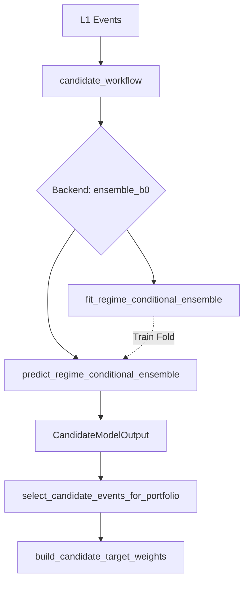
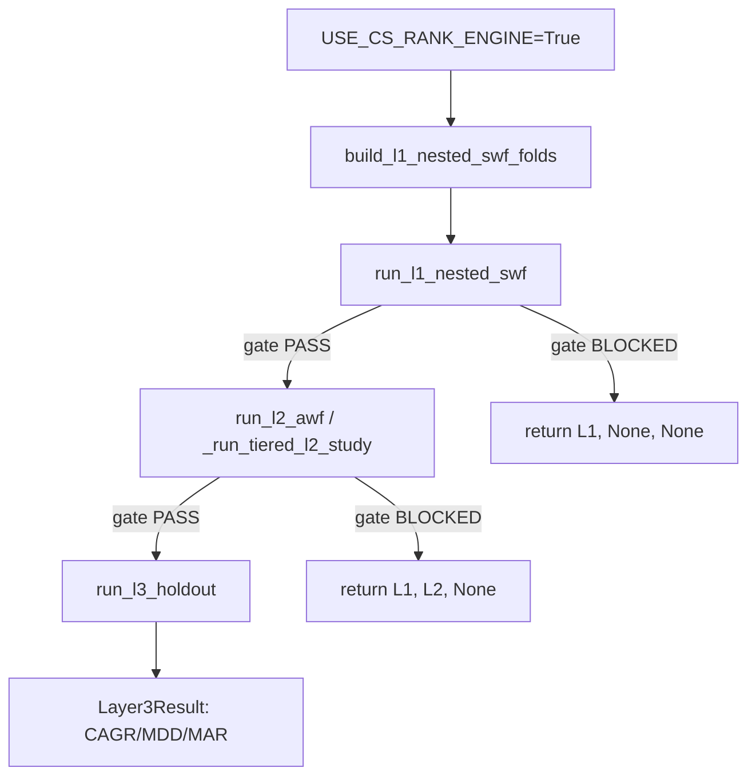

# 1. Purpose
Transforms L1 candidate events into optimal portfolio weights via regime-conditional shrinkage ensemble and stop-risk/Kelly sizing.

# 2. Core Logic & Math

**Regime-Conditional Shrinkage (Ensemble B0)**
- $\mu_{\text{net}} (a, g) = \frac{n_{a,g} \cdot \bar{x}_{a,g} + k \cdot \bar{x}_{\text{global}}}{n_{a,g} + k}$
- where $a$ = archetype, $g$ = entry_regime_code, $k$ = `ensemble_shrinkage_k`

**Conditioning Axis Selection (`ensemble_conditioning`)**
- Default `"auto"`: fold마다 IS 내부 검증 Rank IC 비교로 `archetype_regime` vs `archetype_only` 결정.
  - $\Delta IC = IC_{\text{regime}} - IC_{\text{arch}} \geq \text{ensemble\_min\_conditioning\_ic\_gain}$ 이면 `archetype_regime` 선택.
- `"archetype_regime"` / `"archetype_only"` 명시 가능 (수동 override).
- **Fail-SAFE Constraint:** OOS proof window 없이 `archetype_regime`이 선택된 경우 → `archetype_only`로 강등 (`conditioning_path="no_oos_evidence_failsafe"`). 증거 없이 복잡한 경로를 선택하지 않는다.

**Fallback Logic (Two-level)**
- Level 1 (Missing regime): $\mu(a, g) \rightarrow \mu(a)$
- Level 2 (Missing archetype): $\mu(a) \rightarrow \mu_{\text{global}}$

**Signal Evaluation Gates (OOS)**
- $IC_{\text{rank}} = \text{Spearman}(\text{score}, \text{target})$ over OOS window. Gate: $IC_{\text{rank}} \geq \text{min\_oos\_rank\_ic}$
- $t_{\text{stat}} = IC_{\text{rank}} \times \sqrt{\frac{N_{\text{oos}} - 2}{1 - IC_{\text{rank}}^2}}$. Gate: $t_{\text{stat}} \geq \text{min\_ic\_tstat}$
- Q10 Tail Risk: $\text{Fail Rate} \leq \text{max\_variant\_oos\_q10\_fail\_rate}$

**Regime-Cell Bayesian Admission (Orthogonal Signal Rescue)**
- Unified admission criterion: $p_{\text{admit}} = P(\mu > \delta \mid \text{data}) \geq p_{\text{admit\_min}}$
- Prior: $\mu \sim \mathcal{N}(\mu_0, \tau^2)$ where $\tau^2$ = cross-cell variance (data-derived; fallback `admission_tau_prior_bps²`)
- Likelihood: $\bar{x} \mid \mu \sim \mathcal{N}(\mu, \Omega_{nw}/n)$ with Newey-West long-run variance $\Omega_{nw}$ (Bartlett kernel)
- N-N conjugate posterior: $\sigma^2_{\text{post}} = 1/(n/\Omega_{nw} + 1/\tau^2)$, $\mu_{\text{post}} = \sigma^2_{\text{post}}(n\bar{x}/\Omega_{nw} + \mu_0/\tau^2)$
- $p_{\text{admit}} = \Phi((\mu_{\text{post}} - \delta)/\sigma_{\text{post}})$ via survival function; $\delta$ = `min_regime_cell_edge_bps`
- James-Stein shrinkage: $k_0 = \Omega_{nw}/\tau^2$ derived from data — no hard-coded regularization
- `min_regime_cell_oos_obs` = NW variance stability floor only (default 10); **not** a domain gate
- OR-path: if `regime_cell_admitted=True`, bypasses global pooled gates (`min_obs`, `breakeven_hard_gate`, `mean_edge`, etc.)
- Replaces: `min_obs=60`, `min_tstat=1.0` (statistically inconsistent; effect-size-agnostic)

**Direction A: Regime-Conditional Score Slope (score_z → μ calibration)**
- Opt-in via `ensemble_score_calibration_enabled=True`. Applied on top of cell lookup.
- Per-regime shrunk-OLS: $\beta_g = \rho_g \cdot (\sigma_y / \sigma_z)$, shrunk: $\hat{\beta}_g = \frac{n_g}{n_g + k_{\text{slope}}} \cdot \beta_g$ (James-Stein toward 0)
- Prediction when `score_calibration_valid[g]=True`: $\mu(e) = \alpha_g + \hat{\beta}_g \cdot \text{clip}(z, -Z_{\text{clip}}, Z_{\text{clip}})$
- Validation: `score_calibration_valid[g]` requires IS $\hat{\beta}_g > 0$ **AND** OOS tail-probe $\rho_{\text{probe}} > 0$ (sign persistence). If probe window < 10 events, IS-only check applies.
- Fail-safe: `score_calibration_valid[g]=False` → falls back to cell/archetype lookup (regression-free).
- **Status: Active, but cross-sectional power not confirmed.** `score_z` (within-variant 2160-bar causal percentile) lacks cross-sectional alpha. Realized IC ≈ -0.046 with 3/6 regimes valid.

**Direction B: Symmetric q90 Estimation for Kelly σ**
- `_fit_cell_means` now returns `cell_q90, arch_q90, global_q90` (9-tuple, previously 6-tuple).
- $q_{90}^{\text{cell}} = w \cdot \hat{q}_{90}^{\text{raw}} + (1-w) \cdot q_{90}^{\text{global}}$ (symmetric with q10 path)
- Kelly σ uses proper inter-decile: $\sigma_R = (q_{90\_R} - q_{10\_R})/2.563$ (bilateral ±1.28σ span, valid)

**Fractional Kelly Sizing (calibrated_event_kelly)**
- $\sigma_R = \frac{q_{90\_R} - q_{10\_R}}{2.563}$
- $second\_moment = \max(\mu_R^2 + \sigma_R^2, 1e-6)$
- $w = \text{kelly\_fraction} \times \frac{\max(\mu_R, 0.0)}{second\_moment}$

**Dynamic Portfolio Caps & Vol-Targeting Guard**
- 타임스텝 $t$의 국면 코드 $Regime_t$에 맞춘 동적 Cap 제약:
  - $Cap_{\text{gross}, t} = Cap_{\text{gross}} \times \text{gross\_multiplier}(Regime_t)$
  - $Cap_{\text{net}, t} = Cap_{\text{net}} \times \text{net\_multiplier}(Regime_t)$
- 이중 볼라틸리티 타겟팅 방지 (`double_scaling_guard`):
  - 켈리/오버레이 사이징을 통해 1차적으로 비중이 스케일링된 경우, 포트폴리오 투영 단계에서 target_ann_vol을 $0.0$으로 처리하여 이중 감쇠(Attenuation)를 우회.

**Portfolio Covariance Kelly (Experimental — `use_portfolio_kelly=True`)**
- Full-covariance extension of diagonal Kelly: $w = f_k \cdot (\hat{\Sigma} + \varepsilon \bar{\sigma}^2 I)^{-1} \mu$
- Covariance: Ledoit-Wolf OAS shrinkage toward $F = \text{diag}(S)$: $\hat{\Sigma} = \delta F + (1-\delta) S$ with analytic $\delta^* = \frac{(1-2/k)\,\text{tr}(S^2)+\text{tr}(S)^2}{(n+1-2/k)(\text{tr}(S^2)-\text{tr}(S)^2/k)}$
- Look-ahead safety: window always $[t-W, t)$; ridge $\varepsilon = \text{cov\_ridge\_eps} \times \bar{\sigma}^2$
- Sign guard: $w_i \leftarrow 0$ if $\text{sign}(w_i) \neq \text{sign}(\mu_i)$
- **Status: Disproven** — OOS CAGR -7.9% vs diagonal +2.8%. Root cause: Markowitz error-maximisation under noisy Σ̂ at current event density (~144 trades / 180-bar window). Disabled by default (`use_portfolio_kelly=False`).

**Walk-Forward Survival Censoring**
- If fold realized edge $<$ `min_fold_realized_edge_bps`, fold fails.
- Failed fold predictions: $\mu, q10, q90, p_{\text{pass}} \rightarrow 0$ to prevent anti-selection in the portfolio pool.

# 3. Architecture Flow

# 4. Core Variables & I/O

| Type | Variable | Description |
|------|----------|-------------|
| **Input** | `events: pd.DataFrame` | Candidate events from L1 signal generation |
| **Input** | `entry_regime_code: int` | Regime code at the time of signal entry |
| **Param** | `ensemble_shrinkage_k` | Regularization strength toward global mean. Bounds: `[0, ∞)` |
| **Param** | `ensemble_conditioning` | Conditioning axis: `"auto"` (default, data-driven) \| `"archetype_regime"` \| `"archetype_only"` |
| **Param** | `ensemble_min_conditioning_ic_gain` | Min IC gain for auto to prefer archetype_regime. Bounds: `[0.0, 1.0]` |
| **Param** | `min_oos_rank_ic` | Minimum OOS Spearman Rank IC. Bounds: `[-1.0, 1.0]` |
| **Param** | `min_ic_tstat` | Minimum IC t-statistic for signal validity. Bounds: `[0.0, ∞)` |
| **Param** | `max_variant_oos_q10_fail_rate` | Maximum allowed fraction of events failing q10 threshold. Bounds: `[0.0, 1.0]` |
| **Param** | `regime_cell_admission_enabled` | Enable Bayesian per-cell admission (default `True`) |
| **Param** | `min_admission_posterior_prob` | $p_{\text{admit\_min}}$: minimum posterior probability. Bounds: `[0.5, 1.0)` |
| **Param** | `admission_use_newey_west` | Use NW autocorr-corrected variance; `False` = IID |
| **Param** | `admission_tau_prior_bps` | Fallback prior std when <2 cells. Bounds: `(0, ∞)` |
| **Param** | `min_regime_cell_oos_obs` | NW stability floor (not domain gate). Default: 10 |
| **Param** | `min_regime_cell_edge_bps` | $\delta$: minimum profitable edge. Default: 8.0 bps |
| **Param** | `ensemble_score_calibration_enabled` | Enable Direction A score slope. Default: `True` (active in prod). |
| **Param** | `ensemble_score_z_clip` | score_z clip bound (±). Default: `3.0`. |
| **Param** | `ensemble_score_calibration_min_obs` | Min events per regime for slope fit. Default: `60`. |
| **Param** | `ensemble_score_slope_k` | James-Stein shrinkage strength for β. Default: `100.0`. |
| **Param** | `double_scaling_guard` | Enable double vol-targeting scaling guard. Default: `True` |
| **Param** | `regime_gross_multipliers` | Gross cap multipliers per regime. Default HSL tailored |
| **Param** | `regime_net_multipliers` | Net cap multipliers per regime. Default HSL tailored |
| **Param** | `bl_shrinkage_var_mult` | Black-Litterman var shrinkage multiplier. Default: `0.20` |
| **Param** | `bl_shrinkage_omega_mult` | Black-Litterman omega shrinkage multiplier. Default: `0.10` |
| **Param** | `L2_OPTUNA_TRIALS` | Number of trials for L2 Optuna hyperparameter optimization. Default: `50` |
| **Output**| `expected_net_bps` | Shrinkage-adjusted expected return per event |
| **Output**| `target_weights` | Final portfolio allocation weights per event |

# 5. Edge Cases & Handling
- **Missing OOS Samples (Sparse Signals):** If $N_{oos} < 3$, $t_{stat}$ is forced to 0.0 to strictly prevent division-by-zero or inflated confidence in rare patterns.
- **Unseen Regimes in Live Trading:** If the system encounters an `(archetype, regime)` tuple missing from the trained ensemble, it falls back gracefully to the archetype mean, then the global mean.
- **OOS Fold Failure (Contamination Defense):** If a walk-forward fold exhibits deeply negative out-of-sample edge, its predictions are censored (forced to 0) rather than dropped, preserving the matrix shape while neutralizing its allocation power.
- **No OOS Evidence (Fail-SAFE):** If `archetype_regime` is selected but no OOS proof window exists (e.g. first fold), the system degrades to `archetype_only` rather than proceeding without evidence. `conditioning_path="no_oos_evidence_failsafe"` is emitted for observability.

---

# 6. 3-Layer Tiered Hybrid Architecture (USE_CS_RANK_ENGINE)

> **Activation:** `OPT_FUTURES_CONFIG["USE_CS_RANK_ENGINE"] = True` (default `False` — Phase D preserved)

## 6.1 Purpose
Cross-sectional ranking + Diagonal Kelly pipeline as a parallel seam to Phase D ensemble. Activated at `_run_strategy_stage` entry; exceptions fall back to Phase D.

## 6.2 Core Math

**Layer 1 — SWF Strategy Panel Validation**
- Folds: `build_l1_nested_swf_folds` with anchored prequential evidence snapshots and expanding fit.
- Panel validation: `compute_per_strategy_oos_validation(fold_tuples=futures)` evaluates the strategy panel with default `min_obs=30`, `t_stat_floor=1.5`, `consistency_floor=0.60`.
- Fold diagnostics: `cs_ic_mean`, `cs_ic_tstat`, `cs_ic_fold_pass_ratio`, and `decile_lift_bps` are tracked per fold and aggregated for the gate.
- **Gate**: `trained_fold_coverage >= 0.80`, `n_valid_strategies >= 5`, `panel_diversity >= 0.50`, `cs_ic_fold_pass_ratio >= 0.60`.
- Legacy pooled IC is no longer a gate input and is not shown in the main table; if emitted, it is diagnostic only.

**Layer 2 — CS Rank + Diagonal Kelly AWF**
- BTC-β neutralization: $\mu_{\text{neutral},i} = \mu_i - \beta_i \cdot \bar{\mu}_{\text{mkt}}$ (CS mean as proxy)
- Rank selection: legacy `selection_mode="signed"` preserves historical top-K; Layer 2 uses `selection_mode="absolute"` so strong shorts rank symmetrically.
- **Event-level net edge handoff**: `ValidatedSignalBatch -> Layer2SignalSchedule`, then per-bar `raw_mu = side * expected_net_bps / expected_holding_bars` so direction and holding horizon survive the handoff.
- Diagonal Kelly: $w_i \propto f_k \cdot \mu_i / \sigma_i^2$; friction mask: $|\mu_i| \geq \text{hurdle}_i$; support mask prevents new non-zero support from being created by projection.
- Vol-target scaling: $w \leftarrow w \cdot (\sigma_{\text{target}} / \sigma_{\text{port}})$; caps: gross/per-symbol/net/beta, then revalidate support-preserving projection.
- No-trade band: $|\Delta w_i| < \text{band} \rightarrow w_i \leftarrow w_{\text{prev},i}$
- **Taker cost deduction**: `compute_rebalance_cost(previous_weights, target_weights, round_trip_cost_bps)` uses actual weight delta and applies cost only on rebalance bars.
- **Causal signal schedule**: active events are resolved from `decision_idx` and `expected_holding_bars`; non-overlapping events never create synthetic positions for inactive bars.
- **Numerical Stability & NaN Protection**: tradeable mask and funding rows fail open on malformed mocks; NaN/Inf values are zeroed before sizing and return accounting.
- **AWF Window Constraint**: OOS folds are restricted to `[\text{l2\_start\_idx},\ \text{holdout\_start\_idx})`. No overlap with L1 evidence or L3 holdout.
- **EW Bench baseline**: `w_base = 1/len(selected)` for Top-K selected symbols only — isolates Kelly sizing contribution. (Previously: all valid signals EW, which produced structurally negative baselines and invalidated relative gates.)
- **Gate** (10-condition sequential AND; first failure → `blocker_reason`):
  - **Stage 0 (Deployment Sanity):** `signal_total > 0` AND `friction_pass_pct > 0` AND `support_leak_count == 0` AND `isfinite(sharpe, cagr)` → `no_deployment`
  - **Stage A (Absolute Compound Growth — PRIMARY):**
    1. $\text{CAGR}_{\text{hybrid}} \geq l2\_min\_cagr$ (default **0.15**) — post-cost compound growth ≥15%.
    2. $\text{MAR}_{\text{hybrid}} \geq l2\_min\_mar$ (default **1.0**) — CAGR/MDD ≥ 1 (annual gain ≥ max drawdown).
    3. $\text{Sharpe}_{\text{hybrid}} \geq l2\_min\_sharpe\_abs$ (default **1.0**) — institutional floor for leveraged crypto futures.
  - **Stage B (Risk Control):**
    4. $\text{MDD}_{\text{hybrid}} \leq \text{MDD}_{\text{EW Bench}}$ — relative risk guard vs EW Bench.
    5. $\text{MDD}_{\text{hybrid}} \leq l2\_max\_mdd\_abs$ (default **0.20**) — absolute cap (50% DD requires +100% recovery; 20% cap enforced).
  - **Stage C (Robustness / Anti-overfit):**
    6. $\text{fold\_pass\_ratio} \geq l2\_min\_fold\_pass\_ratio$ (default 0.60); pass = $\prod(1+r_{\text{fold}}) > 1.0$ (compound, not Sharpe-positive).
    7. $\text{PSR} \geq l2\_min\_psr$ (default **0.90**) — Probabilistic Sharpe Ratio (Bailey & López de Prado, 2012): $\text{PSR} = \Phi\!\left(\frac{(\widehat{SR} - SR^*)\sqrt{n-1}}{\sqrt{1 - \gamma_3\widehat{SR} + \frac{\gamma_4-1}{4}\widehat{SR}^2}}\right)$, where $\gamma_3$=skew, $\gamma_4$=non-excess kurtosis. Guards against lucky Sharpe due to skewness/fat tails.
    8. $\text{friction\_pass\_pct} \geq l2\_min\_friction\_pass$ (default **0.50**) — ≥50% of signals must cover their own transaction cost hurdle. Prevents concentration in few high-edge signals.
  - **Stage D (Relative Advantage — SECONDARY, sign-safe additive):**
    9. $\text{Sharpe}_{\text{hybrid}} \geq \text{Sharpe}_{\text{EW Bench}} + l2\_min\_sharpe\_uplift$ (default 0.20). Additive form prevents sign-reversal when baseline Sharpe < 0.
  - All thresholds configurable via `l2_params` keys; default values are crypto-futures conservative floors — do NOT tune to pass a specific backtest.
  - **MAR display guard**: `cagr < 0` → shown as `n/a(loss)` (MAR is non-monotone when CAGR < 0).

**Layer 3 — Frozen Holdout**
- Single WFFold covering `[ho_start, ho_end)`, frozen L2 params.
- CAGR (compound): $\text{CAGR} = \left(\prod_{t=1}^{n}(1+r_t)\right)^{b_{\text{yr}}/n} - 1$ — arithmetic sum approximation removed; total loss ($\prod \leq 0$) returns $-1.0$.
- MAR: $\text{CAGR} / (\text{MDD} + 10^{-9})$
- **Gate**: $\text{Sharpe} \geq \text{Sharpe}_{\text{baseline}}$ AND $\text{MDD} \leq \text{MDD}_{\text{baseline}}$

**Decoupled Optuna**
- `L1_ALPHA_SPACE` → `objective_l1_ic` (IC only; Sharpe not referenced)
- `L2_ALLOC_SPACE` → `objective_l2_growth` (보수적 기대 복리성장 LCB 최대화; 제약 조건은 TPESampler의 `constraints_func`로 전달)
- **DSR-Corrected Selection & Replay**: [selection.py](file:///src/domain/futures/strategy/tiered_workflow/selection.py)에서 완료 trial들의 block signature로 `n_trials_eff`를 연산하고, 최종 챔피언에 대해 DSR 검증(DSR >= min_dsr, Bailey & López de Prado (2012) 기반 per-bar 스케일 교정 수식 적용) 및 결정적 일치 검증(cagr/mdd/growth_lcb)을 강제함.
- Short-circuit: L1 BLOCKED → L2/L3 = None (skip)

**Optuna L2 Execution Flow (Step A→B→C→D):**
- **Step A (L1 Validation):** Executes `run_tiered_pipeline` with `target_phase="l1"` to obtain L1 results. If L1 is blocked, execution returns early.
- **Step B (L2 Signal Batching):** Builds a causal signal batch using the Layer 1 validation results and historical L2 training windows via `_build_l2_signal_batch`.
- **Step C (L2 Study Optimization):** Runs `_run_tiered_l2_study` with `objective_l2_sharpe` (maximizing CAGR, returning `-inf` on gate failures) for `L2_OPTUNA_TRIALS` iterations. Within the objective function, AWF folds are filtered to the L2 window `[l2_start, holdout_start)` to align exactly with the pipeline's evaluation bounds. Verbose table logging is suppressed via `verbose=False` passed to `run_l2_awf`, and a carriage-return (`\r`) callback displays progress as a single line. If all trials fail, falls back to default `l2_params`.
- **Step D (Final Pipeline Run):** Executes `run_tiered_pipeline` with `l1_result_override` containing the L1 result and `l2_params` containing the best parameters found. L1 execution is skipped, directly running the L2 AWF simulation with `verbose=True` to print the final scorecard exactly once.

## 6.3 Architecture Flow

## 6.4 Key Module Map

| Module | Role |
|--------|------|
| `tiered_workflow/` | L1/L2/L3 orchestrator (`pipeline.py`) + `awf_sim.py` shared loop |
| `walk_forward.py` | `WFFold` + `build_l1_nested_swf_folds` (anchored evidence snapshots, expanding fit) |
| `signal_composer.py` | `compose_symbol_signals`: BarRet → SymbolSignal + HAC t-stat |
| `cs_rank.py` | `rank_and_select` + `neutralize_cross_section` (BTC-β wired) |
| `portfolio_constructor.py` | `diagonal_kelly_weights` (friction mask: `abs(mu) >= hurdle`) |
| `tiered_logging.py` | Pure format functions → pipe-table log strings |
| `workflow.py` | `suggest_layered_params` + `objective_l1_ic` / `objective_l2_sharpe` |

## 6.5 Integration Status
- **Active** (`USE_CS_RANK_ENGINE=True` in `OPT_FUTURES_CONFIG`).
- Bridge 실행 완료 후 tiered 분기 진입 — `ml_out.labeled`(Triple-Barrier events) + `align_data_maps(data_maps)` 사용.
- Phase D allocation 스킵 (`return None`); 예외 시 Phase D fallback 보존.
- Phase flag 매핑: `--phase signal` → bridge(신호진단)+L1, `--phase alo` → +L2+L3, `full` → +최적화.
- L1 table rendering uses `CS IC Mean`, `CS IC t-stat`, `CS Fold Pass%`, `Strategy Panel`, `Panel Diversity`, and `Decile Lift`; legacy `Pooled IC` fields are removed from the primary presentation.
- L2 uses `ValidatedSignalBatch` directly; legacy symbol-level averaging is no longer the production contract.

## 6.5.1 Tiered Aligned Scope (Invariant)
- `aligned_tiered` scope = **`Stage6 OOS selected ∩ data_stage.data_maps`** (bridge와 동일, `effective_trade_syms`).
- `data_stage.valid_symbols`(inference union)을 분모로 사용하지 않음 — 신호 생성 범위와 breadth 분모 일치 보장.
- Fallback: `effective_trade_syms`가 공집합이면 `list(data_stage.valid_symbols)` 사용 (하위 호환).
- **Breadth 의미**: "거래하려는 심볼 중 fold 유효 신호 비율" = `n_valid / len(aligned_tiered.symbols)`.
- `Layer1Result.n_trade_scope` = `n_total` (scope 교정 후 동일값; 관측성 필드).

## 6.6 Edge Cases
- **REGIME_FLOOR clamp**: `l1_start > l2_start` → warning logged, L1 window is zero-length.
- **SWF degenerate** (insufficient bars for minimal OOS window): single fallback fold covering full range.
- **Total loss** (cumulative pnl ≤ -1): `_cagr()` returns -1.0; MAR computed with `mdd + 1e-9` guard.
