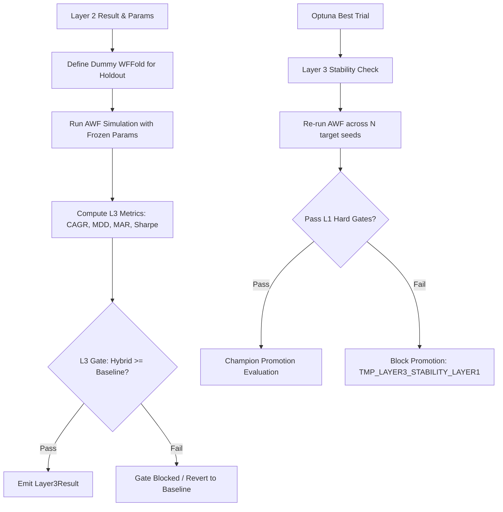

# 1. Purpose
Executes the final out-of-sample (OOS) validation (Layer 3) to ensure strategy robustness. It encompasses both the "Frozen Holdout" evaluation within the Tiered Hybrid Architecture and the multi-seed "Layer 3 Stability Check" during final Optuna optimization.

# 2. Core Logic & Math

## 2.1 Layer 3 — Frozen Holdout (Tiered Pipeline)
Operates as the final verification seam for the CS Rank + Diagonal Kelly (Layer 2) portfolio, using a completely unseen holdout window `[ho_start, ho_end)`.

**Frozen Parameters:**
- Uses the optimal `l2_params` identified during the Layer 2 AWF simulation.
- Hyperparameters are **frozen**; no refitting or parameter adjustment occurs in Layer 3.
- `l2_deploy_leverage`가 존재하면 L3 holdout도 동일 배치 레버리지로 평가한다.

**Performance Metrics (Lean 5-Gate, single-pass compounding focus):**
- **CAGR / Sharpe / Sortino:** Computed on actual hybrid and baseline (1/N) returns using `bars_per_year(tf)` annualization (no vol-proxy approximation).
- **MDD / CVaR95:** Maximum peak-to-trough drawdown and 95% tail loss of the hybrid portfolio.
- **Deployment Parity:** L3 hybrid metrics are computed on `apply_deployment(rets, L*)` output when `deploy_leverage > 1.0`; otherwise L3 stays on the unit path.
- **MAR:** $\text{MAR} = \frac{\text{CAGR}}{\text{MDD} + 10^{-9}}$
- **`total_return` / `equity_multiple`:** Single-pass terminal compounding result (`equity_multiple - 1`), reusing the L2 terminal-multiple helper — no new math, lean reuse per design decision (L3 favors realized compounding over Optuna-grade diagnostics).
- **`n_trades`:** Realized trade count over the holdout window — feeds the `insufficient_trades` gate.
- **`avg_gross_exposure`:** Mean gross exposure across the holdout AWF simulation, diagnostic only.
- **`min_trades` / `max_mdd_abs` / `min_sharpe` / `min_sortino` / `max_cvar95`:** Gate thresholds are persisted on `Layer3Result` and rendered in the scorecard for exact replay alignment.
- **Reversal-Kill Attribution (diagnostic, always propagated):** `risk_off_bars` / `risk_off_realized_price` / `risk_on_realized_price` are taken from `sim.fold_attributions[0]` (the single dummy-fold `Layer2FoldAttribution` produced by `_run_awf_simulation`, same struct L2 already populates) — pure plumbing, no new computation. `reversal_kill_active` reads `os.environ["L2_REVERSAL_KILL"]` directly and independently of the simulation boundary, so it reflects the actual runtime env for this holdout regardless of what the (mockable) simulation returns. The scorecard renders these under an optional `[L3-REVERSAL]` line following the existing `hasattr(r, ...)` diagnostic-field convention (same pattern as `growth_lcb`/`total_cost_bps`).
- **Reversal-Kill Economic Replay (`run_l3_reversal_economic_replay`, opt-in via `L3_REVERSAL_REPLAY` env):** Re-runs `run_l3_holdout` once per variant in `_l2_reversal_replay_variants()` (8 variants: `baseline_off` + 7 `dd_threshold`/`persistence_bars`/`recovery_cooldown_bars` combinations), scoping `L2_REVERSAL_KILL*` env per call via `_temporary_reversal_env` (env restored after each call). Results are written to `docs/results/l3_reversal_replay.csv` and logged via `format_l3_reversal_replay_table`. `L2ReversalReplayVariant` / `_l2_reversal_replay_variants()` / `_temporary_reversal_env()` are shared with the L2 harness (`active_pipeline.py::_run_l2_reversal_economic_replay`) and live in `pipeline.py` (domain layer) — `active_pipeline.py` imports rather than duplicates them, keeping the application→domain dependency direction intact.

**Holdout Gate (L3 Gate, ordered short-circuit):**
1. `no_holdout_returns` — holdout span produced zero returns.
2. `non_finite` — any of CAGR/MDD/Sharpe/Sortino/total_return/equity_multiple is non-finite.
3. `insufficient_trades` — $n_{\text{trades}} < \text{min\_trades}$ (default 10).
4. `negative_return` — $\text{total\_return} \leq 0$.
5. `mdd_abs` — $\text{MDD}_{\text{hybrid}} > \text{max\_mdd\_abs}$ (default 0.35), absolute capital-protection cap independent of baseline.
6. `cvar_95` — $\text{CVaR95}_{\text{hybrid}} > \text{max\_cvar95}$ (default 0.06).
7. `sharpe_abs` — $\text{Sharpe}_{\text{hybrid}} < \text{min\_sharpe}$ (default 0.0).
8. `sortino_abs` — $\text{Sortino}_{\text{hybrid}} < \text{min\_sortino}$ (default 0.0).
- Replaces the legacy single `cagr < 0.0` check — `negative_return`(on `total_return`) is the direct single-pass compounding check; absolute MDD cap defends against a baseline that itself crashed.

**Holdout Data Scope (Data Integrity Fix, 2026-06-16):**
- `aligned.datetimes` passed into `run_l3_holdout` MUST span `[fetch_start, holdout_end]` — i.e. the IS and OOS per-symbol frames merged via `pick_strategy_data_maps` (see `docs/architecture/layer2.md` §2 Data Scope). Previously `aligned` was IS-only (ending at `holdout_start`), making `_resolve_holdout_span` always raise `empty_holdout_window` — a structural bug, not a strategy/data quality finding.
- `_resolve_holdout_span` now logs `start_idx/end_idx/n_bars/last_dt` on the empty-window error path for fast diagnosis if the merge ever regresses.

## 2.2 Layer 3 — Multi-Seed Stability Check (Optimization Stage)
When full Optuna optimization is executed, `check_stability_layer3` enforces that the selected champion strategy demonstrates parameter stability across different random seeds.

**Stability Gate (`FUTURES_TMP_LAYER3_HARD_GATE`):**
- If enabled, every stability-seed AWF replay must independently pass Layer-1 validation checks.
- Prevents overfitting to a specific noise realization within the AWF grid, blocking promotion if the parameter set is fragile.

# 3. Architecture Flow

# 4. Key Components

| Module | Role |
|--------|------|
| `allocation/pipeline.py` | Implements `run_l3_holdout`, defining the dummy fold and calling the AWF sim. |
| `validation/walk_forward.py` | Shared simulation loop (`_run_awf_simulation`) executed with frozen L2 params. Outputs `fold_attributions` (`Layer2FoldAttribution` tuple) per-fold diagnostics. |
| `validation/champion_registry.py` | Defines `ChampionMetrics`, `BaselineChampionMetrics`, `Layer3Result`, promotion gate logic. |
| `optimization/candidate_selector.py` | Implements `check_stability_layer3` for multi-seed validation. |
| `optimization/final_evaluator.py` | Orchestrates the final champion evaluation, invoking Layer 3 stability checks. |

# 5. Integration with Runner

- `src/execution/opt_main_futures.py` (thin entrypoint) delegates to `src/application/futures/runner/cli.py`.
- `runner/pipeline.py` orchestrates Layer 1, Layer 2, and Layer 3 via `run_tiered_pipeline`. `run_l3_holdout` performs the evaluation over the `ho_start` to `end_date` window, logging diagnostics.
- During full optimization, the pipeline proceeds to `_run_optimization_stage` after strategy evaluation. The selected champion candidate undergoes `check_stability_layer3` validation before proceeding to the final Champion Swap logic.
