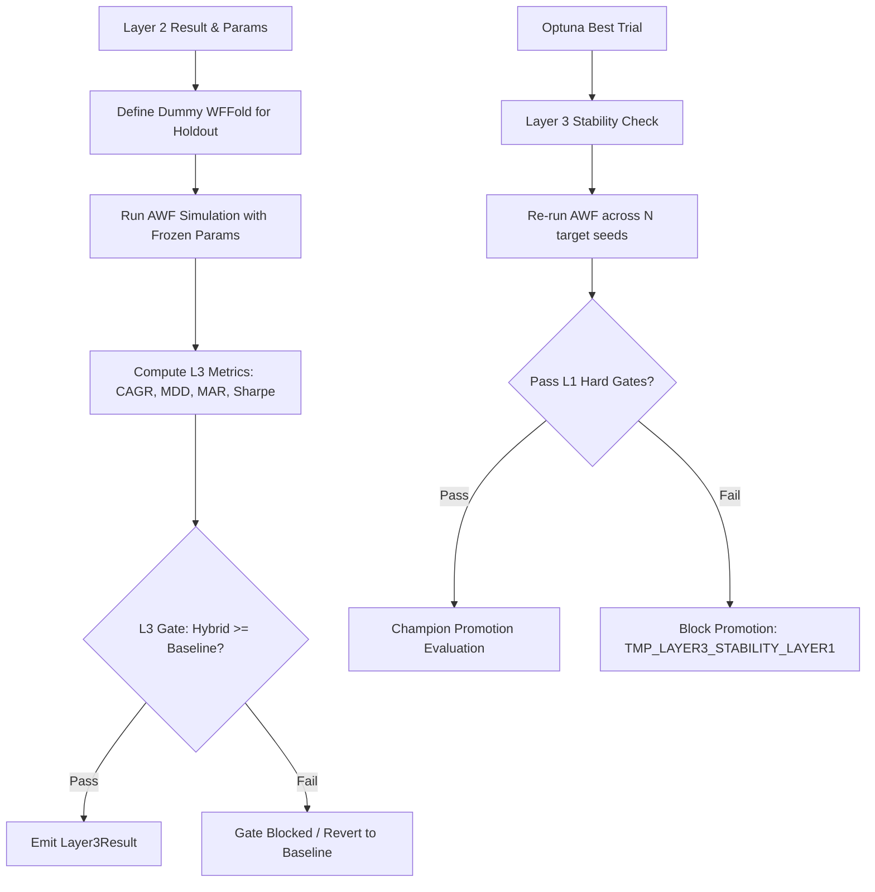

# 1. Purpose
Executes the final out-of-sample (OOS) validation (Layer 3) to ensure strategy robustness. It encompasses both the "Frozen Holdout" evaluation within the Tiered Hybrid Architecture and the multi-seed "Layer 3 Stability Check" during final Optuna optimization.

# 2. Core Logic & Math

## 2.1 Layer 3 — Frozen Holdout (Tiered Pipeline)
Operates as the final verification seam for the CS Rank + Diagonal Kelly (Layer 2) portfolio, using a completely unseen holdout window `[ho_start, ho_end)`.

**Frozen Parameters:**
- Uses the optimal `l2_params` identified during the Layer 2 AWF simulation.
- Hyperparameters are **frozen**; no refitting or parameter adjustment occurs in Layer 3.

**Performance Metrics:**
- **CAGR (Actual):** $\text{CAGR} = (1 + \sum r_t)^{b_{\text{yr}}/n} - 1$ (Computed on actual portfolio returns, avoiding vol-proxy approximation).
- **MDD:** Maximum peak-to-trough drawdown of the hybrid portfolio.
- **MAR:** $\text{MAR} = \frac{\text{CAGR}}{\text{MDD} + 10^{-9}}$
- **Sharpe Ratio:** Evaluated for both the hybrid and baseline (1/N) portfolios.

**Holdout Gate (L3 Gate):**
- $\text{Sharpe}_{\text{hybrid}} \geq \text{Sharpe}_{\text{baseline}}$ AND $\text{MDD}_{\text{hybrid}} \leq \text{MDD}_{\text{baseline}}$
- Ensures the active allocation logic strictly outperforms the naive equal-weight baseline in the most recent unseen market regime.

## 2.2 Layer 3 — Multi-Seed Stability Check (Optimization Stage)
When full Optuna optimization is executed, `check_stability_layer3` enforces that the selected champion strategy demonstrates parameter stability across different random seeds.

**Stability Gate (`FUTURES_TMP_LAYER3_HARD_GATE`):**
- If enabled, every stability-seed AWF replay must independently pass Layer-1 validation checks.
- Prevents overfitting to a specific noise realization within the AWF grid, blocking promotion if the parameter set is fragile.

# 3. Architecture Flow

# 4. Key Components

| Module | Role |
|--------|------|
| `tiered_workflow/pipeline.py` | Implements `run_l3_holdout`, defining the dummy fold and calling the AWF sim. |
| `tiered_workflow/awf_sim.py` | Shared simulation loop (`_run_awf_simulation`) executed with frozen L2 params. |
| `tiered_workflow/dataclasses.py`| Defines `Layer3Result` (CAGR, MDD, Sharpe, MAR, gate_passed). |
| `optimization/candidate_selector.py` | Implements `check_stability_layer3` for multi-seed validation. |
| `optimization/final_evaluator.py` | Orchestrates the final champion evaluation, invoking Layer 3 stability checks. |

# 5. Integration with opt_main_futures.py

- In `--phase alo`, `opt_main_futures.py` executes Layer 1, Layer 2, and Layer 3 via `run_tiered_pipeline`. `run_l3_holdout` performs the evaluation over the `ho_start` to `end_date` window, logging diagnostics.
- In `--phase full`, the pipeline proceeds to `_run_optimization_stage` after strategy evaluation. The selected champion candidate undergoes the `check_stability_layer3` validation to confirm robustness against seed variance before proceeding to the final Champion Swap logic.
