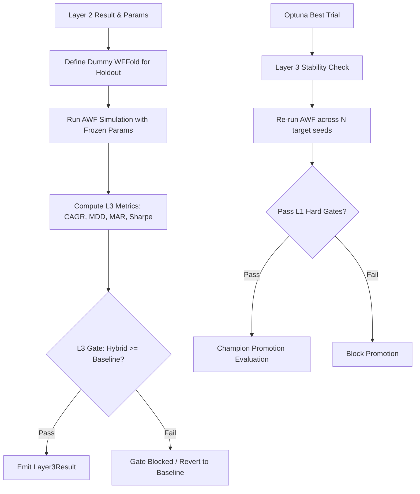

# 1. Purpose
최종 OOS(Out-of-Sample) 구간에 대한 검증을 담당한다. Tiered Hybrid Architecture 내의 완전 격리된 "Frozen Holdout" 평가와 최종 Optuna 최적화 과정에서 다중 시드를 이용해 모사 성능의 오버피팅 여부를 판별하는 "Layer 3 Stability Check"로 구성된다.

# 2. Core Logic & Math

### Layer 3 — Frozen Holdout (Tiered Pipeline)
L2 AWF 시뮬레이션에서 결정된 최적 하이퍼파라미터(`l2_params`)와 배포 레버리지($L^*$)를 완전 동결(Frozen)하고, 미관측 홀드아웃 윈도우 `[ho_start, ho_end)`에서 단일 패스 시뮬레이션을 수행한다.

- **Deployment Parity**:
  - $L^* > 1.0$ 인 경우 `apply_deployment(rets, L*)` 수식을 적용해 평가.
  - $L^* \le 1.0$ 인 경우 unit path (leverage = 1.0) 성과를 그대로 적용.
- **Performance Formulas**:
  - CAGR, Sharpe, Sortino: Base TF의 연간 바 개수(`bars_per_year(tf)`)를 사용해 계산.
  - MAR Ratio: $\text{MAR} = \frac{\text{CAGR}}{\text{MDD} + 10^{-9}}$
  - Terminal Compounding: `equity_multiple - 1` (단일 패스 복리 종가 기준 산출)

### Diagnostic Attribution Metrics `[ADR_20260704_L3_MAJORDIAG]` `[ADR_20260704_L3_INCOHERENCE]`
- **Reversal-Kill & Regime Mix**: OOS 구간의 Regime 분포(`regime_bull_pct`, `regime_bear_pct`, `regime_crisis_pct`)와 Reversal-Kill 동작 여부를 결합하여 분석.
- **Long/Short P&L Decomposition**: 롱 비중과 숏 비중을 분리하여 각 다리의 실현 수익 및 참여율 산출.
  - $w_{long} = \max(w, 0), \quad w_{short} = \min(w, 0)$
- **Per-Symbol Long/Short Attribution**: 심볼별 P&L 기여도를 분해하여 특정 자산군의 쏠림 현상을 모니터링.
- **Regime-Mu Incoherence**: 역 regime(bear, crisis) 환경에서 매수(bullish) 시그널이 유지되는 비율 및 반전 지연 시간(Reversal Lag) 측정.

### Layer 3 — Multi-Seed Stability Check
Optuna 최적화로 최종 선별된 챔피언 전략에 대해 $N$개의 서로 다른 랜덤 시드로 AWF 시뮬레이션을 재실행하여 파라미터 안정성을 검증한다.
- **Stability Gate**: `FUTURES_TMP_LAYER3_HARD_GATE` 활성화 시, 모든 시드에서 L1 Hard Gate 조건들을 통과해야 최종 승인된다.

# 3. Architecture Flow

# 4. Holdout Gates (L3 Validation Seam)
L3 Holdout 검증 완료를 위해 포트폴리오는 아래 순차적 조건문(Short-circuit)을 모두 통과해야 한다.

1. **No Holdout Returns**: OOS 구간 내 거래가 전혀 없거나 수익률 배열이 비어있지 않아야 함.
2. **Non-Finite Check**: CAGR, MDD, Sharpe, Sortino 등 지표가 Finite 값이어야 함.
3. **Minimum Trades**: 총 거래 횟수 $n_{trades} \ge \text{min\_trades} \quad (10)$
4. **Positive Return**: 누적 복리 수익률 $\text{total\_return} > 0$
5. **Absolute MDD Limit**: 최대 낙폭 $\text{MDD}_{hybrid} \le \text{max\_mdd\_abs} \quad (0.35)$
6. **CVaR95 Limit**: 95% CVaR 테일 리스크 $\text{CVaR95}_{hybrid} \le \text{max\_cvar95} \quad (0.06)$
7. **Absolute Sharpe**: $\text{Sharpe}_{hybrid} \ge 0.0$
8. **Absolute Sortino**: $\text{Sortino}_{hybrid} \ge 0.0$

# 5. Core Components

| Module | Role |
|---|---|
| `allocation/pipeline.py` | `run_l3_holdout` 진입점 제공, dummy fold 생성 및 시뮬레이션 호출 |
| `validation/walk_forward.py` | frozen 파라미터를 사용한 시뮬레이션 실행 루프 및 fold diagnostics 생성 |
| `validation/champion_registry.py` | `Layer3Result` 정의 및 L3 Holdout Gate 논리 평가 |
| `optimization/candidate_selector.py`| 다중 시드 검증용 `check_stability_layer3` 구현 |
| `optimization/final_evaluator.py` | 챔피언 선출 및 최종 L3 안정성 검증 오케스트레이션 |
