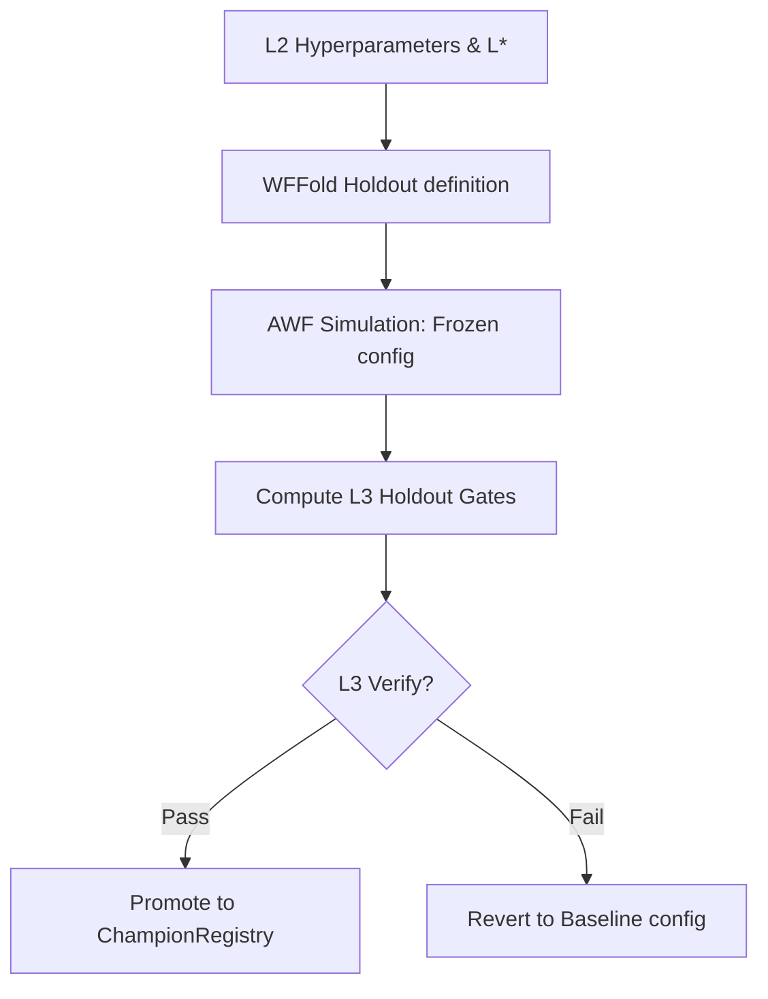

# 1. System Boundary
- **In-Scope**:
  - Evaluation of frozen parameters over Out-of-Sample (OOS) holdout windows `[ho_start, ho_end)`.
  - Multi-seed validation checks across random simulation seeds for parameter stability.
  - Champion promotion gating and `Layer3Result` registry state management.
- **Out-of-Scope**:
  - In-sample model parameter discovery and training (managed in Layer 2).

# 2. Mathematical Formalism & Constraints

### Deployment Parity
$$R_{\text{deploy}} = \begin{cases} \text{apply\_leverage}(R, L^*) & \text{if } L^* > 1.0 \\ R_{\text{unit}} & \text{if } L^* \le 1.0 \end{cases}$$

### Performance Ratios
$$\text{MAR} = \frac{\text{CAGR}}{\text{MDD} + 10^{-9}}$$
$$\text{CVaR}_{95} = E\left[ R \mid R \le q_{0.05}(R) \right]$$

### Sizing Decomposition (Long/Short)
$$w_{\text{long}} = \max(w, 0)$$
$$w_{\text{short}} = \min(w, 0)$$

### Rolling Holdout Panel Admission
$$\text{Verdict} = \text{PASS} \iff \forall e \in \text{PromotionEpisodes}: \text{Metric}_{\text{candidate}, e} \ge \text{Metric}_{\text{baseline}, e}$$

# 3. Strict I/O Contract

### Interface Data Structures
| Struct / Field | Type | Data Type | Description |
| :--- | :--- | :--- | :--- |
| **Layer3Result** | Model | `struct` | Final OOS verification report |
| ├─ `cagr` | Member | `float` | Annualized compounded growth rate |
| ├─ `mdd` | Member | `float` | Maximum peak-to-trough drawdown ratio |
| ├─ `sharpe` | Member | `float` | Annualized Sharpe ratio |
| ├─ `gate_passed` | Member | `bool` | True if all L3 Holdout gates are satisfied |
| **ValidationEpisode** | Model | `struct` | Episodic verification boundaries |
| ├─ `episode_id` | Member | `str` | Unique episode key identifier |
| ├─ `reference_date` | Member | `datetime` | Pivot boundary datetime |
| ├─ `role` | Member | `str` | Purpose mode (`"promotion"` or `"stress_only"`) |

# 4. Topology & Dynamic Flow

# 5. Configurable Parameters & Gate Limits

| Parameter / Limit | Threshold | Purpose |
| :--- | :--- | :--- |
| `n_trades_min` | $\ge 10$ | Minimum required trades in OOS to bypass low-sample bias |
| `mdd_limit_max` | $\le 0.35$ | Absolute limit on maximum drawdown allowed |
| `cvar95_limit_max` | $\le 0.06$ | Maximum tail-risk allowance for the 95% CVaR threshold |
| `sharpe_min` | $\ge 0.0$ | Required net positive risk-adjusted returns |
| `FUTURES_TMP_LAYER3_HARD_GATE` | Environment Var | Enforces L1 hard gates across all seed validation runs |
