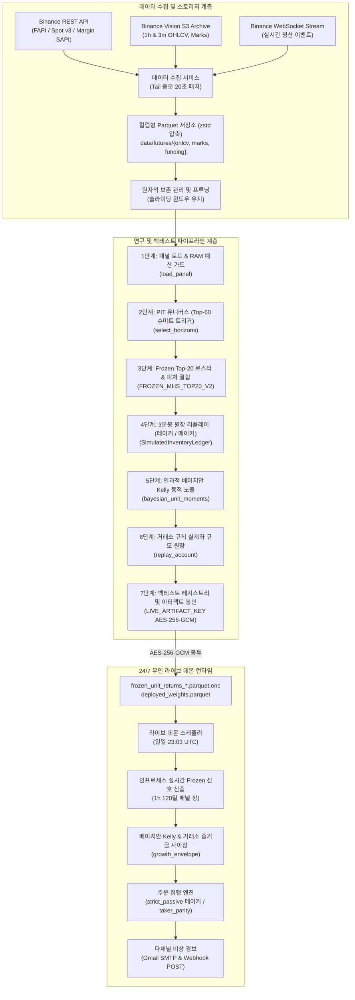

# 시스템 개요 및 아키텍처 (System Overview & Architecture)

## 1. 시스템 목표 (System Goal)

**crypto-pilot**은 바이낸스 USDT-M 무기한 선물(`USDT-M Perpetual Futures`) 시장을 위한 체계적인 퀀트 알파 연구 및 24/7 무인 트레이딩 시스템입니다.

시스템의 핵심 설계 목표는 단순 백테스트에서 발생하는 **"목표 가중치(Target Weight) PnL 착시의 배제"**입니다. 1시간봉 종가 시점에 마찰 없이 목표 비중으로 즉시 전환된다고 가정하는 대신, 3분봉(`3m`) 프록시 체결, 3계층 수수료 스케줄, 실시간 마크 가격 MTM 평가, 그리고 8시간 선물 펀딩비 실정산이 통합된 모의 체결 원장([`SimulatedInventoryLedger`](file:///home/kth/crypto-pilot/src/mhs/execution/ledger.py))을 기준 원장(Single Source of Truth)으로 삼아 정밀하게 손익을 측정합니다.

원시 시장 데이터 수집부터 PIT 유니버스 선별, Frozen Top-20 횡단면 알파 추출, 인과적 베이지안 Kelly 동적 노출, 바이낸스 거래소 브래킷(MMR)과 주문필터가 결합된 실계좌 원장([`replay_account`](file:///home/kth/crypto-pilot/src/mhs/execution/account_replay.py)), 그리고 저사양 클라우드(OCI Ampere A1.Flex, `mem_limit: 2g`)에서의 24/7 무인 자동매매까지 전 과정을 일관된 파이프라인으로 수행합니다.

---

## 2. 시스템 경계 (System Boundary)

```text
+-----------------------------------------------------------------------------------+
| 시스템 내부 범위 (In-Scope: crypto-pilot 핵심 엔진)                               |
|  - 바이낸스 FAPI / Spot / Margin / Vision S3 자동 수집 및 Parquet 분할 캐싱        |
|  - 3단계 Point-In-Time (PIT) 유니버스 필터링 및 Schmitt-Trigger 히스테리시스      |
|  - Frozen Top-20 횡단면 알파 전략 (5개 직교 피처 랭크 평균 및 종목별 5% 클립)     |
|  - 인과적 베이지안 수축 Kelly 동적 노출 (전일까지의 단위북 실적 사후 모멘트 갱신) |
|  - 3분봉 바 단위 체결 프록시 및 테이커/메이커 (strict_passive) 집행 경로          |
|  - 거래소 증거금 사다리(MMR/cum), 최소주문단위, 청산 실시간 판정 실계좌 원장     |
|  - 24/7 무인 라이브 데몬 (일일 23:03 UTC 신호 및 주문 집행, 샤딩 상태 영속화)    |
|  - 제로 트러스트 CI/CD: Tailscale 사설망 VPN, 서버 .env 정본, LIVE_ARTIFACT_KEY 봉인|
+-----------------------------------------------------------------------------------+
| 시스템 외부 범위 (Out-of-Scope: 명시적 비목표)                                    |
|  - 마이크로초 단위 Level-3 매칭 엔진 시뮬레이션                                   |
|  - 다중 거래소(바이낸스 vs OKX/Bybit 등) 간의 횡단면 차익거래                     |
|  - 온체인 DEX 유동성 풀 및 DeFi 스마트 컨트랙트 연동                               |
|  - 큐 대기열 우선순위를 다투는 초고빈도(HFT) 패시브 메이킹                        |
+-----------------------------------------------------------------------------------+
```

---

## 3. 고수준 아키텍처 (High-Level Architecture)

시스템은 상호 결합도가 낮게 분리된 3대 계층인 **데이터 인프라 계층**, **연구 및 백테스트 계층**, 그리고 **라이브 데몬 런타임 계층**으로 구성됩니다.



---

## 4. 핵심 서브시스템 (Core Subsystems)

| 서브시스템 | 주요 책임 | 핵심 불변식 및 안전장치 |
| :--- | :--- | :--- |
| **Market Data** | 시세 수집, 디스크 tail 증분 갱신([`data_refresh.py`](file:///home/kth/crypto-pilot/src/live/data_refresh.py)), 원자적 프루닝([`retention.py`](file:///home/kth/crypto-pilot/src/market_data/retention.py)) | RAM 85% 한도 가드, 보존 기간 초과 시세 임시파일 원자적 치환(`tmp.replace`) |
| **Quant Primitives** | PIT 유니버스 선정([`pit_universe.py`](file:///home/kth/crypto-pilot/src/quant/universe/pit_universe.py)), 횡단면 랭킹, 부트스트랩 | 상위 60위 진입/120위 방출 히스테리시스, 720h 과거 거래대금 Causal 필터 |
| **MHS & Frozen** | Frozen Top-20 전략 사양([`frozen_research_candidate.py`](file:///home/kth/crypto-pilot/src/mhs/frozen_research_candidate.py)), 인과적 베이지안 Kelly 동적 노출 | 5개 직교 신호 랭크 평균, 사전 $\mu_0=0$(730일 가중) 사후 모멘트 갱신 |
| **Execution Engine** | 3분봉 단위 프록시 체결([`ledger.py`](file:///home/kth/crypto-pilot/src/mhs/execution/ledger.py)), 실계좌 규모 원장([`account_replay.py`](file:///home/kth/crypto-pilot/src/mhs/execution/account_replay.py)) | 3-tier 수수료 차감, 8시간 펀딩비 직전 보유량 정산, 30분 메이커 대기 후 테이커 폴백 |
| **Backtest Registry** | 백테스트 SQLite3 레지스트리([`registry.py`](file:///home/kth/crypto-pilot/src/backtests/registry.py)) 및 인덱스 관리 | 단일 정본 `registry.sqlite3` 및 `index.jsonl` 영속화, 중복 방지 |
| **Live Runtime** | 24/7 무인 데몬([`scheduler.py`](file:///home/kth/crypto-pilot/src/live/scheduler.py)), 일일 23:03 UTC 신호 및 주문 집행([`runner.py`](file:///home/kth/crypto-pilot/src/live/runner.py)) | `LIVE_ARTIFACT_KEY` AES-256-GCM 봉인 검증, 세무 장부([`live_tax_ledger`](file:///home/kth/crypto-pilot/src/live/tax_collector.py)) 기록 |
| **CLI & Ops** | 통합 CLI 진입점(`data`, `backtest`, `research`, `live`, `ops`), 사전 점검 | 제로 트러스트: Tailscale 사설망 배포, 서버 로컬 `.env` 단일 정본 |

---

## 5. 엔드투엔드 수명주기 (End-to-End Operational Lifecycle)

1. **시세 동기화**: 1시간봉 OHLCV, 8시간 펀딩비, 1시간 마크 가격을 수집합니다. 프로덕션 환경에서는 디스크 tail 기준 미수집된 2시간 구간만 인프로세스로 증분 동기화하여 약 20초 이내에 갱신을 완료합니다.
2. **PIT 유니버스 확정**: 매 결정 시점마다 결손 심볼 배제(Source Gap Guard) $\rightarrow$ 직전 720시간 거래대금 중앙값 상위 50% 선별 $\rightarrow$ 상위 60위 진입/120위 탈락 Schmitt-Trigger를 적용하여 미래 참조 없이 매매 유니버스를 확정합니다.
3. **Frozen Top-20 신호 산출**: 5개 직교 횡단면 피처(테이커 불균형 168h/720h, 모멘텀 336h, 잔차 모멘텀 336h, 왜도 168h)의 랭크 평균을 구하고 종목별 5% 클립을 적용해 달러 중립 목표 비중을 산출합니다.
4. **인과적 베이지안 Kelly 동적 노출**: 사전 $\mu_0 = 0$(730일 가중)에서 매일 전일까지의 단위북 실적만으로 사후 $\mu, \sigma$를 계산하고, 기대수익 50% 할인과 거래소 증거금 상한을 고려해 최적 노출 배율을 동적으로 결정합니다.
5. **3분봉 체결 리플레이 및 실계좌 검증**: 3분봉 해상도에서 즉시 테이커 체결 또는 30분 앵커 지정가 대기 후 테이커 폴백 메이커 체결을 구동합니다. 바이낸스 실거래 브래킷(Tier별 누적유지증거금 MMR/cum)과 최소 주문단위를 적용해 강제 청산 위험을 배제합니다.
6. **24/7 무인 자동매매 데몬**: 오라클 클라우드 Docker 컨테이너 상에서 데몬이 24/7 상시 가동되며, 매일 `23:03 UTC`에 시세 증분 갱신, frozen 신호 산출, 메이커/테이커 발주, 거래소 잔고 대조를 무인 수행합니다.

---

## 6. 외부 연동 및 인프라 명세 (External Dependencies)

* **거래소 연동**: Binance USDT-M 선물 REST API (`/fapi/v1`), 현물 API v3 (`/api/v3`), 마진 SAPI (`/sapi/v1`), Binance Vision S3 공용 아카이브, Binance 실시간 청산 WebSocket (`ccxt.pro`).
* **배포 환경**: Oracle Cloud Infrastructure (OCI) Ampere A1.Flex (ARM64, 호스트 2 OCPU/12GB 공유), `mhs-live` 컨테이너 `mem_limit: 2g` / `liquidation-collector` `768m` 하드캡.
* **보안 및 네트워크**: Tailscale 사설망 VPN (외부 공인 인바운드 포트 완전 차단), 서버에 배치된 `.env`를 단일 정본으로 사용하고 전략 부트스트랩 단위수익률 아티팩트를 `LIVE_ARTIFACT_KEY` AES-256-GCM으로 봉인, Docker Compose.
* **파이썬 툴체인**: Python 3.11+, uv (패키지 동기화), NumPy 2.x, Pandas 2.2+, PyArrow, SciPy, CCXT 4.5+, Pydantic v2.
