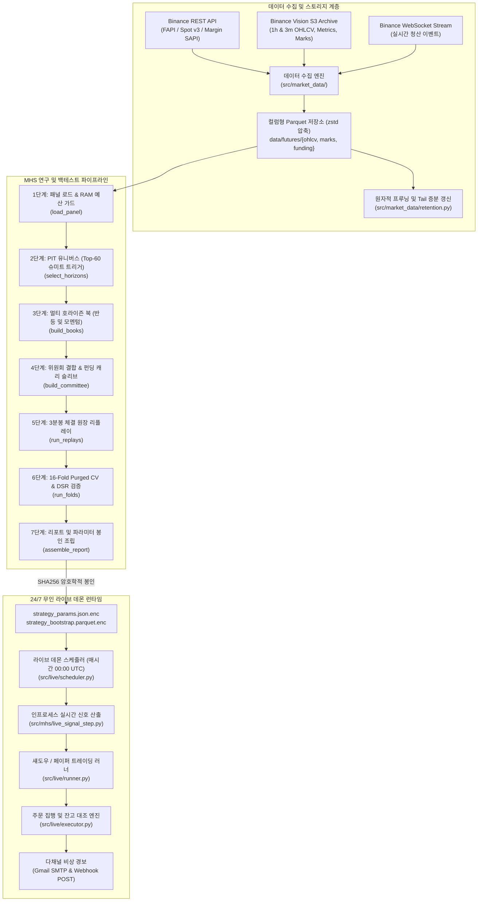

# 시스템 개요 및 아키텍처 (System Overview & Architecture)

## 1. 시스템 목표 (System Goal)

**crypto-pilot**은 바이낸스 USDT-M 무기한 선물(`USDT-M Perpetual Futures`) 시장을 대상으로 한 체계적인 퀀트 알파 연구 및 24/7 무인 트레이딩 시스템입니다.

시스템의 핵심 설계 목표는 단순 백테스트에서 흔히 발생하는 **"목표 가중치(Target Weight) PnL 착시의 배제"**입니다. 1시간봉 종가 시점에 체결 오차나 마찰 없이 목표 비중으로 즉시 전환된다고 가정하는 대신, crypto-pilot은 3분봉(`3m`) 프록시 체결, 3계층 수수료 스케줄, 실시간 마크 가격 기반 MTM 평가, 그리고 8시간 단위 선물 펀딩비 실정산이 통합된 모의 체결 원장([`SimulatedInventoryLedger`](file:///home/kth/crypto-pilot/src/mhs/execution/ledger.py))을 기준 원장(Single Source of Truth)으로 삼아 정밀하게 손익을 측정합니다.

원시 시장 데이터 수집부터 멀티 호라이즌 알파 추출, 포트폴리오 최적화, 168시간 엠바고 16-Fold Walk-Forward 교차 검증, 그리고 저사양 엣지 클라우드(1 vCPU, 1.2GB RAM)에서의 24/7 무인 자동매매까지 전 과정을 일관된 파이프라인으로 수행합니다.

---

## 2. 시스템 경계 (System Boundary)

```text
+-----------------------------------------------------------------------------------+
| 시스템 내부 범위 (In-Scope: crypto-pilot 핵심 엔진)                               |
|  - 바이낸스 FAPI / Spot / Margin / Vision S3 자동 수집 및 Parquet 분할 캐싱        |
|  - 3단계 Point-In-Time (PIT) 유니버스 필터링 및 Schmitt-Trigger 히스테리시스      |
|  - Multi-Horizon Market State (MHS): Flow 모멘텀 위원회 (k=5) + 펀딩 캐리 슬리브  |
|  - 시장 베타 직교화 및 2중 레짐 방어 (BTC 크래시 틸트 + 전략 P&L 변동성 타겟팅)   |
|  - 3분봉 바 단위 체결 프록시 및 현금/계약 수량 기반 모의 실행 원장                |
|  - 168시간 엠바고 16-Fold Anchored Purged Walk-Forward 교차 검증 및 DSR 산출     |
|  - 24/7 무인 라이브 데몬 (매시간 정각 크론, 샤딩 상태 영속화, 섀도우/페이퍼/라이브)  |
|  - 제로 트러스트 CI/CD: Tailscale 사설망 VPN, Mozilla SOPS 암호화, SHA256 불변 봉인|
+-----------------------------------------------------------------------------------+
| 시스템 외부 범위 (Out-of-Scope: 명시적 비목표)                                    |
|  - 마이크로초 단위 Level-3 매칭 엔진 시뮬레이션                                   |
|  - 다중 거래소(바이낸스 vs OKX/Bybit 등) 간의 횡단면 차익거래                     |
|  - 온체인 DEX 유동성 풀 및 DeFi 스마트 컨트랙트 연동                               |
|  - 큐 대기열 우선순위를 다투는 초고빈도(HFT) 패시브 메이킹                        |
+-----------------------------------------------------------------------------------+
```

---

## 3. 고수준 아키텍처 (High-Level Architecture)

시스템은 상호 결합도가 낮게 분리된 3대 계층인 **데이터 인프라 계층**, **MHS 연구 파이프라인 계층**, 그리고 **라이브 데몬 런타임 계층**으로 구성됩니다.



---

## 4. 핵심 서브시스템 (Core Subsystems)

| 서브시스템 | 주요 책임 | 핵심 파일 경로 |
| :--- | :--- | :--- |
| **Market Data** | 거래소 시세 수집, 디스크 tail 증분 갱신, 무손실 원자적 프루닝, 데이터 갭 검출 | [`src/market_data/services/`](file:///home/kth/crypto-pilot/src/market_data/services/), [`src/market_data/retention.py`](file:///home/kth/crypto-pilot/src/market_data/retention.py) |
| **Quant Primitives** | PIT 유니버스 선정, 횡단면 랭킹, 변동성 타겟팅, 블록 부트스트랩 계산 | [`src/quant/universe/`](file:///home/kth/crypto-pilot/src/quant/universe/), [`src/quant/technical_experts/`](file:///home/kth/crypto-pilot/src/quant/technical_experts/) |
| **MHS Pipeline** | 7단계 연구 파이프라인 오케스트레이션, 신호 결합, 북 블렌딩, 리스크 포락선 관리 | [`src/mhs/pipeline/orchestrator.py`](file:///home/kth/crypto-pilot/src/mhs/pipeline/orchestrator.py), [`src/mhs/pipeline/stages/`](file:///home/kth/crypto-pilot/src/mhs/pipeline/stages/) |
| **Execution Engine** | 3분봉 바 단위 프록시 체결, 재고 및 현금 원장 회계, 펀딩비 실정산, MTM 평가 | [`src/mhs/execution/ledger.py`](file:///home/kth/crypto-pilot/src/mhs/execution/ledger.py), [`src/mhs/execution/strategy_replay.py`](file:///home/kth/crypto-pilot/src/mhs/execution/strategy_replay.py) |
| **Validation Engine** | 16-Fold Purged Walk-Forward CV(168h 엠바고), DSR 다중 검정 보정, 9대 스트레스 시나리오 | [`src/mhs/evidence.py`](file:///home/kth/crypto-pilot/src/mhs/evidence.py), [`src/mhs/pipeline/stages/fold.py`](file:///home/kth/crypto-pilot/src/mhs/pipeline/stages/fold.py) |
| **Live Runtime** | 24/7 무인 데몬 구동, 매시간 신호 계산, 상태 영속화, 섀도우/페이퍼/실거래 라우팅 | [`src/live/scheduler.py`](file:///home/kth/crypto-pilot/src/live/scheduler.py), [`src/mhs/live_signal_step.py`](file:///home/kth/crypto-pilot/src/mhs/live_signal_step.py) |
| **CLI & Ops** | 통합 CLI 진입점(`data`, `research`, `live`), 사전 점검(preflight), 세무 장부 요약 | [`src/cli/main.py`](file:///home/kth/crypto-pilot/src/cli/main.py), [`src/cli/commands/`](file:///home/kth/crypto-pilot/src/cli/commands/) |

---

## 5. 엔드투엔드 수명주기 (End-to-End Operational Lifecycle)

1. **시세 동기화**: 1시간봉 OHLCV, 8시간 펀딩비, 1시간 마크 가격을 수집합니다. 프로덕션 환경에서는 디스크 tail 기준 미수집된 2시간 구간만 인프로세스로 증분 동기화하여 20초 이내에 갱신을 완료합니다.
2. **PIT 유니버스 확정**: 매 결정 시점 $t$마다 결손 심볼 배제(Source Gap Guard) $\rightarrow$ 직전 720시간 거래대금 중앙값 상위 50% 선별 $\rightarrow$ 상위 60위 진입/120위 탈락 Schmitt-Trigger를 적용하여 미래 참조 없이 매매 유니버스를 확정합니다.
3. **신호 및 위원회 산출**: 48h 단기 반등 및 72h~504h 19개 장기 모멘텀 지평을 계산합니다. $k=5$ `flow_momentum` 위원회가 테이커 매수/매도 불균형, 횡단면 모멘텀, 잔차 모멘텀, 왜도를 결합하고 30% 비중의 펀딩 캐리 슬리브를 혼합합니다. Causal Lag-1 자기상관에 따라 3행 트랜치 평활 여부를 적응형으로 결정합니다.
4. **포트폴리오 조립 및 리스크 제어**: 포트폴리오 추적 오차 20% 필터를 통해 불필요한 미세 조정을 방지합니다. 720바 OLS 시장 베타 직교화와 BTC 급락 크래시 틸트, 그리고 전략 자체의 21일 실현 변동성 타겟팅 기반 켈리 사이징을 적용합니다.
5. **체결 리플레이**: 3분봉 해상도에서 즉시 테이커 체결 프록시를 구동하고, 3-tier 수수료(2.64~6.07 bps) 차감, 직전 보유량 기준 8시간 펀딩비 정산, 마크 가격 MTM 평가를 원장에 반영합니다.
6. **통계 검증 및 파라미터 봉인**: 168시간 엠바고 16-Fold Walk-Forward CV와 DSR을 통해 통계적 유의성을 검증한 후, 22개 설정 플래그의 SHA256 다이제스트를 생성하여 파라미터를 암호학적으로 봉인합니다.
7. **24/7 무인 자동매매 데몬**: 매시간 `00:00 UTC`에 오라클 클라우드 Docker 상에서 데몬이 자동 기동되어 시세 동기화, 신호 계산, 모의/실주문 집행, 거래소 잔고 대조, 세무 장부(`live_tax_ledger`) 갱신을 무인 수행합니다.

---

## 6. 외부 연동 및 인프라 명세 (External Dependencies)

* **거래소 연동**: Binance USDT-M 선물 REST API (`/fapi/v1`), 현물 API v3 (`/api/v3`), 마진 SAPI (`/sapi/v1`), Binance Vision S3 공용 아카이브, Binance 실시간 청산 WebSocket (`ccxt.pro`).
* **배포 환경**: Oracle Cloud Infrastructure (OCI) Ampere A1 (ARM64 아키텍처, 1 vCPU, 1.2GB RAM 할당 한도).
* **보안 및 네트워크**: Tailscale 사설망 VPN (외부 공인 인바운드 포트 완전 차단), Mozilla SOPS + Age 비대칭 암호화 (`.env.enc` 및 배포 아티팩트 암호화), Docker Compose.
* **파이썬 툴체인**: Python 3.11+, uv (패키지 동기화), NumPy 2.x, Pandas 2.2+, PyArrow, SciPy, CCXT 4.5+, Pydantic v2.
