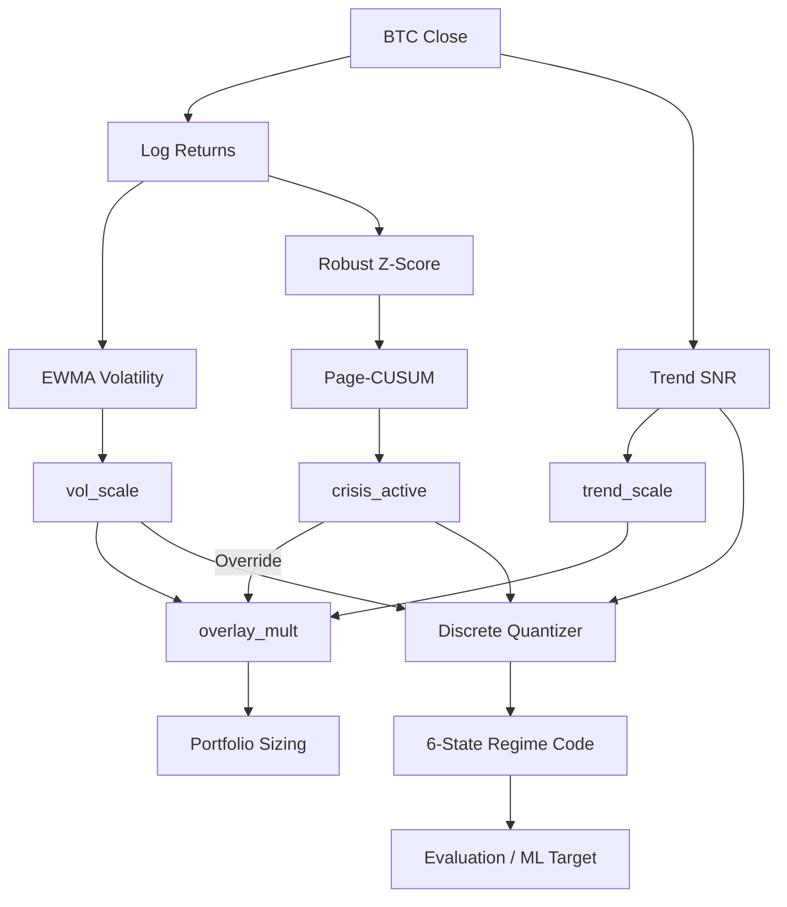

# 1. Purpose
Establishes a 2-layer causal market state from BTC price action: a continuous risk overlay for position sizing and a discrete 6-state code for evaluation and ensemble conditioning.

# 2. Core Logic & Math

**Volatility Targeting**
- $\hat{\sigma}_{t} = \sqrt{\text{EWMA}[ (r - \bar{r})^2 ]_{t} \cdot \text{bars\_per\_year}}$
- $\text{vol\_scale}_{t} = \text{clip}\left(\frac{\sigma_{\text{target}}}{\hat{\sigma}_{t}}, \text{min\_vol\_scale}, \text{max\_vol\_scale}\right)$

**Trend SNR Gate**
- $s_{t} = \ln(P_{t}) - \text{EMA}(\ln P)_{t}$
- $\text{snr}_{t} = \frac{s_{t}}{\text{std}(s)_{t}}$
- $\text{trend\_scale}_{t} = \frac{1}{2} (1 + \tanh(\text{snr}_{t}))$

**Page-CUSUM Crisis Detector**
- $z_{t} = \frac{r_{t} - \text{median}_{\leq t}}{1.4826 \cdot \text{MAD}_{\leq t}}$
- $S^{+}_{t} = \max(0, S^{+}_{t-1} + z_{t} - k)$
- $S^{-}_{t} = \max(0, S^{-}_{t-1} - z_{t} - k)$
- Crisis triggers if $S^{+}_{t} > h$ or $S^{-}_{t} > h$.

**Overlay Compositor**
- $\text{overlay\_mult}_{t} = \text{vol\_scale}_{t} \cdot \text{trend\_scale}_{t}$
- If crisis active: $\text{overlay\_mult}_{t} = \text{crisis\_gross\_floor}$

**Discrete Quantizer (6-State)**
- Base: 2x2 grid (`bull/bear` by $\text{trend\_snr} \geq 0$, `quiet/volatile` by $\text{vol\_scale} \geq 1.0$)
- Override: If crisis active $\rightarrow$ `crash` (5). Transition $\rightarrow$ (4).

# 3. Architecture Flow

# 4. Core Variables & I/O

| Type | Variable | Description |
|------|----------|-------------|
| **Input** | `P_t` | BTC Close Price at time $t$ |
| **Param** | $\sigma_{\text{target}}$ | Target annualized volatility. Bounds: `(0.0, 1.0]` |
| **Param** | `crisis_gross_floor` | Risk override multiplier during crisis. Bounds: `[0.0, 1.0]` |
| **Param** | $k, h$ | CUSUM drift and threshold, derived from target ARL. Bounds: `ARL > 0` |
| **Output**| `overlay_mult_1d` | Continuous risk multiplier applied to final portfolio weights. Bounds: `[0.0, max_vol_scale]` |
| **Output**| `code_1d` | Discrete regime integer (0-5) used for signal gating and B0 ensemble |
| **Eval**  | `RegimeScoreCard` | Metrics C2(Persistence), C3(Distinctness), C4(Stability), C5(Coverage) |

# 5. Edge Cases & Handling
- **Flash Crash / Liquidity Vacuum:** Rapid extreme price drops trigger the CUSUM crisis condition, immediately snapping the `overlay_mult_1d` to `crisis_gross_floor` and ignoring naive volatility targeting bounds until the cooldown period expires.
- **Zero Volatility (Stale Data):** If exchange feeds freeze (resulting in zero returns and zero MAD), statistical safeguards (small epsilon additions to MAD) prevent division-by-zero during robust Z-score calculation.
