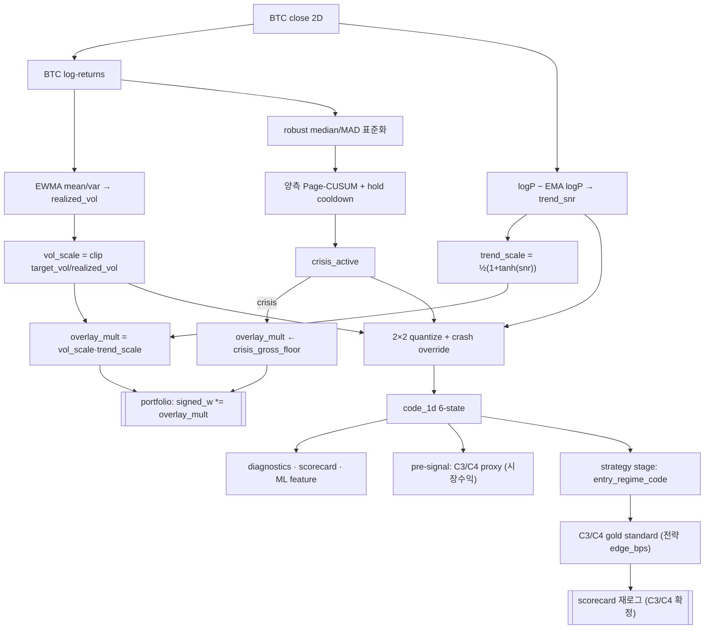

# 1. Overview

BTC를 시장 anchor로 삼아 **2-Layer**로 시장 상태를 표현한다.
- **연속 Risk Overlay** (`overlay_mult`) — 포트폴리오 gross exposure를 실시간 변조. **실제 배분을 구동하는 유일한 경로.**
- **이산 Regime Code** (`code_1d`, 6-state) — 진단·평가(C2~C5)·ML feature(`entry_regime_code`)용 라벨. 배분을 직접 구동하지 않음.

모든 신호는 **causal**: 진입은 `code[t-1]`/`overlay_mult[t-1]`만 소비.

---

# 2. Core Components

| Component | 책임 | 파일 (라인) |
|-----------|------|------------|
| Volatility Targeting | EWMA realized vol → inverse-vol `vol_scale` | `market_regime.py:254-262` |
| Trend SNR Gate | EMA 이격도 z-score → `tanh` smooth `trend_scale` | `market_regime.py:264-269` |
| CUSUM Crisis Detector | robust 표준화 + 양측 Page-CUSUM → `crisis_active` | `market_regime.py:271-289` |
| Overlay Compositor | `overlay_mult = vol_scale·trend_scale` (crisis 시 floor) | `market_regime.py:291-302` |
| Discrete Quantizer | `(trend_snr, vol_scale, crisis)` → 6-state code (per-bar adaptive band) | `market_regime.py:125-140` |
| Quality Gate | cal-eval 구간 overlay lift(Sharpe 차분) / leakage / crisis precision | `market_regime.py:343-418` |
| Scorecard (C2~C5) | Persistence / Distinctness / OOS Stability / Coverage | `regime_evaluation.py:278-351` |
| Pre-signal Proxy | 시장수익 기반 C3/C4 조기 진단 (`--phase regime`) | `regime_evaluation.py:471-` |
| Gold-standard Refresh | 전략 이벤트(`entry_regime_code`·`edge_bps`)로 C3/C4 재계산·재로그 | `opt_main_futures.py:_refresh_regime_c34_gold_standard` |

---

# 3. Data Flow



**평가 2단계 측정:**
- **Pre-signal proxy** (`--phase regime`): 레짐이 *시장 수익* 분포를 구분하는가 — 조기 진단.
- **Gold standard** (strategy stage 이후): 레짐이 *전략 실현 edge* 분포를 구분하는가 — 확정 평가. strategy stage 완료 후 `_refresh_regime_c34_gold_standard`가 이벤트 데이터로 C3/C4를 채워 scorecard를 재로그.

---

# 4. Business Rules & Invariants

- **Causality (C1, hard gate):** overlay/code는 미래 정보 미참조. 진입 시점은 `[t-1]` 소비. (검증: `evaluate_regime_quality`의 leakage perturbation test, `market_regime.py:373-386`)
- **Bounded exposure:** `vol_scale ∈ [0.25, 1.5]` (clip), `trend_scale ∈ [0, 1]` (tanh half-range) → `overlay_mult ∈ [0, 1.5]`.
- **Crisis floor:** crisis_active 구간 `overlay_mult = crisis_gross_floor (=0.15)` 고정. 위기 시 강제 de-risk.
- **CUSUM 보존성:** ARL(Average Run Length) target에서 drift/threshold 역산 → 오탐률을 통계적으로 제어.
- **Code 정합:** `code_1d` 정수 ↔ `name_by_code` 6-tuple 1:1.

---

# 5. Data Schemas

```python
# market_regime.py
RiskOverlayContext:        # 연속 — 배분 구동
    vol_scale_1d:     NDArray[float64]   # [T] inverse-vol
    trend_scale_1d:   NDArray[float64]   # [T] tanh∈[0,1]
    crisis_active_1d: NDArray[bool_]     # [T] CUSUM 발화
    overlay_mult_1d:  NDArray[float64]   # [T] 최종 gross multiplier

MarketRegimeContext:       # 이산 — 진단/feature
    code_1d:        NDArray[int8]        # [T] 0..5
    name_by_code:   tuple[str, ...]      # (bull_quiet, bull_volatile,
                                         #  bear_quiet, bear_volatile,
                                         #  transition, crash)
    trend_score_1d: NDArray[float64]     # [T] trend_snr
    vol_z_1d:       NDArray[float64]     # [T] log realized_vol z
    dispersion_z_1d:NDArray[float64]     # [T] 횡단면 분산 z

# regime_evaluation.py
RegimeScoreCard:           # C2~C5 가중(0.70) 부분 점수
    c2_*  # Persistence: dwell_median, transition_rate, entropy_rate
    c3_*  # Distinctness: kw_pvalue, has_sign_flip, mutual_info
    c4_*  # OOS Stability: spearman_rho(IS vs OOS Sharpe rank)
    c5_*  # Coverage: occupancy min/max, effective_regimes
    weighted_c2_to_c5: float
```

---

# 6. Theory (수식 근거)

**(1) Volatility Targeting** — leverage를 변동성에 반비례시켜 risk budget을 일정 유지.
```
σ̂_t = sqrt( EWMA[(r − EWMA[r])²]_t · bars_per_year )
vol_scale_t = clip( σ_target / σ̂_t , 0.25, 1.5 ),   σ_target = 0.40 (ann)
```

**(2) Trend SNR Gate** — 추세 이격도를 잡음 대비 신호로 정규화 후 부드럽게 게이팅.
```
s_t = logP_t − EMA_span(logP)_t
snr_t = s_t / rolling_std_span(s)_t
trend_scale_t = ½ (1 + tanh(snr_t)) ∈ [0,1]
```
`tanh`는 극단값 saturation + 0 근방 선형 → 추세 강도에 매끄럽게 비례.

**(3) Page-CUSUM Change-Point** — robust 표준화 잔차의 누적합으로 분포 변화(위기) 탐지.
```
z_t = (r_t − median_≤t) / (1.4826 · MAD_≤t)         # robust, causal
S⁺_t = max(0, S⁺_{t-1} + z_t − k),  S⁻_t = max(0, S⁻_{t-1} − z_t − k)
발화: S⁺_t > h  또는  S⁻_t > h  → crisis hold_bars 동안 active
```
`k`(drift), `h`(threshold), `hold_bars`는 target ARL에서 역산
(`tail_z = Φ⁻¹(1 − 1/2·ARL)`, `k=0.25·tail_z`, `h=1.8·tail_z`). 오탐 빈도를 ARL로 통계 보증.

**(4) 이산 Quantizer** — 두 연속 신호를 2×2 격자로 라벨링(+crash override).
```
bull  = trend_snr ≥ 0,   quiet = vol_scale ≥ 1.0
code = {00:bull_quiet, 01:bull_volatile, 10:bear_quiet, 11:bear_volatile}
       crisis_active → crash(5)
```

**(5) Scorecard 통계량**
- C2 entropy rate: `H = −Σ_i π_i Σ_j P_ij log P_ij` (전이행렬 기반 지속성).
- C3 Distinctness: Kruskal-Wallis(분포 차이) + 그룹 평균 부호반전 + mutual information.
- C4 OOS Stability: IS vs OOS regime별 Sharpe 순위의 Spearman ρ.
- C5 Coverage: effective regimes `N_eff = exp(H_occupancy)`.

---

# 7. Known Limitations

| ID | 한계 | 상태 | 영향 |
|----|------|------|------|
| D1 | `transition`(code 4) 구조적 dead state | ✅ 해소 (Phase 1+4: per-bar percentile band) | `transition=8.9%` |
| D2 | `rule_diagnostics`에 독립 4-state regime 공존 — SSOT 위반 | ✅ 해소 (CUSUM code_1d 단일화) | — |
| D3 | 이산 경계가 데이터-blind 고정 상수 | ✅ 해소 (expanding median 적응 임계) | — |
| D4 | `overlay_lift` 게이트가 raw edge에 측정 → de-risk 처벌 | ✅ 해소 (Sharpe 차분) | — |
| D5 | C3/C4가 이산 code 심판, 실제는 연속 overlay | ✅ 완화 (overlay IC 축 + C3 magnitude_sep) | — |
| D6 | `_expanding_robust_location_scale` O(T²) | ⬜ 보류 (현 T 규모 기능 무관) | 대규모 T 성능 |
| D7 | CUSUM expanding robust scale → 후반 vol 전환 둔감 | ⬜ 보류 | crisis 반응성 |
| D8 | C2 dwell 측정 대상 오류 (micro band 절대값) | ✅ 해소 (macro_dwell 방향수준 측정) | dwell=3 = 실측 진단 |
| D9 | C3/C4가 signal phase 이후에만 측정 가능 | ✅ 해소 (proxy + gold standard 2단계 연결) | — |
| D10 | C2 임계 `macro_dwell ≥ 6`이 **timeframe-blind**. 4h 실측 dwell=3 → 구조적 FAIL | ⬜ 미해소 (`regime_c2_dwell_target` 파라미터화 후순위) | C2 score=3.0 undercount |

## 7.1 핵심 아키텍처 발견 (Proxy vs Gold 괴리)

Phase 6 gold standard 연결 후 확정된 **본질적 한계** (코드 결함 아님). Signal Rising-Edge Refactor(2026-06-08) 이후 측정값 반영:

| 측정 | flip | rho | 결론 |
|------|------|-----|------|
| Proxy (시장수익) | Y | 0.886 | 레짐이 **BTC 시장 방향**은 강하게 구분 |
| Gold (전략 edge, refactor 후) | **N** | **0.314** | 방향 구분 여전히 불가, OOS 순위 안정성은 0.029→0.314 개선 |

- **함의:** 레짐은 시장 상태를 잘 분류하나, 모든 레짐에서 전략 edge가 동일 부호(long-bias) → flip=N 유지. rising-edge로 신호 풀이 정제(ML-Ready 3→5, gold events 4013→7370)되면서 C4 rho는 0.314로 부분 개선됐으나 ρ≥0.5 미달.
- **근본 원인:** ML-Ready 5개가 전부 방향성(추세/모멘텀) 신호라 레짐 무관 동방향 수익. flip=Y를 달성하려면 **레짐별로 부호가 역전되는 신호**(예: 추세장 momentum vs 비추세장 mean-reversion)가 풀에 공존해야 함.
- **측정 일관성 노트:** C2/C5는 regime-stage `code_1d`, C3/C4 gold standard는 strategy-stage `code_1d` 기반. 둘 다 BTC-anchored 동일 윈도우라 일치하나, 구조상 별개 계산 경로임.
