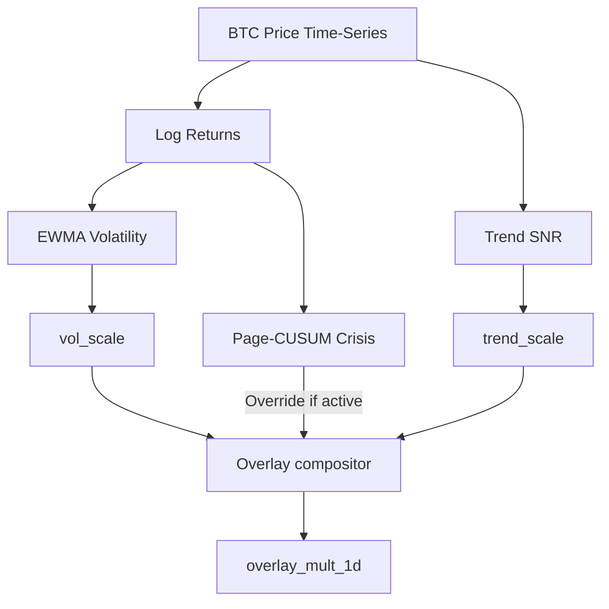

# 1. System Boundary
- **In-Scope**:
  - Real-time continuous overlay scaling calculation (`overlay_mult_1d`) based on BTC price action.
  - Page-CUSUM crisis detection and 6-state / compressed 3-state regime code routing.
  - Breadth-augmented Reversal Risk-Off Switch detector for exposure haircuts.
- **Out-of-Scope**:
  - Sizing weight execution and order booking (managed in Layer 2 and Layer 3).

# 2. Mathematical Formalism & Constraints

### Volatility Targeting Scale
$$\hat{\sigma}_{t} = \sqrt{\text{EWMA}[ (r - \bar{r})^2 ]_{t} \cdot \text{bars\_per\_year}}$$
$$\text{vol\_scale}_{t} = \text{clip}\left(\frac{\sigma_{\text{target}}}{\hat{\sigma}_{t}}, \text{min\_vol\_scale}, \text{max\_vol\_scale}\right)$$

### Trend SNR Scale
$$s_{t} = \ln(P_{t}) - \text{EMA}(\ln P)_{t}$$
$$\text{snr}_{t} = \frac{s_{t}}{\text{std}(s)_{t}}$$
$$\text{trend\_scale}_{t} = \frac{1}{2} (1 + \tanh(\text{snr}_{t}))$$

### Kaufman Efficiency Ratio (ER)
$$\text{ER}_{t} = \frac{|P_{t} - P_{t-w}|}{\sum_{i=t-w+1}^{t} |P_{i} - P_{i-1}|}$$

### Reversal Risk-Off Switch Detector
$$\text{DD}_{t} = 1 - \frac{P_{t}}{\max_{t-w+1 \le i \le t}(P_i)}$$
$$\text{Mom}_{t} = \text{EMA}(P, \text{fast})_{t} - \text{EMA}(P, \text{slow})_{t}$$
- Raw trigger condition:
$$\text{risk\_off\_raw}_{t} = (\text{DD}_{t} \ge \text{dd\_threshold}) \land (\text{Mom}_{t} < 0)$$
- State transition persists for $N_{\text{bars}}$ before activation and recovery requires $N_{\text{recovery\_bars}}$ (Hysteresis).

### Page-CUSUM Crisis Detector
$$z_{t} = \frac{r_{t} - \text{median}_{\leq t}}{1.4826 \cdot \text{MAD}_{\leq t} + \epsilon}$$
$$S^{+}_{t} = \max(0, S^{+}_{t-1} + z_{t} - k), \quad S^{-}_{t} = \max(0, S^{-}_{t-1} - z_{t} - k)$$
- Crisis state active if: $(S^{+}_{t} > h) \lor (S^{-}_{t} > h)$

### Overlay Compositor
$$\text{overlay\_mult}_{t} = \begin{cases} \text{crisis\_gross\_floor} & \text{if crisis\_active}_{t} = \text{TRUE} \\ \text{vol\_scale}_{t} \cdot \text{trend\_scale}_{t} & \text{otherwise} \end{cases}$$

# 3. Strict I/O Contract

### Interface Signals
| Type | Variable | Shape | Data Type | Description |
| :--- | :--- | :--- | :--- | :--- |
| **Input** | `P_t` (BTC price) | Array | `float64` | Raw historical price series of BTC |
| **Input** | `universe_prices` | `[T, N]` | `float64` | Cross-sectional closing prices for breadth calculation |
| **Param** | `sigma_target` | Scalar | `float` | Targeted annual volatility anchor |
| **Param** | `crisis_gross_floor` | Scalar | `float` | Hard exposure limit during crisis triggers |
| **Output**| `overlay_mult_1d` | Array | `float64` | Exposure multiplier time-series shifted by 1 bar |
| **Output**| `regime_code` | Array | `int32` | Classified 6-state regime index (0 to 5) |
| **Output**| `risk_off_1d` | Array | `bool` | Flag vector indicating active hard risk-off status |

# 4. Topology & Dynamic Flow

# 5. Configurable Parameters & Exposure Caps

| Parameter / Cap | Default / Target | Purpose |
| :--- | :--- | :--- |
| `crisis_gross_floor` | 0.10 | Gross portfolio multiplier cap during active crisis states |
| `l2_regime_bull_gross_cap` | 1.00 | Portfolio maximum exposure limit under bull regimes |
| `l2_regime_bear_gross_cap` | 0.35 | Portfolio maximum exposure limit under bear regimes |
| `l2_regime_crisis_gross_cap`| 0.25 | Portfolio maximum exposure limit under crisis regimes |
| `dd_threshold` | 0.05 | Peak-to-trough price decline threshold to trigger risk-off switch (5%) |
| `persistence_bars` | 24 | Minimum sequential bars needed to confirm a state transition |
