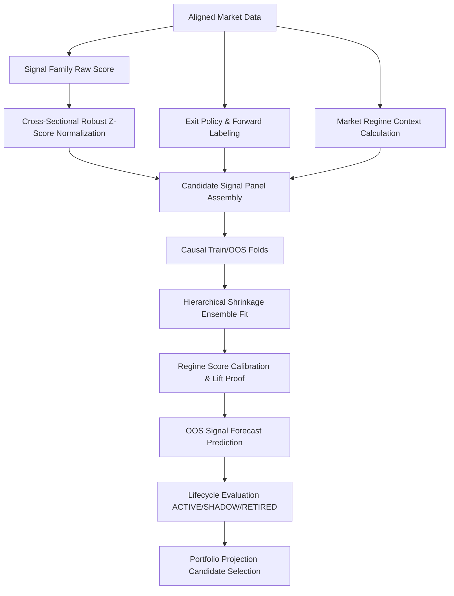

# 1. System Boundary

- **In-Scope**:
  - Signal Family별 Raw Indicator 계산 및 Cross-Sectional Robust Z-Score 정규화.
  - Forward Profit Labeling, Target Horizon 설정 및 Exit Policy 생성.
  - Market Regime Context 바인딩 및 3-Level Hierarchical Empirical Bayes Shrinkage Ensemble.
  - Score Calibration ($\beta_{\text{regime}}$) 및 Portfolio Projection 필터링.
- **Out-of-Scope**:
  - L2/L3 포트폴리오 가중치 할당, Risk Parity, Execution Order Generation (추가 오버레이 계층 처리).

# 2. Key Components & Mathematical Formalism

### 2.1 Raw Signal Calculation & Cross-Sectional Normalization (`rules.py`)
- **Signal Families**: `trend_ma`, `vol_breakout`, `residual_reversion`, `taker_imbalance_momentum`, `funding_flow_carry` 등 31개 이상의 패밀리 및 아키타입 (`trend`, `ts_mom`, `mean_rev`, `carry_rev`, `flow_rev`, `unwind`, `beta_neut`).
- **Numba MAD-based Robust Z-Score**:
  $$z_{i, t} = \operatorname{clip}\left( \frac{x_{i, t} - \operatorname{Median}_{i}(x_{i, t})}{1.4826 \cdot \operatorname{MAD}_{i}(x_{i, t}) + \epsilon}, -3.0, 3.0 \right)$$

### 2.2 Forward Labeling & Triple Barrier (`labels.py`)
- **Forward Log Return Label**:
  $$r_{i, t, h} = \log\left(\frac{P_{i, t+1+h}}{P_{i, t+1}}\right)$$
- **Trade Metrics**:
  - `y_edge_bps`: 기대 알파 손익 (bps)
  - `y_mae_r` / `y_mfe_r`: Risk Unit 스케일링 기반 Maximum Adverse/Favorable Excursion

### 2.3 Regime-Conditional Hierarchical Shrinkage Ensemble (`ensemble.py`)
과적합 방지 및 OOS Stability 확보를 위해 3단계 계층적 Empirical Bayes Shrinkage 적용:
$$\text{Global Prior} \longrightarrow \text{Archetype Prior} \longrightarrow \text{Archetype-Regime Cell Prior} \longrightarrow \text{Variant Specific Edge}$$
- **Shrunk Cell Expectation**:
  $$\mu_{\text{cell}} = w \cdot \bar{y}_{\text{cell}} + (1 - w) \cdot \mu_{\text{archetype}}, \quad w = \frac{N_{\text{eff}}}{N_{\text{eff}} + k_{\text{prior}}}$$
- **Regime Score Calibration**:
  $$\widehat{\mu}_{i, t} = \alpha_{\text{regime}} + \beta_{\text{regime}} \cdot z_{i, t}$$
  - $\beta_{\text{regime}} \le 0$ 인 경우 Cell Mean Lookup으로 Fallback.

### 2.4 Lifecycle & Portfolio Projection (`workflow.py`, `portfolio_projection.py`)
- **Lifecycle Evaluation**: Effective sample size ($N_{\text{eff}}$) 및 Lift Proof test 결과에 따른 `ACTIVE`, `SHADOW`, `RETIRED` 상태 전이.
- **Event Filtering & Sizing Weight**:
  $$\text{Weight}_{i, t} \propto \frac{\widehat{\mu}_{i, t}}{\sigma^2_{\text{residual}} + \text{ParamVar}}$$

# 3. Strict I/O Contract

| Type | Variable | Shape / Type | Description |
| :--- | :--- | :--- | :--- |
| **Input** | `AlignedMarketData` | Custom Data Class | Cross-sectional OHLCV, OI, Funding, LSR Data |
| **Input** | `CandidateStrategyConfig` | Config Object | Signal/Ensemble 하이퍼파라미터 및 Gate 조건 |
| **Intermediate**| `CandidateSignalPanel` | DataFrame `[Events x Features]` | Signal score, Regime ID, Labels 포함 패널 |
| **Output**| `RegimeConditionalEnsemble` | Dataclass Model | Shrunk cell means 및 Score calibration parameters |
| **Output**| `CandidateFoldOutput` | Data Structure | Portfolio Projection에 전달될 OOS 예측 결과 및 Event 선택 목록 |

# 4. Topology & Dynamic Flow

# 5. Signal Improvement Guide

1. **Indicator/Rule Level (`rules.py`)**: Signal Family 식 추가 및 MAD Clip 범위 조정.
2. **Labeling & Exit Level (`labels.py`)**: Target Horizon ($h$) 및 Dynamic ATR Barrier 설정 변경.
3. **Regime Conditioning (`ensemble.py`)**: Prior Shrinkage Parameter ($k_{\text{prior}}$) 조정 및 Score Calibration $\beta$ 검증 조건 강화.
