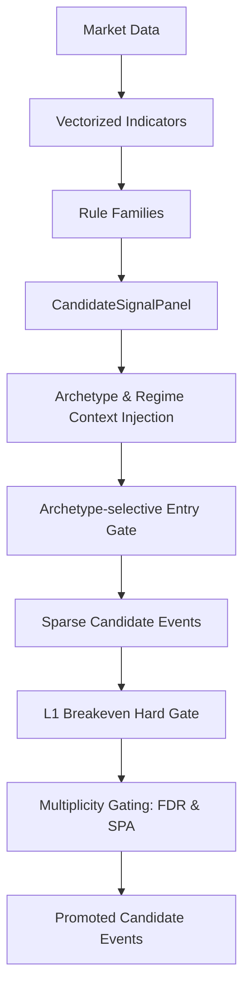

# 1. Purpose
Generates vectorized rule panels with archetype/regime contexts and filters them through an L1 breakeven hard gate to produce sparse candidate events.

# 2. Core Logic & Math

**Signal Vectorization & Sparsity**
- $S_{t} = f(\text{Market Data}_{1..t})$ (Dense conviction score)
- $E_{t} = 1 \text{ if } (S_{t} \neq 0 \land S_{t-1} == 0) \text{ else } 0$ (Sparse entry trigger, side hint)
- Strict Causality: No forward-looking data $t+k$ is used in evaluating $S_{t}$ or $E_{t}$.

**Archetype-Selective Regime Gating**
- $A_{\text{reversion}}$ (Mean Reversion) entries are blocked ($E_{t} \rightarrow 0$) in regimes specified by `mean_rev_blocked_regimes`.

**L1 Breakeven Hard Gate (Hurdle)**
- For a variant to be promoted, its OOS mean edge after hurdle must be positive and significant.
- $\text{Edge}_{i} = \text{Gross Return}_{i} - \text{Execution Costs}_{i}$
- Condition: $\frac{1}{N} \sum (\text{Edge}_{i}) > 0 \land t_{\text{stat}}(\text{Edge}) \geq \text{min\_rule\_ir\_t}$
- Evaluated strictly within archetype-allowed regimes.

**Multiplicity Control (BH-FDR & SPA Gates)**
- To control the inflation of false discoveries under pool expansion:
  1. **BH-FDR (Benjamini-Hochberg FDR Control):** 
     - Calculates one-sided p-values: $p_i = 1 - F_{t}(t_{\text{stat}, i}, \text{df} = N_i - 1)$ where $t_{\text{stat}, i}$ is NW-autocorrelation corrected.
     - Sorts $p_{(1)} \le p_{(2)} \le \dots \le p_{(m)}$ and finds the largest $k$ satisfying: $p_{(k)} \le \frac{k}{m} \alpha_{\text{FDR}}$.
     - Variants with $p_i$ corresponding to indices $\le k$ are admitted.
  2. **SPA (Hansen's Single Predictive Ability):**
     - Runs circular block bootstrap on the OOS edge time-series of the top-performing candidate strategy.
     - Rejects $H_0: E[\text{Edge}_{\text{best}}] \le 0$ at a family level. If SPA p-value $> p_{\text{max}, \text{SPA}}$, all promotions are blocked (fail-closed).
  - Final promote $= \text{Gate}_{\text{individual}} \land \text{FDR\_pass} \land \text{SPA\_pass}$

**Empirical-Bayes Ensemble Shrinkage (James-Stein)**
- Cell-mean $\hat{\mu}_a$ per archetype $a$ is shrunk toward the grand mean $\bar{\mu}$ via:
  - $k_{\text{eff}} = \frac{\bar{\sigma}^2_{\text{within}}}{\text{between\_var}}$, clamped to $[0, k_{\max}]$
  - $\tilde{\mu}_a = \frac{n_a \hat{\mu}_a + k_{\text{eff}} \bar{\mu}}{n_a + k_{\text{eff}}}$
- $\text{between\_var} = \frac{1}{A}\sum_a (\hat{\mu}_a - \bar{\mu})^2$; large $\text{between\_var}$ → $k_{\text{eff}} \approx 0$ → no shrinkage (cell means trusted).
- Controlled by: `ensemble_adaptive_shrinkage`, `ensemble_shrinkage_k_max`, `ensemble_freq_n_cap`.
- **IS-only**: $k_{\text{eff}}$ computed only on training data; OOS fold IC used as post-hoc diagnostic, not as a shrinkage input.

**Variant-Edge Hierarchical Prior (James-Stein 3-Level Shrinkage & Variant Offset)**
- Restores within-cell variant identity: variants in the same (archetype × regime) cell receive discriminated scores rather than a shared cell mean.
- Anchor $a_v$ = mode-cell mean of the variant's most common (archetype, regime) pair in the training set:
  - $a_v = \hat{\mu}_{(\text{mode\_arch}_v,\, \text{mode\_regime\_v})}$ → fallback $\hat{\mu}_{\text{arch}}$ → global $\bar{\mu}$
- Shrinkage weight: $w_v = \frac{n_{\text{eff}}}{n_{\text{eff}} + k_v}$, where $n_{\text{eff}} = \min(n_v, \text{freq\_n\_cap})$ (0 = no cap)
- Shrunk mean: $\tilde{\mu}_v = w_v \cdot \hat{\mu}_v + (1-w_v) \cdot a_v$
- Variant Offset: $\text{offset}_v = \tilde{\mu}_v - a_v$ (represents variant's shrunk relative strength over its cell anchor)
- Prediction: $\mu_{\text{pred}, t} = \text{cell\_val}_{(\text{arch},\, \text{regime}_t)} + \text{offset}_v$ (fully preserves dynamic event-level regime conditioning)
- Family Filtering: only variants belonging to allowed families (`ensemble_variant_prior_families`) receive variant offsets; others regress entirely to cell means to filter noise.
- Small-sample guard: if $n_v < \text{min\_obs}$, $\tilde{\mu}_v = a_v \implies \text{offset}_v = 0.0$ (full anchor fallback)
- Controlled by: `ensemble_variant_prior_enabled`, `ensemble_variant_shrinkage_k`, `ensemble_variant_min_obs`, `ensemble_variant_prior_families`.

**Profit Floor Gate (Hard Economic Floor)**
- Separate `profit_floor` check outside Bayesian OR-path bypass loop.
- $\text{pass\_profit\_floor} = \mu_{\text{OOS}} \geq \text{min\_variant\_oos\_profit\_bps}$
- Cannot be bypassed by regime-cell admission; enforces cost-based minimum unconditionally.

**Regime-Cell Conditional Admission (OR-path)**
- Promotes a variant diluted by the global-pooled gates if it holds a strong edge in a specific regime cell $g$ (supplies orthogonal diversifiers to the B0 ensemble).
- Per-cell (regime $g$) stats over the OOS recommendation window:
  - $\mu_{g} = \frac{1}{n_g} \sum_{i \in g} \text{Edge}_{i}$, $\quad t_{g} = \frac{\mu_{g}}{\sigma_{g}/\sqrt{n_g} + \epsilon}$ (IID SE; **non-NW first-order approx → optimistic under overlap**)
  - Cell passes iff $n_g \geq \text{min\_regime\_cell\_oos\_obs} \land \mu_{g} \geq \text{min\_regime\_cell\_edge\_bps} \land t_{g} \geq \text{min\_regime\_cell\_tstat}$
- Admit iff $\geq 1$ cell passes; retain top-`max_admitted_cells_per_variant` cells by $\mu_g$ (anti over-specialisation).
- Final promote $= \text{global\_AND\_gates} \lor (\text{admission\_enabled} \land \text{cell\_admitted})$. **Safety gates (`min_obs`, `q10_fail`, `event_density`) stay mandatory in both paths.**

# 3. Architecture Flow

# 4. Core Variables & I/O

| Type | Variable | Description |
|------|----------|-------------|
| **Input** | `AlignedMarketData` | Vectorized pricing and volume data matrices |
| **Param** | `standalone_breakeven_hard_gate_enabled` | Enforces L1 profitability gate before allocation. Bounds: `[True, False]` |
| **Param** | `mean_rev_gating_enabled` | Blocks mean-reversion entries in volatile/crash regimes. Bounds: `[True, False]` |
| **Param** | `min_rule_ir_t` | Minimum t-statistic for standalone breakeven gate. Bounds: `[0.0, ∞)` |
| **Param** | `regime_cell_admission_enabled` | Enables the regime-cell OR-path. Bounds: `[True, False]` |
| **Param** | `min_regime_cell_oos_obs` | Min per-cell OOS obs for admission. Bounds: `[1, ∞)` |
| **Param** | `min_regime_cell_edge_bps` | Min per-cell mean edge (bps) for admission. Bounds: finite |
| **Param** | `min_regime_cell_tstat` | Min per-cell t-stat for admission. Bounds: `[0.0, ∞)` |
| **Param** | `max_admitted_cells_per_variant` | Top-N cells retained by edge. Bounds: `[1, ∞)` |
| **Param** | `ensemble_adaptive_shrinkage` | Enables EB James-Stein shrinkage for archetype cell means. Default: `True` |
| **Param** | `ensemble_shrinkage_k_max` | Upper bound for $k_{\text{eff}}$. Bounds: `[0, ∞)`. Default: `50.0` |
| **Param** | `ensemble_freq_n_cap` | Max effective $n$ per cell (0=disabled). Bounds: `[0, ∞)` |
| **Param** | `min_variant_oos_profit_bps` | Hard economic floor for profit gate (non-bypassable). Default: `0.0` |
| **Param** | `ensemble_variant_prior_enabled` | Enables variant-level JS shrinkage. Default: `True` |
| **Param** | `ensemble_variant_shrinkage_k` | Shrinkage strength $k_v$ for variant prior. Default: `30.0` |
| **Param** | `ensemble_variant_min_obs` | Min obs for variant mean; below this → full anchor fallback. Default: `40` |
| **Param** | `fdr_gate_enabled` | Enables FDR control gate. Default: `False` |
| **Param** | `spa_gate_enabled` | Enables SPA circular-block bootstrap gate. Default: `False` |
| **Param** | `fdr_alpha` | Target False Discovery Rate threshold. Default: `0.10` |
| **Param** | `spa_p_value_max` | Maximum p-value allowed to pass the SPA gate. Default: `0.10` |
| **Param** | `spa_n_bootstrap` | Number of bootstrap runs for SPA p-value calculation. Default: `2000` |
| **Output**| `CandidateSignalPanel` | Dense 2D structure containing `signed_score`, `side_hint`, and `valid_mask` |
| **Output**| `events: pd.DataFrame` | Sparse tabulated representation of valid entry signals |

# 5. Edge Cases & Handling
- **Data Gap/Missing Bars:** If input market data has NaNs due to exchange downtime, indicator valid_mask is strictly enforced (False), preventing erroneous signal generation.
- **Divergent Trend & Reversion Overlap:** Handled gracefully since rule panels are grouped by archetype; if both trigger simultaneously, they produce distinct sparse events evaluated independently by downstream allocators.
- **Cell-Admission Zero-Variance Cell:** If all per-cell edges are identical ($\sigma_g = 0$), the $\epsilon$ term in $t_g$ prevents div-by-zero; cell still admits on $\mu_g \geq$ threshold.
- **Cell-Admission Multiple Comparisons:** Per-cell selection over OOS amplifies data-snooping vs. global gates; the $t_g \geq 1.0$ floor is a weak, non-NW guard — purged/embargoed nested validation is the proper follow-up before live capital.
- **Multiplicity Gating Fail-Closed:** Under extremely sparse event environments or low expectancy, the SPA gate automatically fails (fail-closed), preventing overfitting noise candidates from leaking.

# 6. Data Integrity & Optimization (Robust Validation Guard)
- **Data Integrity Verification (`verify_data_integrity`):** Before rule signals are composed, a strict multi-point sanity check is executed per symbol on the `AlignedMarketData` object.
  - *Data Length Check (`too_short`):* Triggers if the history length is below `min_length` (e.g., 100 bars).
  - *Missing Values Check (`excessive_nan`):* Blocks the symbol if any NaN values exist in close, high, low, or volume arrays (threshold: $> 0.0\%$).
  - *Invalid Values Check (`invalid_values`):* Detects zero or negative prices/volume.
  - *Stuck Price Check (`stuck_price`):* Flags frozen prices where the standard deviation of the close series is near-zero ($\sigma_{\text{close}} < 10^{-8}$).
  - *High-Low Violation Check (`hi_lo_violation`):* Flags any instances where high price is strictly lower than low price ($High < Low$).
- **Performance Optimizations:**
  - *Vectorized Percentile (`_compute_score_pct_variant_hist`):* Replaced $O(N^2)$ python masking filters with a vectorized $O(N \log N)$ `np.searchsorted` causal boundary search.
  - *Confluence Counts (`n_same`):* Upgraded from string concatenation mapping to optimized Pandas `groupby().transform("size")` with index alignment series.
  - *Affinity Matrix Lookup (`arm`):* Replaced list comprehensions with a high-density 2D numpy lookup table mapping archetype and regime integer keys.

# 7. Layer1 Nested SWF & Readiness Gate

**Nested Anchored Walk-Forward (Nested SWF)**
- **Structure**: Splitting history into $K$ nested anchored folds. 
  - `outer_train_k` internally creates `inner_folds` to perform inner fit $\rightarrow$ inner OOS evaluation $\rightarrow$ compute `fold_registry_k` evidence.
  - `outer_oos_k` uses `fold_registry_k` as a frozen selection registry to generate label-free predictions, joining realized outcomes only at the end for fold evaluation.
- **Invariants**: Purge and embargo boundary isolation: $\max(\text{inner\_oos\_exit\_idx}) < \text{outer\_oos\_start\_k}$.

**Target Contract Reform**
- **Strict Gross Alignment**: Regression targets are strictly mapped to `gross_event_bps` or `gross_return_r`. 
- Net targets and cost-derived metrics are excluded from Layer1 model execution.
- Label-free inference: In candidate dataset building, exit indices for OOS prediction are inferred via $\text{entry\_idx} + \max(\text{expected\_holding\_bars} - 1, 0)$ when labels/exits are unavailable.

**Hard Gate Evaluation**
- **Requirements**: Gate checks include `fold_cov`, `sym_count`, `sym_ratio`, `fold_ratio`, `opp_ic`, `opp_tstat`, `probe_bps`, `probe_tstat`.
- **Failure Handling**: Any single gate check failure triggers `gate_passed = False`, resulting in no final inference artifact.

